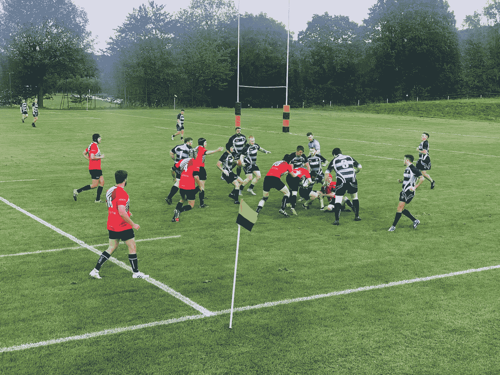

# 在我们的应用失败后，我们去掉了一半的代码

> 原文：<https://medium.com/geekculture/we-ripped-out-half-our-code-base-c65040168959?source=collection_archive---------40----------------------->

## 我们制造了错误的产品，不得不花数周的时间来修复它。

创业是艰难的，你从一个想法开始，然后尽可能努力地将它快速推向市场。在这个过程中，你研究，设计，测试，重复，直到你有东西准备出售。我们经历了同样的过程，却发现我们制造了错误的产品。

当我们开始[collectiv](https://collctiv.com)的时候，我们想实现一件事，让从你的朋友那里收钱变得非常容易。

> 向一群人募捐的过程是分散的、相似的，结果导致组织募捐的人赔钱。

我们研究当前的解决方案，与朋友和家人交谈，调查人们，收集所有信息来构建版本 1。我们在几周内构建了一个很棒的初始应用程序，它在功能上做了我们研究确定的所有事情。它允许人们创建一个群组，给群组中的人发信息，并提示他们为某个事件或活动付费。我们现在需要的是实地测试。

# Beta 测试

Match day with our Beta testers

我们早期组织的一件事是找到一群乐于测试一个全新产品的测试者。我们的测试用户是一个 80 人的学生橄榄球队，结果证明这是一个完美的测试组。他们会利用 Collctiv 来组织训练、比赛日和社交活动。

那是八月底，也是第一次季前测试的比赛日。我们让我们的应用程序在 30 个试图支付比赛费用的橄榄球小伙子身上运行。我们看到的是 30 个小伙子努力抓住我们已经建立起来的东西。看着他们下载应用程序，注册，加入，请求加入群，被接受，找到活动，为活动付费。看着很痛苦。如果这就是用户体验，我们在那里提供帮助，那么我们可能从未接触过的人将如何使用我们的应用程序呢？简而言之，第一版失败了。

# 撕掉 4 周的工作

我们很快意识到，我们为组织者而不是“贡献者”创建了一个应用程序，我们过度设计了这个问题。我们已经失去了对我们试图实现的目标的关注，并试图适应每一种情况。

很多企业都这样做，即使有最好的研究、设计和意图，你也会犯错误。这是学习过程的一部分，你需要接受它不起作用，找到新的解决方案，然后继续前进。我们最终移除了应用程序 50%的代码，大约需要 4 周的工作。我们把应用重新聚焦到它本来应该有的地方，从一群人那里收钱，就是这样。去除所有这些艰苦的工作令人失望，但我们意识到，为了应用程序的成功，我们必须这样做。在我们重新调整工作重心后，观看橄榄球队使用该应用程序带来了更愉快的体验，两年后他们仍在使用该应用程序，并且现在以更多样化的方式使用它。我们将需要付费的点击次数从 26 次减少到 1 次。

作为企业主和首席技术官，很难眼睁睁地看着自己的产品失败，尤其是在经过大量艰苦工作和熬夜之后。这是旅程的一部分，你知道在经历了这些挫折后，产品会得到改进。

> 没有人做错什么，这不是任何人的错，失败是正常的。

作为领导者，我们需要接受这一点并鼓励它，因为没有它我们就不会取得进步，我们的团队就不会尝试新的和美妙的事情。