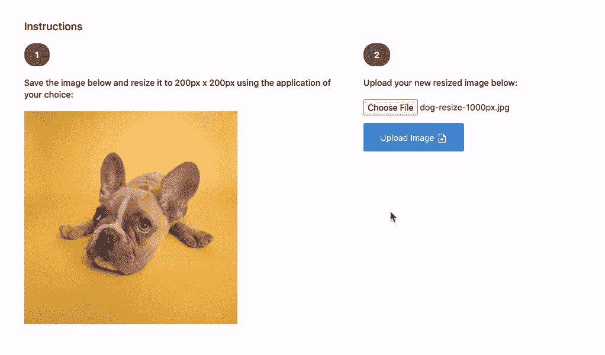
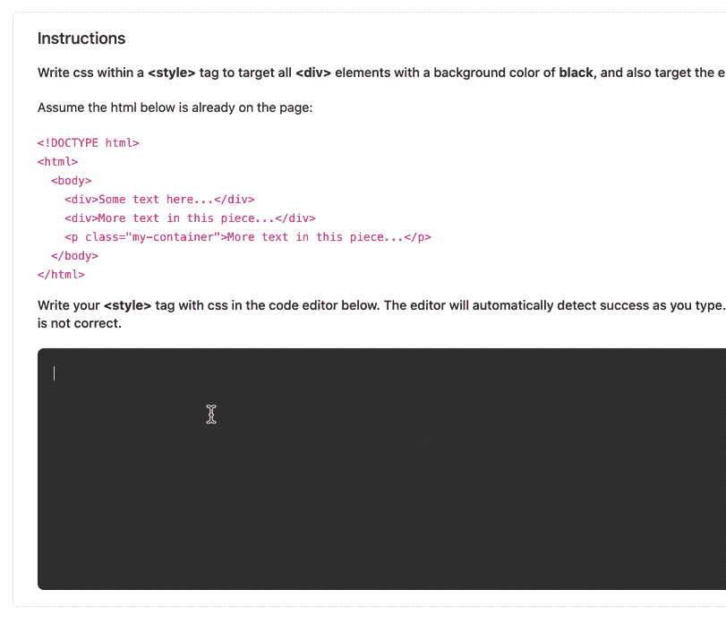

# 我们必须教我们的员工基本的网络和互联网概念。

> 原文：<https://medium.com/geekculture/we-start-must-teach-our-people-basic-web-internet-concepts-7134117de22a?source=collection_archive---------7----------------------->

## 你的员工在煮我的脑子…

***TL/DR:你们的员工都应该参加我新正式认可的*** [***网络课程***](https://www.webfun101.com?utm_source=WB&utm_medium=Medium&utm_campaign=PSHP-20210830) ***即教 Web &互联网基础知识！***

在过去的十年里，我为无数网络公司工作和咨询过，这些公司的员工对互联网及其重要组成部分的基础知识几乎一无所知。这是一笔可悲的交易。有时候会让我觉得脑袋要爆炸了。在每个周末，教你的员工如何“谷歌一下”，或者向他们解释 SEO 实际上是什么，或者教他们关于图像分辨率和长宽比，这是一种可怕的使用我的付费率——但这是我经常做的。

与你的一些员工交谈感觉就像与我 80 岁的父亲谈论软件项目——他点点头，表现出理解的样子，只是为了示好，但我知道他不理解。他甚至没有让我详细说明，他只是顺其自然。他是一个伟大的团队成员！

我父亲不负责一个价值 6000 万美元的电子商务企业的营销——哦，不，他不负责。我父亲不负责向一个十人软件工程师团队提供产品需求，这个团队每月花费你的组织 280，000 美元——不负责。

我的[新在线课程](https://www.webfun101.com?utm_source=WB&utm_medium=Medium&utm_campaign=PSHP-20210830)涵盖基本概念，如:

*   [什么是互联网？](https://www.webfun101.com/p/course/?utm_source=WB&utm_medium=Medium&utm_campaign=PSHP-20210830)
*   [服务器](https://www.webfun101.com/p/course/?utm_source=WB&utm_medium=Medium&utm_campaign=PSHP-20210830)
*   [页面加载](https://www.webfun101.com/p/course/?utm_source=WB&utm_medium=Medium&utm_campaign=PSHP-20210830)
*   [图像文件类型(JPG、PNG、GIF、WEPB)](https://www.webfun101.com/p/course/?utm_source=WB&utm_medium=Medium&utm_campaign=PSHP-20210830)
*   [视频基础知识](https://www.webfun101.com/p/course/?utm_source=WB&utm_medium=Medium&utm_campaign=PSHP-20210830)
*   [HTML 基础知识](https://www.webfun101.com/p/course/?utm_source=WB&utm_medium=Medium&utm_campaign=PSHP-20210830)
*   [CSS 基础知识](https://www.webfun101.com/p/course/?utm_source=WB&utm_medium=Medium&utm_campaign=PSHP-20210830)
*   [基本 Javascript 识别](https://www.webfun101.com/p/course/?utm_source=WB&utm_medium=Medium&utm_campaign=PSHP-20210830)
*   [如何报告错误](https://www.webfun101.com/p/course/?utm_source=WB&utm_medium=Medium&utm_campaign=PSHP-20210830)
*   [谷歌分析概念](https://www.webfun101.com/p/course/?utm_source=WB&utm_medium=Medium&utm_campaign=PSHP-20210830)
*   [SEO(搜索引擎优化概念)](https://www.webfun101.com/p/course/?utm_source=WB&utm_medium=Medium&utm_campaign=PSHP-20210830)
*   [谷歌搜索控制台概念](https://www.webfun101.com/p/course/?utm_source=WB&utm_medium=Medium&utm_campaign=PSHP-20210830)

这些事情都不复杂。我几乎为我需要创建这个在线课程而感到尴尬，但我生命中的每一周都惊讶于这个世界是多么需要它。

^ Could it be my Dad, or your employee? The stock photo company says that the elderly man in the above photo is “confused.”

当我问你的员工是否熟悉谷歌搜索控制台，或者问他们要一个压缩的 JPG 而不是 PNG，或者问他们在谷歌分析中用一个*二次元*过滤，或者问他们给我发一个错误报告，上面有网址、截图、操作系统和浏览器版本，他们给我的反应和我父亲一样。他们点头微笑。他们拿到了。别担心伙计！

那么，当谈到搜索引擎优化，或报告网页错误，或识别无效的 HTML 行，为什么我的父亲知道的就像你的一些员工一样多，他们负责数百万，有时数十亿美元的互联网收入？这真的很吓人。简直是终结者 2 级别的恐怖。世界颠倒了，我发誓。

让我们一起来解决这个问题！

请让你所有的员工都参加我的新认证在线课程 [**网络基础 101**](https://www.webfun101.com?utm_source=WB&utm_medium=Medium&utm_campaign=PSHP-20210830) ，该课程教授网络和互联网基础知识。

我们的现代员工每天都在与网站和软件打交道。一个电子商务公司就是一个很好的例子。对于一家电子商务公司的 20 人团队来说，其中 10 人可能每天都会访问网站:

*   设计师
*   内容作者
*   促销营销人员/ SEO 贡献者
*   业务员
*   产品协调员/运营人员
*   高管/经理
*   顾问

2021 年，我们的人民需要了解基本的网络和互联网概念。我们在工作中思考或接触的一切都受到我们对互联网工作方式及其基本组件的基本假设的影响。

在工作中，我们经常说的和理解的东西不一样。这在团队内部是一个大问题，在与顾问交流时也是如此。这种由于缺乏基础而导致的误解问题会导致误解、计划不周、不信任和员工士气低落。

当我们说 SEO 的时候，我们说的是同一件事吗？当我们说谷歌搜索控制台时，我们都明白它是用来做什么的吗？当我们说“网站地图”时，我们是不是都在谈论一个提交给搜索引擎的标准化 XML 文档，以帮助他们在浏览 web 时有效地定位我们的资产？当我们说“这一页坏了”时，到底是什么意思？

提高我们对网络和互联网基本概念的认识有助于与我们业务相关的所有事情:

*   提高效率
*   员工之间更多的共同假设
*   更好的团队间沟通和协调(这尤其有助于与开发人员、创意人员和“技能职位”网络员工的交流)
*   更好的规划和评估
*   **缩短会议时间！**
*   员工对日常工作更有信心
*   提高员工士气

如果你便宜的话，我的新课程甚至有免费版本。我爸爸也喜欢自由，就像你一样。但是如果你选择付费版本，你的员工将被要求在我的[作业门户](https://www.webfun101.com/p/assignments-portal/?utm_source=WB&utm_medium=Medium&utm_campaign=PSHP-20210830)(我专门为这门课程从头开始编写的定制应用)中完成作业。[作业门户](https://www.webfun101.com/p/assignments-portal/?utm_source=WB&utm_medium=Medium&utm_campaign=PSHP-20210830)将来自[课程](https://www.webfun101.com/p/course/?utm_source=WB&utm_medium=Medium&utm_campaign=PSHP-20210830)学习部分的信息转化为分级作业，这些作业要求在图像大小调整、图像清晰度、图像色彩空间、基本 HTML 和 CSS 以及识别 Javascript 页面错误等方面的技能发展。我课程的付费版本还附带了英国 CPD 标准委员会颁发的完全认证证书。

From the [Assignments Portal](https://www.webfun101.com/p/assignments-portal/?utm_source=WB&utm_medium=Medium&utm_campaign=PSHP-20210830)

*查看我新认证的在线课程，* [*网络基础 101*](https://www.webfun101.com?utm_source=WB&utm_medium=Medium&utm_campaign=PSHP-20210830) *。*

*在*[*WilliamBelk.com*](https://www.williambelk.com)*找我。关注我* [*推特*](https://twitter.com/wbelk) *。*