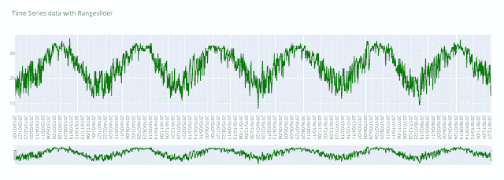
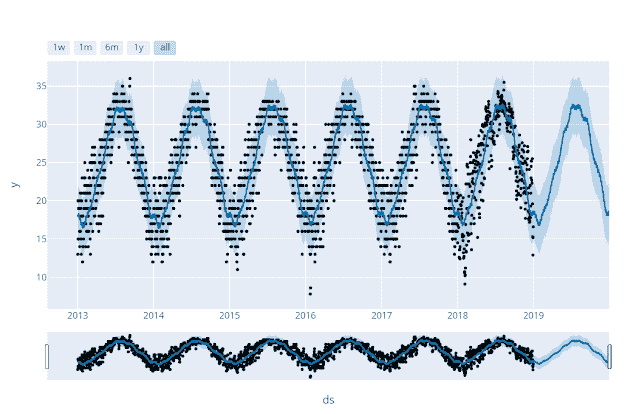
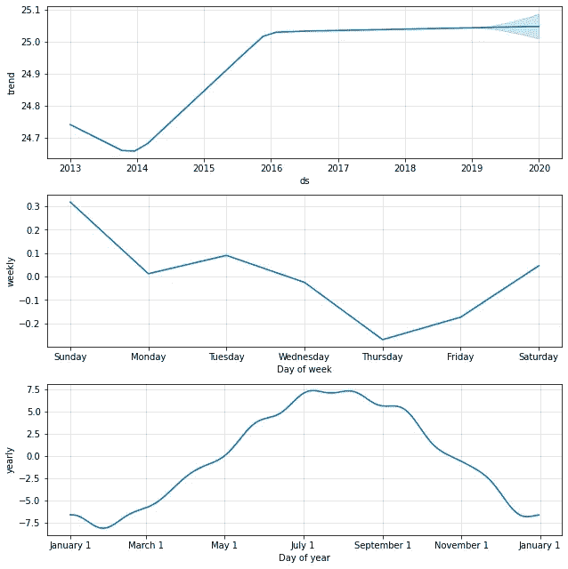

# 使用深度学习模型 Prophet 的天气预报

> 原文：<https://medium.com/geekculture/weather-forecast-using-deep-learning-model-prophet-72bc878be48b?source=collection_archive---------13----------------------->

你有多少次试图准确预测销售额、天气或股票？很多时候，我们可能会找到一个好的神经模型，但我们无法调整它的超参数。深度学习模型 PROPHET 将在开发预测模型方面对初学者有用。我们开始吧！


Prophet

**什么是先知模型？**

Prophet 正在评估用 R 和 Python 执行的方法。它是快速的，并给出完全计算机化的量表，可以由信息研究人员和检查人员手动调整。

Prophet 是一种基于加法模型预测时间序列数据的程序，其中非线性趋势符合每年、每周和每天的季节性，加上假日影响。这种方法在时间安排上效果最好，因为它有可靠的偶然影响和一些真实的信息。Prophet 对模式中缺失的信息和运动非常敏感，通常能很好地处理异常情况。Prophet 是由脸书核心数据科学小组提供的开源编程。它可以在 CRAN 和 PyPI 上下载。

**先知的优点:**

1.准确快速

*   在脸书，Prophet 被广泛应用于为规划和目标设定创建可靠的预测。
*   他们发现，在大多数情况下，与其他方法相比，它的性能更好。

2.全自动的

*   无需人工操作即可对杂乱的数据做出合理的预测。
*   Prophet 对异常值、缺失数据和时间序列中的剧烈变化非常稳健。

3.可调预测

*   Prophet 程序为用户提供了许多调整预测的可能性。
*   您可以通过添加您的领域知识，使用人类可理解的参数来改进您的预测。

4.有 R 或 Python 版本

*   使用任何你觉得舒服的语言来获得预测。

**公式**

*先知方程是如何工作的？*

打破脸书开源时间序列预测程序背后的方程式。

该方法利用具有三个主要模型段的可分解时间安排模型:趋势、季节性和假期。

y(t) = g(t) + s(t) + h(t) + e(t)

其中:

*   g(t):趋势模拟非周期性变化，即随时间的增长
*   季节性呈现周期性变化，即每周、每月、每年
*   h(t):节假日的影响
*   e(t):涵盖模型不适应的误差

**理解代码:**

**1。安装软件包:**

```
pip install chart_studio
pip install fbprophet
```

**2。导入库:**

```
import pandas as pd
import numpy as np
import chart_studio.plotly as plotly
import plotly.figure_factory as ff
from plotly import graph_objs as go
from fbprophet import Prophet
from fbprophet.plot import plot_plotly
```

3.正在加载数据集:

```
df = pd.read_csv(‘/content/weather_temperature_yilan.csv’)
df.head()
```

4.绘制原始数据:

```
fig = go.Figure()fig.add_trace(go.Scatter(x=df.Date, y=df[‘Temperature’], name=”temperature”,line_color=’green’))fig.layout.update(title_text=’Time Series data with Rangeslider’,xaxis_rangeslider_visible=True)fig
```



5.将数据帧分为 X 和 y:

```
X = df[[‘Date’, ‘Temperature’]]
y = df.iloc[:,1]
```

6.将数据加载到“ds”和“y”中:

```
train_df = pd.DataFrame()
train_df[‘ds’] = pd.to_datetime(X[“Date”])
train_df[‘y’]=y
train_df.head(2)
```

7.应用和拟合 Prophet 模型:

```
model = Prophet()
model.fit(train_df)
future = model.make_future_dataframe(periods=365)
future.tail(2)
```

8.预测数据:

```
forecast = model.predict(future)
fig1 = plot_plotly(model, forecast)
fig1
```



9.组件式预测:

```
#plot component wise forecast
fig2 = model.plot_components(forecast)
```



用几行代码，你就可以很好地预测，而且，我们预测了它每周、每月和每年的趋势。您可以从我的 GitHub 个人资料中访问代码: [*天气 _ 预报*](https://github.com/muskaanpirani/Weather_Forecast.git)

感谢阅读！

你也可以通过 [LinkedIn](https://www.linkedin.com/in/muskaanpirani/) 、 [GitHub](https://github.com/muskaanpirani) 和 [Medium](https://muskaanpirani.medium.com/) 联系我。