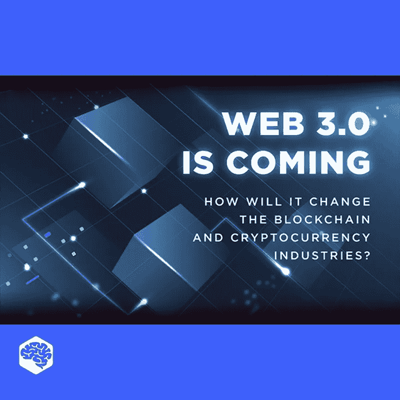

# Web 3.0 即将到来——但它是什么，Web 1.0 和 2.0 去了哪里？

> 原文：<https://medium.com/geekculture/web-3-0-is-coming-but-what-is-it-and-where-did-web-1-0-and-2-0-go-f3fc107d46e3?source=collection_archive---------19----------------------->

## Web 3.0 只是一个被过度炒作的幻想吗？

简而言之，web 3.0 是网站和应用程序的第三代互联网服务，将专注于利用机器对数据的理解来提供数据驱动的语义 web。Web 3.0 的最终目标是创建更智能、互联和开放的网站。

它将如何改变区块链和加密货币行业？让我们在这个视频里一起想清楚。我们希望你喜欢它！