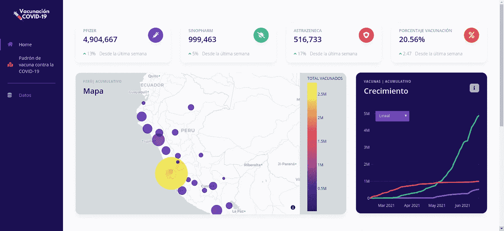
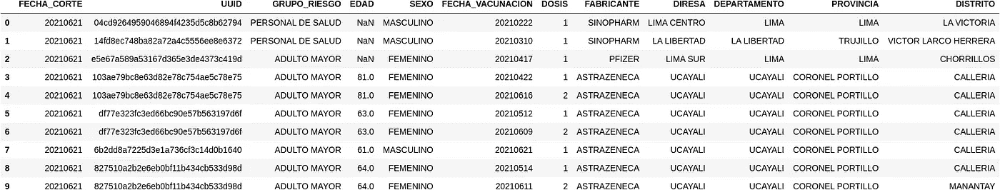
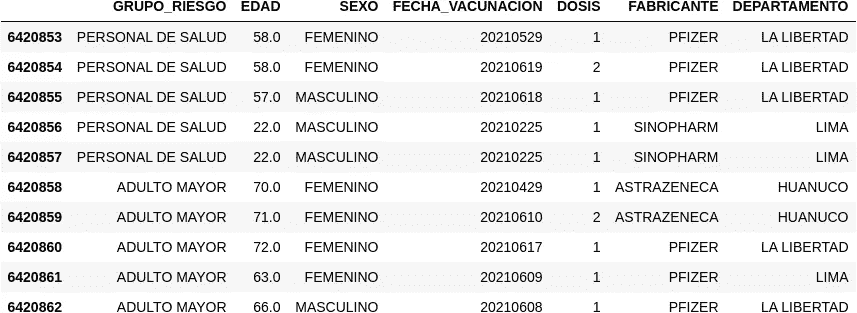
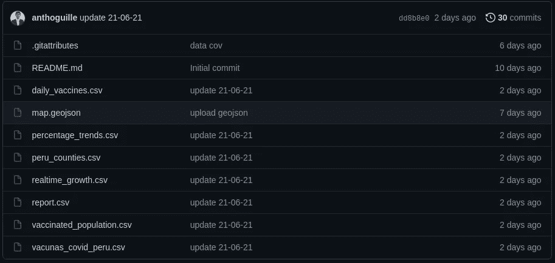
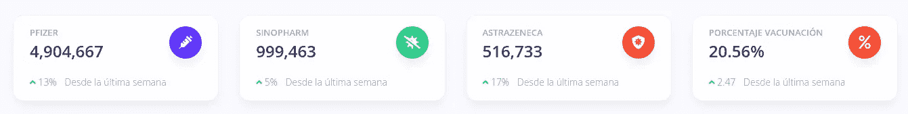
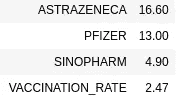
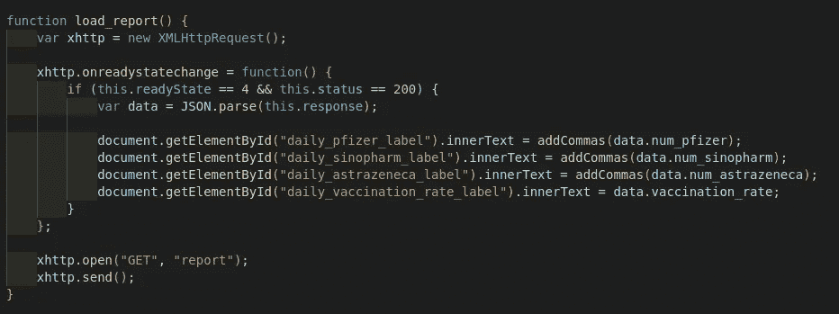
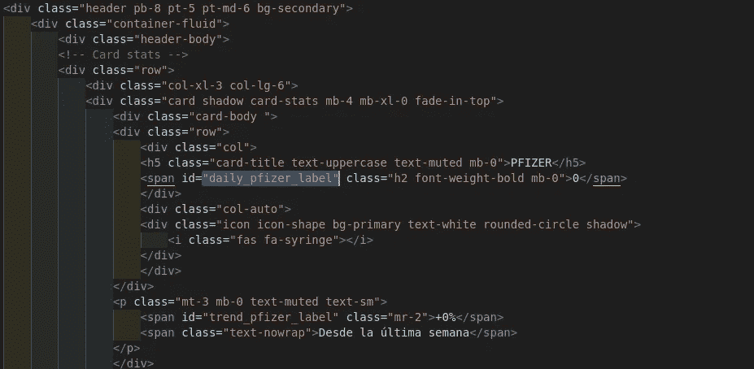

# Web 应用程序—仪表板疫苗 covid19 Perú

> 原文：<https://medium.com/geekculture/web-app-dashboard-vaccines-covid19-per%C3%BA-288388cffa76?source=collection_archive---------32----------------------->

该项目的目标是通过动态可视化向公众提供秘鲁疫苗接种过程的统计信息。


数据集可在“[***vacuna ción contra COVID—19【卫生部—卫生部】***](https://www.datosabiertos.gob.pe/dataset/vacunaci%C3%B3n-contra-covid-19-ministerio-de-salud-minsa) ”下载。

这里可以看到 web app[](https://vacunascovid19-peru.herokuapp.com/)

**

# *建造于*

1.  ***Django** : Django 是一个高级 Python Web 框架，它鼓励快速开发和干净、实用的设计。*
2.  ***Plotly:** Plotly 为个人和协作提供在线图形、分析和统计工具，以及 Python、R 和其他语言的科学图形库。*
3.  ***Appseed:** AppSeed 是一个全栈 web 应用生成器，允许您选择一个可视化主题，并在几分钟内将其应用到一个完整但灵活的技术栈上，大大缩短了从可视化设计到应用部署的开发时间。*
4.  ***Bootstrap:** Bootstrap 是最流行的 **CSS 框架**，用于开发响应式和移动优先的网站。*

***注:**要开展这个项目，有必要在 html，css 和 javascript 的基本知识。*

## *在姜戈开始一个项目*

*[文档](https://docs.djangoproject.com/en/3.2/intro/tutorial01/)*

```
*django-admin startproject mysite*
```

*上面的代码，将创建下一个文件。*

```
*mysite/
    manage.py
    mysite/
        __init__.py
        settings.py
        urls.py
        asgi.py
        wsgi.py*
```

## *数据清理*

*在这里，我们将选择用于不同视图的列。*

**

## *数据处理*

*当然，在前面的步骤中，我们能够更深入地清理数据，但是，每个视图需要不同的处理，因此，我们将执行不同的转换并创建几个”。csv”文件，这些文件将被上传到 Github，以实现某些流程的自动化。*

****

*例如:*

***创建顶级卡片***

**

```
*df = data_set
df = df['FABRICANTE'].value_counts().to_frame()
df = df.rename(columns={"FABRICANTE":"COUNTS"})
df.to_csv("report.csv", encoding = "utf-8")
report = pd.read_csv("report.csv")def report(request):
    df = pd.read_csv("report.csv")
    df = df.set_index("Unnamed: 0")
    population = 31237385
    vaccination_rate = f'{(int(df.sum())/population)*100:.02f}%'data = {
        'num_pfizer': int(df.COUNTS[0]),
        'num_sinopharm': int(df.COUNTS[1]),
        'num_astrazeneca': int(df.COUNTS[2]),
        'vaccination_rate': vaccination_rate,
    }data = json.dumps(data)
    return data*
```

*上面的代码，首先统计“FABRICANTE”列中的唯一值，基于秘鲁人口的大概数量，通过将接种疫苗的总人数除以人口来计算接种率。*

*输出:*

```
*'{"num_pfizer": 4904667, "num_sinopharm": 999463, "num_astrazeneca": 516733, "vaccination_rate": "20.56%"}'*
```

*现在，我们将创造潮流。*

```
*def realtime_growth(date_string=None, weekly=False, monthly=False):
    df = data_set
    df['FECHA_VACUNACION'] = pd.to_datetime(df['FECHA_VACUNACION'], format='%Y%m%d')
    data=df[['FECHA_VACUNACION','FABRICANTE']]
    growth_df=pd.pivot_table(data, index='FECHA_VACUNACION',columns='FABRICANTE',aggfunc=len, fill_value=0)

    return growth_dfdef percentage_trends():    
    current = realtime_growth().sum()
    lastest = realtime_growth()[:-8].sum()
    trends = round(number=((current - lastest)/current)*100, ndigits=1)

    population = 31237385
    last_week = realtime_growth()[:-8].sum().sum()
    now = realtime_growth().sum().sum()
    rate_change= round((((now-last_week)/population)*100), ndigits=2)
    trends = trends.append(pd.Series(data=rate_change, index=['VACCINATION_RATE']))return trends*
```

*上面的代码将列“DATE_VACCINATION”从类型“int”转换为“datetime”，然后根据“DATE_VACCINATION”制作一个显示接种人数的动态表，它还将现在和一周前的接种人数进行比较，以了解增加或减少了多少。*

**

*现在，我们将在 Django 框架下工作，解释将会很长，如果下面的内容不能被理解，我道歉。在以后的文章中，我会一步一步来。*

**

***javascript file***

*如果上述函数的状态为 200，它将返回一个内容，在本例中，html 中的元素为“num_pizer”、“num_sinopharm”、“num_astrazeneca”和“_ rate”。*

**

***Header.html***

***CSS 和引导程序***

*Bootstrap 是一个 **css** **框架**，两者都将负责设计我们仪表板的组件，由于 bootstrap，我们将能够使整个设计适应移动设备的屏幕。*

*这是一个项目的简要总结，有很多我想详细说明，当时间允许的时候我会这样做。感谢您的阅读。*