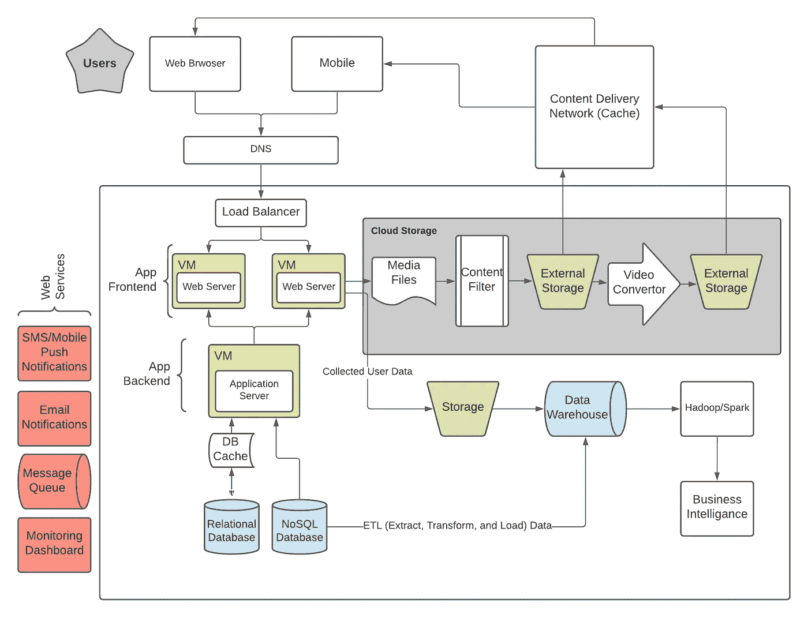

# Web 应用程序架构

> 原文：<https://medium.com/geekculture/web-application-architecture-800d3ecd8019?source=collection_archive---------2----------------------->

## **什么是 web 应用架构？**

> web 应用程序体系结构描述了 web 应用程序所有组件的布局，还强调了各种应用程序组件、第三方中间件系统、web 服务和数据库之间的交互。这提供了同时协同工作以向最终用户提供服务的多个应用程序之间的交互快照。

## 软件架构和软件设计的区别

***软件架构*** 是强调一个系统的所有高层组件以及它们之间的交互。

***软件设计*** 是一种代码级的设计，侧重于将应用业务逻辑分布到各种有自己特定用途的模块中。这有助于构建和管理应用程序业务逻辑。

# Web 应用程序架构图

Web Application Architecture Diagram

## 用户代理人

用户代理主要是帮助用户与服务器交互的工具。用户主要使用网络浏览器(Google Chrome、Firefox、Microsoft Edge、Safari 以及 Android 和 IOS 平台上的移动应用程序)与服务器进行交互。用户代理向服务器发送请求并接收响应，然后将响应显示给用户。

## **域名系统**

域名服务器就像是网站的通讯录。每当用户使用浏览器向 web 地址发送请求时，浏览器在发送请求之前利用 DNS 找到 web 服务器的真实地址(IP 地址)。浏览器需要找出网站所在的服务器，这样才能将 HTTP 请求发送到正确的位置。

## 负载平衡器

负载平衡器主要处理水平扩展。它将传入的请求定向到多个服务器中的一个，然后负载平衡器将从这些服务器收到的响应发送给用户。通常，web 应用服务器以相互镜像的多个副本的形式存在，以提供一致性和可用性。负载平衡器在它们之间分配任务。它与服务器自动伸缩配合得很好。

## 虚拟计算机

在计算中，**虚拟机** ( **VM** )是计算机系统的虚拟化/仿真。虚拟机基于计算机体系结构，并提供物理计算机的功能。它们的实现可能涉及专门的硬件、软件或其组合。

## 网络服务器

Webserver 处理用户的请求并发送包含数据(HTML、JSON、XML 等)的响应。)回到一个浏览器。托管在虚拟机上的 Web 服务器利用虚拟机提供的计算能力来执行任务。web 服务器通常指后端基础设施，如数据库、缓存服务器、作业队列等。

## 数据库

数据库提供了组织、添加、搜索、更新、删除和执行数据计算的工具。一般有关系型数据库——MySQL、PostgreSQL、Microsoft SQL Server、Oracle 数据库、Microsoft Access 等，也有非关系型数据库——MongoDB、Dynamo DB 等。

## 缓存服务

缓存服务为数据提供存储，允许存储和搜索数据。缓存允许您参考之前的结果，以加快计算速度。缓存可以在各种技术层中应用和利用，包括操作系统、网络层(包括内容交付网络(CDN)和 DNS)、web 应用程序和数据库。

> 客户端— HTTP 缓存头、浏览器
> DNS — DNS 服务器
> Web — HTTP 缓存头、cdn、反向代理、Web 加速器、键/值存储
> App —键/值数据存储、本地缓存
> 数据库—数据库缓存、缓冲区、键/值数据存储

## 内容交付网络(CDN)

内容交付网络或内容分发网络(CDN)是代理服务器及其数据中心的地理分布式网络。目标是通过相对于最终用户在空间上分布服务来提供高可用性和高性能。cdn 服务于大部分互联网内容，包括 web 对象(文本、图形和脚本)、可下载对象(媒体文件、软件、文档)、应用(电子商务、门户)、直播流媒体、点播流媒体和社交媒体网站。

## 外部存储器

外部存储用于存储资产，包括图像、视频、文档和其他大型文件。在许多情况下，还会对这些文件执行操作。例如，Youtube 会自动转换用户上传的多种分辨率的视频。脸书将用户图像和视频转换成适合移动设备的格式。因为将这些数据存储在虚拟机本地磁盘上成本很高，并且会消耗大量计算资源，所以它们通常存储在外部存储中。云存储是最受欢迎的选择之一。

**云存储**是一种云计算模式，通过云计算提供商将数据存储在互联网上，云计算提供商将数据存储作为服务进行管理和运营。它以即时的容量和成本按需交付，无需购买和管理您自己的数据存储基础架构

## 网络服务

Web 服务提供了一个公共平台，允许基于各种编程语言构建的多个应用程序能够相互通信。

Web 服务使用 SOAP(简单对象访问协议)在应用程序之间发送 XML 数据。数据通过 HTTP 请求发送。从 web 服务发送到应用程序的数据称为 SOAP 消息。SOAP 消息只不过是一个 XML 文档。因为文档是用 XML 编写的，所以调用 web 服务的客户端应用程序可以用任何编程语言编写。

主要有两种类型的 web 服务。

1.  简单对象访问协议或 SOAP web 服务。
2.  表述性状态转移或 REST web 服务。

## 数据仓库

数据仓库是用于报告和数据分析的系统，被认为是商业智能的核心组件。每个现代应用程序都收集、存储和分析数据。数据仓库是来自一个或多个不同来源的集成数据的中央存储库。它们将当前和历史数据存储在一个地方，用于执行商业智能和为企业创建分析报告。

用于构建数据仓库系统的两种主要方法是提取、转换、加载(ETL)和提取、加载、转换(ELT)。

这三个必需的过程是—

> **提取**:从多个来源提取数据。
> **转换**:转换数据，包括清理、边距、分类。
> **加载**:加载存储器中的数据进行数据入库。

# Web 应用组件的模型

web 应用程序组件只有三种模型。它与 web 应用程序使用的服务和数据库的数量密切相关。他们在这里:

*   *一台网络服务器，一个数据库*
*   *多个网络服务器，一个数据库*
*   *多个网络服务器，多个数据库*
*   *应用服务*

这三个所谓的“单体”模型是由于它们的服务器的刚性和稳定性。相比之下，应用服务(微服务和无服务器)往往更灵活，因为它们简化了升级和扩展。应用这个模型允许将 web 服务器分成更小的部分:微服务中的“服务”和无服务器中的“功能”。因此，使用它们中的每一个来独立地修改和缩放更加容易。

# Web 应用程序架构最佳实践

构建可靠的应用程序架构的主要标准是:

*   高效的
*   灵活的
*   可重复使用的
*   易于测试
*   始终如一地成功解决问题
*   使用结构良好且易于理解的代码
*   在开发过程中可伸缩
*   具有快速响应时间
*   不会粉碎
*   没有单点故障
*   简单的
*   使用 go-to 安全标准

有用的资源:

[https://www.youtube.com/watch?v=Z3SYDTMP3ME](https://www.youtube.com/watch?v=Z3SYDTMP3ME&list=WL&index=7&t=5s)

[https://en.wikipedia.org/wiki/Web_application](https://en.wikipedia.org/wiki/Web_application)

> 如果你想揭开硅谷所有成功背后的更多秘密，请关注我的 [Twitter](https://twitter.com/vipl0ve) 、 [LinkedIn](http://linkedin.com/in/viploveprakash) 或 [GitHub](https://github.com/vipl0ve) ，并访问我的网站[viploveprakash.com](http://viploveprakash.com/)。