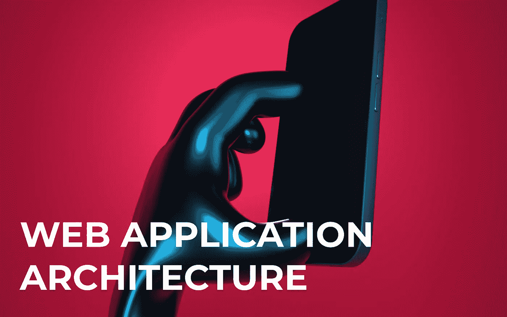

# Web 应用程序架构:最佳实践和指南

> 原文：<https://medium.com/geekculture/web-application-architecture-best-practices-and-guides-1daa277e5f8c?source=collection_archive---------14----------------------->

如果你计划开发和发布一个 web 产品，你迟早会遇到 web 应用架构的概念。软件开发人员使用这个术语来描述数字产品的高层结构，包括数据存储和服务器操作细节。