# 微服务的网络应用📳(微服务—第 1 部分)

> 原文：<https://medium.com/geekculture/web-applications-to-microservices-microservices-part-1-90287982e7fa?source=collection_archive---------4----------------------->

微服务架构概述

# 整体建筑

我们今天所拥有的被称为单片应用程序。这些都是作为一个单一的、统一的单元构建的，或者换句话说，我们可以说，整体应用程序为您的整个应用程序提供了一个单一的可执行文件(整个应用程序被打包到一个文件中)。

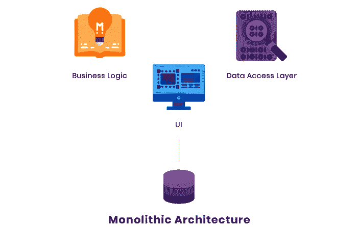

让我们讨论一下整体架构的一些优点和缺点。

## 单片架构的优势

**①** 易于测试——因为它是一个单独的应用程序，所以测试整个应用程序很容易。

**②** 易于监控——开发者知道应用程序每个部分的位置，因为它是一个单独的应用程序。因此监控很容易。

**③** 当使用单片架构时，很容易启动和开发新的应用程序。此外，它易于部署，因为所有需要的操作都可以在一个目录中一次执行。

**④** 基础设施简单。

## 整体架构的缺点

**①**

想想下面的场景:

假设有一个“租车应用程序”，我们有一个用户界面、业务播放器、汽车注册流程、客户注册流程、租车流程..等等。因此，根据整体架构，所有这些进程都放在一起，作为一个文件传送。因此，如果有人需要更改用户界面，现在我们需要发送整个文件。

相应地，你需要测试整个应用程序，你需要检查整个应用程序的性能..等等。

**②由于它维护着一个庞大的代码库，因此理解起来要困难得多。**

想想下面的场景:

有时可能会有 100 或 1000 名工程师开发同一个应用程序。因此，如果出现一些问题，开发人员必须通过一个单独的支持过程，调试过程将非常困难。部署过程也很艰难，因为它需要确保一切顺利转移到新版本。

**③有时对应用程序进行更新对开发人员来说也是一个挑战，因为它需要重新部署系统**

**④由于大部分元素都是相互依赖、相互关联的，因此，要把应用程序换成一种新的语言、新的框架……真的很难。**

# **面向服务的架构**

这是我们在计算机软件设计中可以看到的建筑设计。这里，应用程序的组件通过网络或通信协议向其他组件提供服务。面向服务的体系结构使得软件组件可以很容易地在各种网络上协同工作。面向服务的主要概念独立于任何供应商、技术或产品。有人说微服务就是 SOA 2.0。SOA 可以分为以下两个部分:

> ***功能方面***
> 
> ***服务质量方面***

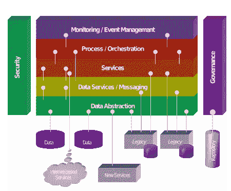

**面向服务架构的优势**

✹易于维护

✹可伸缩

✹可靠

✹平台独立性

**面向服务架构的缺点**

✹高成本

✹高带宽服务器

✹额外超载

# 微服务架构

微服务可以被定义为将大型软件应用程序切割成松散耦合的单元的途径，这些单元通过 API 相互通信。它也是解决由整体架构的限制引起的所有问题和交通堵塞的一种可能的选择。而这个架构遵循的是面向 SOA 服务的架构设计。有人说微服务就是 SOA 2.0。

Martin Fowler

Martin Fowler 列出了微服务架构的以下九个常见特征:

*1。故障设计*

*2。围绕业务能力组织*

*3。智能端点&哑管道*

*4。产品不是项目*

*5。分散数据管理*

6。基础设施自动化

7。分权治理

8。进化设计

9。通过服务的组件化

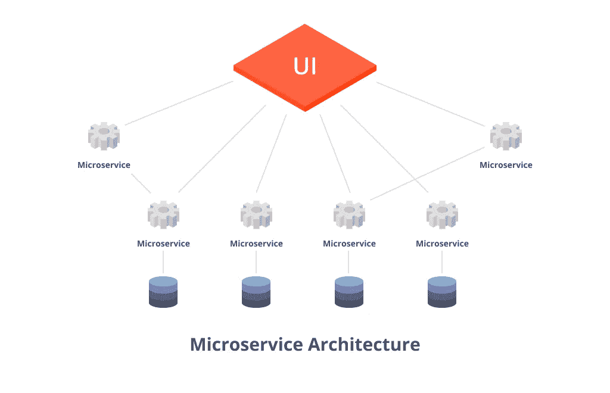

**微服务的特点:**

📍微服务是领域驱动的开发。它必须有一个明确的范围。

📍它有能力运行自己的进程，并且不依赖于其他人。

📍微服务可以与一些轻量级机制进行通信。大部分时候是 HTTP，但不仅仅局限于 HTTP。(通过轻量级方式与其他服务通信)

📍微服务应该能够作为单独的服务进行扩展和部署。并且它应该能够使用不同类型的编程语言来实现。

📍使用微服务时，要尽可能保持分散控制。

📍并且应该使用一个小的开发团队来开发它。

最后，微服务可以定义为:

一种将单个应用程序开发为一组小型服务的方法，每个服务都有能力运行自己的进程，而不依赖于其他服务，并使用轻量级机制进行通信。并且这些服务共享最少的集中管理。这些服务可以用不同类型的编程语言开发，并使用不同的数据存储技术。

## 独立扩展

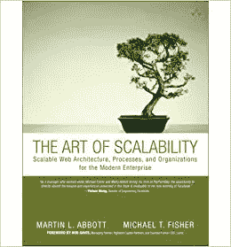

Martin Abbott 和 Michael Fisher 在 2015 年出版的《可伸缩性的艺术》一书中对此进行了完美的描述

# 🢃🢃🢃🢃

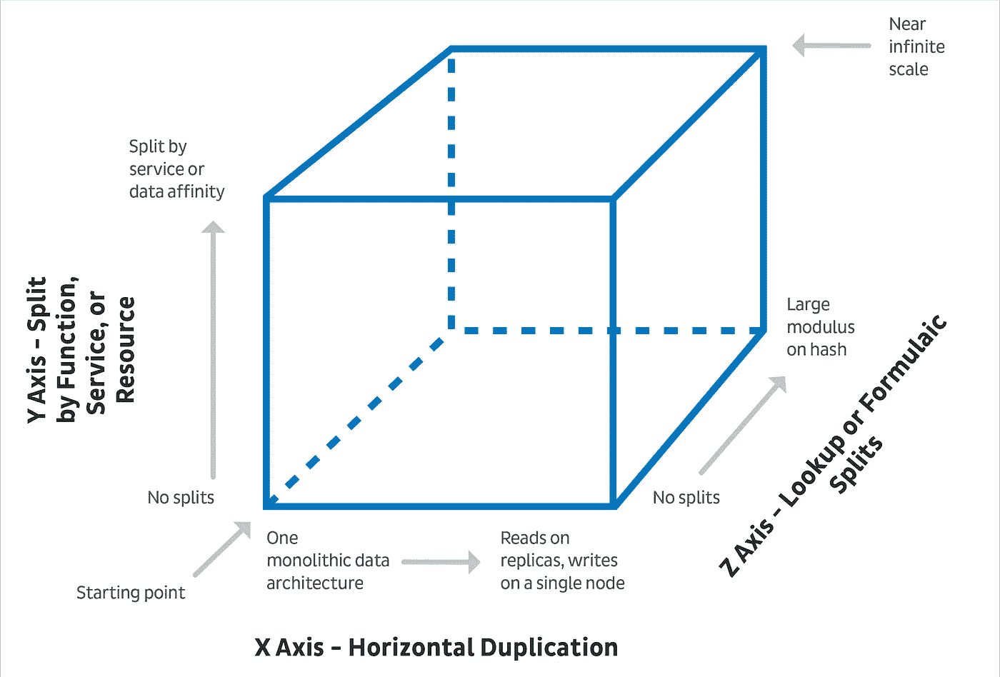

Ref:[https://dzone.com/articles/scaling-microservices-advanced-approaches-with-the](https://dzone.com/articles/scaling-microservices-advanced-approaches-with-the)

因此，这个立方体定义了三种不同的途径来扩展应用程序。有三个轴，分别是 X、Y 和 z。

> ***水平复制— X 轴* s**

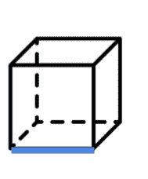

应用程序应该能够通过 x 轴向外扩展。如果一个实例不够，这意味着它应该能够扩展其他实例并继续运行。

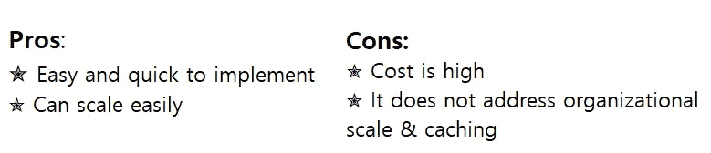

> ***面向查找的拆分— Z 轴***

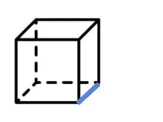

通过 z 轴，它应该能够分片。(也许它应该能够在地理上划分流量)

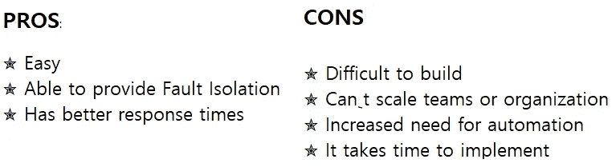

> *功能或服务分割—* ***Y 轴***

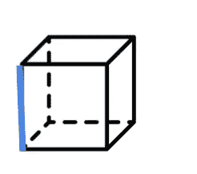

通过 y 轴，应该可以进行功能分解。相应地，在 y 轴上，伸缩将一个大的整体应用程序分解成微小的服务。(这里微服务来合体)

如果我们采取功能分解，很多人倾向于认为由于系统庞大，他们甚至不能想到微服务。让我们通过下面的例子来理解它。

示例:

假设我们有一个单一的应用程序，在“租车应用程序”中注册车辆、注册客户、租车、计费和支持。因此，根据功能分解，现在我们可以拆分这 5 种不同的服务。现在假设有另一个叫做“搜索功能”的功能，这是假日季节需求最大的服务。所以现在我们可以扩展新的搜索服务来平衡负载。但是没有必要扩展三种不同的车辆登记服务。因为现在不需要服务。

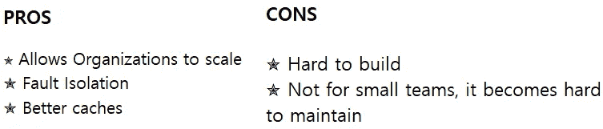

# 如何开发微服务应用🧐

📍**语言-** 我们可以选择任何编程语言，因为每个服务可以使用不同的语言。此外，我们可以混合许多类型的语言、数据存储技术和开发框架。

📍**设计-** 应该考虑领域驱动的设计。(确保每项服务都不依赖于其他因素)

📍当考虑整体架构时，一个错误就可能导致整个系统崩溃。这可以在微服务架构中克服，因为它有独立的单元，可能不会影响整个应用程序。但这并没有说微服务有能力应对故障。从整体架构转换到微服务不会自动解决问题，因此不要在设计应用程序时假设它会毫无疑问地顺利运行。

假设你有一个服务，你要调用服务 B，突然服务 B 停止工作。因此，现在您应该确保整个微服务链不会因为单个服务的失败而失败。

因此，你必须实现**服务弹性**和**容错**特性。

📍因为有如此多的框架支持微服务开发。也有一些可用于部署的框架。

📍避免硬编码这些值。

例如:如果您硬编码了另一个服务的名称，并且在该服务中更改了 IP 地址或其他服务。这可能会导致系统故障。为了避免这种情况，我们可以使用 API 网关、治理注册器..等等。

📍需要重组你的开发团队，因为你应该有一个拥有一切的完整的 flex 团队。这是因为你需要在团队成员中分配职责。

# 微服务的优势

✹:我们可以选择任何语言，因为每个服务可以使用不同种类的语言。

✹服务是可扩展的，因此程序员可以独立地扩展系统的不同单元。

✹:理解和诊断任何生产问题都很容易，因为团队成员总是了解整个服务。

✹易于理解是这种微服务架构的另一个优势。随着简单性的增强，程序员能够理解服务的功能。

# 微服务的缺点

✹很难监控，因为有多个应用程序。

✹测试并不容易

✹应该非常重视版本和部署。因为如果您更改了版本，依赖您的服务或使用您的服务的其他消费者可能会遇到问题。

✹必须确保所有的服务都运行良好，以使整个应用程序正常工作。

微服务架构的服务之间的✹通信有些复杂，因为它包含作为独立服务的一切。因此，在模块之间传递的请求应该小心处理。

✹调试问题可能很困难。(因为每个服务都有自己的一组日志要查看)

## Java 中的微服务

Java 可以说是开发微服务最好的编程语言之一。下面是一些适用于 java 的微服务框架。

*   下拉向导
*   Spark 框架
*   时髦的
*   吉普斯特
*   弹簧框架
*   游戏框架

# 参考

 [## 整体架构和微服务架构之间的差异

### 整体架构是作为一个大型系统构建的，通常只有一个代码库。单片应用程序紧密地…

www.tutorialspoint.com](https://www.tutorialspoint.com/difference-between-monolithic-and-microservices-architecture)  [## SOA 与微服务:用例子解释主要区别

### SOA 是计算机软件设计中的一种架构模式。在这种类型的应用程序中，组件提供服务…

www.guru99.com](https://www.guru99.com/microservices-vs-soa.html#2)  [## 比例立方体

### 最后更新日期:2020 年 2 月 12 日|发布者:Marty Abbott 5 分钟阅读秤立方体是一种细分模型…

akfpartners.com](https://akfpartners.com/growth-blog/scale-cube)