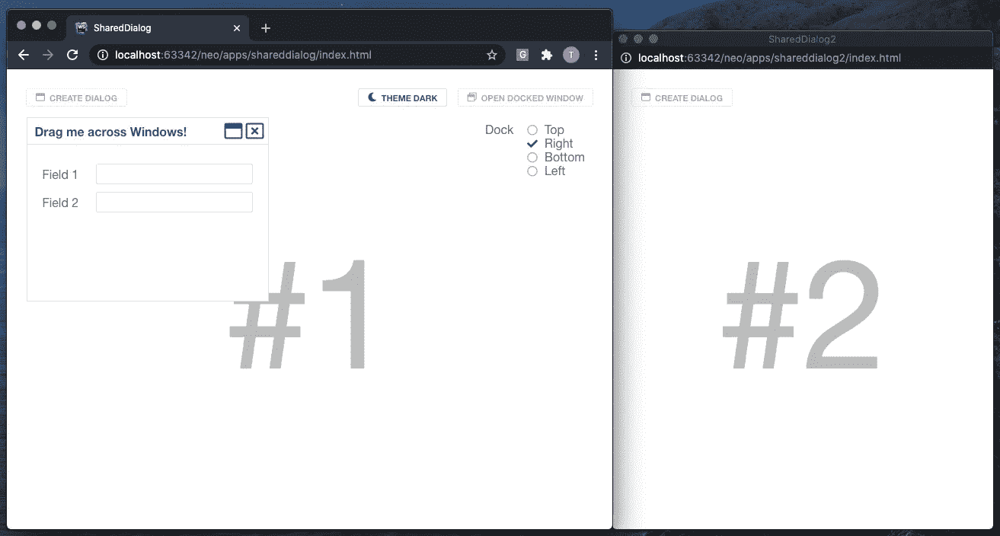
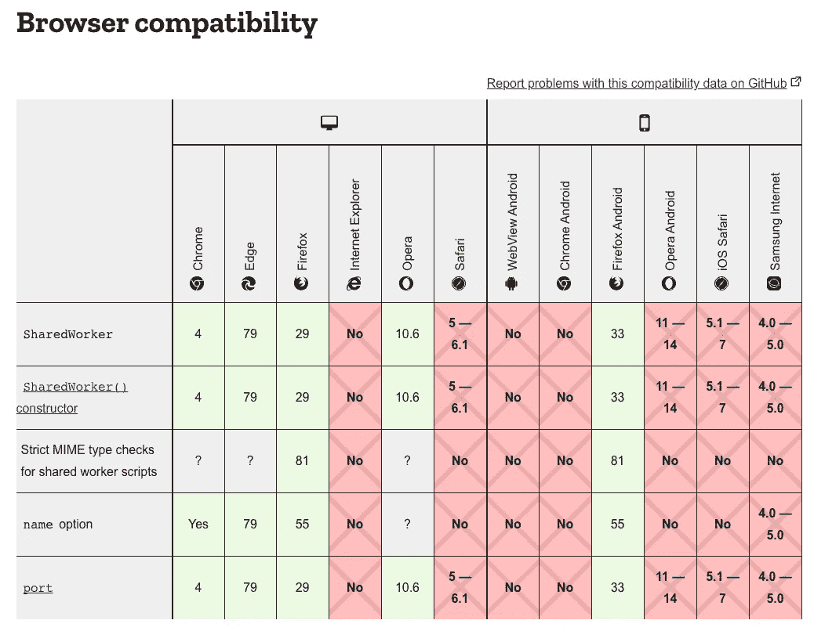
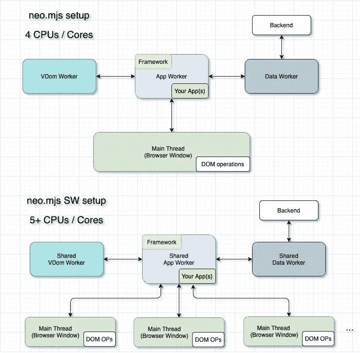
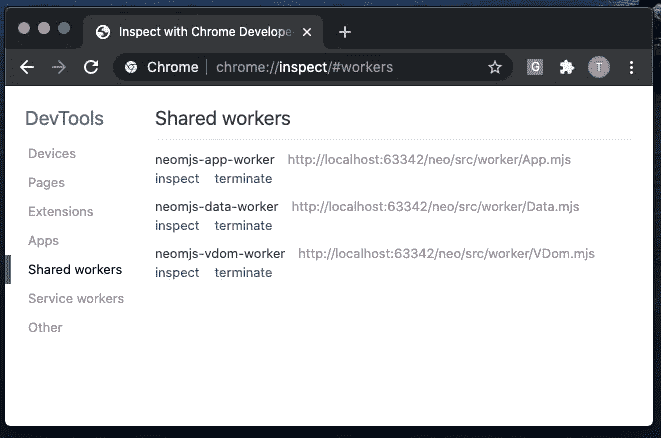
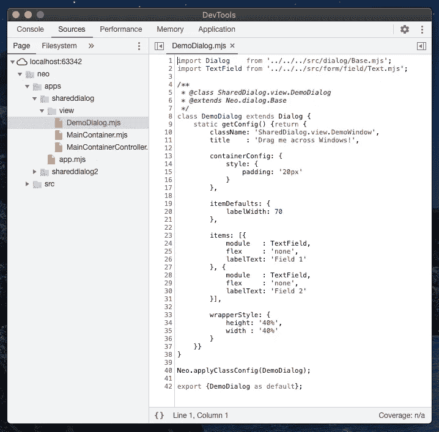
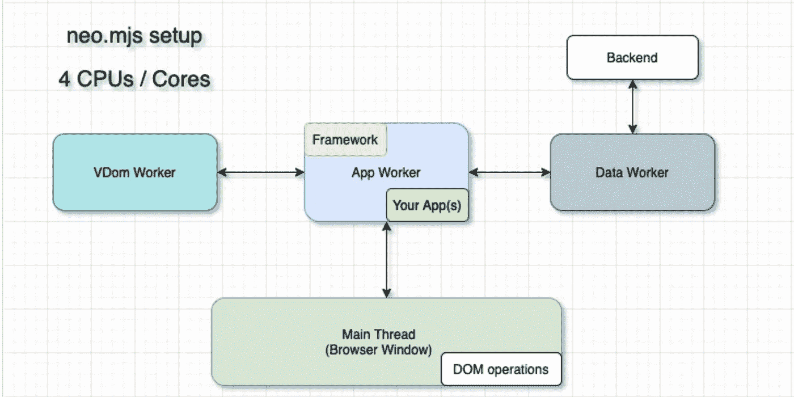
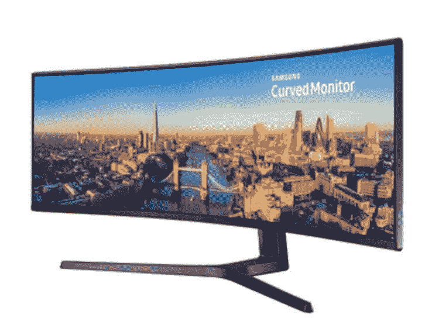

# 基于网络的多屏幕应用，包括拖放

> 原文：<https://medium.com/geekculture/web-based-multi-screen-apps-including-drag-drop-5e161da6507b?source=collection_archive---------0----------------------->

我对这个话题感到兴奋，因为我们将要谈论的技术为新一代基于网络的应用程序开辟了道路，这种应用程序可以直接跨多个浏览器窗口进行通信，而不涉及后端。

[旁注]这篇文章很长。如果你只有很短的时间，看看 2 中的视频。，阅读 10 中的精彩部分。然后决定你是否想全部读完。

# 内容

1.  介绍
2.  演示应用程序
3.  我们使用的是 HTML5 拖放 API 吗？
4.  浏览器窗口之间如何沟通？
5.  浏览器对共享工作者的支持如何？
6.  neo.mjs 框架再合适不过了！
7.  演示应用程序代码库概述
8.  拖放概念
9.  多窗口拖放逻辑
10.  **将对话框放入另一个窗口**
11.  在线演示
12.  我们能做得更多吗？
13.  neo.mjs 框架的下一步是什么？
14.  最后的想法:呼吁行动！

# 附录

1.  前一篇文章:“将单页应用扩展到多个浏览器窗口”
2.  停靠的浏览器窗口

# 1.介绍

举例来说，如果你想创建一个基于 web 的 IDE 或者一个同时在多个屏幕上运行的银行/交易应用，你会面临几个问题。

当然，你可以创建一个原生外壳(例如使用 [GitHub Electron](https://github.com/electron/electron) )并以全屏模式在每个屏幕上显示一个浏览器窗口，但是当多个窗口需要相互交互时，这就变得非常棘手了。

这从简单的事情开始:您在左侧屏幕上有一个表格，当您单击表格行时，您希望调整右侧屏幕上图表的内容。

如果您想将内容从一个屏幕动态移动到另一个屏幕，这确实会变得更加复杂。示例:您有一个包含导航树和内容视图的屏幕，并且您希望将导航树移动到一个单独的浏览器窗口中，同时保持功能不变。

跨多个浏览器窗口拖放可能是最困难的部分。想象一个应用程序在两个屏幕上运行(每个屏幕上有一个全屏浏览器窗口)，你可以创建一个应用程序内对话框，并将其从一个屏幕拖到另一个屏幕。你知道并且可能喜欢大多数操作系统桌面的这个特性，在那里你可以很容易地在多个屏幕上拖动你的程序/视图。那么为什么不为你的网络应用提供同样的功能呢？

# 2.演示应用程序

我们正在使用一个简单而强大的演示应用程序:



您可以在浏览器中打开主窗口，然后用右上角的按钮打开一个停靠窗口。您可以动态切换第二个窗口的停靠边。

我们可以用左上角的按钮打开一个应用程序对话框，然后把它拖放到停靠窗口中。我们也可以把它从停靠窗口拖回主窗口。

让我们来看看这是怎么回事:

# 3.我们使用的是 HTML5 拖放 API 吗？

你可能对这个很熟悉:

[](https://developer.mozilla.org/en-US/docs/Web/API/HTML_Drag_and_Drop_API) [## HTML 拖放 API

### HTML 拖放界面使应用程序能够在浏览器中使用拖放功能。用户可以选择…

developer.mozilla.org](https://developer.mozilla.org/en-US/docs/Web/API/HTML_Drag_and_Drop_API) 

简而言之:我们是**而不是**在使用它。

该 API 非常适合简单的用例，比如一个文件上传按钮，您可以在这里将 CVS 文件导入到您的应用程序中。你可以将桌面上的项目拖动到浏览器窗口，这很好。一个好处是，当鼠标不停留在浏览器窗口上时，可以看到一个拖动代理。然而，拖动代理只能得到很少的定制，在放下时，你只能得到一个数据传输对象。

该 API 并不是真正为应用程序特定的复杂用例设计的，比如当你想要移动一个大的组件树时。

# 4.浏览器窗口之间如何沟通？

**答:**显然你可以用后端来处理这个部分。例如，使用套接字连接的 2 个浏览器窗口，然后您可以随意更改。从性能角度来看，这种方法是一场噩梦。

**B:** 浏览器窗口可以使用 postMessages 与它创建的弹出窗口(& iFrames)通信:

[](https://developer.mozilla.org/en-US/docs/Web/API/Window/postMessage) [## Window.postMessage()

### window.postMessage()方法安全地启用对象之间的跨原点通信；例如，在页面和…

developer.mozilla.org](https://developer.mozilla.org/en-US/docs/Web/API/Window/postMessage) 

这种方法已经比“A”好得多了，但是它也带来了许多问题，开发人员可能会很纠结:

1.  商业逻辑放在哪里？
2.  如何避免代码冗余？
3.  如果有多个弹出窗口会发生什么？(假设 popup1 产生了一个新的 popup2，您希望在主窗口和 popup2 之间进行通信)
4.  当我们将一个组件移动到不同的窗口时，我们可以保留它的同一个 JS 实例吗？(不是不可能，但是……)

聪明的方法是使用一个共享的员工:

 [## 共享工作者

### SharedWorker 接口表示一种特定的工作器，可以从几个浏览上下文中访问它…

developer.mozilla.org](https://developer.mozilla.org/en-US/docs/Web/API/SharedWorker) 

SharedWorkers 也使用 postMessages，因此每个浏览器窗口可以直接连接到一个 worker 实例，您可以建立通信。

仅使用弹出窗口没有限制。你也可以使用“真正的”浏览器窗口。

这可能更接近真实的用例，在真实用例中，您使用一个本机 shell，并在每个屏幕上添加一个 WebView(无头浏览器窗口)。

# 5.浏览器对共享工作者的支持如何？

再说一次:多窗口应用最常见的用例是本地 Shells，所以你可以选择一个你喜欢的浏览器(比如一个无头的 Chromium)。

不过了解一下对所有浏览器的支持感觉还是有帮助的:
[https://developer . Mozilla . org/en-US/docs/Web/API/shared worker](https://developer.mozilla.org/en-US/docs/Web/API/SharedWorker)



谷歌 Chrome 中的支持是完美的。SharedWorkers 甚至在这里支持 JS 模块。

自从微软 Edge 改用 Chromium 引擎后，在那里也是一个水平。

我们有一张 Android 版 Chrome 的开放票:
[https://bugs.chromium.org/p/chromium/issues/detail?id=154571](https://bugs.chromium.org/p/chromium/issues/detail?id=154571)

Firefox 中支持 SharedWorkers(我最后一次检查，不包括 JS 模块)。

WebKit (Safari)还不**支持**:

 [## 149850 -恢复对共享工作者的支持

### 错误 149850:恢复对共享工作人员的支持

bugs.webkit.org](https://bugs.webkit.org/show_bug.cgi?id=149850) 

该团队至少在考虑恢复它，所以在票上添加评论会有帮助！

# 6.neo.mjs 框架再合适不过了！

为了创建这个演示应用程序，我们不想重新发明轮子，并且可以用很少的代码解决这个用例。

neo.mjs 框架&所有演示都是完全开源的(麻省理工学院许可的)，所以你可以使用、扩展和定制它。

您可以在此处找到该项目:

[](https://github.com/neomjs/neo) [## 近地天体

### neo.mjs 使您能够使用一个以上的 CPU 创建可扩展的高性能应用程序，而无需使用…

github.com](https://github.com/neomjs/neo) 

快速浏览一下它附带的应用程序架构:



SharedWorkers 设置正是我们的跨窗口拖放演示所需要的。我们可以通过修改一个框架配置，从普通工人设置切换到共享工人设置:

```
useSharedWorkers: true
```

使用框架的方式保持不变。

**那么，该演示环境的主要优势是什么？**

1.  我们获得了现成的工人设置和通信 API。
2.  我们在所有连接的浏览器窗口中获得唯一的 DOM ids。
3.  DOM 事件与主线程完全解耦。
4.  所有组件(JS 实例)都存在于应用程序工作器中。

# 7.演示应用程序代码库概述

目前，代码库位于 apps 文件夹中:
[https://github.com/neomjs/neo/tree/dev/apps](https://github.com/neomjs/neo/tree/dev/apps)

准确地说是/sharedDialog & /sharedDialog2。

[旁注]这种布局的原因在于在线示例(Github 页面)的部署方式。更好的做法是将每个示例放入其自己的存储库中，并调整部署以单独获取每个 repo。这也允许我们为每个例子使用不同的框架版本。在我的待办事项列表上！

描述这两个主要视图相当简单:
[apps/shared dialog 2/view/main container . mjs](https://github.com/neomjs/neo/blob/dev/apps/shareddialog2/view/MainContainer.mjs)

第一个 MainContainer 的代码非常相似，但也包含停靠窗口 radios:
[apps/shared dialog/view/main container . mjs](https://github.com/neomjs/neo/blob/dev/apps/shareddialog/view/MainContainer.mjs)

app1 中有 DemoDialog.mjs 视图:
[apps/shared dialog/view/demodialog . mjs](https://github.com/neomjs/neo/blob/dev/apps/shareddialog/view/DemoDialog.mjs)

该文件仅包含在**中，并不存在于我们的停靠窗口应用程序中。**

接下来让我们来看看第二个 MainContainerController:
[apps/shared dialog 2/view/MainContainerController . mjs](https://github.com/neomjs/neo/blob/dev/apps/shareddialog2/view/MainContainerController.mjs)

你想想，这已经很了不起了！

停靠窗口应用程序本身不包含任何逻辑，因此存在**零**冗余。

```
onCreateDialogButtonClick()
```

上面的方法期望主 app 存在，在这个上下文里面是公平的。我们直接在主应用程序的视图控制器中触发一个方法。我们也可以在主视图实例上触发一个事件并订阅它。

因此，主应用 MainContainerController 包含所有相关的业务逻辑，只需 600 行代码:
[apps/shared dialog/view/MainContainerController . mjs](https://github.com/neomjs/neo/blob/dev/apps/shareddialog/view/MainContainerController.mjs)即可完成

在我们深入研究之前，让我们先了解一下拖放的基础知识，这样我们就有了共识。

# 8.拖放概念

当我们拖动应用程序对话框时，我们并没有拖动真正的 DOM 节点，而是所谓的 proxyEl。

proxyEl 应该是 real 元素的一个更轻量级的克隆。对于一个对话框，它包含标题和空主体以减少浏览器回流(想象一个包含网格/表格的复杂组件树)。

对话框类还在开发中，你可以在这里找到它:
[src/dialog/base . mjs](https://github.com/neomjs/neo/blob/dev/src/dialog/Base.mjs)

我们正在淡出真正的对话框(减少不透明度),我们正在四处移动代理。

这种方法的一个好处是，我们可以很容易地扩展和增强它。例如，我们可以实现一个 ESC 键监听器来在任何时候取消当前的拖动操作(销毁 proxyEl，淡入对话框)。

对话框类正在使用 draggable 的实例。drag zone:
[src/draggable/drag zone . mjs](https://github.com/neomjs/neo/blob/dev/src/draggable/DragZone.mjs)

这个函数可以将 proxyEl 运动直接分配给可选的主线程 addon:
[src/main/addon/dragdrop . mjs](https://github.com/neomjs/neo/blob/dev/src/main/addon/DragDrop.mjs)

= >对于简单的用例，我们不需要将每个 drag:move 事件都推送到应用程序工作器，从性能角度来看，将移动保持在 main 中是有意义的。

**简而言之:**dialog 类已经有了在它所在的应用程序(浏览器窗口)中拖动它的逻辑，所以我们不需要在我们的演示应用程序中实现这一部分。

# 9.多窗口拖放逻辑

如 7 中所述。你已经可以在这里找到完整的逻辑:
[apps/shared dialog/view/maincontainercontroller . mjs](https://github.com/neomjs/neo/blob/dev/apps/shareddialog/view/MainContainerController.mjs)

首先，让我们来看看`createDialog()`

两个应用程序都有一个“创建对话框”按钮，点击它将创建一个新的对话框实例。我们也可以在关闭时卸载对话框，然后在单击按钮时再次装载它。这取决于你的应用用例(它是你想保留的常用对话框还是类似于只使用一次的登录表单)？).

启用或禁用“创建对话框”按钮非常简单，因为所有组件都在应用程序工作器中。因此您可以使用管理器。组件来查找实例，即使它们的 DOM 位于不同的浏览器窗口中:

`button.disabled`是一个框架配置，所以只要给它赋一个新值就会触发一个 setter 并自动为你更新 UI。

我们在对话框实例配置中添加了一个`dragZoneCreated`监听器，因此我们可以监听相关的事件:

DragZone 本身将在 dialog 类中创建`onDragStart()`(如果它还不存在的话)，所以我们需要这个自定义事件挂钩。

我们只在第二个浏览器窗口存在的情况下做一些事情`onDragStart()`。

我们假设你不能在拖动操作中调整对话框或浏览器窗口的大小(嗯，也许可以用一些操作系统快捷键，但不能用鼠标)。

我们存储对话框 rect，它的大小与 proxyEl 相同。

我们储存了`dragStartWindowRect`。重要提示:这是我们开始拖动的窗口的 document.body DOMRect，所以它可以是主窗口或停靠窗口。

我们将没有开始拖动的窗口的大小存储在`targetWindowSize`中。

对于 drag:move，我们使用一个矩形实用程序类:
[src/util/rectangle . mjs](https://github.com/neomjs/neo/blob/dev/src/util/Rectangle.mjs)

(当我们添加浮动菜单时，我们可以进一步增强这一点。)

如果我们还没有 proxyEl，我们将创建它(包括当前位置)，否则我们将把它移动到与鼠标光标匹配的位置。

我们隐藏了非 drag:start 窗口的 proxyEl，以防 proxyEl 在 drag:start 窗口中完全可见(否则，如果您拖动得非常快，我们会有副作用)。

这里的线索是，如果我们开始在停靠窗口内拖动，我们可以假装它是主窗口，另一边有一个停靠窗口=> **重用相同的业务逻辑**。

如果我们将对话框完全放在 drag:start 窗口中，我们不需要做任何事情，因为对话框 DragZone 会处理好的。

我们需要切换逻辑，以防对话框完全放在另一个窗口中，或者放在两个窗口之间。

# 10.将对话框放到另一个窗口中

这是本文的亮点。

我们基本上可以将代码简化为:

```
dialog.unmount();

dialog.appName = 'SharedDialog2'; // the name of the other Window App

dialog.mount();
```

现在你很可能会问自己:

**“这到底怎么可能？!"**

这将把我们带回到:

**那么，在这个演示环境中，[neo.mjs]的主要优势是什么？**

1.  我们获得了现成的工人设置和通信 API。
2.  我们在所有连接的浏览器窗口中获得唯一的 DOM ids。
3.  DOM 事件与主线程完全解耦。
4.  所有组件(JS 实例)都存在于应用程序工作器中。

我们可以保留同一个 dialog JS 实例，因为它位于(共享的)app worker 中。

我们可以将它放在另一个浏览器窗口中，因为我们知道不会有任何冲突的 DOM ids。

解耦的 DOM 事件意味着对话的整个业务逻辑仍然可以工作。将它放入另一个窗口后，您仍然可以关闭它、调整它的大小或再次拖动它。

框架知道哪个应用程序在哪个窗口中，所以调整 appName 是我们在这里需要做的。

# 11.在线演示

我将演示添加到 neo.mjs 在线示例:
[https://neomjs.github.io/pages/](https://neomjs.github.io/pages/)

请在谷歌 Chrome 的桌面版本中打开演示。

[dist/production/apps/shared dialog/index . html](https://neomjs.github.io/pages/node_modules/neo.mjs/dist/production/apps/shareddialog/index.html)

dist/prod 版本也可以在 Firefox 上运行，但是还没有完善。停靠窗口的位置需要一些调整，并有一些 CSS 问题。拖放逻辑本身工作良好。

[apps/shared dialog/index . html](https://neomjs.github.io/pages/node_modules/neo.mjs/apps/shareddialog/index.html)

开发模式版本只能在 Chrome & Edge 上运行，因为其他浏览器还不支持共享 worker 范围内的 JS 模块。在这个版本中，您可以看到真正的代码，因为它不需要任何编译就可以工作。

要检查 SharedWorkers，您需要输入以下 URL:

chrome://inspect/#工人



然后点击应用工人，你会得到一个新的控制台窗口。

在 dev 模式中，您将获得真正的代码(没有源代码图):



# 12.我们能做得更多吗？

答案显然是"**是的！**”。

1)我们可以充分润色 Firefox 的演示。

2)使逻辑更加通用。我们可以扩展对话。为共享 workers 上下文创建一个新的 DragZone 实现。这可以使它更容易使用。

3)添加跨窗口动画。
虽然我们可以很容易地改变对话框的动画目标，这很好:

如果我们可以将锚节点放在不同的窗口中，那也很好。理论上:我们在两个窗口中以不同的位置同时开始相同的动画(例如，将 proxyEl 从窗口外部移动到一个窗口中的按钮，并将其从对话框移动到另一个窗口中可见区域外部的目标位置)。

4)在窗口之间放下对话框是一个非常有趣的话题。

我从找出哪个窗口与对话框有更大的交集并将对话框移动到那里的方法开始:

公平地说，这对于大多数用例来说已经足够了。

然而，你可以在屏幕之间拖放基于操作系统的应用程序，它们仍然保持完整的功能。那么，为什么不为基于网络的应用程序实现同样的目标呢？

想到的第一个想法是克隆对话框 JS 实例，并在每个窗口中有一个实例。这种方法带来了很多副作用和定制逻辑。如果拖动真实实例会发生什么？更糟糕的是，如果拖动克隆的会怎么样？我们需要为用户可以交互的每个组件定制逻辑，并使它们保持同步(例如，在你输入文本字段的情况下)。

有了 neo.mjs 设置，我们可以做得更好！

我们可以把对话框的 DOM 放到两个窗口中，逻辑仍然可以工作。我首先想到的是保留 1 个 vdom(新状态)对象和 2 个 vnode 对象(当前状态)，但是这需要进行两次增量更新计算。

因为对话框应该是同步的(除了它们的位置样式值)，我们甚至不需要这个。

我最新的头脑风暴想法是给应用工人添加一个标志，以防它有组件(对话框)应该同时存在于多个浏览器窗口中。

如果是这样，我们可以调整组件的 appName 配置来支持一系列应用程序。如果我们改变一个组件的 vdom，而这个组件在一个对话框中被挂载了不止一次，那么它可以只把增量更新发送给所有相关的主线程。

这仍然留下了用户生成更改的话题，例如，当你在一个文本字段中键入内容时，我们只需更新 vdom 和 vnode，对于单页应用程序没有什么可做的。或者在滚动网格/表格的情况下，不需要滚动同步。

因此，在一些地方，框架需要触发新的增量更新，最好不要为非共享的 workers 上下文添加不相关的代码。

这是一个我很想深入探讨的话题！

5)一旦这个逻辑到位，我们还可以做一些事情，比如调整对话框的大小，使它可以在不止一个浏览器窗口中运行。

6)我们可以支持 2 个以上的窗口。例如，顶部有两个屏幕，底部有两个屏幕= >一个对话框可以同时被拖入 4 个窗口。我知道，边缘案件的边缘案件…:)

7)我们可以在 DragZone 中添加一个挂钩，以防止在设置了标志的情况下发生拖放逻辑(例如，如果我们将一个对话框拖放到另一个窗口中，则不需要将它也拖放到原始窗口中(调用 setTimeout()的原因)。

# 13.neo.mjs 框架的下一步是什么？

同样，你可以在这里找到麻省理工学院完全授权的项目:

[](https://github.com/neomjs/neo) [## 近地天体

### neo.mjs 使您能够使用一个以上的 CPU 创建可扩展的高性能应用程序，而无需使用…

github.com](https://github.com/neomjs/neo) 

我的内部路线图非常长。

说实话，在开发拖放实现的时候，我脑海中就有了这个技术演示的想法，并有动力去完成它，只是为了感受一下是否真的需要它。

如果你正在做一个基于网络的多屏应用有意义的商业用例，请在这里添加评论！

因为据我所知，目前使用该框架的客户主要集中在水疗中心:



我将把我的重点放在框架核心和添加更多的组件以及进一步完善现有的第一。

有对视图模型和数据绑定(虚拟机配置到组件配置)的请求，这是一个史诗。

简化组件配置= >一旦 webpack (Acorn)支持，就添加公共类字段是我的首要任务。第一个突破性的变化之一，所以这将成为 neo.mjs v2。

# 14.最后的想法:呼吁行动！

这种规模的开源项目需要大量的工作和爱。

不是指这个技术演示本身，而是整个 neo.mjs 框架范围。

为了达到一个可持续的水平，他们需要一个积极的贡献者或赞助者社区。理想情况下两者都有。

可悲的是，neo.mjs 仍然是一颗隐藏在野外的宝石，还没有足够多的人注意到它的存在。

我认为，当框架最初在 GitHub 上发布时(2019 年 11 月)，这些概念太超前了。从那以后发生了很多变化(自 GA 以来有 4700 多个提交)。我真心希望现在有更多的开发者准备好尝试一下。

如果你想支持这个项目，就告诉你的朋友，或者分享这篇文章。

**这对我意义重大！**

如果你有 JS 技能可以贡献，我们非常欢迎你这样做。

我意识到，虽然使用 neo.mjs 相当容易，但对它做出贡献却是另一回事，需要专家水平。

我仍然愿意帮助更多的开发人员跟上速度！

现在，我将更专注于帮助客户项目将他们的第一个 neo.mjs 应用程序投入生产，以免在财务方面耗尽精力。别担心，我会在业余时间尽可能好地推进这个项目。

问候&快乐编码，
托拜厄斯

# 附录

# 1.前一篇文章:“将单页应用扩展到多个浏览器窗口”

这个演示应用程序有意保持尽可能简单。

如果您想查看一个或多个更复杂的用例(无需跨窗口拖放):

你可以在这里找到这篇文章:

[](/swlh/expanding-single-page-apps-into-multiple-browser-windows-e6d9bd155d59) [## 将单页应用程序扩展到多个浏览器窗口

### 内容

medium.com](/swlh/expanding-single-page-apps-into-multiple-browser-windows-e6d9bd155d59) 

这篇文章在这一点上有点过时，但 Covid 应用程序本身仍然是如何在 SharedWorkers 上下文中进行交流的一个很好的例子。

# 2.停靠的浏览器窗口

当前的实现更像是一个副产品，因为它方便测试不同的拖放方向。

然而，我已经得到反馈，这通常对多窗口应用有用。

尤其是在你的用户在大屏幕上工作的情况下。
你知道，大概是这样的:



在 neo.mjs 代码库中，我们有一个新的(可选的)主线程插件来支持这一点:
[src/main/addon/window position . mjs](https://github.com/neomjs/neo/blob/dev/src/main/addon/WindowPosition.mjs)

您可以将它放入您的 index.html 文件(`mainThreadAddons`)以及 build scripts/web pack/JSON/myapps . JSON 中

有两个主要限制:

1.  您只能修改通过`window.open()`创建的浏览器窗口，这意味着它仅限于弹出窗口。因此，你可以调整弹出窗口的大小和位置，但不能调整主窗口本身。
2.  有一个错误(安全特性)阻止你通过编程将一个弹出窗口移动到不同的屏幕上。示例:您在第二个屏幕上打开主窗口。打开一个停靠窗口。将主窗口拖到第一个屏幕上。停靠窗口将停留在第二个屏幕上，即使位置是正确的。如果你手动拖动弹出窗口到你的第一个屏幕上，它将再次工作。

我没有深入这两个问题，可能有浏览器标志允许它。