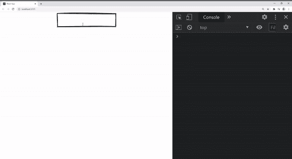
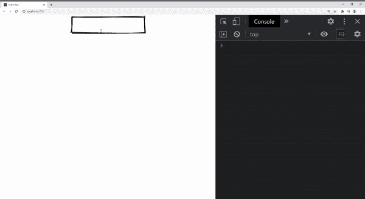

# 带有 React 挂钩的 Web 组件

> 原文：<https://medium.com/geekculture/web-components-with-react-hooks-f0e2a62de323?source=collection_archive---------23----------------------->


## 简介:

当创建一个面向未来的基于组件的设计系统时，Web 组件非常有用，该系统可以跨多个产品进行互操作和共享。

不幸的是，React 是少数几个不完全支持 Web 组件的现代库之一，尤其是在处理事件时。原因是 React 实现了自己的合成事件系统，它不能监听来自 Web 组件的 DOM 事件。

好消息是，您不需要使用 React 从头开始重写所有的设计系统。有一个简单的解决方法，需要创建瘦包装器并订阅 DOM 事件。

在这个例子中，我使用[连接的元素](https://wiredjs.com/)使一个输入 Web 组件与 React 一起工作。有线元素是一组手绘的、粗略的常见 UI 元素。该库使用 [LitElement](https://lit-element.polymer-project.org/) 来创建 Web 组件。

此外，在本文中，我将专门解决通过 React 组件包装器捕获 DOM 事件的问题。如果您想查看所有关于 React 和 Web 组件支持的未决问题，请参考 custom-elements-everywhere.com。

## 概述:

1.  创建 React 应用
2.  安装有线元件
3.  导入有线输入元素
4.  创建组件包装
5.  测试输入“onChange”事件

## 1.创建 React 应用:

创建一个新的 [React 应用](https://create-react-app.dev/docs/getting-started/)。

```
npx create-react-app react-webcomponent
```

## 2.安装有线元件:

关于连线元素的完整文档可以在它们的主[库](https://github.com/rough-stuff/wired-elements)中找到

```
npm i wired-elements
```

## 3.导入有线输入元素:

在这一节中，我们将添加一个没有包装器的有线输入元素，并展示如何在 React 不检测 DOM 事件时不触发“onChange”事件。

上面代码的快速总结:

*   重用 App.js 文件并清理未使用的代码
*   导入的“有线元素”
*   将<wired-input>添加到模板中</wired-input>
*   创建了一个句柄输入函数，用于在触发“onChange”时打印输入的值

不出所料，当输入时，控制台不打印任何内容:



## 4.创建组件包装:

让我们添加一个新的 react 组件，并将其命名为“WiredInput.js”。它将订阅输入事件并从组件 props 中调用“onChange”函数

下面是我们在上面的代码中所做的一些细节:

*   在第 5 行，使用“createRef”创建了对<wired-input>元素的引用，并将其命名为“inputRef”</wired-input>
*   在第 6 行中，添加了一个“useEffect”函数，当 DOM 准备好的时候就会被触发(这样我们可以确保“inputRef”不为空)
*   第 7 行，订阅输入事件
*   第 8 行，检查“onChange”是否未定义，然后调用函数并传递事件给它
*   第 13 行，添加了带有“inputRef”的有线输入元素

## 5.测试输入“onChange”事件

现在我们已经准备好了包装组件，让我们把它付诸行动吧！

首先，让我们更新 app.js 以使用新组件:

下面是我们最终工作代码的演示:



您可以在这里访问[完整的存储库。我希望你喜欢从这篇文章中学习，如果你有任何问题，请在下面留下评论。](https://github.com/muhimasri/react-webcomponent-example)

更多相关文章，你可以[访问我的网站](https://muhimasri.com/)或[注册获取最新文章和更新](https://muhimasri.com/signup/)。再见😊

*原载于 2021 年 4 月 4 日 https://muhimasri.com**[*。*](https://muhimasri.com/blogs/web-components-with-react-hooks/)*