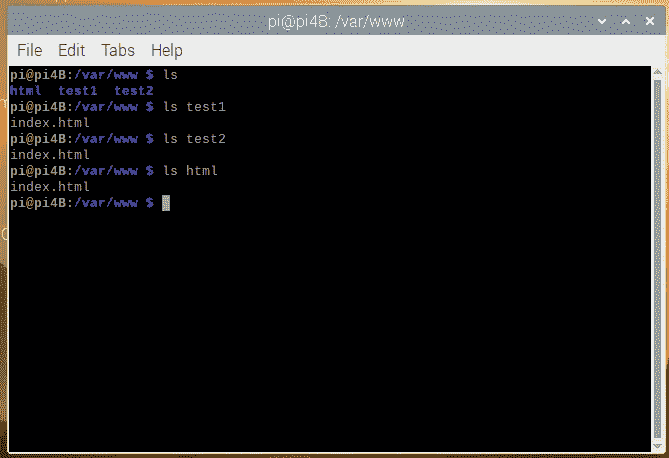
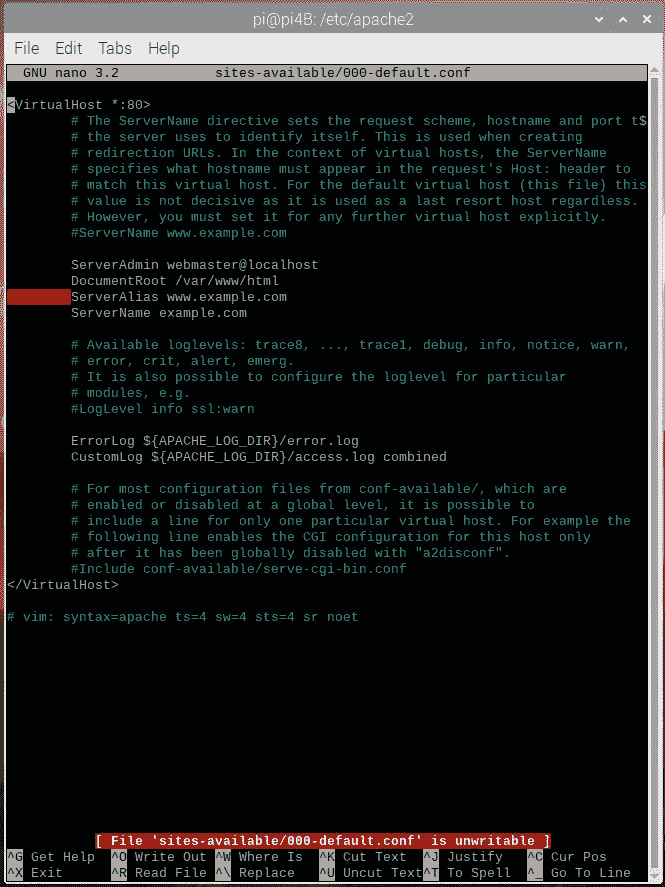
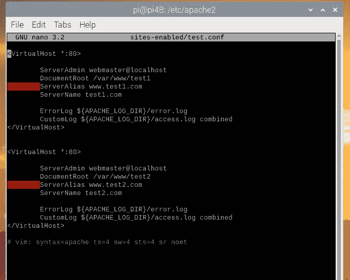
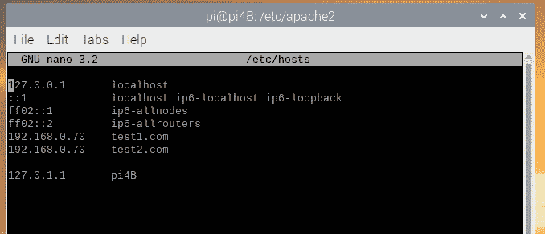
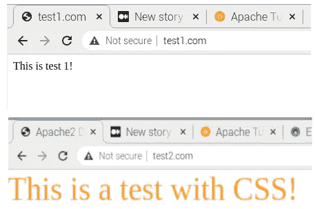

# Web 开发:Apache2 服务器

> 原文：<https://medium.com/geekculture/web-development-apache2-servers-71f1e82d945d?source=collection_archive---------16----------------------->


在你的网站开发之旅的某个时候，你会想要完全控制你的网站，掌握虚拟主机的艺术可以让你更接近这个目标。如果您正在阅读这篇文章，我假设您已经习惯于查看代码和使用 linux 终端。我将介绍使用 raspberry pi 4B 模型设置 apache2 服务器的基础知识，因此您应该有一些经验。

**旁注:**如果你还没有尝试过树莓派，我强烈推荐它。它们可以包含范围广泛的实际项目，并教会您许多关于 Linux 的精彩世界。入场费低。我的 pi 以大约 100 美元(T3)的价格(当时还是全新的)成套件的形式出现在[。你也可以在低至](https://www.microcenter.com/product/621439/raspberry-pi-4-model-b---2gb-ddr4) [$10](https://www.microcenter.com/product/486575/raspberry-pi-zero-w) 的旧版 pi 上这么做。不要对 pi Zero W 嗤之以鼻，他们是毒品机器。

首先打开命令行，下载必要的包来创建我们所知的 LAMP 栈:Linux、apache2、php 和 mysql。

```
sudo apt-get install apache2 -y
sudo apt-get install php libapache2-mod-php -y
sudo apt-get install mariadb-server
```

什么是 mariadb？它是保存 mysql 的包，为了安装它，我们将使用:

```
sudo mysql_secure_installation
```

并且通过 php 访问数据库…

```
sudo apt-get install php-mysql
```

在这篇文章中，我不会向你展示如何使用 php 和 mysql，但是无论如何，请你自己探索更多。

现在，如果一切顺利的话，您应该可以通过输入您的 hostname.local(我的应该是 pi4b.local)在浏览器上看到默认的 web 页面。如果你愿意，你可以使用系统选项下的“sudo raspi-config”命令来调整你的主机名。

现在这里有两个重要的文件夹，我们将在这里进行大部分的调整。第一个是 **/var/www** 。这就是我们的 web 应用程序所在的地方。在那里，您应该看到 html 文件夹中的默认 apache2 页面。检查一下，看看文件和文件夹是如何设置的。为了好玩，我将建立两个测试文件夹，并在每个文件夹中放入它们自己的 index.html 文件。



我们需要了解的第二个文件夹位于 **/etc/apache2** 。这里查看**站点-可用**文件夹和**站点-启用**。在这里，我们配置我们的 **test1** 和 **test2** 文件夹，以便它们在我们的服务器上呈现。在启用了站点的页面中，你会看到 *000-default.conf* 已经在那里了。那是 apache 的默认网站。为了禁用，使用 **a2dissite** 命令:

```
sudo a2dissite 000-default.conf
```

我们进去看看吧。



我们注意到的第一件事是我们的信息包含在一个 VirtualHost 标记中。V.H .允许 apache2 做的是在同一个服务器上服务多个网站。这很好，因为你不需要每个网站都有单独的服务器。是动态的！第一行包含端口号。这里是 80 端口(<virtualhost>)。“*”代表我们的 IP 地址。如果您不知道，请使用命令 **ifconfig** 。然而，你应该有一个静态的网络服务器 IP 地址。</virtualhost>

这个 **DocumentRoot** 将 V.H .指向可以找到 index.html 的文件夹。我们还将设置**服务器别名**和**服务器名称**，以便更容易导航到我们的网站。否则，我们只需在浏览器中输入我们的 IP 地址就可以访问它们。让我们来看看我将如何把两个测试文件夹合二为一。会议文件。



由于虚拟主机，我能够将我的两个测试站点配置到一个 test.conf 文件中！但是等等，我的服务器怎么知道服务哪个站点呢？它们都运行在端口 80 上…我只有一个 IP 地址。这就是我的 **ServerName** 发挥作用的地方。我可以在 **/etc/hosts** 文件中进行配置。



好了，最后一步是激活我们的 test.conf 文件，这样我们的两个测试站点都将托管在 apace2 上。在终端类型中:

```
sudo apache2ensite test.conf
```

按照 apache 的命令重新加载服务器，然后在 url 中加载您的服务器名。这是它们在我的浏览器上的样子。



还不错！试用 apache2 some，并尝试配置一个简单的网站。还有很多东西要学，但是掌握基础知识是很重要的一步。fam 代码。