# Web GIS 开发入门指南

> 原文：<https://medium.com/geekculture/web-gis-development-starter-guide-e9ecd32e7fad?source=collection_archive---------2----------------------->

现在，越来越多的企业每天都在依靠与位置相关的数据来改善他们的运营并增加他们的利润，这些数据包括客户位置、货物位置、货物跟踪等。现在是许多商业逻辑不可或缺的一部分。不幸的是，很少有结构化的课程会同时教你深入的编程和 GIS。这使得它既有挑战性，同时又有回报🤑

如果你对 GIS 开发是否适合你感到困惑，有哪些神话，现实等等。看看我的视频

现在，我假设你真的有兴趣开始 web GIS 开发。

web GIS 开发的整个过程可以分为四个部分来理解

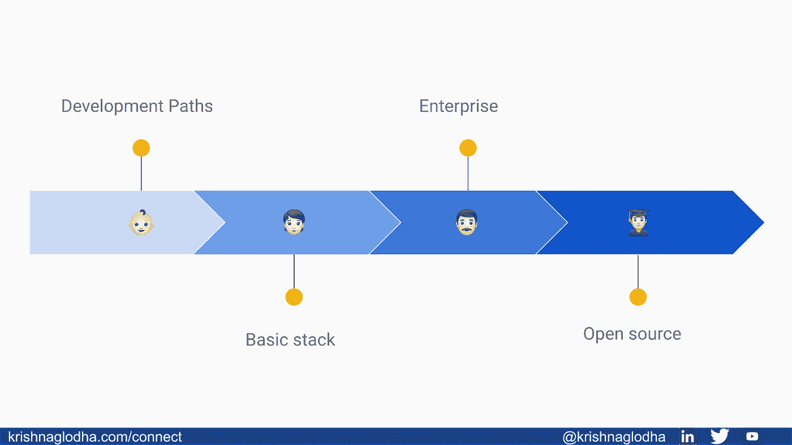

# 发展道路—

Web GIS 开发可以分为两大主流

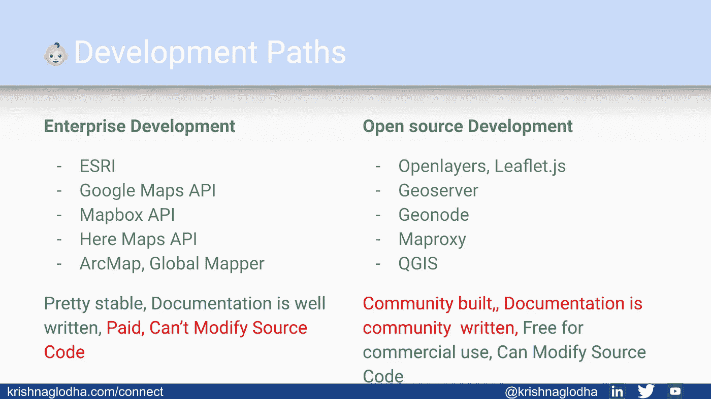

## 企业发展—

这种路径通常使用软件、库、包，往往需要购买才能使用。谷歌地图、ESRI、HERE 地图等公司。创建企业级数据和 API。但是为了使用它们，我们需要购买订阅，进行一次性付款等。

**优点** —这些库是由专门的开发人员创建的，因此这些库非常稳定，并且有良好的文档记录。通常，如果需要，支持团队也是可用的。这些库是安全的和可扩展的，使它们成为大公司的明显选择。
**缺点** —使用此类库的缺点是成本很高，尤其是如果你是一家尝试使用地图的初创公司或小公司，与其他成本相比，这一成本可能会非常高。除此之外，我们总是依赖公司来发布新功能，因为源代码是不共享的。

## 开源开发—

这条道路是社区建立的，感谢传奇和慷慨的开发者和公司，我们生活在一个充满开源应用的世界。许多著名的框架，我们每天都在使用的库，比如 ReactJS，PostgreSQL，Apache Kafka 等等。都是开源的。这意味着你可以使用这些技术来建立你的$$$创业公司，而且你不必付费使用它们。这样的库、包、软件也存在于 GIS 领域。

**优点** —这些(取决于许可)可以免费使用，根据任何商业、非商业应用的需要更改源代码。这里最大的好处显然是，它是完全免费的，你可以修改它，使之成为你自己的产品，并出售。
**——由于这些都是基于社区的，没有专门的支持，虽然 slack、gitter、email 列表上的很多群组都是可用的，但仍然没有支持的保证。通常，为了构建这样的产品，开发人员使用现有的开源产品，因此当涉及到新版本发布时，确保一切正常工作就变得复杂了。**

## **你应该学哪一个？**

**嗯，这不取决于你小子！如果你有一个客户拥有任何企业公司的许可证，他们会请你去做，如果你的客户对他们的创业有这个想法，并希望集成一个基本的地图，他们显然会喜欢免费的东西。**

> **那么如何决定呢？**

**关键是你不知道！我们需要记住，GIS 开发最终是 web 开发，因此，如果您对 Web 开发的基本概念很清楚，您可以从开源跳到企业，再跳到开源。
在这篇博客中，我们将看到三样东西，基本堆栈、企业解决方案和开源解决方案。**

# **基本网络堆栈—**

**GIS 开发是 web 开发的一个子集，这意味着要成为一名 GIS 开发人员，您首先需要成为一名 Web 开发人员**

**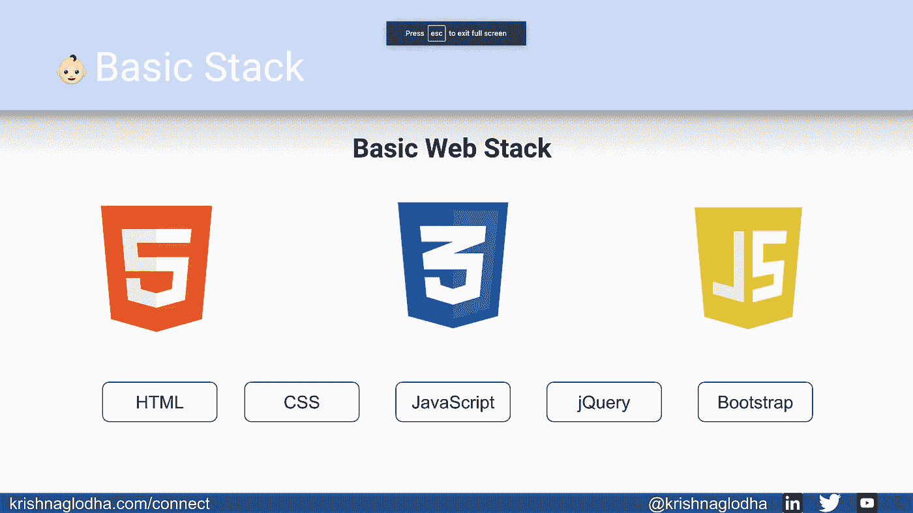**

**每一个对前端工作感兴趣的开发人员(我们在前端看到所有的魔法，地图，UI，表单等。)应该从了解 HTML，CSS，JavaScript 的基础开始。我看到许多年轻的小伙子跳出来反应，棱角分明，只是因为它是趋势🔥，但是了解 HTML、CSS、JavaScript、jQuery、Bootstrap 的基础知识非常非常重要。这将使你开始像一个开发者一样思考。相信我！一旦你很好地掌握了 HTML，CSS，JavaScript，你就会开始享受编码。**

**学习这些东西的一些免费资源是**

*   **超文本标记语言**

*   **半铸钢ˌ钢性铸铁(Cast Semi-Steel)**

*   **Java Script 语言**

*   **引导程序**

*   **jQuery**

**在编码的同时学习这 5 门课程会给你的 web 开发之旅一个最好的开始。如果您感兴趣，请随意探索更多关于这些主题的视频。此时，您应该能够创建自己的小项目，如**

1.  **作品集网站**
2.  **基本工具(单位转换、计算器等。)**

> **对于 GitHub 来说，重要的是不时地调整工作，不管它有多简单**

**招聘软件工程师的人除了浏览简历和履历之外，还会进行背景调查。拥有一个活跃的 GitHub 档案将永远对你有利。**

# **前端框架—**

**当你完成基本的堆栈时，你要么会发现前端工作非常有趣，要么可能不是你的那杯茶，可能你会觉得 CSS 不是你的东西，你想与数据库、逻辑等一起工作。(和我一样🙉).但是如果你喜欢使用前端框架，你可以决定将你的前端知识提升到一个新的水平**

**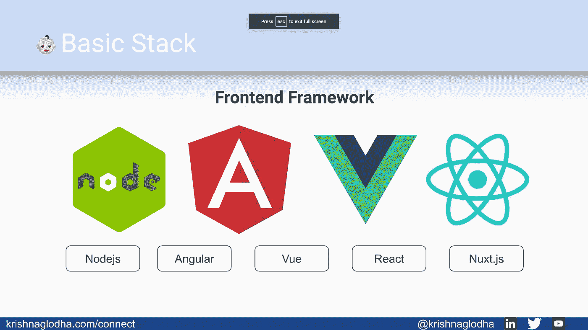**

> **你应该在完成基本的网络堆栈后才访问它**

**你可以了解更多关于 Nodejs 的知识，探索什么是 React，Vue，Angular 等。所有这些框架本身就是一个完整的宇宙，如果在对基本的 web 堆栈有信心之前就跳到它上面，可能会变得太难了。如果您下定决心要学习更多关于前端框架的知识，请从**

*   **JavaScript ES6**

*   **节点 js**

**从这里您可以探索不同的框架，最著名的有**

*   **反应**

*   **有角的**

*   **Vue 3**

**请注意，在几个小时内学会这些框架是不可能的，每个框架中都有大量的小组件需要你去学习。因此，我总是建议你应该在跳到另一个框架之前开始并掌握一个框架**

# **后端语言—**

**每个网站都有两个部分，前端(我们在上面看到的)负责创建一个快速、响应迅速、界面友好的网站，第二部分是后端，通常作为前端和数据库之间的沟通者。作为后端开发人员，您的工作是**

*   **创建和维护 API**
*   **从数据库◀️ ▶️前端 UI 获取/提交数据**
*   **保护数据**

**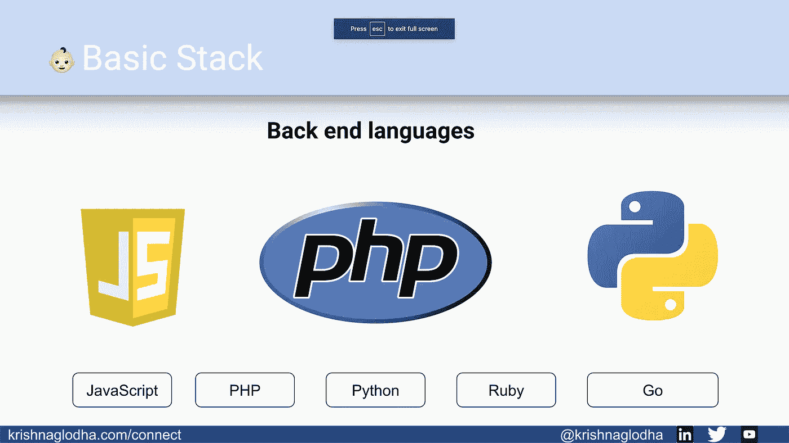**

**截至 2021 年，世界需要的不仅仅是前端和后端工程师来维护一个网站，但作为一个新手，我不想让你困惑和害怕👻。所以我们只坚持这两个术语。
有很多后端语言可以学习。就我个人而言，作为一名 GIS 开发人员，我稍微偏向于 Python，因为有很多专门用于地理空间分析的包是用 Python 编写的，您也可以探索其他语言，如 R、PHP 等。**

*   **计算机编程语言**

*   **稀有**

*   **服务器端编程语言（Professional Hypertext Preprocessor 的缩写）**

# **后端框架—**

**后端语言也有框架，使开发人员的生活变得容易。通常，这些框架非常稳定、可伸缩且安全，使开发人员专注于业务逻辑，而不是重新发明轮子。**

**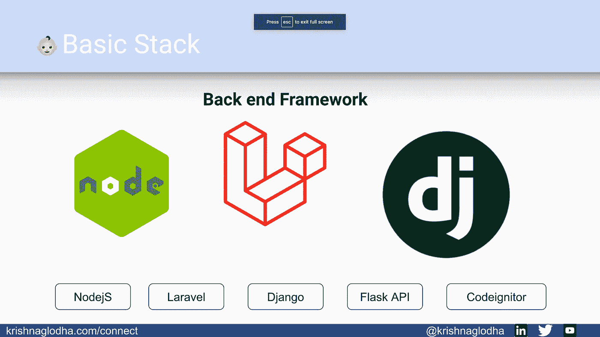**

**如果你使用 Python，你可以学习像 Django、Flask API、Fast API 等框架。**

**如果从事 PHP 工作，可以学习 Laravel、codeIgnitor 等。**

# **数据库—**

**数据库是 web 开发栈的关键部分，因为这是存储所有数据的地方。选择使用哪个数据库取决于应用程序和业务逻辑，对于 web GIS，PostgreSQL 成为一个极好的选择，因为它是世界上最先进的开源关系数据库。**

**快速了解什么是数据库**

**一旦你知道什么是数据库，看看这个视频，了解两种主要类型的数据库**

**一旦理解了这一点，您就可以在这里了解不同的数据库**

*   **一种数据库系统**

*   **关系型数据库**

*   **MongoDB**

**当你完成这个的时候，你会自信地展示自己是一名网络开发人员。现在是征服 GIS 世界的时候了。**

> **准备好了吗斯巴达！！**

**正如我上面提到的，GIS 开发大致可以分为企业开发或开源开发。尽管两者都将使用相同的基本 web 开发逻辑，但是库会有所不同。让我们先来探讨一下企业。**

# **企业发展—**

> **有 1000 多种产品值得探索，这篇博客只是让你思考和探索这些产品的皮毛**

## **软件—**

**通常，软件提供了一种更简单、更友好的做事方式，如 ArcMap、ArcGIS Pro 等软件。不仅仅能够进行基本的数字化和分析。**

**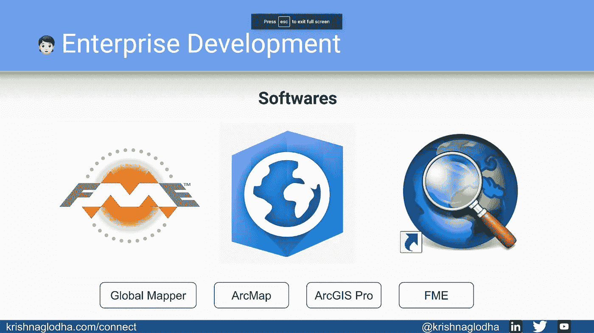**

**探索不同的软件，例如**

*   **ArcMap**

 **[## ArcMap | Esri 培训教程入门

### 亚马逊雨林横跨九个国家，面积达数百万平方公里。由于森林砍伐，目前的估计…

www.esri.com](https://www.esri.com/training/catalog/57660c89bb54adb30c94541c/get-started-with-arcmap/)** 

*   **ArcGIS Pro**

 **[## ArcGIS Pro 基础知识| Esri 培训网络课程

### ArcGIS Pro 提供了集成、可视化、分析和共享数据的工具。本课程向您介绍…

www.esri.com](https://www.esri.com/training/catalog/5cad02469b1f4010cad9ac46/arcgis-pro-basics/)** 

*   **全局映射器**

## **前端映射库—**

**一旦理解了 JavaScript、jQuery、Node js 等基本前端，就可以学习这些库来开始处理地理空间数据**

**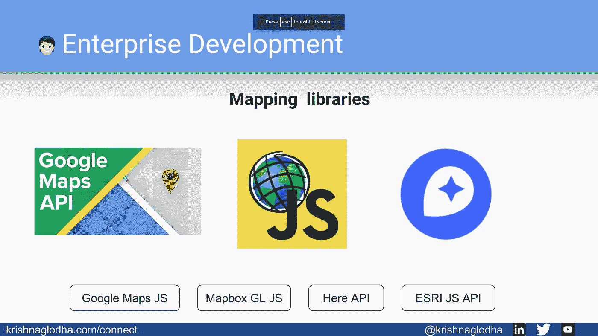**

*   **谷歌地图 API**

**您也可以遵循此文档**

** [## 谷歌地图平台文档|谷歌开发者

### 使用 Google Maps Platform SDKs 和……将真实世界带入您的网络和移动应用程序所需的所有信息

developers.google.com](https://developers.google.com/maps/documentation/) 

*   ArcGIS JS API

 [## ArcGIS API for JavaScript 基础|学习计划

### 了解使用 ArcGIS API for JavaScript 构建 web 应用程序的基础知识。理解基本概念…

www.esri.com](https://www.esri.com/training/catalog/5eb193be59bcad254d30a591/arcgis-api-for-javascript-fundamentals/) 

*   地图框

在 Mapbox，你可以学习如何使用他们的 JavaScript 库 **Mapbox GL JS**

你还可以学习如何使用**地图框工作室**

## 后端映射库—

这些是由企业公司开发的工具、脚本、平台，用于地理空间分析、数据访问等。使用这些，我们可以处理数据，并在前端应用程序中使用它，但并不总是使用他们公司的前端库。尽管这里的一些产品可以免费使用，但是我们确实需要一个 API 密匙。is 并不是完全开源的

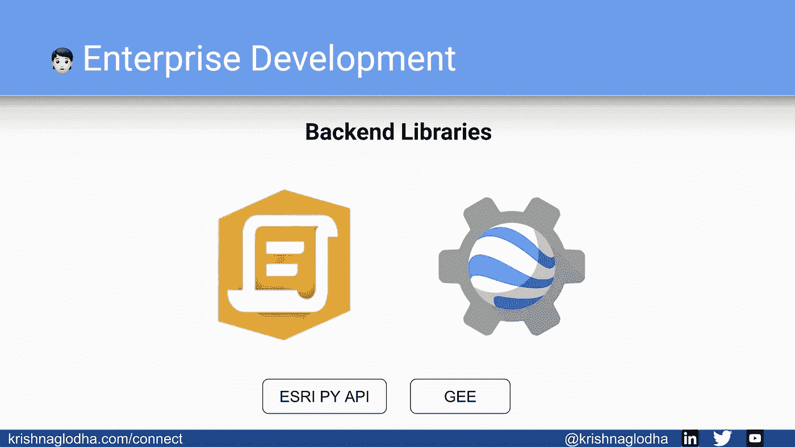

*   ArcGIS Python API

 [## ArcGIS API for Python:了解熊猫和启用空间的数据框架| Esri 培训…

### 本演示通过使用示例以及如何使用新的空间功能，涵盖了现代熊猫的最佳实践…

www.esri.com](https://www.esri.com/training/catalog/5ea8a5c359bcad254d2eb63b/arcgis-api-for-python%3A-getting-to-know-pandas-and-the-spatial-enabled-dataframe/) 

*   谷歌地球引擎

# 开源开发—

这些技术完全可以出于任何商业和非商业目的自由使用或修改源代码

## 软件—

就像企业一样，我们也有设备齐全的软件，可以免费下载和使用。

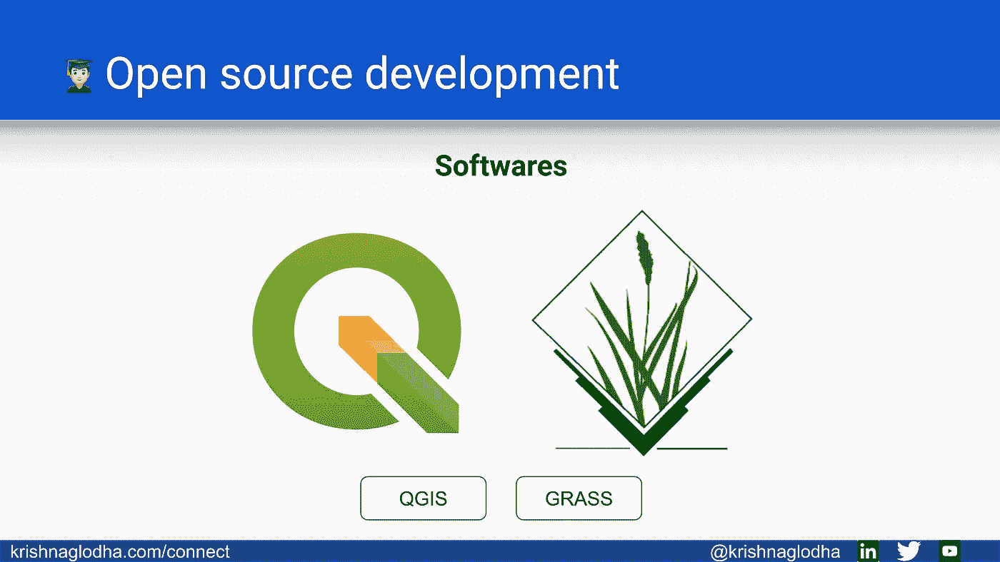

使用最广泛的软件之一是 QGIS

## 前端映射库—

一旦你学会了前端编程的基础，你就可以在 GIS 中使用这些库了

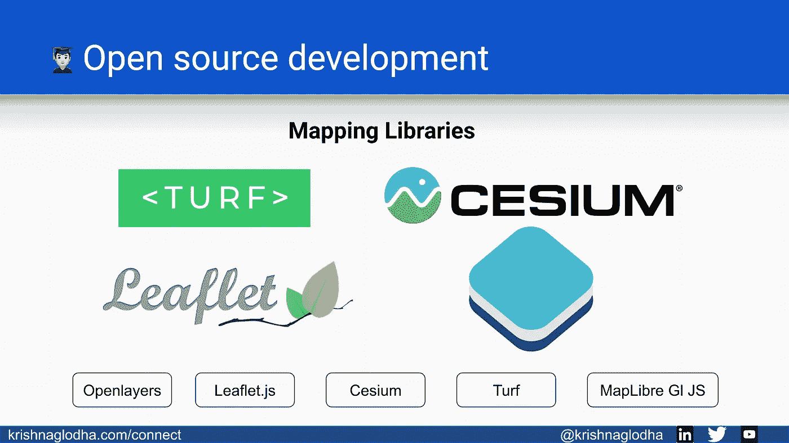

*   开放层

 [## 索引

### 注意:API 更改策略不包括用于样式化 OpenLayers UI 的 CSS 类名。它也不…

openlayers.org](https://openlayers.org/en/latest/apidoc/) 

*   小册子

 [## 文档-传单-交互式地图的 JavaScript 库

### 该参考反映了活页 1.7.1。如果您使用不同版本的传单，请检查此列表。用户界面层…

leafletjs.com](https://leafletjs.com/reference-1.7.1.html) 

*   铯

*   草坪 JS

## 后端映射库—

开源世界中有大量优秀的包、库可用于脚本编写、自动化工作

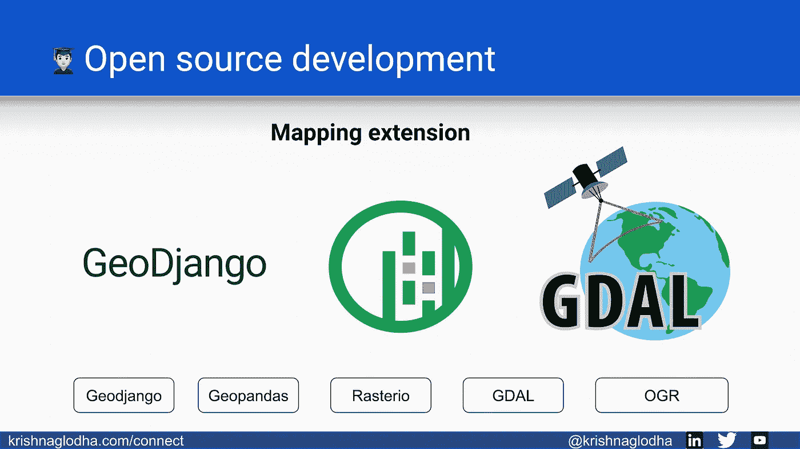

Python 提供了 Geopandas、Rasterio、Shapely、Fiona 等各种包。

*   地理空间分析包

*   Geodjango

*   GDAL

## 其他工具—

作为 web GIS 开发人员，您还可以学习其他一些工具

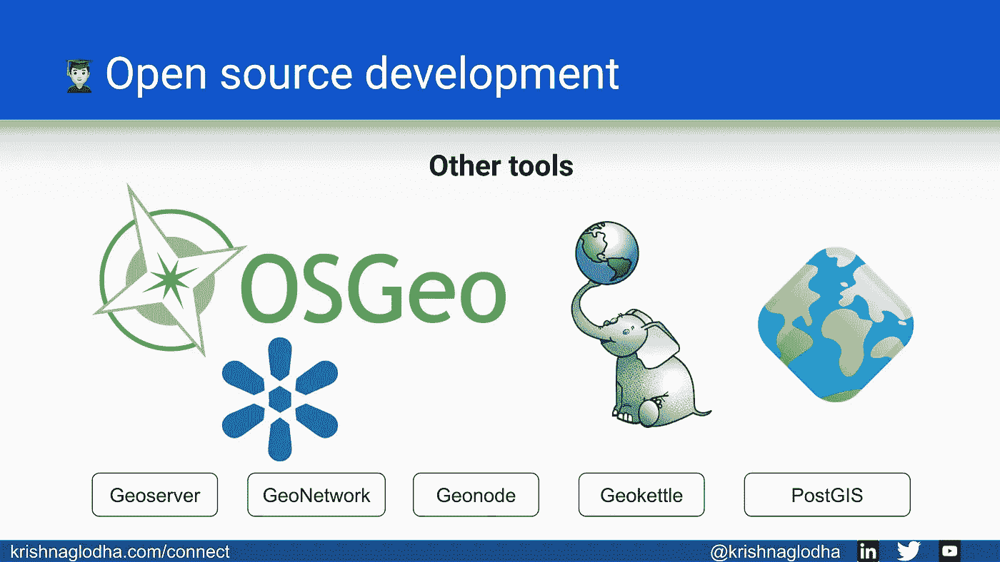

*   波斯特吉斯

 [## PostGIS 3 . 1 . 5 开发手册

### PostGIS 是对 PostgreSQL 对象关系数据库系统的扩展

postgis.net](https://postgis.net/docs/manual-3.1/) 

*   地理服务器

 [## GeoServer 用户手册- GeoServer 2.20.x 用户手册

### GeoServer 是用 Java 编写的开源软件服务器，允许用户共享和编辑地理空间数据…

docs.geoserver.org](https://docs.geoserver.org/stable/en/user/) 

*   地理节点

了解这些技术将使您能够使用 web GIS 项目并探索更复杂的 GIS 技术。

> ***关于*** ***我***

大家好，我是 Krishna Lodha，我是一名全栈式 Web GIS 开发人员。我对地理位置的力量和它告诉我们的故事非常感兴趣。在[https://krishnaglodha.com](https://krishnaglodha.com/)阅读关于我的更多信息，以获得关于该代码的更多信息或建议更好的方法。在 LinkedIn[上 ping 我](https://www.linkedin.com/in/krishnaglodha/)💼，[推特](https://twitter.com/krishnaglodha)🐦，以及 [Youtube](https://www.youtube.com/channel/UC7IQzdf_jn3gkt_9K0TDQmg?view_as=subscriber) 📺

再见！**