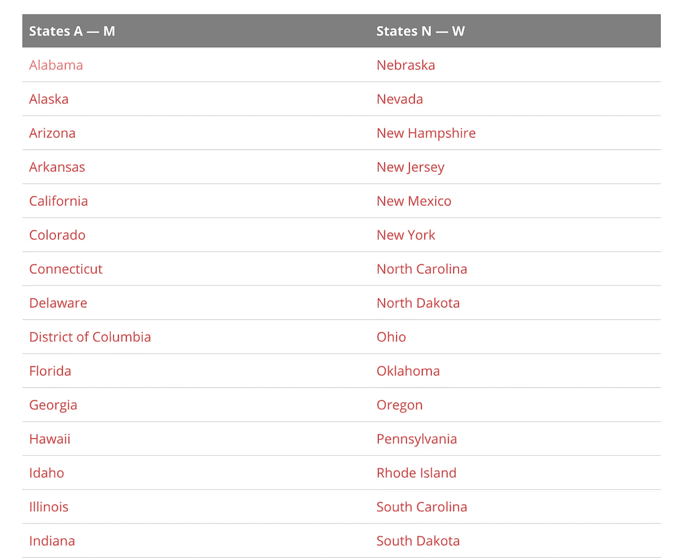
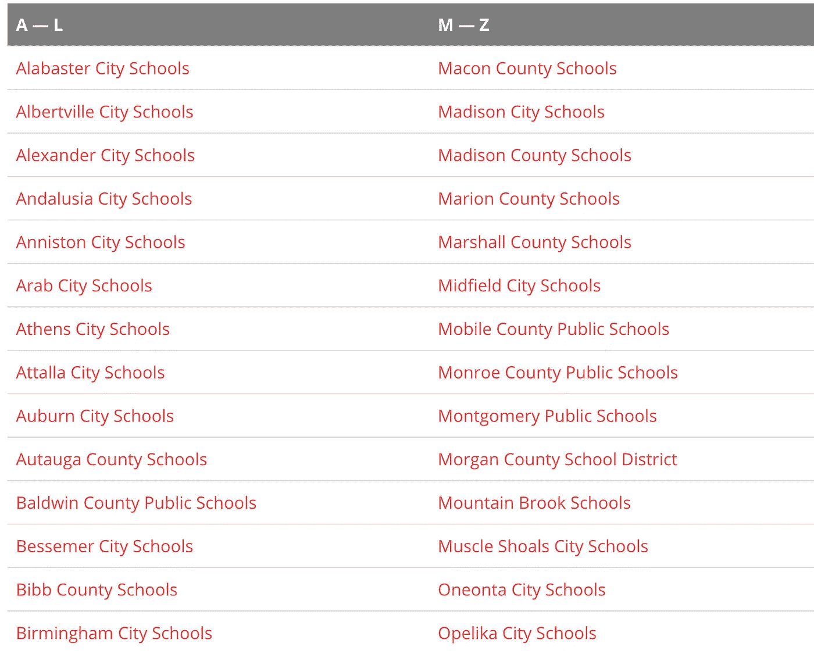
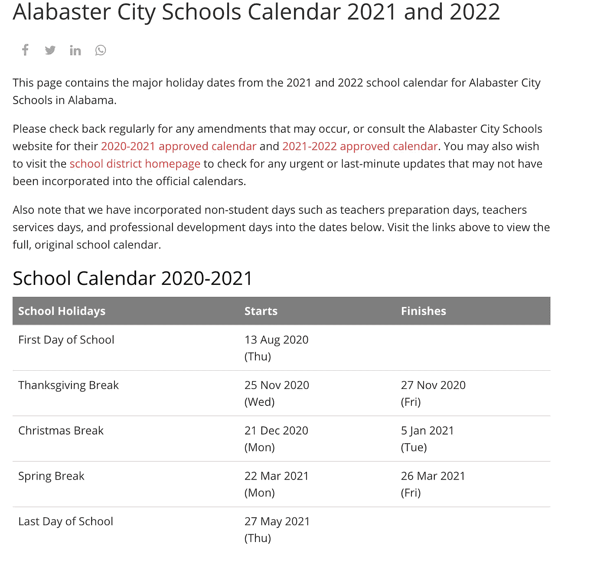
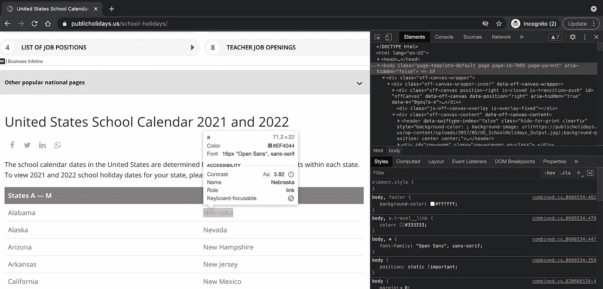
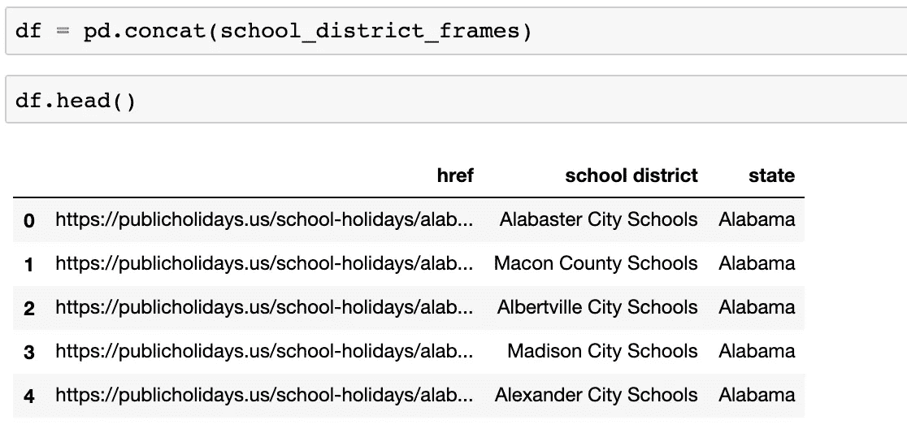
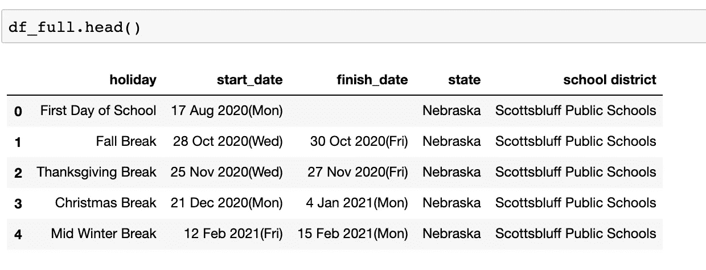

# 网页抓取 101

> 原文：<https://medium.com/geekculture/web-scraping-101-95d67aa57d55?source=collection_archive---------56----------------------->


Image by [Shafin Al Asad Protic](https://pixabay.com/users/shafin_protic-16278454/?utm_source=link-attribution&utm_medium=referral&utm_campaign=image&utm_content=5471975) from [Pixabay](https://pixabay.com/?utm_source=link-attribution&utm_medium=referral&utm_campaign=image&utm_content=5471975)

数据科学需要大量的数据，所以每个优秀的数据科学家都应该知道如何从互联网上免费获取数据。无论你是从维基百科上抓取表格，还是从零售网站上抓取价格，都有一些简单的方法可以做到。浏览互联网时用眼睛看到的任何东西都可以刮下来。

流程相当简单。我用 s *elenium* 或者 *requests* 作为包来刮。

这里我们将使用这个网站:【https://publicholidays.us/school-holidays/ 


在这个网站的第一页是有校历的州。每个状态都是一个可点击的链接。



First layer

每个州点击进入一个学区。



Second Layer

最后，在学区页面上是我们想要的日历。



Third and final layer

我们最终想要提取最终的 HTML，并将其绑定到州和校区。

这些是我的进口货:

```
from bs4 import BeautifulSoup
import time
from urllib.parse import urlencode
from selenium import webdriver
from selenium.webdriver.firefox.options import Options
import pandas as pd
import random
import json
import requests
```

然后我构建几个函数。

```
def soup_builder(url):
    page = requests.get(url)
    html = page.content
    soup = BeautifulSoup(html, 'html.parser')
    return soup
```

或者

```
def soup_builder(url):
    options = Options()
    options.headless = True
    browser = webdriver.Firefox(options=options)
    browser.get(url)
    # add rand time to not get kick off
    delay = random.randint(2, 6)
    time.sleep(delay)
    html = browser.page_source
    browser.quit()
    soup = BeautifulSoup(html, 'html.parser')
    return soup
```

第一个功能要快得多，但某些网站会在将你标记为机器人后让你关机。第二个函数非常慢，但是你的脚本模拟了一个浏览器，随机延迟模拟了你点击的时间。这可以让你的脚本从那些不让你抓取的网站中抓取。



I use command+shift c to look at the HTML as I explore it on the browser

一旦你很好地理解了 HTML 布局，你就可以很容易地编写一些简单的代码来从中提取表格信息。

在获得“汤”即 HTML 之后，您可以开始对 HTML 字符串进行排序，以提取您所关心的信息。在这个阶段，你需要经常查看 HTML 来知道如何解析它。

```
school_district_frames = []
for url, state in zip(states_df['href'], states_df['state']):
    soup = soup_builder(url)
    # grab table
    table_tag = soup.select('table')
    d = find_table_urls(table_tag)
    school_district_df = pd.DataFrame(d)
    school_district_df.columns = ['href', 'school district']
    school_district_df['state'] = state
    school_district_frames.append(school_district_df)
```

这将产生:



```
def find_holiday_table_urls(table_tag):
    d = {'holiday': [], 
         'start_date': [],
         'finish_date': [] 
        }
    '''
     Pulls urls from table
    '''
    for t in table_tag:
        for row in t.findAll('tr')[1:]:
            try:
                text = row.findAll('td')[0].text
                start_date = row.findAll('td')[1].text
                finish_date = row.findAll('td')[2].text
                d['holiday'].append(text)
                d['start_date'].append(start_date)
                d['finish_date'].append(finish_date)
            except:
                continue
    return dholiday_frames = []
data = zip(school_district_df['href'], school_district_df['state'], school_district_df['school district'])
for url, state, school_district in data:
    if school_district in school_districts:
        continue
    soup = soup_builder(url)
    # grab table
    table_tag = soup.select('table')
    d = find_holiday_table_urls(table_tag)
    holiday_df = pd.DataFrame(d)
    holiday_df.columns = ['holiday', 'start_date', 'finish_date']
    holiday_df['state'] = state
    holiday_df['school district'] = school_district
    holiday_frames.append(holiday_df)
```



嘣！现在，您有了一个包含美国所有学校假期的熊猫数据框架。这么多免费数据！然后你可以把它存储到红移或者其他地方。

无论你是用抓取来建立你的创业公司数据仓库还是一次性项目，它对任何数据科学家来说都是一个强大的工具。

**参考文献:**

 [## Selenium 与 Python - Selenium Python 绑定 2 文档

### 请注意，这不是正式文档。如果你想对这个文档有所贡献，你可以叉这个…

selenium-python.readthedocs.io](https://selenium-python.readthedocs.io/) [](https://www.crummy.com/software/BeautifulSoup/bs4/doc/) [## 美丽的汤文档-美丽的汤 4.9.0 文档

### Beautiful Soup 是一个 Python 库，用于从 HTML 和 XML 文件中提取数据。它与您最喜欢的解析器一起工作…

www.crummy.com](https://www.crummy.com/software/BeautifulSoup/bs4/doc/) [](https://pypi.org/project/beautifulsoup4/) [## beautifulsoup4

### 美汤是一个库，可以很容易的从网页上抓取信息。它位于 HTML 或 XML 之上…

pypi.org](https://pypi.org/project/beautifulsoup4/)  [## 请求:HTTP for Humans 请求 2.25.1 文档

### 版本 2.25.1 .(安装)Requests 是一个优雅而简单的 Python HTTP 库，是为人类而构建的…

docs.python-requests.org](https://docs.python-requests.org/en/master/)  [## urllib.parse -将 URL 解析成组件- Python 3.9.5 文档

### 源代码:Lib/urllib/parse.py 这个模块定义了一个标准接口来中断统一资源定位符(URL)…

docs.python.org](https://docs.python.org/3/library/urllib.parse.html) 

无论你是用抓取来建立你的创业公司数据仓库还是一次性项目，它对任何数据科学家来说都是一个强大的工具。