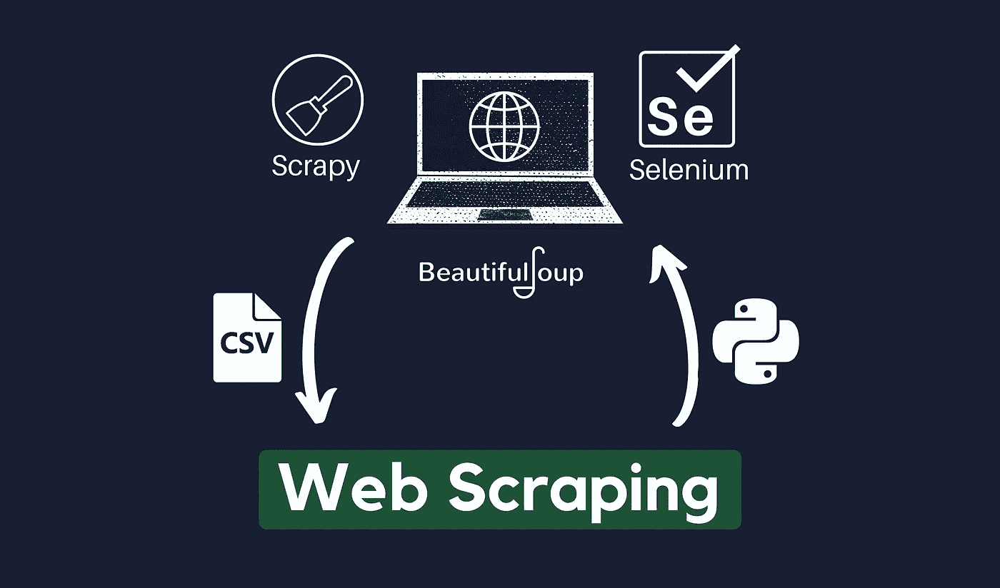

# 网络抓取备忘单(2022)，用于网络抓取的 Python

> 原文：<https://medium.com/geekculture/web-scraping-cheat-sheet-2021-python-for-web-scraping-cad1540ce21c?source=collection_archive---------2----------------------->

## 网页抓取完全指南:美丽的汤，硒，刺痒，XPath，等等！

Image by author

网络抓取是从网站提取数据的过程。虽然您只需要 Python 的基础知识就可以开始学习 web 抓取，但这有时会变得复杂，因为 web 抓取超出了 Python 的范围。它还…