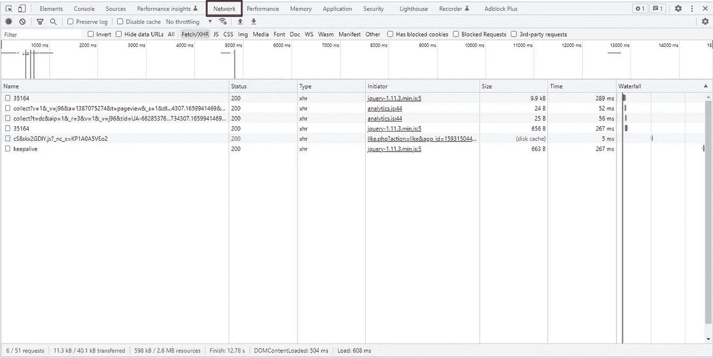
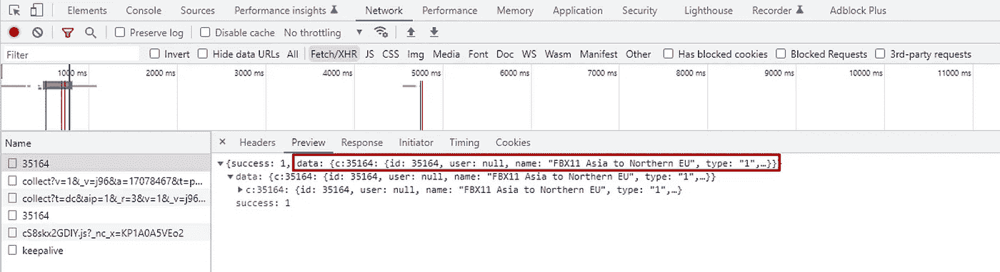
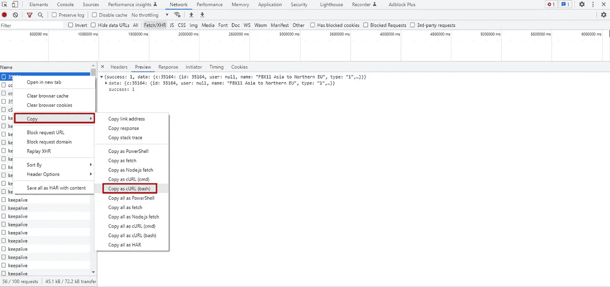
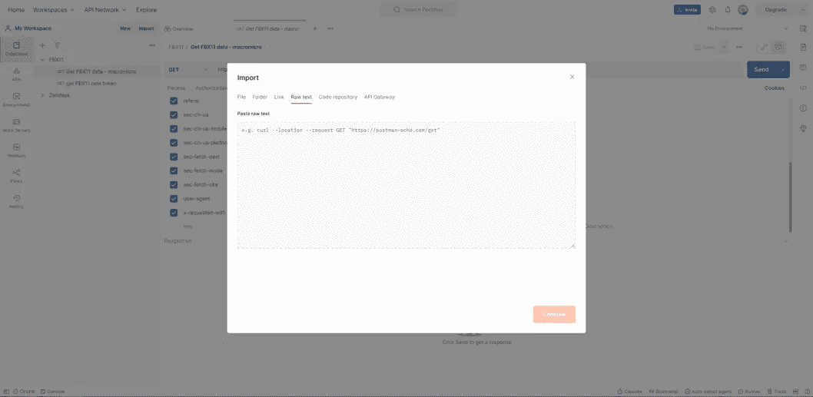
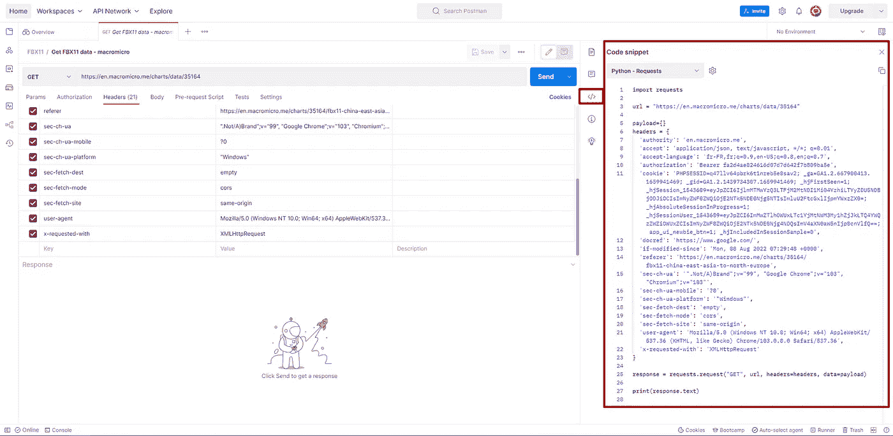

# Web 抓取—通过使用 Python 复制 HTTP 请求来获取数据

> 原文：<https://medium.com/geekculture/web-scraping-get-data-by-replicating-http-requests-with-python-b84d40b10103?source=collection_archive---------5----------------------->

## 使用 Google Chrome DevTools、Postman 和 Python 获取你需要的数据

# #1 简介

如果网页包含数据，显示在图表、表格或任何其他形状或形式中，这些数据一定来自某个地方。在许多情况下，它将来自网站的服务器端，并在 HTTP 请求时发送到您的浏览器。通常，可以在 Python 代码中复制该请求，以与浏览器相同的方式获取数据。让我们看看如何！

# #2 使用 Google Chrome DevTools 确定请求

当你右击 Google Chrome 上的任何网页时，你会发现“Inspect”工具，在这个工具中有一个名为“Network”的标签:

The network tab in the Chrome DevTools — Image by author

这列出了浏览器发送的所有请求及其响应，它们是您看到的页面上所显示内容的组成部分。

单击任何请求都会显示其特征(URL 端点、标头、有效负载等)及其响应。

找到“正确的”请求—包含您所寻找的数据的请求—需要一点浏览。通常数据会被服务器以 json 格式发送到你的浏览器。一个接一个地打开每个请求，直到你找到一个包含你想要的内容的响应。

That seems to be it! — Image by author

# 从谷歌 Chrome DevTools 到 Postman 排名第三

在本节中，我们使用 Postman，因为该工具允许将 API 请求转换为您选择的编程语言的代码片段。这将在过程的最后一部分派上用场。

一旦您确定了感兴趣的请求，右键单击它并使用“Copy as cURL (bash)”选项。

Copy of the original request, as sent out by the browser, in the Network tab — Image by author

然后，您可以使用 Postman 中的导入工具，将其粘贴到“原始文本”标签下:

Import tool in Postman — Image by author

# #4 从 Postman 到 Python(或任何其他编程语言)

最后，转到 Postman 界面右侧的“代码片段”选项卡，选择您的编程语言。
现在你有了:你的 HTTP 请求准备好在你的应用程序中使用，以获得你需要的数据！

Code snippet tool in Postman — Image by author

希望这将对您未来的项目有用！编码快乐！