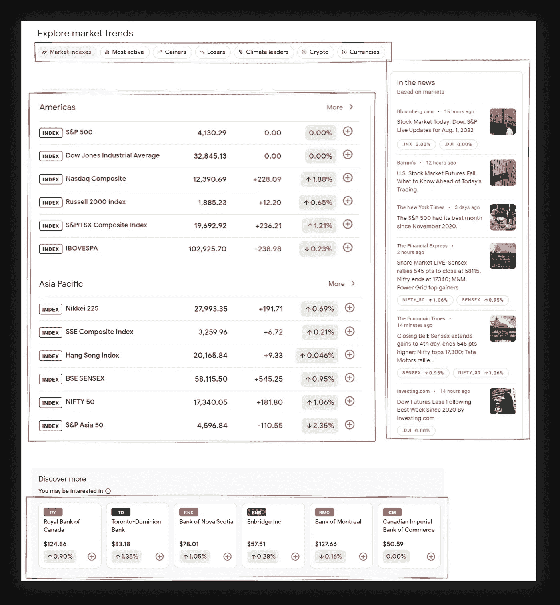
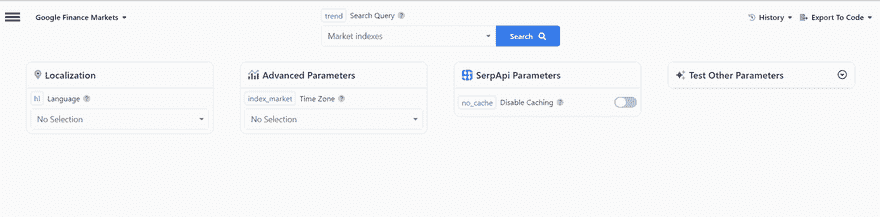

# 用 Python 抓取谷歌金融市场

> 原文：<https://medium.com/geekculture/web-scraping-google-finance-markets-in-python-a657da42a7d?source=collection_archive---------4----------------------->

*   [会刮什么](#ee1e)
*   [全码](#aec9)
*   [先决条件](#2979)
*   [代码解释](#53ae)
*   [谷歌金融市场应用编程接口](#f7ce)
*   [链接](#8471)

# 会刮什么



# 完整代码

# 先决条件

**安装库**:

```
pip install requests parsel
```

**CSS 选择器基础知识抓取**

CSS 选择器声明样式应用于标记的哪一部分，从而允许从匹配的标签和属性中提取数据。

如果你还没有使用 CSS 选择器，我有一篇关于如何在抓取网页时使用 CSS 选择器的博文,内容包括它是什么，优缺点，以及为什么从抓取网页的角度来看它们很重要。

**独立的虚拟环境**

简而言之，它创建了一组独立的已安装库，包括不同的 Python 版本，这些版本可以在同一系统中共存，从而防止库或 Python 版本冲突。

如果你以前没有使用过虚拟环境，看看我的博客文章
专用的 [Python 虚拟环境教程(使用 Virtualenv 和 poems](https://serpapi.com/blog/python-virtual-environments-using-virtualenv-and-poetry/))会更熟悉一些。

📌注意:这不是这个博客的严格要求。

**降低被屏蔽的几率**

请求有可能被阻止。看看[如何降低抓取网页时被屏蔽的几率](https://serpapi.com/blog/how-to-reduce-chance-of-being-blocked-while-web/)，有 11 种方法可以绕过大多数网站的屏蔽。

# 代码解释

导入库:

```
import requests
import json
import re
import argparse
from parsel import Selector
```

*   `[requests](https://requests.readthedocs.io/en/latest/user/quickstart/)`向网站提出请求。
*   `[json](https://docs.python.org/3/library/json.html)`将提取的数据转换成 JSON 对象。
*   `[re](https://docs.python.org/3/library/re.html)`通过正则表达式提取部分数据。
*   `[argparse](https://docs.python.org/3/library/argparse.html)`通过正则表达式提取部分数据。
*   `[parsel](https://parsel.readthedocs.io/en/latest/)`解析 HTML/XML 文档中的数据。类似于`BeautifulSoup`，但是支持 XPath。

首先，如果我们需要通过键入命令行参数来解析数据，而不需要激活代码中的某些功能来提取特定类型的结果，例如，加密、获益者或失败者，我们可以通过创建命令行参数使用`argparse`内置库来完成:

```
parser = argparse.ArgumentParser(prog="Google Finance Markets Options")
parser.add_argument('-i','--indexes', action="store_true")
parser.add_argument('-ma','--most-active', action="store_true")
parser.add_argument('-g','--gainers', action="store_true")
parser.add_argument('-l','--losers', action="store_true")
parser.add_argument('-cl','--climate-leaders', action="store_true")
parser.add_argument('-cc','--crypto', action="store_true")
parser.add_argument('-c','--currency', action="store_true")args = parser.parse_args()
```

然后我们可以像这样运行脚本:

```
$ python main.py -cc # will parse crypto results
```

注意如果不使用`action="store_true"`，结果将是一个错误:

```
$ python main.py -ccGoogle Finance Markets Options: error: argument -cc/--crypto: expected one argument
```

设置为`store_true`的`action`将参数存储为`True`，如果存在的话。所以如果参数存在，它将返回一些输出。

我们也可以将参数设为`[requried](https://docs.python.org/3/library/argparse.html#required)`，这意味着某个参数是*需要*在使用文件时使用。

*   `[add_argument](https://docs.python.org/3/library/argparse.html#the-add-argument-method)`定义如何解析一个命令行参数。
*   `[parse_args](https://docs.python.org/3/library/argparse.html#argparse.ArgumentParser.parse_args)`决定`add_argument`创建什么对象以及如何分配它们。返回填充的命名空间。

下一步是用所有命令行逻辑创建函数。您可以使用点符号访问命令行参数:

```
def main(): # https://docs.python-requests.org/en/master/user/quickstart/#custom-headers
    # https://www.whatismybrowser.com/detect/what-is-my-user-agent
    headers = {
        "User-Agent": "Mozilla/5.0 (Windows NT 10.0; Win64; x64) AppleWebKit/537.36 (KHTML, like Gecko) Chrome/103.0.5060.134 Safari/537.36"
    } if args.indexes:
        html = requests.get("https://www.google.com/finance/markets/indexes", headers=headers, timeout=30)
        return parser(html=html) # ... other arguments logic
```

*   `[user-agent](https://developer.mozilla.org/en-US/docs/Glossary/User_agent)`作为来自浏览器的“真实”用户请求，将其传递给[请求头](https://docs.python-requests.org/en/master/user/quickstart/#custom-headers)。这是用来绕过谷歌的屏蔽，因为默认情况下`requests`用户代理是`[python-requests](https://github.com/psf/requests/blob/main/requests/utils.py#L884-L890)`，网站知道它是一个发送请求的机器人，可能会阻止它。[检查你的](https://www.whatismybrowser.com/detect/what-is-my-user-agent)是什么`[user-agent](https://www.whatismybrowser.com/detect/what-is-my-user-agent)`。
*   `if args.indexes`将检查某个命令行参数是否被传递。
*   `[timeout=30](https://requests.readthedocs.io/en/latest/user/quickstart/#timeouts)`告诉`requests`30 秒后停止等待响应。
*   `return parser(html=html)`从`parser()`函数返回数据，以减少代码大小，因为每个选择器提取的数据都是相同的。

下一步是创建一个解析器函数，从页面中提取所有需要的数据。该函数需要将传递给`parsel`的`html`参数，然后我们需要创建`data`解析后的结构:

```
def parser(html):
    selector = Selector(text=html.text)
    stock_topic = selector.css(".Mrksgc::text").get().split("on ")[1].replace(" ", "_") data = {
        f"{stock_topic}_trends": [],
        f"{stock_topic}_discover_more": [],
        f"{stock_topic}_news": []
    }
```

*   `Selector(text=html.text)`响应中传递的 HTML 将由`parsel`处理。
*   `text=`是一个`[parsel](https://github.com/scrapy/parsel/blob/52b1db6f1c0e9768334d9c33627773e0e687a60d/parsel/selector.py#L230)` [参数，它接受将从中提取 HTML 节点的](https://github.com/scrapy/parsel/blob/52b1db6f1c0e9768334d9c33627773e0e687a60d/parsel/selector.py#L230) `[str](https://github.com/scrapy/parsel/blob/52b1db6f1c0e9768334d9c33627773e0e687a60d/parsel/selector.py#L230)` [对象](https://github.com/scrapy/parsel/blob/52b1db6f1c0e9768334d9c33627773e0e687a60d/parsel/selector.py#L230)。
*   `[css()](https://github.com/scrapy/parsel/blob/90397dcd0b2c1cbb91e44f65c50f9e11628ba028/parsel/selector.py#L351-L362)`从传递的 CSS 选择器中解析数据。每个 [CSS 查询都使用](https://github.com/scrapy/parsel/blob/90397dcd0b2c1cbb91e44f65c50f9e11628ba028/parsel/selector.py#L357-L358) `[csselect](https://github.com/scrapy/parsel/blob/90397dcd0b2c1cbb91e44f65c50f9e11628ba028/parsel/selector.py#L357-L358)` [包](https://github.com/scrapy/parsel/blob/90397dcd0b2c1cbb91e44f65c50f9e11628ba028/parsel/selector.py#L357-L358)转换成 XPath。
*   `[::text](https://github.com/scrapy/parsel/blob/90397dcd0b2c1cbb91e44f65c50f9e11628ba028/parsel/csstranslator.py#L48-L51)` [或](https://github.com/scrapy/parsel/blob/90397dcd0b2c1cbb91e44f65c50f9e11628ba028/parsel/csstranslator.py#L48-L51) `[::attr(<attribute>)](https://github.com/scrapy/parsel/blob/90397dcd0b2c1cbb91e44f65c50f9e11628ba028/parsel/csstranslator.py#L48-L51)`从节点中提取文本或属性数据。
*   `[get()](https://github.com/scrapy/parsel/blob/90397dcd0b2c1cbb91e44f65c50f9e11628ba028/parsel/selector.py#L197-L204)`获取从`parsel`返回的实际数据
*   `[split()](https://www.w3schools.com/python/ref_string_split.asp)`将一个字符串拆分成一个列表，其中每个单词都是一个列表项
*   用一串新的东西代替旧的东西。

在创建了一个空的字典结构后，我们需要通过`appending` it 用新闻、股票和其他数据填充它，在本例中作为一个`dict`:

```
# news ressults
for index, news_results in enumerate(selector.css(".yY3Lee"), start=1):
    data[f"{stock_topic}_news"].append({
        "position": index,
        "title": news_results.css(".mRjSYb::text").get(),
        "source": news_results.css(".sfyJob::text").get(),
        "date": news_results.css(".Adak::text").get(),
        "image": news_results.css("img::attr(src)").get(),
    })# stocks table
for index, stock_results in enumerate(selector.css("li a"), start=1):
    current_percent_change_raw_value = stock_results.css("[jsname=Fe7oBc]::attr(aria-label)").get()
    current_percent_change = re.search(r"\d+\.\d+%", stock_results.css("[jsname=Fe7oBc]::attr(aria-label)").get()).group() # ./quote/SNAP:NASDAQ -> SNAP:NASDAQ
    quote = stock_results.attrib["href"].replace("./quote/", "") data[f"{stock_topic}_trends"].append({
        "position": index,
        "title": stock_results.css(".ZvmM7::text").get(),
        "quote": stock_results.css(".COaKTb::text").get(),
        # "https://www.google.com/finance/MSFT:NASDAQ"
        "quote_link": f"https://www.google.com/finance/{quote}",
        "price_change": stock_results.css(".SEGxAb .P2Luy::text").get(),
        "percent_price_change": f"+{current_percent_change}" if "Up" in current_percent_change_raw_value else f"-{current_percent_change}"
    })# "you may be interested in" at the bottom of the page
for index, interested_bottom in enumerate(selector.css(".HDXgAf .tOzDHb"), start=1):
    current_percent_change_raw_value = interested_bottom.css("[jsname=Fe7oBc]::attr(aria-label)").get()
    current_percent_change = re.search(r"\d+\.\d+%", interested_bottom.css("[jsname=Fe7oBc]::attr(aria-label)").get()).group() # ./quote/SNAP:NASDAQ -> SNAP:NASDAQ
    quote = stock_results.attrib["href"].replace("./quote/", "") data[f"{stock_topic}_discover_more"].append({
        "position": index,
        "quote": interested_bottom.css(".COaKTb::text").get(),
        "quote_link": f"https://www.google.com/finance{quote}",
        "title": interested_bottom.css(".RwFyvf::text").get(),
        "price": interested_bottom.css(".YMlKec::text").get(),
        "percent_price_change": f"+{current_percent_change}" if "Up" in current_percent_change_raw_value else f"-{current_percent_change}"
    })
```

*   `[enumerate()](https://docs.python.org/3/library/functions.html#enumerate)` [给一个 iterable 添加一个计数器并返回它](https://www.programiz.com/python-programming/methods/built-in/enumerate)。
*   `start=1`将从 1 开始计数，而不是从默认值 0 开始计数。
*   `[::text](https://github.com/scrapy/parsel/blob/90397dcd0b2c1cbb91e44f65c50f9e11628ba028/parsel/csstranslator.py#L48-L51)` [或](https://github.com/scrapy/parsel/blob/90397dcd0b2c1cbb91e44f65c50f9e11628ba028/parsel/csstranslator.py#L48-L51) `[::attr(<attribute>)](https://github.com/scrapy/parsel/blob/90397dcd0b2c1cbb91e44f65c50f9e11628ba028/parsel/csstranslator.py#L48-L51)`从节点中提取文本或属性数据。
*   `data[f"{stock_topic}_news"]`动态地将数据作为`dict`附加到由`stock_topic`变量提取的任何值上。
*   `[append()](https://docs.python.org/3/tutorial/datastructures.html)`将提取的数据追加到`list`作为字典。
*   `[css()](https://github.com/scrapy/parsel/blob/90397dcd0b2c1cbb91e44f65c50f9e11628ba028/parsel/selector.py#L351-L362)`从传递的 CSS 选择器中解析数据。每一个 [CSS 查询都使用](https://github.com/scrapy/parsel/blob/90397dcd0b2c1cbb91e44f65c50f9e11628ba028/parsel/selector.py#L357-L358) `[csselect](https://github.com/scrapy/parsel/blob/90397dcd0b2c1cbb91e44f65c50f9e11628ba028/parsel/selector.py#L357-L358)` [包](https://github.com/scrapy/parsel/blob/90397dcd0b2c1cbb91e44f65c50f9e11628ba028/parsel/selector.py#L357-L358)转换成 XPath。
*   `[get()](https://serpapi.com/blog/scrape-google-finance-markets-in-python/(https://github.com/scrapy/parsel/blob/90397dcd0b2c1cbb91e44f65c50f9e11628ba028/parsel/selector.py#L197-L204))`获取实际数据。
*   `[getall()](https://github.com/scrapy/parsel/blob/90397dcd0b2c1cbb91e44f65c50f9e11628ba028/parsel/selector.py#L180-L185)`获得全部一场`list`的比赛。
*   `[jsname=Fe7oBc]`是一个 [CSS 选择器，用于选择具有指定属性和值](https://www.w3schools.com/cssref/sel_attribute_value.asp)的元素，如`[attribute=value]`。
*   `[attrib["href"]](https://github.com/scrapy/parsel/blob/52b1db6f1c0e9768334d9c33627773e0e687a60d/parsel/selector.py#L209)`是访问节点属性的`parsel`方法。它为第一个匹配的元素返回`dict`。`None`如果字典为空。
*   `[replace("<something>", "<with_something>")](https://docs.python.org/3/library/stdtypes.html#str.replace)`用一串新的东西代替旧的东西。
*   `[re.search()](https://docs.python.org/3/library/re.html#re.search)`匹配部分字符串，只抓取数字值。
*   `[group()](https://docs.python.org/3/howto/regex.html#grouping)`通过正则表达式返回匹配的字符串。

返回数据:

```
# data = {
#     f"{stock_topic}_trends": [],
#     f"{stock_topic}_discover_more": [],
#     f"{stock_topic}_news": []
# }# extraction code...return data
```

最后，我们需要为代码读者指定这是一个[可运行脚本](https://www.youtube.com/watch?v=g_wlZ9IhbTs):

```
if __name__ == "__main__":
    print(json.dumps(main(), indent=2, ensure_ascii=False))
```

现在，您可以从命令行运行您的脚本:

```
$ python main.py -ma # most-active
```

您还可以访问 help 命令`-h`来查看可用的参数，如下所示:

```
$ python main.py -h
usage: Google Finance Markets Options [-h] [-i] [-ma] [-g] [-l]
                                      [-cl] [-cc] [-c]optional arguments:
  -h, --help            show this help message and exit
  -i, --indexes
  -ma, --most-active
  -g, --gainers
  -l, --losers
  -cl, --climate-leaders
  -cc, --crypto
  -c, --currency
```

全输出:

```
{
  "most_active_trends": [
    {
      "position": 1,
      "title": "Advanced Micro Devices, Inc.",
      "quote": "AMD",
      "quote_link": "https://www.google.com/finance/AMD:NASDAQ",
      "price_change": "+$3.04",
      "percent_price_change": "+3.22%"
    }, ... other results
    {
      "position": 50,
      "title": "Freeport-McMoRan Inc",
      "quote": "FCX",
      "quote_link": "https://www.google.com/finance/FCX:NYSE",
      "price_change": "-$1.15",
      "percent_price_change": "-3.66%"
    }
  ],
  "most_active_discover_more": [
    {
      "position": 1,
      "quote": "Index",
      "quote_link": "https://www.google.com/financeFCX:NYSE",
      "title": "Dow Jones Industrial Average",
      "price": "32,772.36",
      "percent_price_change": "-0.22%"
    }, ... other results
    {
      "position": 18,
      "quote": "NFLX",
      "quote_link": "https://www.google.com/financeFCX:NYSE",
      "title": "Netflix Inc",
      "price": "$226.14",
      "percent_price_change": "+0.55%"
    }
  ],
  "most_active_news": [
    {
      "position": 1,
      "title": "Alibaba says will work to keep trading in U.S., Hong Kong after being added \nto SEC delisting risk list",
      "source": "CNBC",
      "date": "7 hours ago",
      "image": "https://encrypted-tbn3.gstatic.com/images?q=tbn:ANd9GcRMBjVDpAgK8AJP6gxfd89Kb5rz7th_s3ntTLA_WYWnVWT3Q05aQJTWpMpjcOg"
    }, ... other news results
    {
      "position": 6,
      "title": "Intel CEO: 'This is a time for a bit of austerity'",
      "source": "Yahoo Finance",
      "date": "4 hours ago",
      "image": "https://encrypted-tbn2.gstatic.com/images?q=tbn:ANd9GcTxkwNmmHmcXqkF3-pa2Bl0SsCzdIJyB0jPdutL0vw9pV4sRkgy8BKemYIkEeg"
    }
  ]
}
```

# 谷歌金融市场 API

在 SerpApi，我们最近发布了第一个支持从 Google Finance 提取数据的 Api。本节将向您展示如何使用这个 API 以及它与 DIY 解决方案的不同之处。

API 从`google.com/finance/markets/indexes`中提取一切。从[互动游乐场快速浏览](https://serpapi.com/playground?engine=google_finance_markets&trend=indexes):



这些差异旨在解决不断变化的 CSS 选择器或 HTML 其他部分的问题，因此不需要维护解析器。

除此之外，也没有必要弄清楚如何绕过块，即率 IP 限制，验证码，或其他类似的东西，要么绕过块或维护解析器。

在进入用法部分之前，下面是如何用 PyPi 安装它:

```
$ pip install google-search-results
```

提取“美洲”股票的用法示例:

```
from serpapi import GoogleSearch
import json

# search parameters
params = {
  "api_key": "<your-serpapi-api-key>", 
  "device": "desktop",                  # device used for the search. Could be mobile or tablet also
  "engine": "google_finance_markets",   # serpapi parser engine
  "trend": "indexes"                    # market trend category
}
search = GoogleSearch(params)           # where data extraction happens on the SerpApi backend    
results = search.get_dict()             # JSON -> Python dict

americas_stocks = []

for result in results['market_trends']:
    if 'americas' in result['title'].lower():
        americas_stocks.append(result['results']) # list of stocks
print(json.dumps(americas_stock, indent=2))
```

JSON 输出:

```
[
  [
    {
      "stock": ".INX:INDEXSP",
      "link": "https://www.google.com/finance/quote/.INX:INDEXSP",
      "name": "S&P 500",
      "price": "4,080.11",
      "extracted_price": 4080.11,
      "price_movement": {
        "percentage": 3.09,
        "value": 122.48,
        "movement": "Up"
      }
    },
    {
      "stock": ".DJI:INDEXDJX",
      "link": "https://www.google.com/finance/quote/.DJI:INDEXDJX",
      "name": "Dow Jones Industrial Average",
      "price": "34,589.77",
      "extracted_price": 34589.77,
      "price_movement": {
        "percentage": 2.18,
        "value": 737.24,
        "movement": "Up"
      }
    },
    {
      "stock": ".IXIC:INDEXNASDAQ",
      "link": "https://www.google.com/finance/quote/.IXIC:INDEXNASDAQ",
      "name": "Nasdaq Composite",
      "price": "11,468.00",
      "extracted_price": 11468.0,
      "price_movement": {
        "percentage": 4.41,
        "value": 484.22,
        "movement": "Up"
      }
    },
    {
      "stock": "RUT:INDEXRUSSELL",
      "link": "https://www.google.com/finance/quote/RUT:INDEXRUSSELL",
      "name": "Russell 2000 Index",
      "price": "1,886.58",
      "extracted_price": 1886.58,
      "price_movement": {
        "percentage": 2.72,
        "value": 50.03,
        "movement": "Up"
      }
    },
    {
      "stock": "OSPTX:INDEXTSI",
      "link": "https://www.google.com/finance/quote/OSPTX:INDEXTSI",
      "name": "S&P/TSX Composite Index",
      "price": "20,453.26",
      "extracted_price": 20453.26,
      "price_movement": {
        "percentage": 0.87,
        "value": 175.85,
        "movement": "Up"
      }
    },
    {
      "stock": "IBOV:INDEXBVMF",
      "link": "https://www.google.com/finance/quote/IBOV:INDEXBVMF",
      "name": "IBOVESPA",
      "price": "112,486.01",
      "extracted_price": 112486.01,
      "price_movement": {
        "percentage": 1.42,
        "value": 1576.4,
        "movement": "Up"
      }
    }
  ]
]
```

# 链接

*   [在线 IDE 中的代码](https://replit.com/@DimitryZub1/Scrape-Google-Finance-Markets-in-Python#main.py)
*   [GitHub 资源库](https://github.com/dimitryzub/google-finance-py)
*   [谷歌金融市场应用编程接口](https://serpapi.com/google-finance-markets)

加入我们的推特|[YouTube](https://www.youtube.com/channel/UCUgIHlYBOD3yA3yDIRhg_mg)

添加一个[特征请求](https://github.com/serpapi/public-roadmap/issues)💫还是一个 [Bug](https://github.com/serpapi/public-roadmap/issues) 🐞

最初发布于 ser papi:[https://ser papi . com/blog/scrape-Google-finance-markets-in-python/](https://serpapi.com/blog/scrape-google-finance-markets-in-python/#full-code)