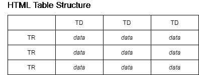
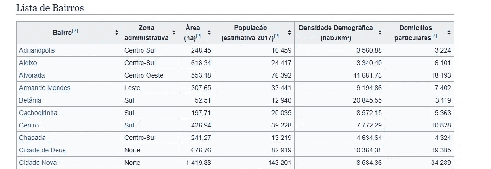
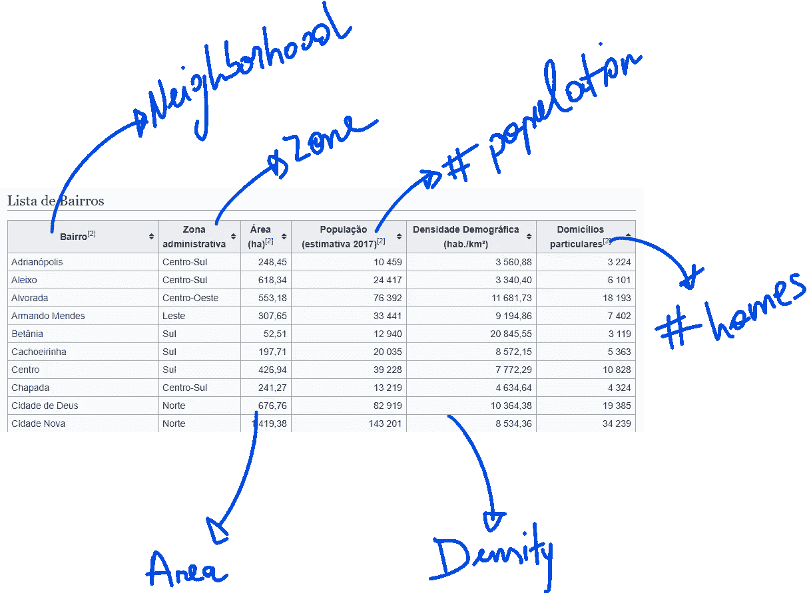
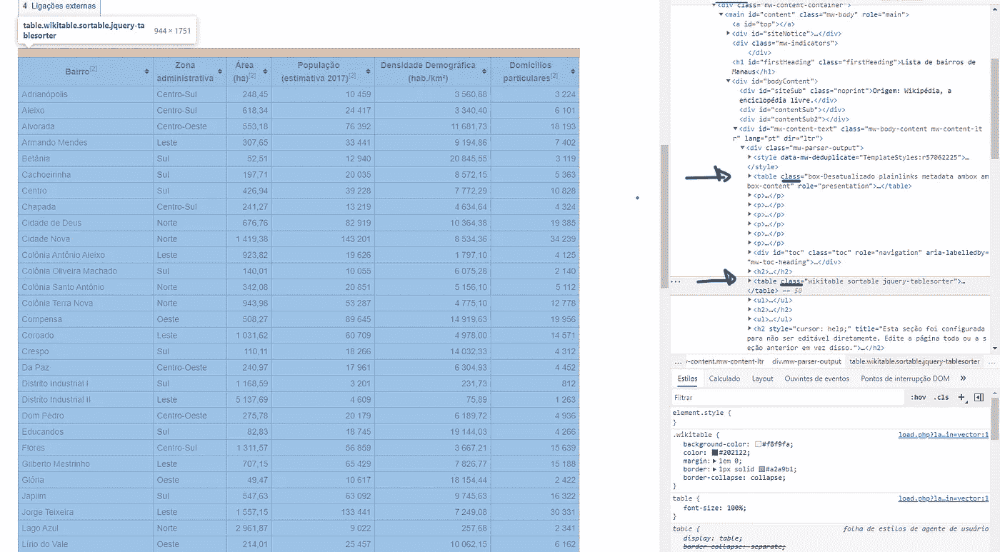
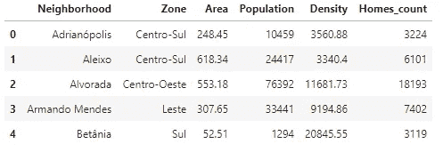
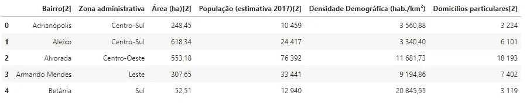
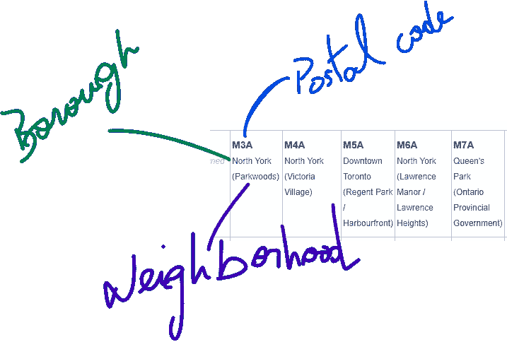
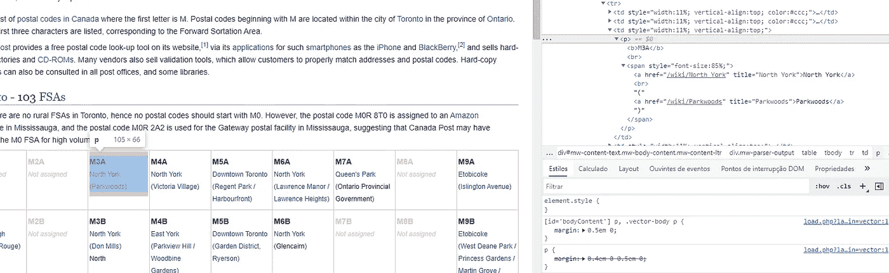
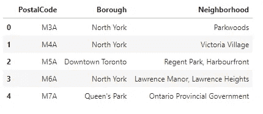

# 使用漂亮的汤在 Python 中抓取 Web 表

> 原文：<https://medium.com/geekculture/web-scraping-tables-in-python-using-beautiful-soup-8bbc31c5803e?source=collection_archive---------0----------------------->


Photo by [Piotr Miazga](https://unsplash.com/@pmiazga?utm_source=medium&utm_medium=referral) on [Unsplash](https://unsplash.com?utm_source=medium&utm_medium=referral)

我们并不总是能够访问一个整洁的、有组织的数据集。 *csv* 格式；有时，我们需要的数据可以在网上找到，我们必须能够收集这些数据。对我们来说幸运的是，Python 有一个以包的形式出现的解决方案*美丽的汤。*

我们应该从在我们的环境中使用这个库开始。

```
pip install beautifulsoup4
```

从[文件](http://www.crummy.com/software/BeautifulSoup/)中，我们了解到:

> Beautiful Soup 是一个 Python 库，用于从 HTML 和 XML 文件中提取数据。

今天，我们将看看在 HTML 中被格式化为表格的数据集。在我们继续之前，我想简单提醒一下这些表的核心结构。

# HTML 中的表格结构

我知道不是每个人都熟悉 HTML 如果没有别的，下面的图片是一个很好的提醒 HTML 表格的基本结构。



注意每个*表格行* (TR)有一个或多个*表格数据* (TD)。这意味着我们可以迭代每一行，然后提取每一列数据。

现在，让我们看看我们将收集的数据。我选择了两个数据集来演示使用 *beautiful soup* 库的不同方法。第一个是[玛瑙斯邻里列表](https://pt.wikipedia.org/wiki/Lista_de_bairros_de_Manaus)；第二个是[多伦多邻里列表](https://en.wikipedia.org/wiki/List_of_postal_codes_of_Canada:_M)(其中的一部分)。

# 1.玛瑙斯邻居列表

给你一些背景，马瑙斯是巴西亚马逊州的一个城市。下图是它的一张明信片:[亚马逊剧院](https://www.bbc.com/culture/article/20170316-the-beautiful-theatre-in-the-heart-of-the-amazon-rainforest)。


Photo by [Rivail Júnior](https://unsplash.com/@rivailjunior?utm_source=medium&utm_medium=referral) on [Unsplash](https://unsplash.com?utm_source=medium&utm_medium=referral)

下面的截图显示了我们的第一个数据集的前几行。在这个[维基百科页面](https://pt.wikipedia.org/wiki/Lista_de_bairros_de_Manaus)中可以找到。



There is a total of 63 neighborhoods in Manaus.

列名使用葡萄牙语，这是巴西的母语。让我们理解每一列在英语中代表什么:



请注意，社区是按区域组织的(南、北、东、中南部等。).在总面积和人口密度上，有些国家比其他国家更大。

让我们开始收集数据吧！

```
*# Importing the required libraries*
**import** requests
**import** pandas **as** pd
**from** bs4 **import** BeautifulSoup
```

导入必要的库之后，我们必须下载站点的实际 HTML。

```
*# Downloading contents of the web page*
url **=** "https://pt.wikipedia.org/wiki/Lista_de_bairros_de_Manaus"
data **=** requests**.**get(url)**.**text
```

然后我们创建一个漂亮的组对象

```
*# Creating BeautifulSoup object*
soup **=** BeautifulSoup(data, 'html.parser')
```

我们现在有了页面的 HTML，所以我们需要找到我们想要的表格。我们可以检索第一个可用的表格，但是页面可能包含多个表格，这在维基百科页面中很常见。为此，我们必须查看所有表格并找到正确的表格。但是，我们不能盲目前进。让我们看看 HTML 的结构。



的确，不止一张桌子。在上图中，突出显示的表是我们要收集的表。不幸的是，这些表没有标题，但是它们有 class 属性。我们可以使用这些信息来选择正确的表。

```
*# Verifying tables and their classes*
print('Classes of each table:')
**for** table **in** soup**.**find_all('table'):
    print(table**.**get('class')) OUTPUT:Classes of each table:
['box-Desatualizado', 'plainlinks', 'metadata', 'ambox', 'ambox-content']
['wikitable', 'sortable']
['nowraplinks', 'collapsible', 'collapsed', 'navbox-inner']
```

我们的代码告诉我们，我们想要第二个表(又名。class = 'wikitable '和' sortable ')。

```
*# Creating list with all tables*
tables **=** soup**.**find_all('table')

*#  Looking for the table with the classes 'wikitable' and 'sortable'*
table **=** soup**.**find('table', class_**=**'wikitable sortable')
```

注意，在将类作为参数传递时，我们不需要使用逗号。一旦我们有了正确的表，我们就可以提取它的数据来创建我们自己的数据框架。

```
*# Defining of the dataframe*
df **=** pd**.**DataFrame(columns**=**['Neighborhood', 'Zone', 'Area', 'Population', 'Density', 'Homes_count'])

*# Collecting Ddata*
**for** row **in** table**.**tbody**.**find_all('tr'):    
    *# Find all data for each column*
    columns **=** row**.**find_all('td')

    **if**(columns **!=** []):
        neighborhood **=** columns[0]**.**text**.**strip()
        zone **=** columns[1]**.**text**.**strip()
        area **=** columns[2]**.**span**.**contents[0]**.**strip('&0.')
        population **=** columns[3]**.**span**.**contents[0]**.**strip('&0.')
        density **=** columns[4]**.**span**.**contents[0]**.**strip('&0.')
        homes_count **=** columns[5]**.**span**.**contents[0]**.**strip('&0.')

        df **=** df**.**append({'Neighborhood': neighborhood,  'Zone': zone, 'Area': area, 'Population': population, 'Density': density, 'Homes_count': homes_count}, ignore_index**=True**)
```

请注意，我们首先创建了一个空的 Dataframe，但是我们给了它列名。然后我们找到所有的*行*；对于每一行，我们需要所有的*数据。*一旦我们有了数据，我们就可以使用索引来引用每个可用的列。我们必须查看 HTML 结构，以便在提取过程中使用正确的引用。在这个例子中，一些列有 HTML 标签 *span* ，需要额外的剥离来处理奇怪的字符。让我们看看我们的 Dataframe 返回了什么。

```
df**.**head()
```



Output of the *head* call

难以置信！我们正在查看从维基百科页面提取的数据。这里有一个提示:熊猫有一个提取 HTML 页面的方法，不需要太多的努力。

## 亲 tip

方法 *read_html* 返回一个包含满足我们的属性规范的 html 元素的 Dataframes 的列表**。在本例中，我们寻找一个包含类的表:wikitable 和 sortable。*千位*参数指定用于解析千位的分隔符。**

```
df_pandas **=** pd**.**read_html(url, attrs **=** {'class': 'wikitable sortable'},  flavor**=**'bs4', thousands **=**'.')
```

让我们看一下数据图表。

```
df_pandas[0]**.**head()
```



Pandas extracted this Dataframe for us

# 2.多伦多邻居列表

像以前一样，让我们先看看数据。



与第一个数据集不同，这个数据集不是按行和列组织的。相反，数据被分组在一个指示邮政编码的列下。让我们简单看一下页面的 HTML 结构。



注意这里的两件事。首先，一些列为空，并显示消息“*未分配*”。第二，每一列都有一个段落(标签 *p* )和一个跨度(标签 *span* )。让我们开始收集过程。

```
**# Importing libraries
import** requests
**import** pandas **as** pd
**from** bs4 **import** BeautifulSoup
```

导入必要的库后，我们下载 HTML 数据。

```
*# Downloading contents of the web page*
url **=** 'https://en.wikipedia.org/wiki/List_of_postal_codes_of_Canada:_M'
data **=** requests**.**get(url)**.**text
```

我们创建了 *BeautifulSoup* 对象。

```
*# Create BeautifulSoup object*
soup **=** BeautifulSoup(data, 'html5lib')*# Get table*
table **=** soup**.**find('table')
```

注意，在这种情况下，我们可以直接找到表格，因为页面上只有一个表格。

```
contents **=** []

*# Getting all rows*
**for** row **in** table**.**find_all('td'):
    cell **=** {}
    **if** row**.**span**.**text **==** 'Not assigned':
        **pass**
    **else**:
        cell['PostalCode'] **=** row**.**p**.**text[:3]
        cell['Borough'] **=** (row**.**span**.**text)**.**split('(')[0]
        cell['Neighborhood'] **=** (((((row**.**span**.**text)**.**split('(')[1])**.**strip(')'))**.**replace(' /',','))**.**replace(')',' '))**.**strip(' ')
        contents**.**append(cell)
```

在这个数据集中，我们研究了每一列(标签 *td* )。我们拒绝空列，从段落和跨度中提取内容。最后，我们将*单元格*添加到*内容列表*中。

```
*# Creating the dataframe*
df **=** pd**.**DataFrame(contents)

*# Changing some values to more comprehensive names*
df['Borough']**=**df['Borough']**.**replace({'Downtown TorontoStn A PO Boxes25 The Esplanade':'Downtown Toronto Stn A',
                                     'East TorontoBusiness reply mail Processing Centre969 Eastern':'East Toronto Business',
                                     'EtobicokeNorthwest':'Etobicoke Northwest','East YorkEast Toronto':'East York/East Toronto',
                                     'MississaugaCanada Post Gateway Processing Centre':'Mississauga'}) 
```

我们通过将内容列表传递给熊猫方法数据框架来创建数据集。此外，我们缩短了区列中一些行的名称。

```
*# Visualizing dataframe*
df**.**head()
```



成功！我们根据需要提取了数据集。

感谢您的阅读！您可以在下面的资源库中找到这些项目的代码:【https://github.com/TSantosFigueira/Coursera_Capstone


Photo by [Marco Bianchetti](https://unsplash.com/@marcobian?utm_source=medium&utm_medium=referral) on [Unsplash](https://unsplash.com?utm_source=medium&utm_medium=referral)