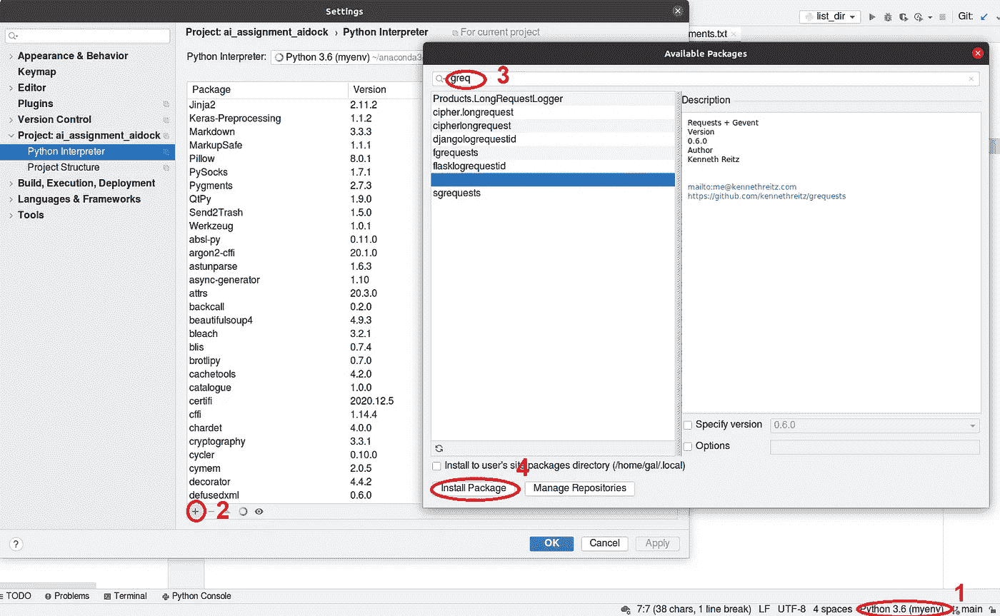
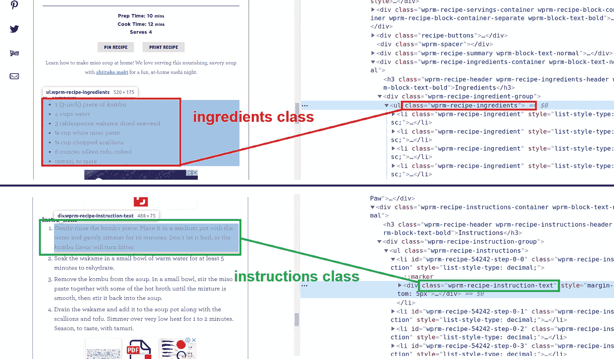
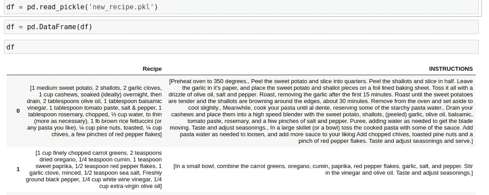

# 网页抓取不费吹灰之力。Python: BeautifulSoup，Grequests。

> 原文：<https://medium.com/geekculture/web-scraping-without-efforts-python-beautifulsoup-grequests-7e7d7886355a?source=collection_archive---------2----------------------->

## 逐步指南

## 如何用漂亮的组和异步 HTTP 请求(Grequests)构建一个 web scraper

Photo by [Artem Sapegin](https://unsplash.com/@sapegin?utm_source=unsplash&utm_medium=referral&utm_content=creditCopyText) on [Unsplash](https://unsplash.com/s/photos/coding?utm_source=unsplash&utm_medium=referral&utm_content=creditCopyText)

# 引言。

这是我的第一个关于网络抓取的教程。我将解释(用完整的代码示例)如何使用 BeautifulSoup 和 Grequests Python 库创建一个 web scraper。

假设你有一个 NLP 任务——从食谱网站收集文本数据，并进行二进制分类:配料/说明。让我们从食谱网站[https://www.loveandlemons.com/](https://www.loveandlemons.com/recipes/)搜集数据。为此，我们将使用最流行的、初学者友好的库:BeautifulSoup 和 Grequests。

# **定义**。

[***beautiful soup***](https://pypi.org/project/beautifulsoup4/)*是开源且完全免费使用的库，使得从网页中抓取信息变得非常容易。它位于 HTML 或 XML 解析器的顶端，为迭代、搜索和修改解析树提供了 Pythonic 习惯用法。BeautifulSoup 没有发送 web 请求的功能。我们将使用 Grequests 模块。除了发送 web 请求，BeautifulSoup 也没有文档解析器。我们必须从诸如“html”这样的选项中进行选择。parser '，HTML5lib，XML Parser，还有一些其他的。*

*[***Grequests***](https://pypi.org/project/grequests/)*也是一个开源的免费库，它允许你用 Gevent 的 requests 来进行异步 HTTP 请求。大多数教程使用请求模块，以手工方式实现异步请求。Grequests 在盒子里已经内置了异步方法，非常方便。**

# **包安装。**

**这并不难做到:**

1.  **在 IDE 解释器设置中查找(我使用 Pycharm，但是新的包安装在任何 IDE 中都是一样的)**
2.  **按加号键添加新的包/库**
3.  **输入您要安装的软件包的名称**
4.  **按安装包。**

****

**Pic.1 How to install package Grequests in Pycharm using Anaconda virtual environments**

**当我们安装好所有的包后，我们可以考虑从网站 ***:*** 收集数据的步骤**

1.  **将所有食谱链接收集到一个列表中**
2.  **从每个页面收集数据**
3.  **将数据保存到文件中**

# ****步骤一。收集所有链接。****

**这很容易做到。首先，构造一个请求列表，使用“grequests.map()”并行发送。然后得到一个响应列表。**

**[How to use grequest](https://gist.github.com/Galina-Blokh/d0528413523e333a261e02ac415987ce)**

**因为我们得到了一个响应列表，所以我们能够用 bs4 和 html.parser 遍历它。这样，我们就得到一个链接列表。**

**[Parsing the results of all the requests by iterating through the res_list with bs4 and link pattern](https://gist.github.com/Galina-Blokh/4db00fd3926ee9eaad35f9c67f8cbd64)**

**我们完成了步骤 1。只有四行代码加上导入——简单！**

# **第二步。从每个页面收集数据。**

**首先，定义一个默认字典来存储我们正在收集的数据。然后重复两行，构建一个请求列表，并从步骤 1 中的所有菜谱页面获得响应。注意:我们应该制作一组链接以减少重复:**

**[Get all recipe responses at one time](https://gist.github.com/Galina-Blokh/d17b0ec042591821cb34c0cb1e41e554)**

**然后开始迭代响应，对类“成分”和类“说明”的每个响应元素应用 bs4 搜索功能。用 try-except 语句包围解析器，因为我们可以捕获 AttributeError 异常(当我们试图解析 None 类型对象时):**

**[Data search in each response with bs4](https://gist.github.com/Galina-Blokh/5457feb40ba41bfaac266b642599cf4d)**

**这里，在下面的图片上，目标类在网页 HTML 中搜索。它显示了您获取目标搜索键的位置:**

****

**当你捕捉所有的文本元素(在同一个 for 循环中)时，你必须把所有的结果转换成一个文本列表，把它放入一个默认的字典中。仅此而已。第二步结束了:**

**[Using list comprehension extract text data from a parsed response](https://gist.github.com/Galina-Blokh/57d286e0ea8307f4cd1d99bfcffcca6c)**

# **第三步。将数据保存到文件中。**

**这是最快也是最容易的一步。Pickle 转储数据的速度比 CSV 快得多，占用的空间也更少。在这里，我们采取泡菜格式，但你可以自由使用任何你喜欢的。**

**[Save data into pickle file](https://gist.github.com/Galina-Blokh/118705d88d22d9a140a88f35974c8541)**

**试着用熊猫打开这个文件——你会看到一组有两栏:“食谱”和“说明”。数据帧中 1009 行中的每一行都是来自 1009 个具有配方的独特页面的数据。每个单元格中的每一项都是段落列表。**

****

**Pic.2 Data set loaded from pickle file**

# **结论。**

**嗯，我们在短时间内做了一件大事。NLP 目标的下一步应该是:预处理数据，将其分成段落，为每个文本段落给出标签(用于文本分类)，将文本转换为序列并建立模型。这可能是一篇文章的主题。**

**在本教程中，您了解了异步 HTTP 请求的 web 抓取是如何快速而简单的。它不需要太多的时间和直观。BeautifulSoup 和 Grequests 对于数据科学来说是非常方便和强大的工具。我希望这些知识能帮你节省谷歌搜索的时间，避免陷入错误。**

***完整项目上* [*Github*](https://github.com/Galina-Blokh/ai_assignment_aidock/tree/refator)**