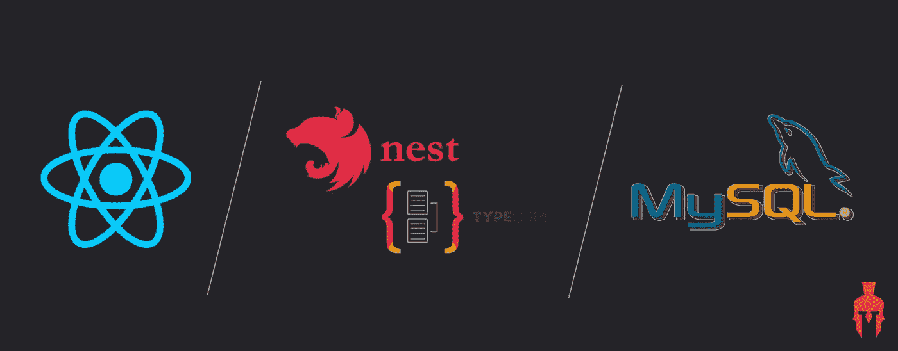
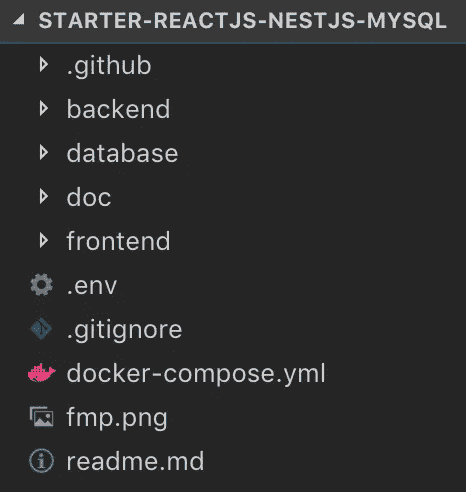
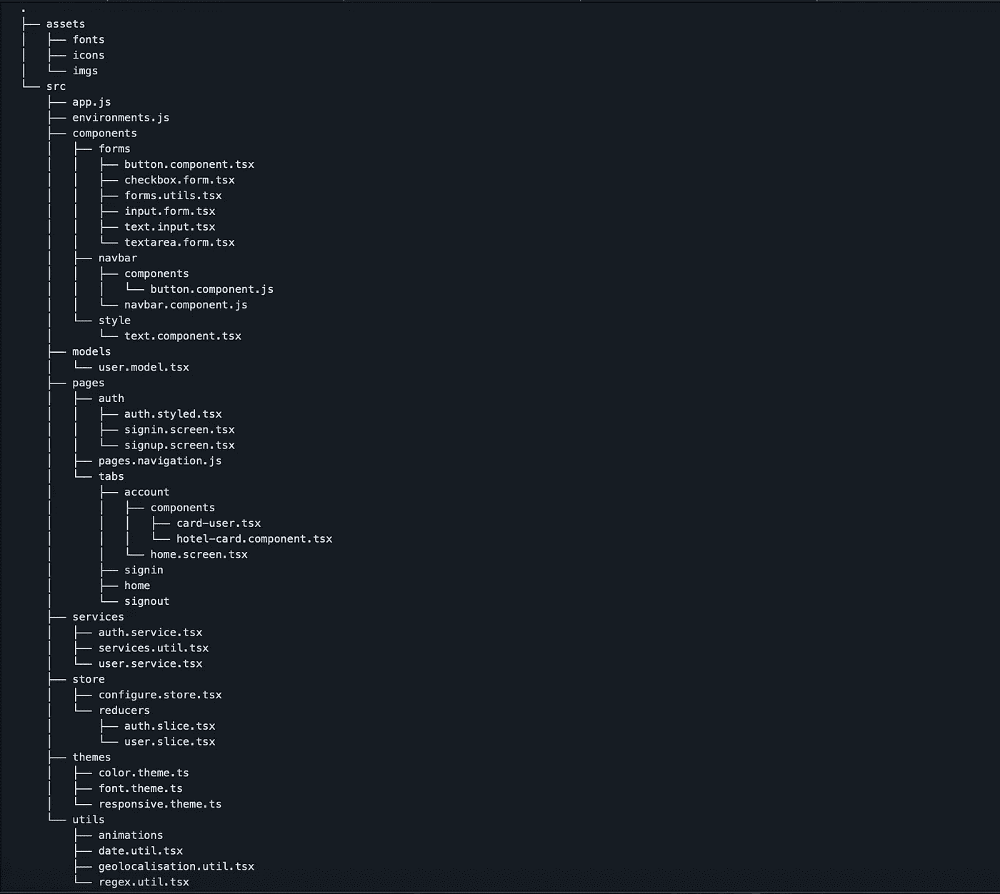
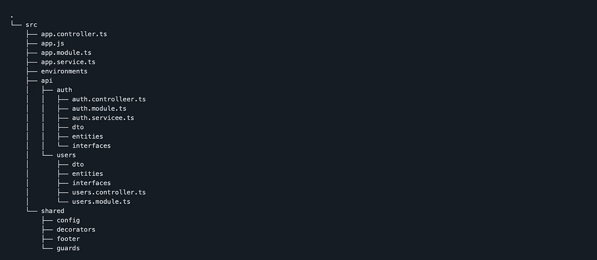
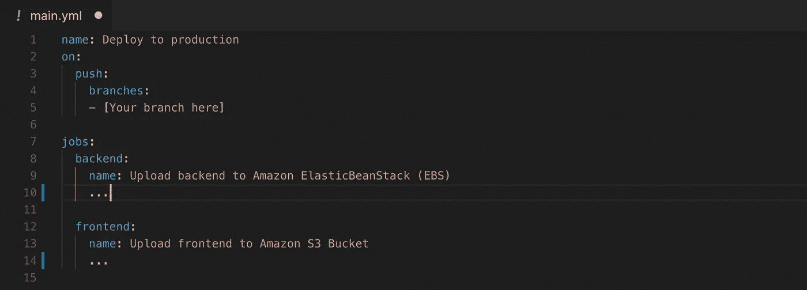

# 具有 CI 和 AWS 部署的 web Starter:React/NestJS/MySQL(+docker 和 GitHub 操作)

> 原文：<https://medium.com/geekculture/web-starter-with-react-js-nestjs-et-mysql-943bf465bb30?source=collection_archive---------16----------------------->

为了提高生产率，避免从头开始每个新项目通常是一个好的做法。这就是 maven 在 Java 领域或 web 领域中对其原型所做的事情。这允许您预配置一个 react 项目，以尽快开始开发，避免配置 Babel、Webpack …

本文的目的是介绍 React。我在几个项目中使用的 Js / NestJS / MySQl web starter。它由[快速模块化项目](https://fast-modular-project.com/)开发，这是一个共享启动器和模块以加速网络和移动开发的新平台。启动器是可以在不同项目之间重用的极简样板，模块是可以根据项目的规范按需添加到启动器上的特性。

# 它的目标

这个 web starter 的目标是:

*   提供具有本地前端/后端/数据库的完整环境，可在一个命令中启动
*   为开发人员提供一个通用的 web 项目结构，该结构具有身份验证功能，可重复用于具有相同技术堆栈的每个新任务
*   独立于操作系统和本地配置
*   定义可以添加功能的基础。我们可以举一个支付系统的例子，该系统将根据项目的需要添加到启动器中(此处有)。

# 它是如何工作的？

## 可通过一个命令启动

在上面提到的目标中，我们解释了启动器不应该受开发者的操作系统的影响，也不应该受本地配置的影响。如何解决这个问题？码头工人！如果你想在 10 分钟内拥有 Docker 基础知识，可以看看[这篇文章](https://blog.fast-modular-project.com/docker-in-10-minutes)。

starter 包含 3 个对应于堆栈的文件夹:

*   React.js 部件的“前端”文件夹
*   NestJS 中 API 的“后端”文件夹
*   本地数据库的“数据库”文件夹

*Web starter React.js / NestJS / MySQL architecture*

这些文件夹中的每一个都包含一个特定的 docker 文件，该文件定义了要执行的所有指令，以便创建我们 3 个服务的 docker 映像。它们将在启动项目时使用。例如，我们定义要使用的 node 和 mysql 的版本。

*docker-compose.yml* 文件用于通过定义以下内容来管理这 3 个服务的创建和交互:

*   他们创造的顺序
*   暴露本地机器上的端口
*   用于保存开发数据库中的数据的 docker 卷
*   …

**你现在可以用** `docker-compose up`启动你的前端、后端和数据库

## React 中的前端。射流研究…

starter 的前端和后端部分定义了命名约定和架构，以便于使用和共享其周围的功能。注意，starter 没有在 React.js 或 NestJS 上添加任何技术覆盖。

文件的命名约定取决于它们的类型。例如，一个登录页面将被命名为“ *signin.screen.tsx*

*   组件(例如: *button.component.tsx* )
*   服务(例如: *auth.service.tsx* )
*   导航器(ex:*pages . navigation . tsx)*
*   store(例如: *configure.store.ts* )
*   …

使用的架构:

File structure — frontend ReactJs

## NestJS 和 TypeORM 中的后端

像前端部分一样，提出了一种架构来促进它的使用和使用它的模块的共享。为了尽可能降低开发者端的复杂度，它还使用 TypeORM 进行数据库交互。

TypeORM 允许我们在编写实体 javascript 时自动在本地数据库中创建表、更新列。TypeORM 还提供了直观地创建复杂查询的工具。如果你想十分钟了解 NestJS 和 TypeORM，可以看看这些文章:[了解 NestJS](https://blog.fast-modular-project.com/nestjs-in-10-minutes) ，[了解 TypeORM](https://blog.fast-modular-project.com/typeorm-with-nestjs-in-10-minutes) 。

使用的架构:

File structure — backend NestJS

# 在启动器上添加功能

根据定义，初学者不包含任何对项目来说多余的功能。由于前端和后端中定义的特定架构，功能(模块)在其上的集成变得容易，并且根据开发者的选择在之后完成。如果项目需要添加一个特性，用户可以添加相应的模块。以下是此入门版中可用模块的非详尽列表:

*   文件上传到 AWS S3 存储桶
*   带条纹的支付系统
*   使用外部服务“短语”的多语言
*   带有 AWS Lambda 和 API 网关的 Websockets
*   使用 ip-api 定位
*   …

此启动器上可用的模块列表在此处可用[。](https://fast-modular-project.com/modules)

# 使用 AWS 进行部署

生产中的部署是项目中的一个重要步骤，但是对于那些没有开始的人来说，它会很快变得非常耗时。虽然本文并不打算详细介绍 starter 的部署，但是这里有所有的参考资料和有用的文档:

*   RDS 数据库的创建:[参见本文](https://blog.fast-modular-project.com/deployment-aws-rds)。
*   为我们的后端创建一个弹性的 Beanstalk 基础设施:[参见本文](https://blog.fast-modular-project.com/deployment-aws-elastic-beanstalk)。
*   用 AWS S3 bucket 和亚马逊 CloudFront 创建一个基础设施来托管和服务我们的前端:[见本文](https://blog.fast-modular-project.com/deployment-aws-s3-cloudfront)。

# 连续累计

持续集成已经在这个 web starter 中就位。一旦在 AWS 上创建了基础设施，您就可以将代码投入生产了。

为此，您需要编辑"*。starter 的 github/workflow/main.yml* "文件，该文件定义了两个 github 动作，用于在 S3 桶和上一步创建的弹性 Beanstalk 中部署前端和后端。

你必须:

*   输入要在其上触发持续集成的分支的名称(通常为 master 或 main)
*   输入您的 S3 存储桶的名称
*   输入您的弹性豆茎的名称
*   将 AWS_ACCESS_KEY_ID 和 AWS_SECRET_ACCESS_KEY 秘密添加到 GitHub 存储库中。

Continuous integration — “.github/workflows/mail.yml”

# 结论

这个 starter(样板文件)通过为您提供一个只需一个简单的命令即可启动的环境、一个预定义的架构、一个用户身份验证、一个 AWS 部署指南和大量可插入的模块(特性),让您加快 web 开发。

[快速模块化项目](https://fast-modular-project.com/starters)现在引用启动器及其模块，请随意将其用于您所有的非商业和商业项目:)

如果你想贡献，你可以在平台上提供自己的启动器或模块来支持开源社区，或者如果你选择将它们设置为优质内容，就可以获得报酬。为此，您可以使用 [FMP 工作室](https://studio.fast-modular-project.com/)。那里见:)

*   https://fast-modular-project.com
*   https://studio.fast-modular-project.com FMP 工作室: