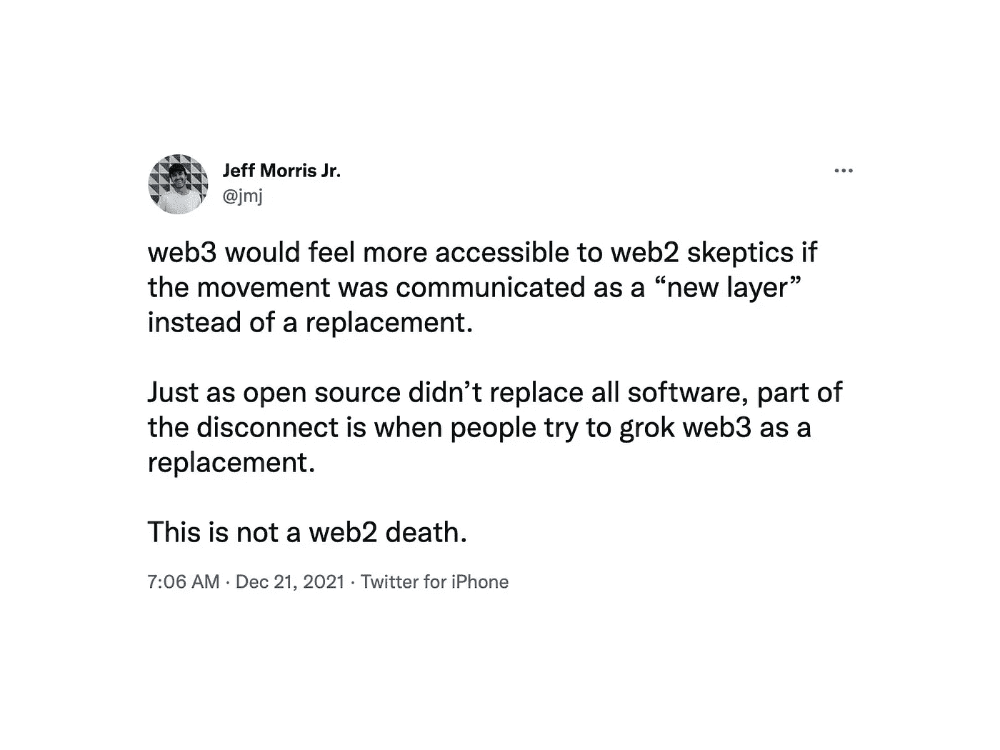

# Web3 和区块链:接入层、分散交易和地缘政治金融含义

> 原文：<https://medium.com/geekculture/web3-and-blockchain-explanation-the-access-layer-decentralized-exchanges-and-geopolitical-ed688d120919?source=collection_archive---------1----------------------->

## Web3 是新的应用程序层，需要访问区块链钱包才能进行交易。这也可能是政府金融强制的终结吗？

我从美国写信来。如果你有来自世界其他地方的独特见解，请留下评论！

时髦术语 Web3 正在迅速流行。Web3 目前的现实是这样的——大多数人完全不知道它意味着什么；大公司和政治机构正在用这个术语玩公关游戏；技术人员很难定义它。

我们正处于**和*之间的某个地方，Web3 是搞什么鬼？*** ”和 ***让我们确保我们对 Web 的定义是一致的 3…*** “我被前者和后者都难倒了。尽管我非常精通技术，有很多实际的加密经验，但我很难理解所有关于 Web3 的想法。我开发过加密应用程序，交易过，套利过，我的朋友们是早期的矿工——他们中的一些人开始从零开始写区块链。加密领域发展如此之快，我很难跟上。

有许多大公司、机构和政治参与者试图使用术语 Web3。像麦肯锡和德勤这样的管理咨询公司需要一个新的术语，它可以成为下一波互联网创新咨询服务的同义词。风险资本家和投资者希望听到从他们潜在的资金接受者的软件代码中渗出的甜蜜的“web3”甘露。广场，公司诉讼，以及妥协的全球企业政治家，如[默克尔](https://www.financemagnates.com/cryptocurrency/regulation/german-political-parties-call-for-regulation-on-crypto-blockchain-industry/)、[梅](https://www.bloomberg.com/news/articles/2018-01-25/u-k-s-may-will-look-very-seriously-at-action-on-bitcoin)、[沃伦](https://decrypt.co/88384/elizabeth-warren-defi-is-one-of-the-shadiest-parts-of-crypto)、[川普](https://news.bitcoin.com/donald-trump-crypto-very-dangerous-warns-of-explosion/)、[谢尔曼](https://catalyst.independent.org/2021/07/15/anti-cryptocurrency-congressman/)、[克林顿](https://www.thestreet.com/crypto/news/hillary-clinton-regulating-crypto-necessary-to-stop-chinese-and-russian-manipulation)等人，似乎只是略微理解了 Web3 与去中心化金融(“de-fi”)的联系，并下意识地将其视为对他们的政治金融寡头、强制框架以及相关的反乌托邦游说影响和回扣的真正威胁。政治家们正迅速试图制定行动方案，以遏制秘密市场的增长和采用，但这可能只是正在发展的去中心化风暴中的一个姿态。

从表面上看，围绕 Web3 的模糊性和缺乏共识都有点愚蠢。然而，在不具体、不安全和故作姿态的 Web3 叙事的表面之下，隐藏着一系列引人入胜的概念和创新，这些概念和创新 1)暴露了基于分布式互联网的应用程序的新“接入层”, 2)对我们现有的整体金融和政治机构的主导秩序构成了绝对不和谐的威胁。

# 1)接入层

从技术上讲，术语 web3 是作为以太网节点[连接规范](https://web3js.readthedocs.io/en/v1.5.2/)的一部分出现的。Web3 的概念已经变得更加广泛。对我来说，最简单的方法就是把 Web3 看作是当前互联网之上的一个全新的分布式访问和应用层。

Web3 是一个应用程序层，需要访问区块链钱包连接才能进行交易。随着加密货币金融资产(即全新的区块链本身、应用内和链上令牌以及不可替代的令牌，如可交易的 NFT 资产)的第二次激增，这一新层正在快速爆炸。

在这些新的 Web3 应用中，[区块链钱包](https://www.coinbase.com/learn/crypto-basics/what-is-a-crypto-wallet)档案经常取代传统的用户名/密码登录。钱包连接应用程序允许您通过区块链地址连接到任意数量的区块链账户。在这个区块链地址中，您可能拥有传统加密货币、独特的游戏/应用代币或数字资产，如 NFT。两个流行的钱包连接应用是 [Metamask](https://metamask.io/) 和 [Wallet Connect](https://walletconnect.com/) 。

**这里要理解的第一个重要概念是，新的 Web3 访问层既是安全认证层，也是区块链/加密货币*交易*层。**

为了访问钱包连接应用程序，我们需要设置一个高度安全的匿名认证密钥(就像一个复杂的密码)。为了访问众多区块链中的一个条目，我们还需要一个高度具体的分类账地址，并结合一个高度安全和匿名的公钥/私钥——对于新手来说，这是钱包连接应用程序很乐意提取的。我们可以把这想象成直接使用我们的 ApplePay 钱包登录网站或应用程序(这在目前是不可能的)。

总之，在 Web3 层中，我们有一类新的应用程序，它 1)要求您能够访问加密货币钱包，2)使用区块链进行交易(使用有价值的加密货币或新奇令牌和数字资产)。

**要理解的第二个重要概念是，区块链货币/代币允许两件事情发生，1)半匿名和不受监管的交易，以及 2)独特的应用内货币/代币/资产，可以在没有区块链市场和分散交易交易所(其数量和受欢迎程度都在快速增长)监管的情况下立即交易。**

这种新型应用的激增正导致新代币和任意价值的数字单位呈指数级增长。分散的交易所正在接受这数千个，很快将是数百万个新代币，并围绕每个代币创造一个交易/投机经济——前提是存在足够的需求。这些分散的交易交易所是纯粹的点对点交易所，我们可以在这里投机和/或交易任何东西。我们可以把这些交易所想象成交易股票、期货合约、交易所交易基金或期权。

这种交易和交易在传统基础设施之外的移动，其影响远远超出了一些异想天开的 NFT 购买、私人汽车销售和投机交易。

# 2)对主导秩序的真正威胁

2018 年，我写了 [*混沌 vs 秩序——加密货币困境*](/hackernoon/chaos-vs-order-the-cryptocurrency-dilemma-2695835f59be) 。我们在这里的 Web3 讨论是对那篇文章的及时更新。

区块链和加密货币交易的去中心化和半匿名性质直接威胁着政治家和银行业寡头。区块链是超国家现象。加密空间的发展速度远远快于传统行业知识或监管遏制的速度。

让我们看看我们当前的金融交易系统，因为它与匿名性、合规性、主导政治意识形态和治理有关。不管我们愿不愿意承认，银行业从根本上讲是政治性的，与社会准入息息相关。银行业往往充当政府的金融强制力。

## 简单交易和银行业务

在美国，我们开个银行账户很简单，前提是能证明身份。如果我们想通过该帐户转移任何有意义的金额，我们就必须立即遵守法规并控制透明度。如果我们想电汇 1000 美元到另一个银行账户，一般来说不成问题。如果我们想电汇 20，000 美元到另一个账户——有问题。如果银行系统不“了解”我们，这种转移就会受到审查。如果汇款人或收款人被任何政府或监管机构认为是不受欢迎的人，就认为这笔钱被延迟了，或者在最坏的情况下未经正当程序就被没收了——想想没有任何物理限制的[民事资产没收](https://www.aclu.org/issues/criminal-law-reform/reforming-police/asset-forfeiture-abuse)。此外，这笔 20，000 美元的电汇除了报名费、报告和合规要求之外，还将收取 20-50 美元的交易费。在一个加密网络上，同样的交易可能花费 0.10 到 3 美元——只有交易发生的公共记录。

除了银行，我们还被鼓励使用信用卡(也就是第一个数字代币)来简化交易。中型企业不接受信用卡就无法运营。像 Visa、PayPal 和 American Express 这样的信贷银行比以往任何时候都更像是政治附属组织。由于银行业推动了许多网络基础设施提供商的业务，我们也看到了一连串的访问限制和其他形式的强制。如果银行业秩序(或他们的游说渠道——即政治家)不喜欢一家公司所代表的东西(无论是道德上还是政治上)，它可以提出一个理由来限制一家公司不经正当程序进行交易的能力。这对客户和业务都有影响。客户不能光顾与其有对等关系的企业。企业无法提供服务。

以下是一些例子:

*   [PayPal 关闭无追索权的长期 Tor 支持者](https://www.eff.org/deeplinks/2021/06/paypal-shuts-down-long-time-tor-supporter-no-recourse)
*   [当银行拒绝他们时，一些成人娱乐工作者转向了加密货币](https://www.kqed.org/news/11899955/when-banks-turned-their-backs-on-them-some-adult-entertainment-workers-turned-to-cryptocurrency)
*   [Mailchimp 最新公司禁止加密货币广告](https://news.bitcoin.com/mailchimp-latest-company-ban-cryptocurrency-advertising/)
*   [Mailchimp 因“有害信息”暂停巴比伦蜂](https://www.zerohedge.com/technology/mailchimp-suspends-babylon-bee-harmful-information)
*   [贝宝冻结维基解密账户](https://www.wired.com/2010/12/paypal-wikileaks/)
*   [PayPal 与 ADL 合作打击极端主义，保护边缘化群体](https://www.adl.org/news/press-releases/paypal-partners-with-adl-to-fight-extremism-and-protect-marginalized)
*   [亚马逊将暂停支持特朗普的社交网络 Parler 的托管服务](https://www.buzzfeednews.com/article/johnpaczkowski/amazon-parler-aws)
*   [GoFundMe 引用了新冠肺炎的错误信息，严令暂停缅因州医生的筹款活动](https://bangordailynews.com/2021/12/01/news/gofundme-yanks-suspended-waterville-doctors-fundraiser-for-covid-19-misinformation/)
*   “饶了我们吧！”古巴活动人士称，美国的制裁阻止了他们的在线服务

这份例子清单并不意味着给所涉各方赋予道德或政治价值。这个列表清楚地说明了主导秩序扼杀交易参与的力量。如果一个企业不符合，它可以被排除在交易社会之外。我曾经向一位朋友提到，她讲述了她与一位自由意志主义者的对话，这位自由意志主义者提出了一些“实际上非常好的观点”——即“不受约束的政府权力只有在你同意政府的情况下才是好的……”

## 信用卡中断

尽管政策和银行之间有这种明显的结合，但这意味着信用卡公司将自己更多地暴露在加密市场中吗？他们如何从集中控制和影响的模式走向分散混乱？PayPal 最近[将他们的 fiat-to-crypto 转换限额提高到每周 10 万美元](https://www.cnbc.com/2021/07/15/paypal-ups-weekly-crypto-purchase-limit-fivefold-to-100000-.html)。签证是[投资资源加密咨询](http://Visa launches crypto consulting services in push for mainstream adoption)。

目前，信用卡终端(实体零售或虚拟)对每笔交易收取 3-5%的费用。就在最近，我们看到[亚马逊对 Visa 的收费](https://www.globaltimes.cn/page/202111/1239895.shtml)进行了大力反击，这或许更多地表明这些模式都已经过时了。也许信用卡公司的目标是在区块链交易费和他们现有的实体和虚拟终端交易费之间套利。

## 投机交易的新时代

如果我们想在纽约证券交易所或纳斯达克这样的美国交易所交易资产或合同，我们必须首先有一个上述的银行账户。然后，我们需要向 Etrade 或查尔斯·施瓦布这样的连接经纪人支付高额费用。经纪人受政府监管。经纪人要交税。经纪人拥有大规模的集中式软件基础设施。针对连接代理制定的法规和透明度合规性让他们花费了大量资金。这些经纪公司一开始亏损严重，然后向用户/客户/交易商收取费用，以弥补基础设施成本和监管机构施加的自上而下的压力。这并不是说监管不好，而是说很多监管被强制应用于系统参与者。

区块链交易完全不受传统监管和合规结构的约束。区块链自己在代码和节点级别执行他们自己的策略，并假设双方出于相互的善意进行交易，仅此而已。建立了世界交易基础设施的金融寡头们不可能高兴地坐在那里，因为他们知道双方可以在不支付接入费的情况下交换数字价值。一个不负责任、不负责任且负债累累的政府不可能高兴地坐在那里，知道双方可以交换数字价值而不用缴税。

随着区块链交易和围绕比特币、以太币、Monero 和 Ripple 等加密货币的交易的首次爆发，世界上许多政府都实施了加密货币交易所和加密到法定货币转移的报告要求。这方面的一个很好的例子是我在 2018 年写的关于比特币基地等交易所的监管措施， [*比特币基地与国税局的合作将导致更多的点对点交易，更黑暗的加密网络*](/hackernoon/coinbase-cooperation-with-irs-will-cause-more-peer-to-peer-trading-darker-crypto-web-90322e3cb25) *。同样值得注意的是，中国继续对其加密市场进行干预，并将大型加密交易所转移到新加坡。寡头们在 2018 年害怕的未来就在眼前，这让他们感到恐惧。*

在区块链和加密货币中，我们看到了去中心化和神圣的个人、集体政治或文化道德、企业利益网络和管理机构之间摩擦的光辉例证。区块链是一个古老史诗故事的数字剧场。

## 权力下放是个问题

当前的银行交易经济完全集中在政府监管实体和跨国金融卡特尔之下。我们传统经济中的交易是由银行和信用卡公司批准的，它们共同代表了身份验证层。我们首先证明我们人类/企业的存在和价值，然后我们被授权使用银行、ATM、信用卡、商户终端、Apple Pay 等进行交易。除了现金交易，所有传统的数字交易都完全由受监管的跨国公司推动，这些公司听命于(有时参与)政府的强制力。

与此形成鲜明对比的是，区块链是完全分散的。区块链由两部分组成，1)余额、转账或数字资产的分类账，如 Excel 电子表格，其中的行代表硬币/代币余额、区块链账户之间的转账记录或 NFT 等数字资产；2)分布式服务器(或节点)网络，托管可公开访问的链以批准交易。

每个区块链交易都需要一个到链的访问接口(比如通过一个支持 Web3 的钱包，它连接到节点的分布式 Web)。没有管理机构来关心交易包含什么，转移了多少，或者各方是谁。是 100%点对点的。我信任你。你信任我。我们基于对等的相互信任来创建交易。

区块链上的每个事务都需要计算资源。区块链交易可以代表货币价值，也可以是完全新奇、没有价值的数字资产。根据区块链的历史，每个事务都需要一定数量的分布式节点来批准事务。

当我们说分布式时，我们指的是不位于像亚马逊、谷歌或微软这样的集中式数据中心提供商内。区块链节点通常由网络的参与者运行。一个节点可以运行在简单的东西上，比如公寓里可以上网的笔记本电脑。任何人都可以根据特定链条(像[比特币](https://bitcoin.org/en/full-node)或者[以太坊](https://ethereum.org/en/developers/docs/nodes-and-clients/))的代码/服务器需求运行一个区块链的一个节点。100，000 个不同的人可以在世界任何地方经营一个连锁的节点。

一旦被释放到数字世界，唯一能关闭区块链交易的就是移除互联网本身——想想类似于环境或核电启示录的东西。

我们所看到的是 10，000 个不同的区块链在一个完全分布式的环境中竞争证明他们的价值，这个环境几乎没有任何没有用代码表达的治理或约束。Web3 是使用这些新区块链进行交易的应用程序层。

## 分散交易所

如前所述，允许这些成千上万的新区块链硬币、代币和资产爆发成纯粹不受约束的市场经济的跨越鸿沟的机制是分散的点对点交易交易所。很难强调这是一个多大的游戏规则改变者；或者说这些分散的交易所对主导秩序构成了多大的威胁。

虽然每个区块链都需要计算费用来批准交易(有时称为“gas”)，但该成本可能比传统费用低几个数量级，真正分布，并由每个区块链或分散式交易所特有的算法和激励结构来控制。区块链计算费用目前波动很大。为了应对这种波动性，分散式交易所正在利用二级交易池和算法定价模型进行创新，以提高效率、模拟交易需求并降低资产交易成本。

与 Etrade、查尔斯·施瓦布或 Interactive Brokers 等交易经纪商不同，区块链没有中介实体来调节点对点的价值交换；没有任何实体可以从访问银行/交易基础设施或连接到纽约证券交易所、CBOE 或纳斯达克等交易所收取一定比例的费用。此外，由于分散式交易所通常使用算法定价模型，因此不再需要订单簿和显示订单簿所需的大规模实时流基础设施。

有许多流行的分散和“互换”交易所，如 [Vesper](https://vesper.finance/) 、 [SushiSwap](https://analytics.sushi.com/) 、 [SundaeSwap](https://testnet.sundaeswap.finance/#/) 和[PancakeSwap](https://pancakeswap.finance/swap)——以及资产市场，如 [OpenSea](https://opensea.io/explore-collections) 和[rarable](https://rarible.com/)。

就机制而言，分散式交易所的功能很像伦敦证券交易所、纳斯达克、纽约证券交易所、德意志交易所或 CBOE——除了没有集中的连接仲裁者/监管者。

分散式交换机提供以下功能:

*   创建一个市场来投机数字资产
*   列出所述资产的最后交易价格
*   针对底层加密资产的对等交易执行合约
*   将一项资产(基于价值的资产，如加密货币，或者新颖的资产，如 NFT)从区块链的一个位置转移到区块链的另一个位置，通常在同一条链上，但不是必须的。**在交易池的情况下，这也可以以模拟或“指定”的方式进行，但对于我们这里的对话来说，这有点复杂。*

正如我们之前所探讨的，当面对无法收取费用或税收时，企业和政府的利益是不高兴的——非常不高兴。他们目前的监管合规、费用、税收和处罚机制是监管和强制清算机构合规的能力，这些清算机构将加密货币兑换成法定货币，如将比特币兑换成美元，然后将存款发送到您的传统银行账户。这是比特币基地、双子座和其他人的通病。请求从加密货币转换为法定货币的人将受到当地税收、费用、法律、处罚、限制等的约束。

随着 Web3 应用/访问层的成熟，它有可能颠覆一切。一旦价值被转移到加密资产中，该价值现在可以用于在数千个，也许数百万个新地方进行交易，而不是将其转移回法定货币，如英镑、€欧元、₩韩元或美元。加密价值在任何给定的区块链网络、市场和分布式交易所中存在的时间越长，加密价值就离潜在的机构和政府费用、税收和胁迫越远。

分散的交易所和市场允许每个加密资产在许多其他资产之间转换和交换。这些交流将允许各种不受监管的点对点投机。把这想象成交易与 S&P500、黄金、白银或石油价格挂钩的 ETF。只要对任何资产或事件的投机性押注有足够的需求，其表现就会在分散的交易所交易。

想象一下，数万亿新的投机交易不受低效的审批、审查、费用、税收、管理机构或合规管理的影响。这对个人来说是好事，但对金融寡头来说是直接威胁。正如亚马逊、好市多和塔吉特对个人和家庭来说是伟大的一样，它们在中小型零售业的破坏和毁灭中扮演着重要角色。

## **关闭**

在写这篇文章时，我不得不问自己一个非常严肃的问题，“通过帮助阐明去中心化的 Web3 惯性的新现实，我会成为其潜在的未来监管破坏的同谋吗？”我非常认真地对待这个问题。我一生都不墨守成规，追求效率和真理——这可能是个缺点。

纵观全球，我们看到政府的叙述和事实之间的脱节几乎在我们所到之处都在扩大。在最好的情况下，全球政府和跨国公司坚定不移地鼓励经济的可持续增长。在最坏的情况下，这些实体已经被证明是不负责任的利己主义者——就像无法阻止的过度生长和情绪化的青少年恶霸。全球政府、政治家和跨国公司都在床上，享受着阶级主义、排外主义、裙带关系和暴力的任性的精英狂欢。由于他们完全控制了金融准入系统，他们根据非法影响和命令进行无效率行动和胁迫的许可证无法受到限制或撤销。当然，政府和企业追求的是许多正义和负责任的举措，但政府和跨国公司从根本上来说并不是好的——它们就像你我一样一往无前。真实、高效和乐观的信号变得如此微弱，几乎听不见，而愤世嫉俗的噪音变得震耳欲聋和荒谬。

至少，我们必须追求加密货币的效率、透明度和明显缺乏强迫的内在动机。

我认为分散的加密空间远远领先于政府，无论是国家的还是全球的，这是难以理解的。政府无法遏制这个高效创新的庞然大物。正如开源软件超越了集中式软件平台的自然限制，区块链技术也超越了传统金融。其分散的、社区驱动的性质使区块链不受束缚、灵活、高效。

政府、政治家和跨国公司需要尊重加密货币的力量，而不是与之斗争。任何斗争都将是徒劳的，并以许多无辜和正派的演员为代价。当政府基于恐惧和裙带关系影响制定政策时，附带损害总是悲剧性的——在精英们不吃、不睡、不喝、不生活的边缘地区总是更糟。如果政治家们记得政府不应该是一只不停进食的懒惰野兽，那就最好了——政府是由人民资助的，并且有一个通过效率、信任、乐观、善意和自由来维护他们最大利益的契约。政府必须给予自由和创新的个人更多的信任，让社会变得更好。政府必须允许创新顺其自然，即使以现有的、通常效率极低的制度权力结构和规范为代价。

> "当一个人的薪水取决于他对某事的不理解时，要让他理解这件事是很难的。"—厄普顿·辛克莱

也许这个世界比以往任何时候都更需要区块链和它所代表的一切，或者，我们需要越来越多的政府来拯救我们自己…

*在*[*【WilliamBelk.com】*](https://www.williambelk.com)*找我。关注我* [*推特*](https://twitter.com/wbelk) *。*