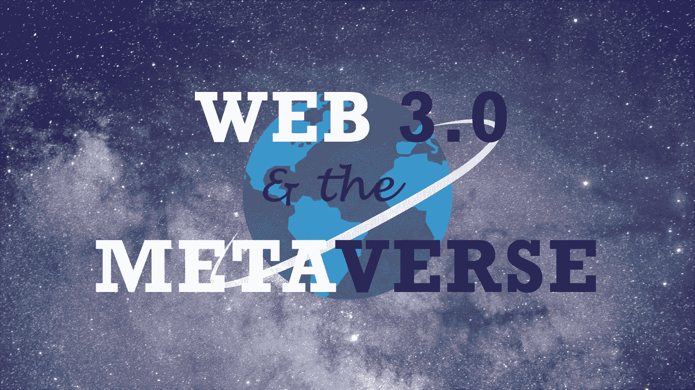
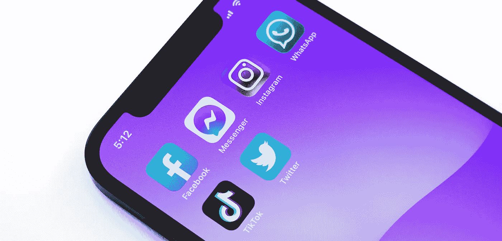
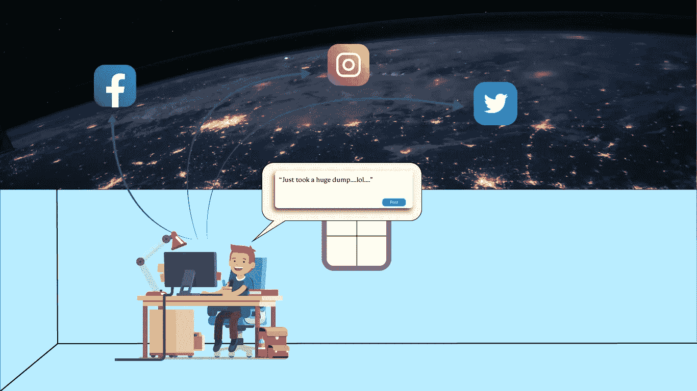
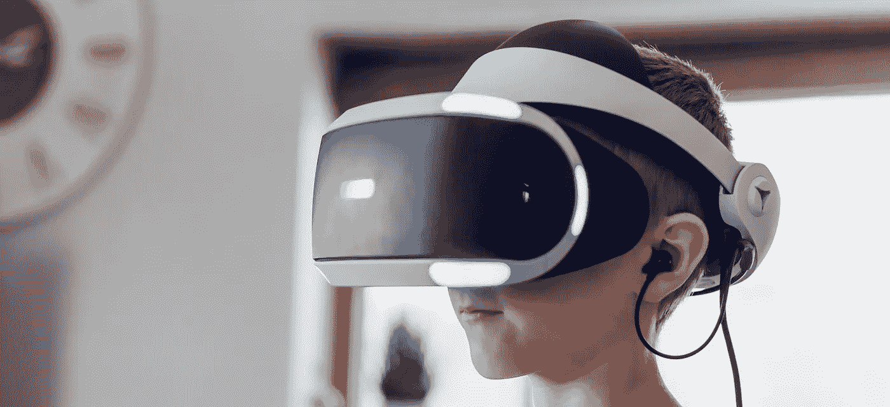
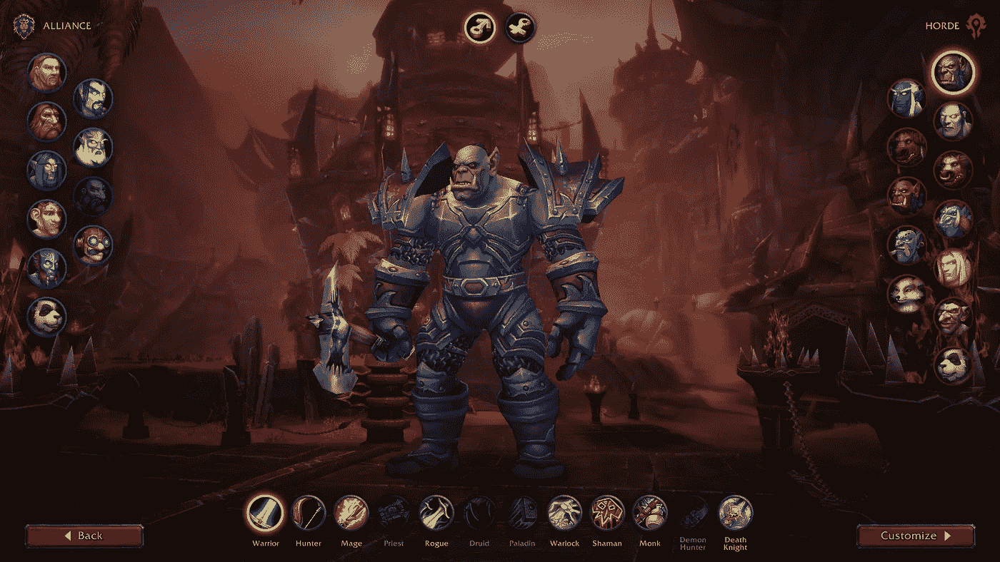
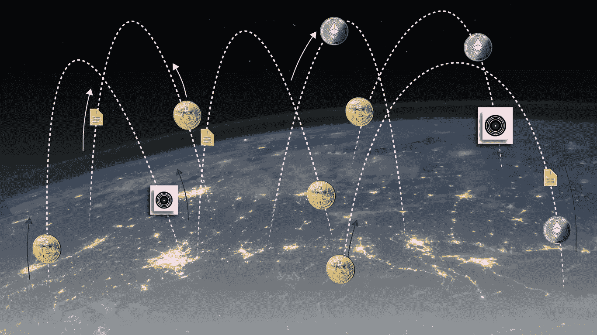

# Web3:人工智能、加密货币和元宇宙

> 原文：<https://medium.com/geekculture/web3-artificial-intelligence-cryptocurrency-and-the-metaverse-f264841144bc?source=collection_archive---------3----------------------->

An introduction to the future of the internet

意识到世界在过去十年中变化的速度之快、程度之大，几乎令人恐惧。我们已经从欣赏由正规电视节目制作的节目变成了由个人在互联网上制作的网络节目。从广告牌和传单上的实体营销，到脸书和 YouTube 等产生流量的网站上的广告。这就像我们的整个生活方式已经随着互联网社区的进步而改变。如果你认为，我们不能比这更进一步，那么 Web3(也称为 Web3.0)将证明你是错的。

如果不了解 Web3 的根源，即 Web1.0 和 Web2.0，谈论 web 3 就没什么意思了。你们中的大多数人可能会对我们每天使用的互联网有多个版本感到震惊。嗯，你们都用过前两个版本，只是没有注意到过渡。

## Web1.0

A nostalgic throwback to the good times

这是 90 年代互联网的第一次迭代，当时网页只不过是一段文字。那是一个简单得多的时代，你只需上网查找一些信息，仅此而已。社交媒体是一个抽象的概念，广告仍然可以在电视和广告牌上看到，如果你想和某人说话，你必须打一个固定电话。

互联网就像一个巨大的百科全书，静态页面上有很多很多的文本。你可以创建自己的信息库，但知识产权不是一个东西，几乎一切都是公开的。第一版的主要亮点是:

*   从 90 年代早期的**到 2000 年代中期的**
*   静态网页(没什么新奇的)
*   信息的集合。
*   大部分只是文本信息

## Web2.0

Photo by [Jeremy Bezanger](https://unsplash.com/@jeremybezanger?utm_source=unsplash&utm_medium=referral&utm_content=creditCopyText) on [Unsplash](https://unsplash.com/s/photos/social-media?utm_source=unsplash&utm_medium=referral&utm_content=creditCopyText)

W eb2 始于社交媒体的繁荣。这是人们真正意识到互联网的力量超越了简单的信息共享。随着 JavaScript 和 Ajax 等现代技术的出现，网页不仅仅是一段文字。

现在，您可以**上传/嵌入视频、分享图片、上传音频剪辑、“喜欢”的内容、在您喜欢的地方发表评论**。这开辟了许多途径，互联网成为一个自己的社区，人们可以在这里相互联系，相互交流，分享他们的时刻，分享各种内容。

People will share literally anything

这个新时代也见证了社交媒体影响者、艺术家、创作者和电子商务的崛起。它为人们开辟了新的谋生方式，创造了成千上万的赚钱机会，但这也意味着几乎所有的控制和权力都掌握在一些大公司手中，如**谷歌、脸书、微软等**。因为这些公司拥有你所有的数据(当然，在征得同意的情况下，下次一定要阅读条款和条件😏)，他们可以随心所欲地出售这些数据(根据你签约时同意的 EULA)，而这正是他们所做的。

所以关键的亮点变成了，

*   从 2000 年代中期的**到现在仍在继续。**
*   动态网页/内容。
*   在线内容创作者的崛起。
*   **广告收入**的冒险经历。
*   中央集权制和社交媒体巨头**的大本营**。

## web 3.0——未来？

Photo by [Jessica Lewis](https://unsplash.com/@thepaintedsquare?utm_source=unsplash&utm_medium=referral&utm_content=creditCopyText) on [Unsplash](https://unsplash.com/s/photos/augmented-reality?utm_source=unsplash&utm_medium=referral&utm_content=creditCopyText)

所以我们收集了一些信息，然后它变成了一个平台，让人们展示自己，做各种事情(实际上是任何事情)，但是我们从这里去哪里呢？嗯，还有很多东西需要探索。

**人工智能**和**区块链**的引入为互联网世界打开了一个全新的维度，这就是 Web3.0 的意义所在。Web3 将向我们介绍基于区块链和人工智能的*元宇宙*。但是在继续之前，让我们看看这些术语的实际含义。

## 区块链

区块链概念最初是在 2000 年代末作为比特币 T21 网络的架构解决方案提出的。区块链基本上是一种存储数据的方式。传统上，数据存储在以表格形式存储数据的数据库中。这种形式的存储非常不安全，容易受到攻击。

Structure of a blockchain

另一方面，区块链以块的形式存储数据，每个块都有一个散列表示。每个块还指向前一个块的散列。一旦创建了一个数据块，它就会附带一个时间戳，如果试图修改其中包含的信息，该数据块的哈希就会被更改。这意味着不仅该特定块被无效(因为散列被改变，所以该块失去其身份)，而且在它之后的每个块也被无效，因为下一个块被认为指向当前块的散列，而当前块不再存在。

因此，篡改一个数据块会扰乱整个数据链，这就是为什么很难篡改任何数据的原因。

## 人工智能

如果您一直在关注我的文章，这个术语应该不需要介绍。简单来说，人工智能就是训练计算机做出类似人类的决定，并能够理解我们周围的世界。人工智能已经存在了几十年，但在过去的十年里，我们看到它的发展出现了巨大的突破，计算机能够理解图像和文本，并执行类似人类的任务。

尽管人工智能不是 Web3.0 中引入的新东西，但专家认为它将在消除 Web3 宇宙中几项任务的人工干预方面发挥重要作用。

如果你想了解更多关于 AI 的知识，可以从这里开始[。](https://writersbyte.com/datascience/ai-for-beginners-3/?swcfpc=1)

 [## 面向初学者的人工智能:计算机视觉和自然语言处理

### 我们已经谈了很多关于人工智能的一般意义以及它对我们世界的影响。在以前的文章中，我们…

writersbyte.com](https://writersbyte.com/datascience/ai-for-beginners-3/?swcfpc=1) 

或者，如果你想了解人工智能算法，你可以看看下面的文章。

 [## 人工智能和数据科学

### 编辑描述

writersbyte.com](https://writersbyte.com/category/datascience/?swcfpc=1) 

## 梅塔华？—这一切意味着什么？

到目前为止，我们已经谈论了区块链概念和人工智能，但这些与 Web3 有什么关系呢？

术语*元宇宙*类似于术语‘宇宙’。这意味着一个独立于我们的世界，一个你以数字化身存在的虚拟世界。你有一个虚拟的家庭，拥有一个虚拟的家，赚取和消费虚拟货币。

那么这一切有什么联系呢？你可能不是第一次遇到这个概念。如果你熟悉在互联网早期风靡一时的游戏**魔兽世界**，那么你已经见过元宇宙是什么样子了。在魔兽世界中，你可以创造你自己的角色，和朋友一起进行任务，或者只是进行一些有趣的活动。Web3 的元宇宙更进一步。

Character customization in World of Warcraft | [source](https://www.pcgamer.com/world-of-warcraft-is-changing-its-character-creation-screen-for-the-first-time-ever-and-i-hate-it/)

由于 Web3 上的一切都将基于区块链，因此所有交易都将使用加密货币进行。既然区块链网络意味着一个去中心化的系统，每个用户拥有平等的权力，那么这也意味着社交媒体巨头如脸书和谷歌垄断的终结。今天所有可用的人工智能技术都将被带到元宇宙

## 那么这个元宇宙有什么新的特点呢？

这一次不仅仅是去探索和闲逛。随着**加密货币和 NFTs** 的兴起，我们已经开始将我们的购买数字化。现在，人们不再拥有实物艺术品，而是购买数字艺术品作为**艺术品。**在元宇宙，你会发现人们购买数字商品，就像你购买日常用品一样，人们将以**道(去中心化自治组织)**的形式创业，你会看到银行以 **DeFi(去中心化金融)**的理念运营，所有这一切都因为区块链的架构而成为可能。

Web3: Exchange of cryptocurrency for other currencies, files, or NFTs

元宇宙将是一个与现实世界平行的数字世界，但它将通过互联网访问，在这里你可以选择自己的长相和生活方式。

那么 Web3 什么时候到来？

我上面提到的关于 Web3 和元宇宙的一切仍然只是许多未来学家和技术爱好者预测我们的未来会是什么样子时提出的一个抽象概念。然而，最近的一些发展表明，元宇宙可能比我们预期的更近，例如加密货币和 NFT 的正常化。

*最近更名为*(巧合？一个都没有！)现在已经把重点转移到了增强现实上。脸书(现在是 Meta)的首席执行官最近展示的演示向我们展示了元宇宙的一瞥，正如我们上面讨论的一样；在这个世界里，你以虚拟角色的身份生活，可以和朋友一起闲逛，计划聚会和会议，甚至举办虚拟派对。**

****

**Mark Zuckerberg showcasing the metaverse created by Meta**

**除了脸书，许多其他巨头都准备迎接互联网的新浪潮，所以你看到自己在虚拟世界中创建的虚拟图书馆中作为自己的化身阅读这篇文章可能只是时间问题。**

## **最后的想法**

**每当我们取得这样的进步时，总会有持相反观点的批评家。虚拟现实和增强现实的概念并不新鲜，已经存在了近十年，然而它们并没有像预期的那样起飞，所以很难说 ***【元宇宙】*** 是否会成为现实，以及人们会如何接受它。**

**然而，随着世界进步的速度，为这样的变化做好准备并准备拥抱未来并不是不合理的。**