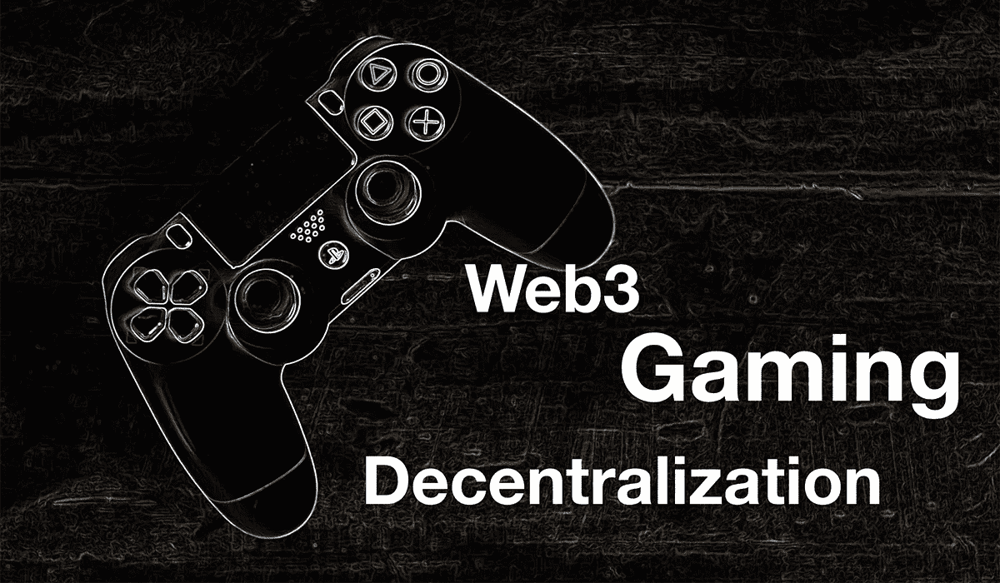
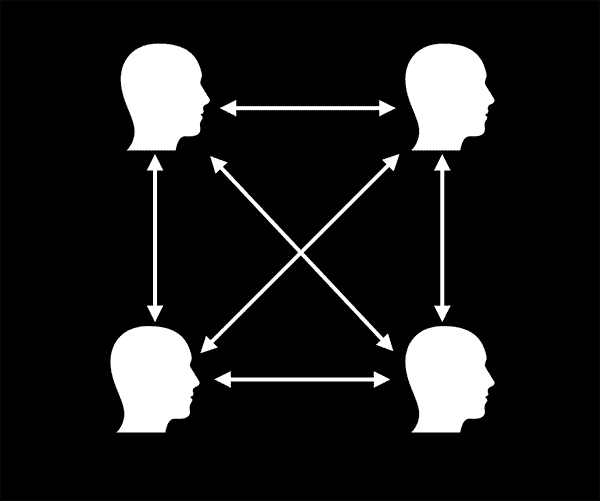
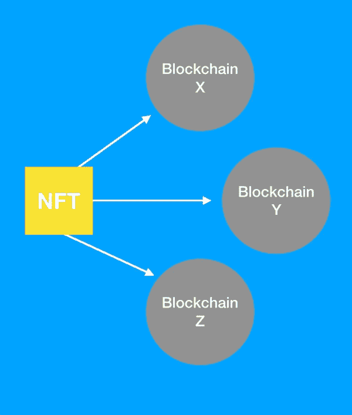
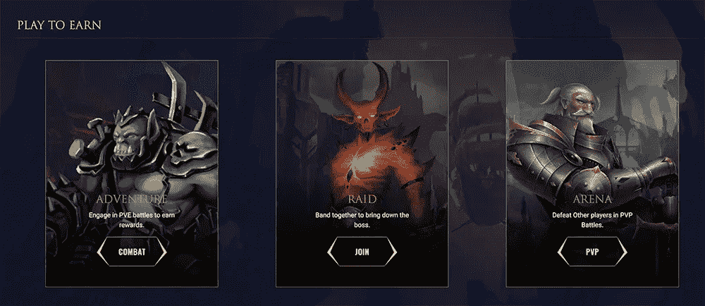
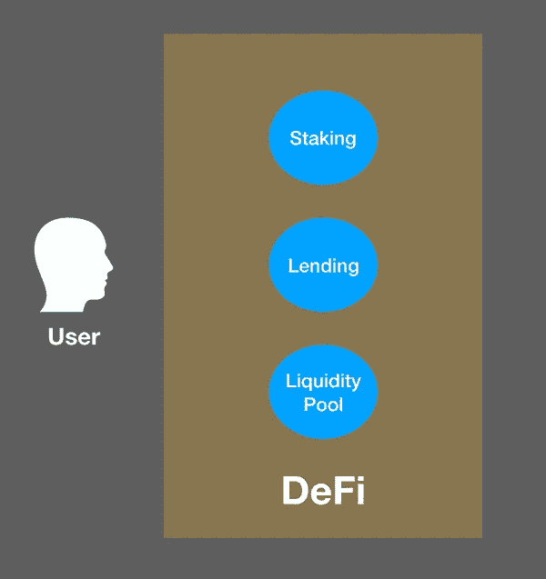

# Web3 为游戏的未来引入了新功能

> 原文：<https://medium.com/geekculture/web3-introduces-new-features-for-the-future-of-gaming-908bea09a9e0?source=collection_archive---------8----------------------->

[**Web3**](https://ethereum.org/en/web3/) 是一个软件开发框架，允许与 ***【区块链】*** 集成。区块链提供了验证层，它可以在没有中央机构控制的情况下不变地存储数据。它不受信任，没有中间人，所以不容易被操纵和审查。

这样做的好处是有助于建立一种证明，比如记录在公共分散数据库中的数字项目的所有权，而不需要中介。这可以是一种公平和透明的验证数据的方式，不受单个实体的影响，而是通过分布式共识机制。

Web3 可以为游戏玩家提供前所未有的新功能，因此他们对游戏的引入是对市场的颠覆。这有助于解决游戏中的问题。以下是可以改变游戏行业的一些主要功能。

## 所有权

在传统游戏中，平台可以暂停玩家的帐户，并删除他们的数据，无论服务方面给出什么理由。这是因为游戏玩家在传统游戏平台上不拥有他们的数据。有了区块链，玩家可以保留他们从游戏中获得的物品，而无需依赖另一方。这使得 ***所有权*** 成为游戏玩家的 Web3 主要特色。

在 Web3 中，区块链帮助玩家建立游戏中资产的所有权。如果一个用户声称自己拥有一个稀有的 **NFT(不可替代的令牌)**，这是他们从玩游戏中获得的，区块链可以证明这是事实。这有助于减少反索赔，因为有记录的所有权证明。传统游戏没有不可信的验证系统，因为它主要基于对平台的信任。如果平台拒绝承认游戏内资产的所有权，问题就出现了。

**With Web3, gamers can own their in-game assets and take custody of it.**

如果平台突然关闭，它还可以从平台上清除玩家拥有的任何物品。通过拥有区块链，即使游戏平台不再运行，资产也可以继续存在。区块链还提供数字资产的跨平台使用，因此它们不会永远丢失。

需要注意的是，区块链是用于验证的，而不是用于强制执行所有权的合法性。这意味着反诉仍然可以由另一方提出，它仍然取决于法院来确定谁是合法的所有者。通过对区块链的验证，如果法院认为它是不可否认的证据，它可以提供解决方案。

## 透明度

Web3 带来了更多的*资产所有权、游戏内购买交易、奖励发放、验证随机性的透明化。由于诚信和公平，这在游戏行业中至关重要。重要的是确保游戏平台没有欺骗游戏玩家，并且它们正确地向游戏玩家分配奖励。在这方面，区块链可以是确保公平的一种方式。*

**

*[**Chainlink**](https://coinrivet.com/it/chainlink-sets-new-industry-benchmark-for-randomness-with-vrf-v2-upgrade/) **smart contracts on the blockchain provide transparency by using decentralized verification of randomness which can be used in gaming. It is open to the public to show fairness.***

*需要更多透明度的游戏问题的一个例子是提供赌博的在线游戏网站。过去，一些网站陷入了[作弊丑闻](https://slate.com/news-and-politics/2013/05/ultimatepoker-and-ultimatebet-the-online-poker-scandal-that-never-ends.html)。游戏行业的欺诈是具有挑战性的，因为游戏玩家正从不提供真正随机性的作弊系统中失败。有了 Web3，玩家可以玩使用随机数发生器的游戏，随机数发生器使用区块链进行验证。*

## *分散*

****去中心化*** 通过使用非中介的验证者网络，有助于为游戏玩家证明公平可信的数据。当游戏玩家在区块链上记录数据以有效地要求奖励收入时，他们可以从该功能中受益。如果网络在区块链上验证了索赔，那么平台必须进行支付，并且不能推翻索赔的有效性。*

*由于 Web3 是去中心化的，它可以使游戏平台独立于中央权威机构。玩家的数据在一个分散的网络上通过加密手段得到保护，该网络是防审查和防篡改的。*

*这被设计成允许交易是 ***点对点(P2P)*** 的，而不需要中介来转移价值。在这种情况下，当游戏玩家记录数据时，他们正在创建一个需要网络费用的证明，该网络费用是为了处理数据而传输的值。*

**

***Decentralization does not require a central authority. It can be peer-to-peer or allow users to directly transact with one another without permission from a third-party making it less prone to manipulation.***

*游戏中资产的实际内容也可以存储在分散的网络上。像 IPFS 这样的协议提供了不基于单一平台的存储。它分布在由参与者托管的各种存储系统中，这些参与者被激励来存储内容。游戏玩家不会丢失或被没收他们的内容，只要他们有一个安全的区块链。*

## *自我主权*

*通过跨平台互操作性，游戏玩家可以自由地将他们的资产转移到其他平台。这意味着有了 Web3 的支持，游戏玩家可以在各种基于区块链的游戏之间转移游戏内资产。例如，在一个游戏中赢得或购买皮肤的玩家可以在兼容的另一个游戏中使用它。*

**

***With an NFT, gamers can create self sovereign profiles where they can use their digital assets across different blockchains through cryptographic authentication.***

****自我主权*** 为玩家提供了对自己资产的完全控制权。可以创造一个 NFT 来代表这种身份验证的形式，这样游戏玩家就不需要得到他们正在玩的平台的许可来转移他们所拥有的东西。游戏玩家将完全保管他们所拥有的东西，这意味着在他们选择的任何平台上转移资产的完全授权。*

## *激励*

****激励*** 的使用为游戏带来了新的维度。虽然传统游戏主要是为了娱乐，但 Web3 游戏提供了同样的功能，但增加了玩游戏的收入。这与传统游戏中的*货币化*(例如[移动游戏货币化](https://www.blog.udonis.co/mobile-marketing/mobile-games/game-monetization-features))不同，因为 Web3 不仅提供购买游戏内物品，还提供使用加密货币的收入。*

*Web3 引入游戏的一个吸引人的特点是代币形式的激励。游戏开发者可以使用 **SDK(软件开发工具包)**将此功能添加到新的或现有的游戏中。这将具有区块链功能的软件模块无缝地插入到游戏中，可以简化和加快开发。*

*游戏中的激励可以通过完成关卡和赢得挑战的奖励形式提供。由于游戏玩家受到激励，这可以吸引更多的玩家到 Web3 游戏生态系统。这方面的一个例子是**即玩即赚** ( **P2E)** 游戏平台 *Axie Infinity* ，它的生态系统[出现了巨大的增长](https://dgen.network/axie-infinity-community-building-success-story/)。*

*受激励的 Web3 游戏能给开发者带来的一件事就是忠诚度。奖励的好处可以为开发者的平台赢得更多的玩家，这可以用来建立忠诚度计划。有了奖励，开发者可以扩大用户群，增加收入。*

**

*[**CryptoBlades**](https://www.cryptoblades.io/) **is an example of a P2E game where gamers can earn from playing.***

## *游戏化*

*游戏与 **DeFi(去中心化金融)**的交叉为游戏玩家打开了新的机会。 ***游戏化*** 或 ***GameFi*** 不仅允许游戏玩家赚取，还可以参与类似*赌注*、*借贷*和*流动性池*的加密融资协议。这些都是传统金融中使用的金融工具的对应物。*

**

***With Web3 games, gamers can get exposure to DeFi protocols.***

*GameFi 的使用风险相当大。开发者在游戏中集成这些协议的方式很有趣。风险在于，如果游戏玩家不小心花钱，这就像赌博一样。这些都被记录在区块链上，所以帮助核实索赔并不难，但它也可以显示你是否在赔钱。*

## *数字治理*

*随着代币的推出，随之而来的是 ***数字治理*** 。这是随着以太坊之后的第三代和第四代区块链推出的(例如 EOS、Tron、币安链)。这将允许持有代币的 Web3 游戏玩家参与投票表决他们所属游戏平台的新政策和发展。一个令牌可以代表一次投票，但这完全取决于游戏平台如何实现他们的投票系统。*

*游戏玩家可以通过在投票智能合同中持有一定数量的代币来投票。当提议被发送时，游戏平台可以在其令牌持有者社区中举行投票，以确定是否实施新的东西来帮助平台。对于传统的游戏平台，情况并非如此，因为决策集中在董事会或高层管理人员手中，而没有咨询游戏玩家。*

## *摘要*

*在游戏中，Web3 的使用在很多方面都很重要。它可以帮助游戏玩家建立他们购买的游戏中物品或资产的所有权。这意味着他们完全保管这些项目，而不是游戏平台，使他们对数字内容有更多的控制权和权利。因为它是在一个开放的分散系统上记录的，所以它也提供了更多的透明度来帮助提供公平性。*

*这也意味着，即使游戏平台由于某些原因(如破产、服务器崩溃、系统被黑等)而关闭。)，游戏玩家仍将拥有游戏中物品的监护权，因为 Web3 使它们独立于游戏平台。玩家可以保留游戏中的物品，如皮肤、能力、武器和奖励，并将其转移到其他平台。*

*Web3 还给予游戏玩家特权，允许他们参与数字治理。这一概念有助于游戏民主化，允许使用代币支持社区驱动的决策。游戏玩家实际上可以投票决定他们游戏平台的未来。*

*虽然这些功能在理论上看起来不错，但这是否有益将取决于游戏玩家和开发者。Web3 可以解决游戏中的许多问题，但在实践中仍有一些问题需要解决。这包括关于加密货币的监管明确性和进一步采用，以促进 Web3 游戏的发展。这有助于塑造游戏行业的未来发展方向。*