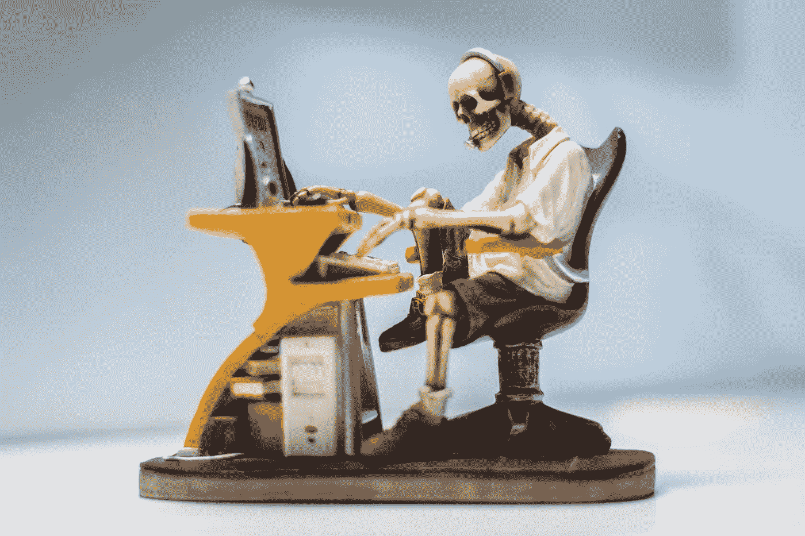

# 网络 3 是一个破碎社会的产物

> 原文：<https://medium.com/geekculture/web3-is-the-result-of-a-broken-society-6f8e52e7e5bf?source=collection_archive---------20----------------------->

## 你想要 Web3，因为社会已经崩溃了

Thanks [Pexels](https://www.pexels.com/photo/figurine-of-human-skeleton-sitting-infront-of-computer-463684/)!

[Web3](/geekculture/an-introduction-to-cryptocurrency-web3-nfts-and-daos-1736d229cc7a) 正在*人气爆棚*。很多人认为这是因为 Web3 很棒。公平地说，确实是这样。

但它回避了问题。

为什么？

这与我们在逃避什么而不是在建设什么有很大关系*。*