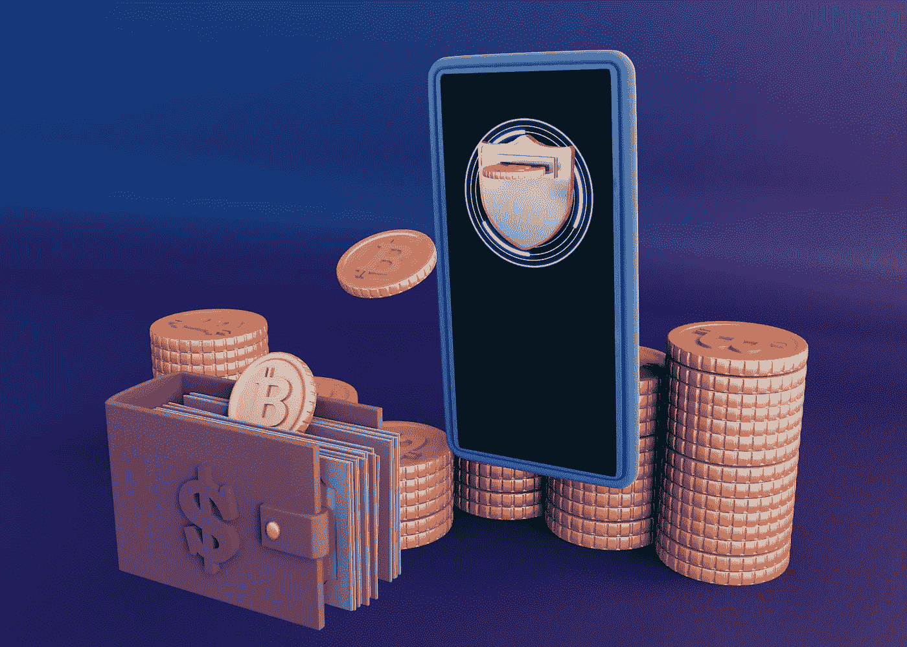
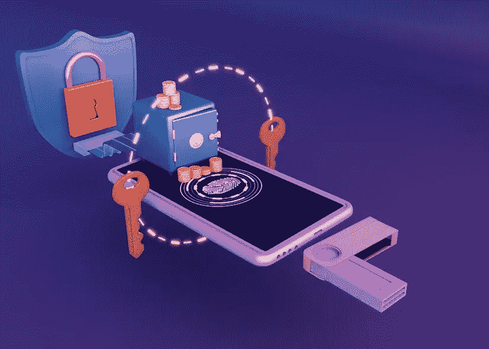
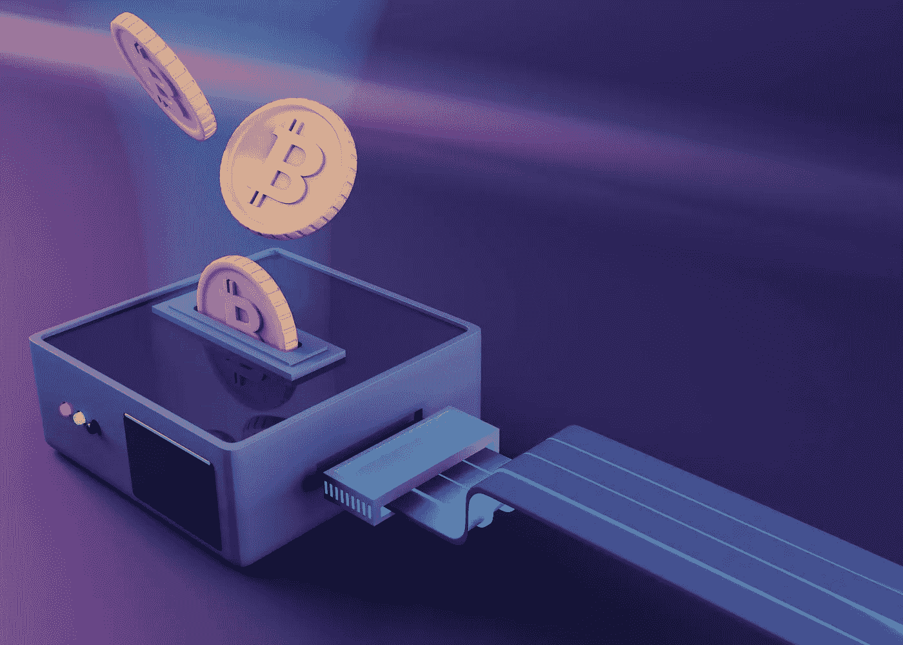
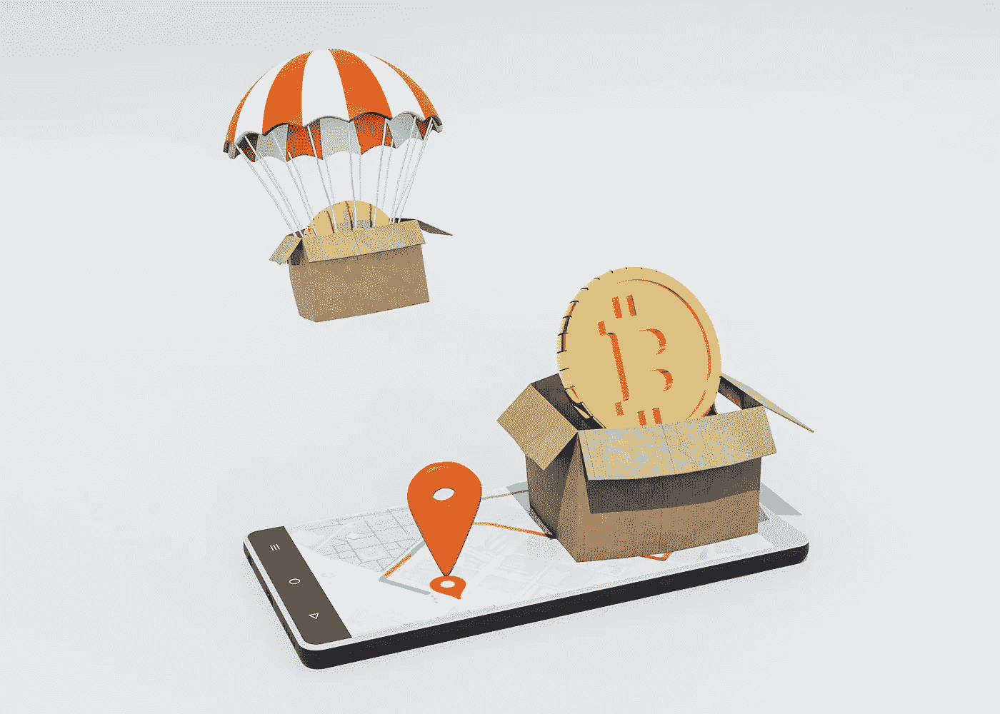

# Web3 钱包开发:加密、NFT 和区块链应用的途径

> 原文：<https://medium.com/geekculture/web3-wallet-development-a-pathway-for-crypto-nft-and-blockchain-applications-cf6465aeb4a6?source=collection_archive---------9----------------------->

## Web 3 钱包的出现让加密货币用户可以使用许多新的定义、游戏和 NFT 相关的应用。

Web3 钱包是一个智能应用程序，Web3 环境的参与者可以使用它来转移加密货币和不可替代的令牌。它们是专门设计的解决方案，可以在集中和分散的环境中访问信息。由于 Web3 在去中心化的网络上蓬勃发展，在进入 Web3 钱包开发之前，让我们先看一下 Web3 领域。

# 深入 Web3 世界

使用像去中心化、区块链技术和基于令牌的经济学这样的想法，Web3 提出了一个新版本的万维网。Web3 被认为是互联网走向未来的下一步。加密货币、NFT、Dao、分散金融和其他概念是这个未来基于区块链的网络的愿景的一部分。在读/写/拥有模式下，用户在他们参与的在线社区中拥有经济利益和更大的权力。像个人电脑和智能手机一样，网络体验有望随着 Web3 的出现而发生重大改变。但这并非没有危险。由于金融投机和与 Web3 计划相关的环境影响，一些企业进入市场只是遇到阻力。

# Web3 加密货币钱包开发的需求

我们生活在数字时代，我们的大部分日常活动都直接或间接地受到互联网的影响。Web3 是互联网的下一步，用户可以控制他们的数据并完全拥有它们。在 Web3 空间中，信息存储和传输的方式不同于 Web2 和 Web1。因此，参与 Web3 环境的用户需要不同的方法和技术。

# Web3 钱包开发

商业组织或企业家可以[开发 Web3 钱包](https://bit.ly/3uhOipc) 以两种显著的方式建立他们的企业；他们是

> 从零开始发展
> 
> 利用白标解决方案

## 定制 Web3 钱包开发:

一个 [*Web3 钱包*](https://en.wikipedia.org/wiki/Web3) 很复杂，需要很多功能才能在环境中安全运行。从头开始开发一个 Web3 钱包需要大量的时间和精力。开发商需要有一个团队在区块链技术熟练，应该能够开发一个完整的钱包。

# **利用白标加密货币钱包开发解决方案:**

白标解决方案是现成的钱包程序，企业家可以快速部署，在 Web3 世界中开始他们的业务。它们价格实惠，是小型企业的最佳选择。组织通过复制集成到现有智能钱包中的功能来开发这些功能。

将重要功能集成到 Web3 钱包开发解决方案中

## ★ **支付选项**

用户易于使用的安全支付机制应该被整合到 Web3 钱包开发解决方案中。为方便使用，钱包中应包含多种支付方式。

## ★ **简单的用户界面**

Web3 钱包需要简单易用，以便新用户可以在市场上进行交易。世界各地的用户应该能够简单地访问加密钱包，以便买卖数字资产。

## ★ **实时资产价值**

Web3 钱包开发解决方案应该自动更新加密货币汇率。带有加密市场资产图表的 Web3 钱包帮助投资者和购买者做出明智的决定。

## ★ **认证**

钱包应该与多因素认证系统集成，以安全地管理市场资产。认证系统仅允许授权人员在 Web3 环境中执行交易。

## ★ **多链条支撑**

钱包应该支持来自不同区块链网络的虚拟资产。Web3 参与者参与 Web3 领域的交易应该是安全可靠的。

## ★ **交易历史**

钱包应该存储用户曾经进行的每一次点对点(P2P)交易的所有信息。有了这个功能，参与者应该能够监控他们的所有支出。

## ★ **自动注销**

如果长时间不检查，钱包会自动注销。这阻止了欺诈交易在钱包中发生。通过再次输入密码，用户可以登录。

## ★ **资产备份**

Web3 钱包开发人员开发的数字钱包应采用备份协议，以消除恶意软件、病毒、损坏的设备、黑客、网络钓鱼攻击和其他形式的网络犯罪的影响。用户可以使用备份选项在任何情况下检索数据。

## ★ **通知**

Web3 加密钱包开发团队应该将推送通知集成到钱包中，这样用户就可以随时了解他们在市场中的资产状态，并获得最新消息。

选择 Web3 钱包开发公司之前需要考虑的因素

## ★ **专家开发团队**

开发人员必须了解 Web3、区块链技术和智能钱包。该公司应该有一个有能力的 Web3 钱包创造团队。

## ★ **关于最新技术的最新消息**

开发公司应该了解 Web3 和区块链行业的最新进展，并且应该精通它们。它应该利用更好的算法和安全措施。它的团队应该有足够的能力成功部署 Web3 钱包。

## ★ **可定制服务**

开发者应该允许企业家根据他们的商业需求进行必要的改变。他们的 web3 钱包开发解决方案应该是可定制的。

## ★ **全天候技术支持**

在 Web3 领域，开发公司的团队需要是值得信赖和直率的。公司的专家应该反应迅速，随时提供技术支持。

# **外卖**

Web3 的 [*世界里的每一笔交易都需要智能钱包。Web3 参与者可以存储、发送、接收和交易各种数字货币、资产、信息和数据。然而，你应该意识到，与顶级的 Web3 钱包开发公司合作可以保证你钱包的安全，并提供定制的解决方案来满足你所有的 Web3 业务需求。为了防止任何长期问题，请确保您选择的钱包开发公司在整个开发过程中保持透明。*](https://en.wikipedia.org/wiki/Web3#:~:text=The%20term%20%22Web3%22%20was%20coined%20by%20Polkadot%20founder%20and%20Ethereum,online%20ecosystem%20based%20on%20blockchain.%22)