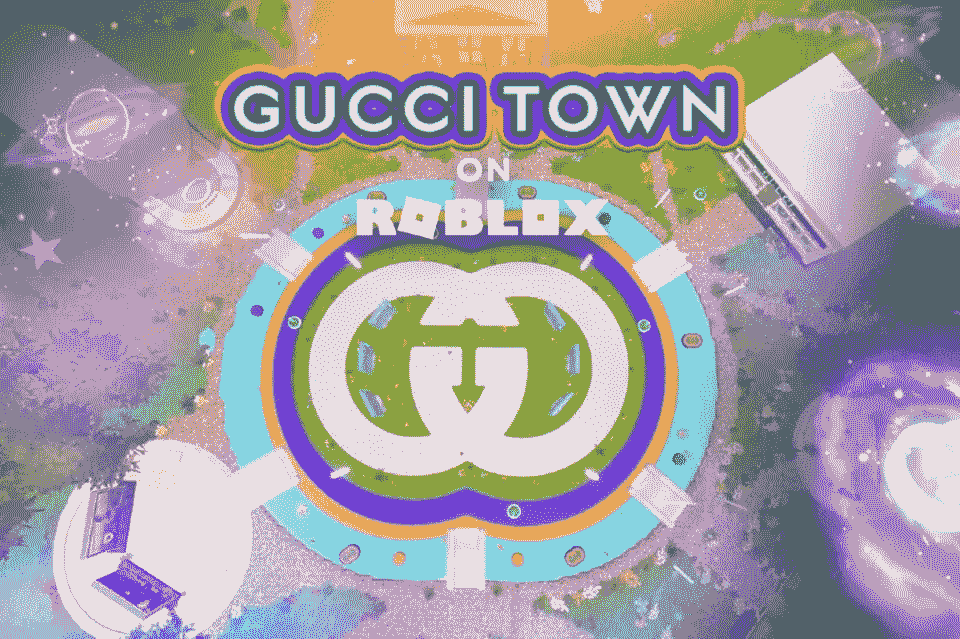
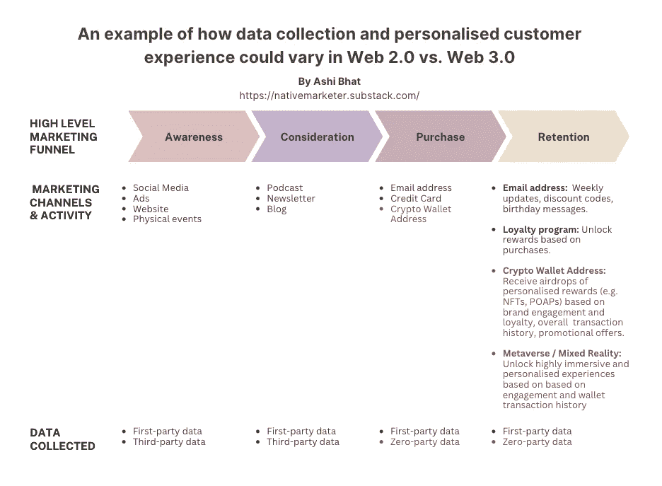

# 网络 3:这对品牌意味着什么？

> 原文：<https://medium.com/geekculture/web3-what-does-it-mean-for-brands-e4cdd6863c1e?source=collection_archive---------1----------------------->

Web3 技术的早期采用者将有一个独特的机会窗口来了解用例并在竞争中领先。 *这里是 Web 3.0 营销的指南，它对品牌意味着什么，以及入门的注意事项。*

Gucci on Roblox

对 Web3、NFTs 和元宇宙的兴趣在 2022 年飙升，像 [Meta 这样的品牌承诺投入 100 亿美元开发自己的元宇宙](https://www.forbes.com/sites/abrambrown/2021/10/25/facebook-expects-metaverse-project-will-cost-at-least-10-billion-in-2021-alone/?sh=1a61ea1325b4)，而[尽管市场低迷，今年仍有超过 230 亿美元的风险投资资金投入 web 3](https://technode.com/2022/10/08/beyond-expo-is-investment-in-web3-a-hype-or-science/)。这些信号表明，除了标题炒作之外，还有更多去中心化的技术，如 Web3。这篇文章概述了 Web3 对品牌的意义，包括好处、挑战和开始时的考虑。关于 Web3 的上下文，可以参考这篇[文章](https://nativemarketer.substack.com/p/how-to-market-an-nft-project-69415c34c52b)。

# **现在的互联网版本(即 Web2)有什么问题？**

凯文·凯利是一位数字幻想家，也是《1000 个真正的粉丝》的作者，他对互联网有一个愿景。他的愿景是，互联网将成为最终的媒人，任何品牌或创作者都可以在那里找到他们的 1000 名真正的粉丝，并获得足够的收入来维持自己的生活。

然而在 2007 年，这个互联网走了弯路。像脸书这样的集中平台成为创作者和粉丝联系的主要方式。他们嵌入了付费播放模式，以控制创作者的可见性，同时为自己保留大部分收入。

对于品牌和创造者来说，当前版本的互联网面临的一些主要挑战是:

*   客户获取成本上升，品牌[在过去 5 年中增长了 60%](https://finance.yahoo.com/news/brands-losing-record-29-customer-133000666.html?guccounter=1&guce_referrer=aHR0cHM6Ly93d3cuZ29vZ2xlLmNvbS8&guce_referrer_sig=AQAAAEuZhkkcZigoozz53ZlB13fERCUoRFFNx3QclK1cjBDytCspNBAR4HDPhmSN5dci5jTAic4y-OotiIm7_wP8lQWJj9No0TLfbiDw-wcfqafiyoHrrE_KgrWWTzkh8h3g4OqRJxR786I5ZNlx7Gq30ukyvhTjYyPNaKt6z7GblY16#:~:text=Customer%20acquisition%20costs%20have%20increased,The%20introduction%20of%20iOS%2014.5.)。
*   随着谷歌、苹果和 Meta 的新隐私更新，竞争激烈的格局使得品牌更难收集数据和提供个性化体验。
*   高度提取平台上的不可移植虚拟社区。

相比之下，Web3 技术可以让品牌通过让他们的客户拥有一部分品牌体验来重振他们的客户体验。这将客户从被动的接受者转变为参与性的、公平驱动的合作伙伴，在一个创造性的竞技场上。

# **web 3 对品牌有什么好处？**

以下是 Web3 技术为品牌带来的 5 大好处。

1.  通过创造深层次的激励来加强忠诚度，从而更有效地吸引和留住客户。
2.  获得更好的品牌认知度
3.  构建更丰富的客户数据，提供高度个性化的体验
4.  重塑全渠道客户体验，随时随地吸引客户。
5.  吸引新兴消费群体

# *1。通过创造深层次的激励来加强忠诚度，从而更有效地吸引和留住客户。*

获得一个新客户的成本可能是留住一个现有客户的五倍。增加 5%的客户保持率可以增加 25-95%的利润([外呼引擎，2022](https://www.outboundengine.com/blog/customer-retention-marketing-vs-customer-acquisition-marketing/) )。

不可替代代币(NFT)允许顾客拥有一部分品牌体验。品牌可以利用这些 NFT 来创建高度参与的社区，动员客户围绕关键活动采取行动，并鼓励未来的产品开发。

品牌可以利用这些代币来创建高度参与的社区，围绕关键活动动员客户行动，并围绕未来的产品开发激发创新。Shopify 曾表示，随着第三方 cookies 的消亡，品牌社区成为建立信任和品牌资产、降低客户支持成本和提高客户保留率的关键。

> **“品牌社区还是测试和迭代新产品的低风险中心，也是客户数据和实时反馈的重要来源。”(Shopify 2022)。**

Lacoste 启动了其“Undw3”NFT 项目，发布了 11k+NFT，使持有者能够访问令牌门控社区，在那里他们可以在“und w3”的创意方向中发挥作用，并获得独特的产品。Lacoste 要求社区成员对实体商品的审美进行投票，并完成以增加品牌影响力为重点的游戏化挑战。然后，他们奖励高度参与的社区成员专属头衔，他们可以利用这些头衔获得额外的特权。

# Lacoste 首席品牌官凯瑟琳·斯宾德勒(Catherine Spindler)表示:“Undw3 是“一个体验、互动和共同创造的世界，我们可以将(客户)加入核心团队，并(给他们机会)拥有 Lacoste 体验的一部分，并对 Lacoste 的未来拥有发言权”。

从这次发布开始，Lacoste 建立了由[~ 60，000 全球社区成员](https://discord.com/invite/undw3)组成的受众群，带来了 100 多万美元的一级销售和 300 万美元的二级销量( [Dune Analytics，2022](https://dune.com/kingjames23/nft-project-possible-data-to-use) )。

如今，客户对与他们喜爱的品牌建立合作关系很感兴趣。品牌可以借鉴 Lacoste 的剧本，与客户建立直接关系，将被动的客户转变为积极的参与者，并增加客户的终身价值。

# *2。获得更好的品牌认知度*

花旗银行报告称，到 2030 年，元宇宙将成为一个价值 13 万亿美元的市场。这个不断增长的市场吸引了一些品牌，这些品牌希望在竞争对手加入竞争之前进行试验，利用机会，深化专业知识。

耐克成为 Web3 中最赚钱的时尚品牌之一，成为头条新闻。今年早些时候，耐克与虚拟时尚工作室 RTFKT 合作推出了他们的“Cryptokicks”系列(即 20k NFT 运动鞋)。

他们发布的一些强有力的统计数据:

*   他们通过 NFTs 创造了 1.853 亿美元的销售额
*   它们从 68，000 笔二级交易中产生了 13 亿美元的二级市场交易量。
*   他们吸引了 20 万以上的会员加入他们的[品牌社区](https://discord.com/invite/rtfkt)。

通过二级交易机会，Nike 能够降低通过约 7 万次二级交易获得额外客户的成本，并产生 13 亿美元的二级收入。

> 甲骨文公司的营销总监塞缪尔·范·德思说，耐克公司赚的钱并不是继续生产非功能性产品的主要原因。他认为，**“对整体品牌认知度、参与度、忠诚度和客户终身收入的影响可能是企业投资(Web3)的最重要原因。”**

# *3。构建更丰富的客户数据，提供高度个性化的体验*

80%的消费者更有可能从提供个性化体验的品牌那里购买产品( [Mckinsey，2020](https://www.mckinsey.com/industries/retail/our-insights/personalizing-the-customer-experience-driving-differentiation-in-retail) )，但如今品牌应对的一些最大挑战是数据跟踪困难(随着对第三方 cookies 的支持逐步取消)和实时分析，以推动客户的个性化体验( [Shopify，2022](https://enterprise.plus.shopify.com/rs/932-KRM-548/images/FOC_PDF_FA.pdf) )。

此图描述了数据收集和推动个性化客户体验在 Web2 和 Web3 之间的差异。

An example of how data collection and personalised customer experience could vary in Web2 vs. Web3\. By Ashi Bhat ([https://nativemarketer.substack.com/](https://nativemarketer.substack.com/))

除了电子邮件地址，品牌还可以获取加密钱包地址。品牌的力量来自于将这些钱包地址与客户关系管理系统(CRMs)联系起来，以推动更有针对性的广告、电子商务销售和大规模创造个性化的接触。

通过查看加密钱包地址，一个品牌可以详细了解个人的购买行为，包括他们之前花了多少钱，以及他们从哪些其他品牌购买了东西。随着越来越多的人开始在区块链上交易，用户的加密钱包将成为他们在线身份的关键和核心。

Meta 最近在 Instagram 上推出了他们的“数字收藏品”功能，因此创作者可以通过将他们的加密钱包连接到应用程序来创建和销售 NFT。Instagram 的月活跃用户超过 10 亿。通过访问用户的数字钱包地址，Meta 将能够看到用户进行的每一笔连锁交易。随着越来越多的数据在链上移动，Meta 将能够利用这些信息为用户驱动高度准确和个性化的广告和奖励。

# *4。重塑全渠道客户体验，随时随地吸引客户。*

拥有极强全渠道客户参与度的公司平均保留了 89%的客户，而全渠道客户参与度较弱的公司仅为 33%([Forbes，2018](https://www.forbes.com/sites/forbestechcouncil/2018/06/15/omnichannel-cx-how-to-overcome-technologys-artificial-divide-and-succeed-at-being-seamless/?sh=758f88803205) )。在后大流行时代，这一点变得更加真实。

在疫情期间，澳大利亚公开赛(AO)的上座率大幅下降，导致锦标赛净亏损超过 1 亿美元。

2022 年，澳大利亚网球公开赛开始了一种创新的方法，通过 Web3 重新连接全球球迷。他们推出了:

*   6k+NFT，每个都与网球场表面的一块土地相关联，这使所有者有机会拥有 AO 的一块实物，以及获得商品和限量版可穿戴设备等额外好处。
*   元宇宙网球体验(通过 3D 虚拟现实平台“分散之地”),球迷可以在世界任何地方探索 AO 区域，完成挑战并与其他球迷互动，同时还可以访问来自史蒂夫·青木和 Tigerlily 的实时虚拟表演。

> 在谈到这次推出时，AO 的元宇宙经理 Ridley Plummer 说:“AO 利用元宇宙让顾客选择他们自己的冒险。他们可以参观大满贯椭圆形办公室、练习村、新闻发布会甚至健身房(即你在现实生活中不能去的地方)”。

AO 创造了世界首创的运动体验，客户可以将自己置身于 AO 叙事中，多次体验 AO 品牌，每次都是以一种全新、独特的方式，以在物理领域不可能的方式。

在元宇宙体验中，必须仔细考虑用户的旅程。品牌需要考虑如何吸引消费者，确保他们玩得开心，并为他们创造难忘的体验，这样他们就会回来并继续致力于品牌。

# **“有了元宇宙的经验，品牌应该在那里寻求支持。品牌应该给(他们的顾客)一份礼物，而不是强迫他们接受广告。应该会很有趣”——Cathay Hackl，web3 营销策略师**

从这次发布开始，AO 从二次销售和大约 7k 品牌粉丝社区吸引了超过 550 万美元的收入，此外，2022 年全球观众人数达到 346+k，播放时间达到 7.46 亿小时，比 2021 年增长 20%。

# *5。吸引新兴消费群体*

Z 世代和阿尔法正在改变零售业的面貌。这些数字原生代习惯于跨所有格式购物。他们习惯于在每一步每一个时刻体验品牌([麦肯锡，2020](https://www.mckinsey.com/industries/consumer-packaged-goods/our-insights/meet-generation-z-shaping-the-future-of-shopping) )。因此，品牌需要满足这些消费者的需求。

像[古驰](https://blog.roblox.com/2021/05/gucci-garden-experience/)、[拉夫劳伦](https://www.roblox.com/ralphlauren)和[沃尔玛](https://www.forbes.com/sites/walterloeb/2022/10/04/walmart-enters-metaverse-with-roblox-experiences/?sh=2c97152a620f)这样的品牌都在 Roblox(一个游戏平台)这样的平台上创造了元宇宙体验，其中 67%的用户年龄在 16 岁以下，82%的用户年龄在 24 岁以下。事实上，Z 世代已经将他们可支配收入的 15%花在元宇宙，预计在未来 5 年内将攀升至 20%。

这几代人与品牌相关的关键定义特征:

1.  他们更喜欢让他们保持联系并创造贡献机会的技术和内容，而不仅仅是消费。
2.  他们影响着父母 80%的消费决策，他们希望通过与他们合作的品牌来实现改变( [Mccrindle， *2019*](https://mccrindle.com.au/article/blog/generation-alpha-and-environmental-consciousness/) )。
3.  他们重视在线社区，因为它允许不同经济环境的人围绕利益动员起来([麦肯锡，2018](https://www.mckinsey.com/industries/consumer-packaged-goods/our-insights/true-gen-generation-z-and-its-implications-for-companies) )。
4.  他们希望随时随地消费产品和服务，并获得高度个性化的全渠道体验([麦肯锡，2018](https://www.mckinsey.com/industries/consumer-packaged-goods/our-insights/true-gen-generation-z-and-its-implications-for-companies) )

这些统计数据突出表明，品牌需要为 Z 世代和 Alpha 世代提供工具，以高度协作的方式与品牌互动，并获得无缝的个性化体验。Web3 技术，如元宇宙和 NFTs，允许品牌建立社区，并以更加视觉化、沉浸式和互联的方式吸引新的受众。

# **“通过下一代顾问委员会与 Z 世代合作。如果你董事会的平均年龄超过 50 岁，而你的员工和客户的平均年龄在 20 多岁或 30 多岁，那么你真的了解驱动企业未来的钱包吗？”(福布斯，2022)**

# *那么品牌如何起步呢？*

1.  **从教育开始**

一些入门方法:

*   利用 Twitter、LinkedIn 和 Reddit 等加密中心，关键的固执己见的领导者可以在这里表达他们的前瞻性观点并分享思想领导力。
*   利用播客和时事通讯来深化你的学习。下面是几个[推荐](https://nativemarketer.substack.com/p/free-resources-for-marketers-to-upskill)。
*   检查各行业的品牌案例研究，提炼品牌的关键知识。

**2。忠于你的品牌基因**

你的品牌 DNA 是你企业身份的本质，你的 Web3 战略需要反映这一点。考虑你的目的、客户、他们看重什么，以及你如何能长期为他们增加价值。

在设计您的走向市场战略、技术堆栈和您将利用的工具时，请确保与核心品牌价值保持一致。例如，星巴克最近宣布了他们的 NFT 动力忠诚计划，[星巴克奥德赛](https://stories.starbucks.com/press/2022/starbucks-brewing-revolutionary-web3-experience-for-its-starbucks-rewards-members/)。认识到他们非常成功的奖励计划的观众没有与区块链技术产生共鸣，他们为他们的计划采用了完全托管的用户体验。

**3。确定您的上市方法**

许多品牌都为自己的业务打造了 Web3 重头戏，并采用了以下两种方式之一:

*   与一个知名的以 Web3 为中心的品牌合作推出(例如 Nike & RTFKT、AO &分散式品牌)。
*   进行独立发布(如星巴克)。

考虑到品牌，探究每种方法的利弊。

**4。从尝试你的部分业务开始。为实验定义清晰的指标。**

将你的 Web3 策略作为测试和建立能力的机会。概述成功的关键指标，以了解技术的局限性、客户偏好和行为。发布后，在您扩展之前，进行实施后审查以概述关键经验。

**5。采取长期的心态**

Web3 技术的早期采用者将有独特的机会了解客户行为和对话，以支持未来的商业模式和产品开发。

品牌需要考虑如何为他们的社区带来价值，吸引顾客，创造创新体验，培养他们的忠诚度。他们还需要变得动态和敏捷，以跟上这项技术。

Web3 技术是新生事物，在安全性、监管和用户体验方面还有很长的路要走。尽管如此，各大品牌都在加倍开发 Web3 技术，并加速其渗透到我们的日常生活中。随着今天与 1995 年的今天的互联网并行，品牌有一个难得的机会采取行动，学习和提问，而没有错过的巨大风险。

那么 Web3 是未来吗？你的结论是什么？

**有用链接:**

*   [NFT 和 Web3 营销指南](https://nativemarketer.substack.com/p/how-to-market-an-nft-project-69415c34c52b)
*   [免费的 Web3 资源启动您的入职之旅](https://nativemarketer.substack.com/p/free-resources-for-marketers-to-upskill)

# 关于我:

我是 Ash，一名资深营销人员，也是 Insider 的创始人，这是一个由区块链支持的新一代忠诚度解决方案。点击了解更多内幕[。](https://www.insiderapp.xyz/)

我热衷于强调可能推动规模和采用的用例，重点是品牌和营销将发挥的作用。**你可以订阅我的时事通讯来了解最新消息:**[https://nativemarketer.substack.com/](https://nativemarketer.substack.com/)