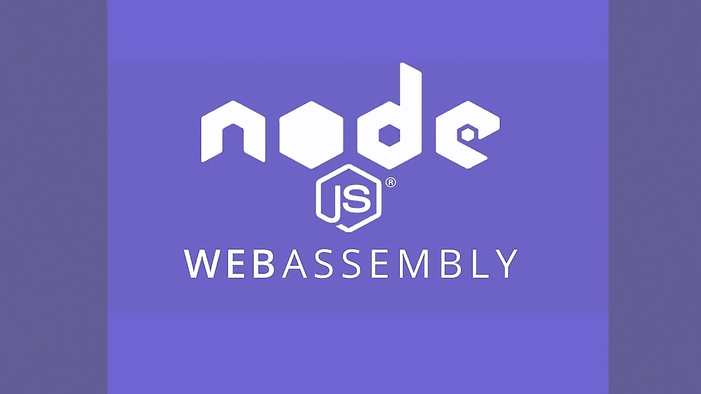
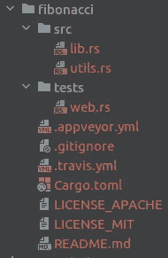
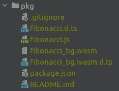
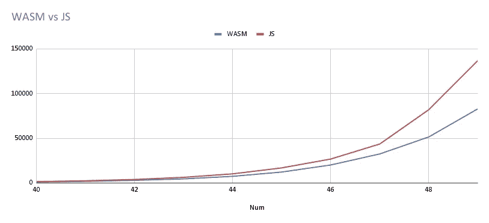

# Node.js 的 WebAssembly

> 原文：<https://medium.com/geekculture/webassembly-for-node-js-13ef6bec0a0?source=collection_archive---------10----------------------->

每个人都在谈论 WebAssembly 以及它将如何改变网络。但是 Node.js 呢？WebAssembly 对后端有用吗？我们来想办法吧！



Node.js 运行在 V8 之上，Google Chrome 使用了相同的 JavaScript 引擎。谷歌 Chrome 从第 57 版开始就支持 WebAssembly。这意味着可以在 Node.js 中运行 WebAssembly

我们今天的计划是:

1.  写一些简单的函数。例如斐波那契数列的计算。
2.  将其编译为 web 程序集
3.  将其导入 Node.js
4.  将结果与纯 JavaScript 代码进行比较

# 为 WebAssembly 选择编程语言

首先我们需要选择一种支持 WebAssembly 的编程语言。你可以在这里找到完整的名单和注释:[https://github.com/appcypher/awesome-wasm-langs](https://github.com/appcypher/awesome-wasm-langs)。我的第一次尝试是 Golang，将 Go 代码编译成 WebAssembly 非常简单:

```
$ GOOS=js GOARCH=wasm go build -o main.wasm
```

但是有一个问题，将函数从 Go WebAssembly 导入到 JavaScript 的唯一选项是用以下代码将其设置为*全局*对象:

```
js.Global().Set("myFunc", fn)
```

可以用，但是很不方便。这就是为什么我决定检查其他选项，发现生锈。根据[文档](https://rustwasm.github.io/docs/wasm-bindgen/reference/deployment.html)可以编译成 Node.js 模块，听起来很有希望。我对生锈一点经验都没有，但是凡事都有第一次。

# 入门指南

1.  用[https://rustup.rs/](https://rustup.rs/)安装防锈和货物(包装管理器)
2.  用[https://rustwasm.github.io/wasm-pack/installer/](https://rustwasm.github.io/wasm-pack/installer/)安装 Wasm-Pack 编译 Rust 代码到 WebAssembly
3.  使用以下内容从样板文件生成新项目:

```
wasm-pack new fibonacci
```

Wasm-Packs 生成一个 Rust 项目，其结构如下:



4.构建方式:

```
cd ./fibonacci && wasm-pack build --target nodejs
```

默认情况下，编译结果将放在 pkg 目录中:



*   `fibonacci_bg.wasm` 是这里主要的东西，它是一个编译好的 WebAssembly 二进制文件。
*   `fibonacci.js` 是一个 JavaScript 包装器。加载 *fibonacci_bg.wasm，*用 JavaScript 函数包装对 WebAssembly 的调用，并通过`module.exports`导出
*   `fibonacci.d.ts`是一个 TypeScript 类型定义文件。

`pkg`目录可以发布到 NPM，也可以用`require`或`import`在本地导入 Node.js 代码

# 写代码

Wasm-Pack 生成以下代码:

使用`#[wasm_bindgen]`我们可以将函数导入和导出到 JavaScript。在这个例子中，`alert`函数是从 JavaScript 导入的，而`greet`函数是导出到 JavaScript 的。我们不需要`alert`，把它去掉吧。让我们用`fibonacci`函数替换`greet`函数:

你可以看到，我没有添加任何优化，并使它非常简单。再次编译并在 Node.js 脚本中测试它:

它将`55`写入控制台。哇，成功了！

# **性能对比**

让我们用 JavaScript 写同样的代码:

并为性能测量编写一个简单的脚本:

它计算从 0 到 50 的斐波那契数，并记录 WebAssembly 和 JavaScript 函数的执行时间。结果如下:

和从 40:



对于低数字没有显著差异，但是对于 30+数字，WebAssembly 函数比 JavaScript 函数快 25%以上。

# 结论

如你所见，WebAssembly 可以很容易地在 Node.js 中使用，而且性能更好。WebAssembly 是一项年轻的技术，很多员工都处于试验阶段，比如 WASI 的[用于访问系统功能，但它仍然有很大的潜力。我认为在不久的将来，WebAssembly 将是编写高性能本机模块的一个不错的选择。](https://nodejs.org/api/wasi.html)

*今天就到这里吧！下次见！Servus！*