# 使用 nodemailer 和 Firebase 云函数的 Webflow 表单处理

> 原文：<https://medium.com/geekculture/webflow-form-processing-using-nodemailer-firebase-cloud-functions-da41672371b8?source=collection_archive---------24----------------------->

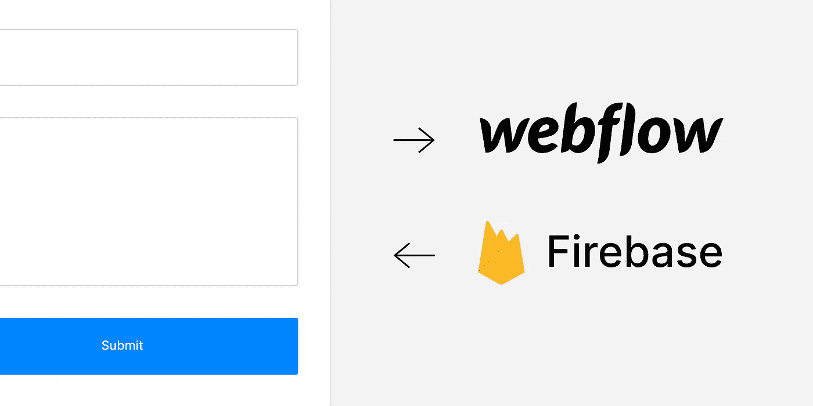

Webflow 太神奇了。真的是。

构建自己的表单也不例外。他们使得在你的网站中设计、构建和使用任何形式都变得非常容易。

那么，如果这么简单，为什么还要费神去阅读这个指南并创建自己的第三方表单处理器呢？

在一些情况下，Webflow 并不是最佳解决方案。

最常见的一个问题发生在想要导出代码并将其托管在 Webflow 本身以外的其他平台上时。

通过导出代码，您可以访问所有的静态前端代码，但是所有花哨、复杂和乏味的后端代码都不见了。这包括任何形式使用的任何可能性。

为了解决这个问题，Webflow 用户通常使用其他非代码工具来处理表单数据。您会发现一些值得推荐的方法:

*   [Formspree.io](https://formspree.io/) (起价 8 美元/月)
*   【Formden.com (9 美元/月起)
*   Jotform.com[(最多 100 份免费，然后每月 24 美元)](https://www.jotform.com/)

现在，我还没有尝试过这些，但我相信他们都很棒。我只是觉得对于这样一个基本工具来说，价格太高了。

这就是为什么你应该继续阅读。

本指南将向您展示如何编写您自己的表单数据处理器，它将在 99.9%的用例中保持免费(除非您每月处理数万个表单请求)。

所以让我们开始吧。

## 设置

为了跟进，您需要以下内容:

*   代码编辑器。我爱我的小 VSCode。
*   Webflow 帐户
*   煽动性的报道
*   安装在计算机上的 Node.js
*   outlook / hotmail 或 Gmail 帐户。(在本指南中，我将使用 hotmail 帐户)

让我们开始创建一个新的 Firebase 项目。

## 一个新的消防基地项目

我称我的项目为“webflow-node-mail”。建立一个新的 Firebase 项目非常简单。

万一你卡住了，你可以通过编码来使用本指南。

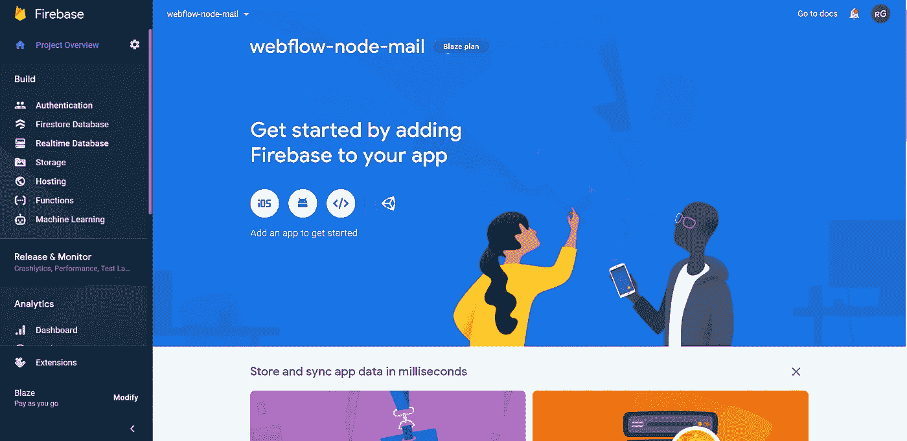

我们想利用 Firebase 的“云功能”特性。

这些基本上是运行在云中的 Javascript(节点)函数，每当请求到达其端点时，就会按需调用。

这听起来可能很复杂也很吓人，但是相信我，过一会儿你就会明白了。

为了在 Firebase 项目中使用云功能，您不得不将项目升级为“Blaze 计划”，

这是通过将信用卡/借记卡连接到您的帐户，并选择“火焰计划”选项来完成的。

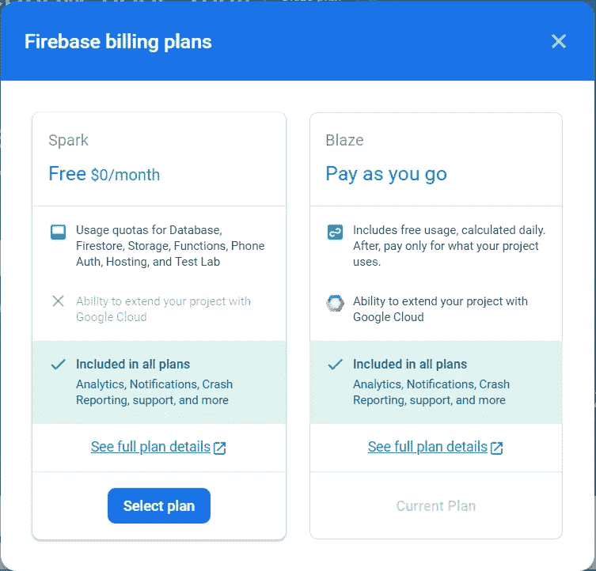

不过不要担心，除非你每月处理成千上万的表单请求，否则你可能一分钱都不用付。

点击此处，您可以了解更多关于 Firebase 定价计划的信息。(每月多达 200 万次免费函数调用等。).

## Firebase CLI

好了，让我们设置 Firebase CLI，以便能够在您的计算机上本地创建 Firebase 项目。

打开一个终端(例如在 VSCode 内部),使用下面的命令从 NPM 直接安装它:

```
npm install -g firebase-tools
```

这将在您的计算机上全局安装 CLI，使您能够在计算机的任何位置创建新的 Firebase 项目。太神奇了。

现在使用以下命令登录 Firebase:

```
firebase login
```

会弹出一个浏览器，你就可以用你的谷歌账户登录了。酷毙了。

## 火基云函数

现在为您的代码创建一个文件夹，并通过终端导航到该文件夹。我们只是为函数的使用进行初始化，因为我们不需要这个项目的任何其他 Firebase 特性。

```
firebase init functions
```

选择“使用现有项目”以便将 Firebase 项目与本地计算机同步。

您可能会在终端中看到一些弹出的选项。例如，您可以选择使用 Javascript 或 Typescript，使用 Eslint for 林挺等。选择你觉得舒服的东西。

完成后，您应该会看到在本地项目文件夹中创建了一些文件和文件夹。

它应该是这样的:

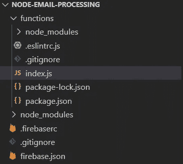

图像中突出显示的 index.js 文件是您将在该项目的其余部分使用的文件。在文本编辑器中打开它。

Firebase 为您提供了一些样板代码，如下所示:

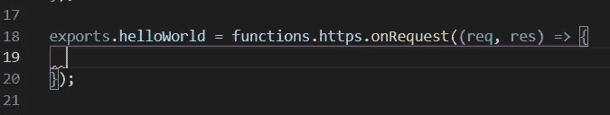

大部分代码将在这个“导出”中编写，每当请求到达其端点时，就会被调用。

所以我们开始编码吧。

## 节点邮件程序

Nodemailer 是 Node.js 的一个包，可以让你通过自己的电子邮件帐户发送电子邮件。这是相当简单的工作，并似乎非常适合这样的事情。

在终端中使用以下命令，在“functions”文件夹中安装 nodemailer:

```
npm install nodemailer
```

## 云函数

为了让 Nodemailer 发送电子邮件，我们需要执行以下操作:

*   创建一个包含我们的电子邮件身份验证的“transporter”对象
*   接受来自我们的 Webflow 表单的数据
*   暂时存储我们的数据
*   通过我们的传送器把数据发送到我们的邮箱

首先，使用下面的代码在 index.js 文件中导入 nodemailer 包:

```
const nodemailer = require("nodemailer");
```

现在创建传送器。它应该包含以下属性:

*   您想使用的服务(在我的例子中是 hotmail)
*   您的用户名和密码
*   某种 node.js TLSSocket 选项(tbh 我并不完全了解这个选项的用途，但是如果它有效的话，它就有效)。

因此，让我们创建一个新的对象，如下所示:

```
const transporter = nodemailer.createTransport({ service: "hotmail", auth: { user: "youremail@hotmail.se", pass: "yourpassword", }, tls: { rejectUnauthorized: false, },});
```

现在让我们继续我们的选项对象。如前所述，我们希望用通过表单发送的数据填充它。

```
const subject = req.body.subject;
const name = req.body.name;
const message = req.body.message;const options = { from: "youremail@hotmail.se", to: "youremail@hotmail.se", subject: subject, html: `<b>Message sent from ${name}</b><br><br>${message}`,};
```

如您所见，我使用了 request (short: req)变量来访问发送到端点的任何数据。

这些名称基于您在 Webflow 中对表单输入的命名，因此请确保您记住了它们。我的如下:

*   名称(req.body.name)
*   主题(请求主体主题)
*   消息(req.body.message)

根据表单的大小，您可以拥有任意多或任意少的数据属性。

在您的“选项对象”中，您应该指定电子邮件地址从哪个帐户发送，以及它应该发送到哪个地址。

您需要使用上面验证的电子邮件作为您的“发件人”电子邮件，但是数据可以发送到一个或多个不同的地址。

如果您想将它发送给多个地址，您可以创建一个地址数组，如下所示:

```
to: ["youremail@hotmail.se", "anotheremail@hotmail.com"]
```

你也可以使用 html 来设计你的邮件，就像我在 options 对象中使用“HTML”属性一样。

我只是简单地为名称使用了粗体文本样式，并为消息使用了几个换行符。

```
html: `<b>Message sent from ${name}</b><br><br>${message}`
```

好了，现在我们可以访问函数中的数据了。让我们把它进一步发送到我们的电子邮件地址。

我们需要在 transporter 对象中使用一个名为“sendMail”的方法。我们能够指定我们希望在成功和错误时发生什么。

我在 Webflow 项目中创建了两个页面，分别名为“成功”和“错误”(与使用原生表单类似)，并根据成功或错误简单地将用户重定向到其中一个页面。

```
transporter.sendMail(options, function(err) { // Error if (err) { return res.redirect("https://node-mailer-  form.webflow.io/error"); } // Success return res.redirect("https://node-mailer-form.webflow.io/success");});
```

这就是我们的功能。检查，复制和/或修改下面的完整代码。

密码

现在我们需要部署该功能。我们通过在终端中使用以下命令来实现这一点:

```
firebase deploy
```

就这么简单。太神奇了。

部署可能需要一点时间，但应该会在一两分钟内完成。完成后，您应该会看到类似这样的内容:

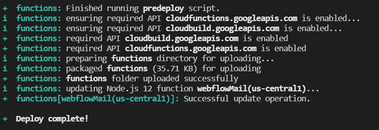

现在让我们转到 Webflow 并创建我们的表单。

以下是我的函数的完整代码:

## Webflow 表单

我的表单非常简单，但是在这个例子中效果很好。

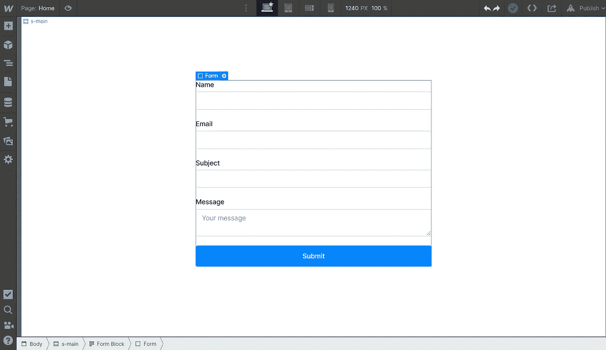

现在，正确命名输入极其重要。如前所述，我们的 nodemailer 函数中使用了输入的名称。

以下是我的电子邮件输入设置示例:

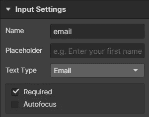

所有输入字段的名称属性应该与我们的云函数中使用的名称相关联。

现在我们需要为表单指定一个动作端点。进入你的 [Firebase 控制台](https://console.firebase.google.com/u/0/)，进入你的项目并导航到“功能”。

在这里，您应该可以找到您部署的函数。

只需复制并粘贴您功能的 URL，并将其作为您的“操作 URL”粘贴到 Webflow 的表单设置中。

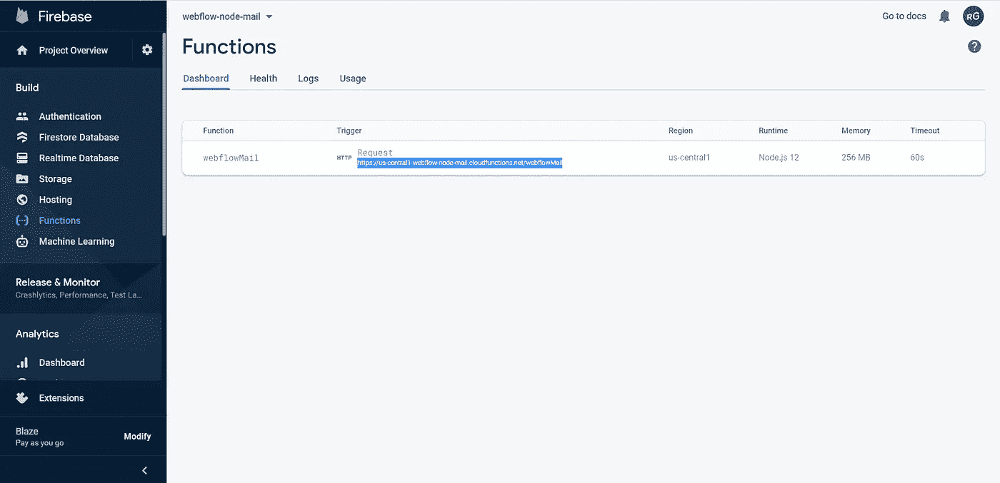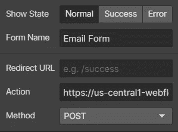

最后一部分是将你的表单方法从 GET 改为 POST。太神奇了。

现在我们可以测试我们的形式。发布您的 Webflow 站点并发送提交内容。

如果一切正常，您应该被重定向到您在函数中指定的任何 url，并且您的收件箱应该看起来像这样:

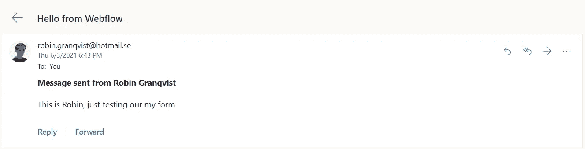

女士们先生们，这就是全部。

你现在已经创建了你自己的、可修改的、免费的、非常漂亮的小云函数，它能够为你处理任何表单数据。

如果你有任何问题，请随时留下评论，我会尽量回复。

玩得开心，

知更鸟🤙