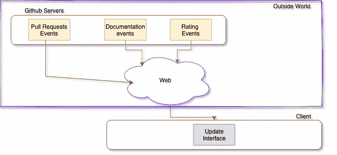
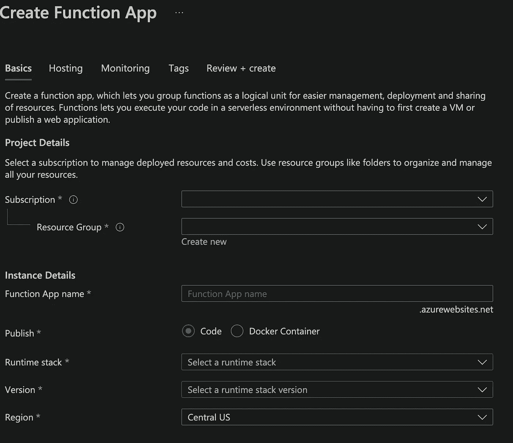
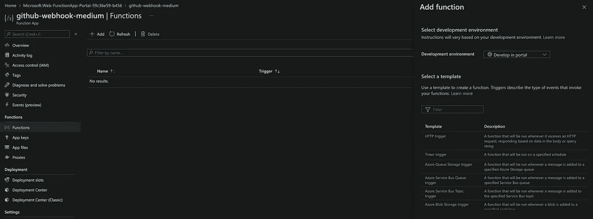
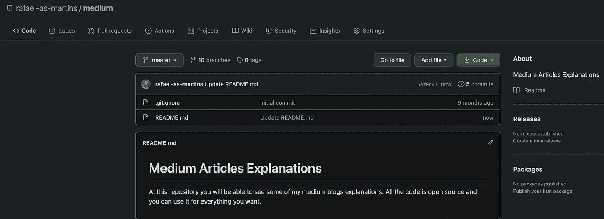
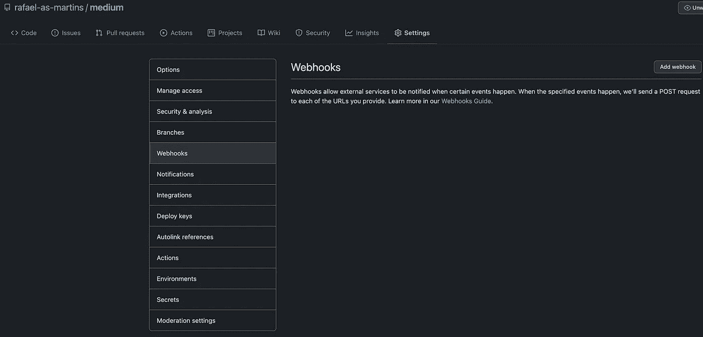
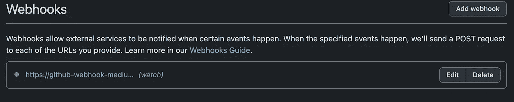
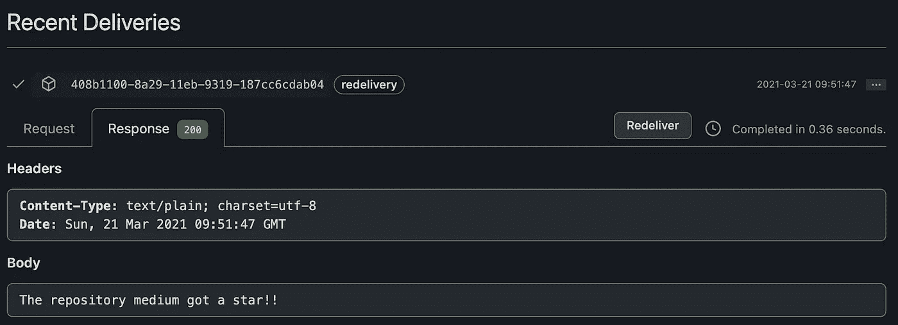

# Webhooks:从零到英雄

> 原文：<https://medium.com/geekculture/webhooks-from-zero-to-hero-7ab6d81babce?source=collection_archive---------7----------------------->

Photo by [Esteban Lopez](https://unsplash.com/@exxteban?utm_source=medium&utm_medium=referral) on [Unsplash](https://unsplash.com?utm_source=medium&utm_medium=referral)

Y 你在一家餐馆里等待外卖，点餐屏幕损坏了。你被要求坐下。在此过程中，您开始与朋友进行 Facetime 对话。

你能做的最简单也是最聪明的事情就是等到你的名字被叫到，同时，跟上对话。然而，想象第二个用例，你是一个不耐烦的人，每隔五分钟，你就问它是否准备好了。

最后，我们都知道第二种方法不太有意义，因为要求更多的更新不会使过程更快。并且很可能会让你忘记谈话的内容。

当你不知道答案什么时候到达的时候，同样的问题发生在许多商业应用中。为了解决这个问题，这类应用程序会不停地询问，尽管大多数时候不会有什么不同。

Webhooks 解决方案就是为了解决这样的问题。这样的架构决策可能会对您的项目产生重大的优化影响。

## ***指数:***

*   什么是网钩？
*   webhooks 的交互是如何编排的？
*   让我们创建一个实际的例子！
*   让我们证明它是有效的！
*   结论；

# #什么是网钩？

Photo by [Markus Winkler](https://unsplash.com/@markuswinkler?utm_source=medium&utm_medium=referral) on [Unsplash](https://unsplash.com?utm_source=medium&utm_medium=referral)

让我们先来分析一下[维基百科](https://en.wikipedia.org/wiki/Webhook)对此是怎么说的:

> web 开发中的 webhook 是一种使用自定义回调来增加或改变网页或 web 应用程序行为的方法。这些回调可以由第三方用户和开发者来维护、修改和管理，这些第三方用户和开发者不一定隶属于原始网站或应用。

有点太抽象了？让我们把它具体化。

webhook 是一种机制，其中我们使用一个[***HTTP POST***](https://developer.mozilla.org/en-US/docs/Web/HTTP/Methods/POST)操作来通知特定的客户端。每当指定的 ***事件*** 发生时，通过定义应该调用哪个 *HTTP* 端点来指定客户端。

你可能会奇怪，为什么 ***贴*** ？答案是这种方法将允许服务器在请求体(JSON/XML)中发送任何数据。

通过 ***事件*** ，我们可以了解一些用例，例如:

*   从聊天中接收信息(例如电报)；
*   喜欢的照片(例如 Instagram)
*   金融股票价格(例如任何经纪人)
*   每次创建一个拉请求时都收到一封电子邮件(例如 GitHub)

我们正在讨论一种有效的方式来询问服务器是否发生了任何变化。

聊天室似乎是一个很好的例子。不考虑 webhooks，我们应该使用哪个间隔来检查新消息？20 秒？五分钟？1 小时？

看情况。有些人可能会像我一样花 10 个小时来回复一条简单的信息，或者他们也可能只花 10 秒钟。假设我们平均每 10 分钟检查一次新邮件。总的来说，我们一天要处理超过 144 个请求，一个月大约 4320 个。而且别忘了，不同的人有不同的答题时机。

一个 webhook 实现可以将这 4320 个请求减少到零左右。服务器会通知你。

# # web hooks 的交互是如何协调的？

Photo by [israel palacio](https://unsplash.com/@othentikisra?utm_source=medium&utm_medium=referral) on [Unsplash](https://unsplash.com?utm_source=medium&utm_medium=referral)

通常，您会有大量的事件。这些事件将触发应用程序 X 和您的应用程序之间的通知过程。

我们可以以 GitHub 用例为例。GitHub 允许你不用做太多工作就能定义 webhooks。

像这样的网钩:

*   分支或标签删除；
*   代码扫描警报；
*   提交评论；
*   创建、更新或删除的项目。
*   能见度变化；
*   和许多其他人；

GitHub webhook simplified workflow

最后，我们只需要在服务器上创建一个 webhook，指定应该到达哪个端点，以及您希望哪个事件触发这样的机制。

# ***#*** 让我们创造一个实际的例子！

Photo by [Daniel McCullough](https://unsplash.com/@d_mccullough?utm_source=medium&utm_medium=referral) on [Unsplash](https://unsplash.com?utm_source=medium&utm_medium=referral)

为了举例说明上面解释的概念，我们将使用 GitHub webhooks。

为了避免设置应用程序环境的大量工作，让我们使用一个[无服务器](https://martinfowler.com/articles/serverless.html)解决方案，即 [***Azure 函数***](https://azure.microsoft.com/en-us/services/functions/?&ef_id=Cj0KCQjwutaCBhDfARIsAJHWnHtWCzfmjP6Ybb8xKVMG2UYQV8Lr182MjE4clzF5ESmSjs5bp2m9mYUaAq38EALw_wcB:G:s&OCID=AID2100101_SEM_Cj0KCQjwutaCBhDfARIsAJHWnHtWCzfmjP6Ybb8xKVMG2UYQV8Lr182MjE4clzF5ESmSjs5bp2m9mYUaAq38EALw_wcB:G:s) 。

如果你是第一次听到这样的技术，我首先建议你看看下面这篇文章:

 [## Azure 函数到底是什么？

### 您可能已经注意到，云是当今对话中一个热门且反复出现的话题。

medium.comI](/geekculture/what-a-heck-is-an-azure-function-e3ddd39c81cf) 

1.  确保你在[***GitHub***](https://github.com/)和[***Azure***](https://portal.azure.com/)上有账号。

> 注:如果你没有订阅，你可以很容易地使用 Azure 免费层。

2.在 Azure 门户上，点击 ***'+创建资源*** '，然后点击 ***'功能 App’****。* 你应该能看到如下页面:

Function App creation

3.在' ***'运行时栈'，*** 上选择' ***节点'。*** 您可以根据您的位置和套餐自由填写剩余字段。填写完所有内容后，点击 ***创建*** 按钮。

4.点击***‘转到资源’。左侧菜单栏上的*** ，点击***‘功能’>‘添加’。*** 你应该能看到这样的东西:

Azure functions management page

5.选择'***' HTTP Trigger '***，给你的函数起一个名字。您可以将' ***授权级别'*** 字段作为' ***功能'。*** 点击*上的按钮。*

*6.在 ***【代码+测试】*** 上，插入以下代码:*

*7.点击***‘获取功能 URL’***，复制 URL 以备将来参考。*

*完成这些步骤后，我们的函数就创建好了，可以使用了。保存插入的代码，让我们将它传递给 GitHub 任务。*

*8.创建 GitHub 帐户后，创建一个简单的存储库，如下所示。*

**

*Medium Repository Page*

*9.点击 ***【设置】*** 选项卡，然后点击***【web hooks】。****

**

*Webhook sections*

*10.点击***‘添加 web hook’。*** 一个类似的表单页面应该会出现。*

**

*11.用以下数据填写表格:*

*   ****有效负载 URL:*** *D* 定义前面提到的 *POST* 客户端端点。*
*   ****内容-类型:*** 选择****【应用/JSON】***选项。**
*   *****秘密:*** 这是避免与客户进行不必要沟通的一种方式。通过在客户端和服务器端定义一个相同的秘密，只有双方才能相互理解。为简单起见，请将该字段留空。**
*   *****事件:*** 选择***‘让我选择个人事件’***和让我们选择***‘手表’。每当你的库获得一颗星，这样的事件就会触发 webhook。*****

**点击 ***【添加 web hook】***。**

# **#让我们证明这是可行的！**

****

**Photo by [National Cancer Institute](https://unsplash.com/@nci?utm_source=medium&utm_medium=referral) on [Unsplash](https://unsplash.com?utm_source=medium&utm_medium=referral)**

**剩下的任务是检查我们的 webhook 是否按预期工作。**

1.  **点击 ***【编辑】*** 按钮脱离已创建的 webhook。**

****

**Created webhook**

**2.在页面的最后，点击' ***'最近交付'*** 选择最近的一个并检查响应。**

****

**Recent Deliveries**

**万岁！我们的网钩开始工作了！**

# **#结论**

**希望我能帮助你更多地了解 webhooks 以及它们的重要性。**

**欢迎在评论中与社区分享您对这种架构的体验。**

**请在评论中告诉我你的想法。**

** [## 软技能以及它们如何影响你的生活

### 让我们从过去中学习，以便从现在中受益，从现在中学习，以便在未来生活得更好。

rafael-as-martins.medium.com](https://rafael-as-martins.medium.com/soft-skills-and-how-they-can-impact-your-life-c650d062add2)  [## 在《疫情时报》上，我是如何设法将我的生产率提高 400%的

### 成功的人只是那些拥有成功习惯的人——布莱恩·特兰西

rafael-as-martins.medium.com](https://rafael-as-martins.medium.com/how-i-manage-to-boost-my-productivity-by-400-in-pandemic-times-53a64e1275be)  [## 将您的 Spring Boot 与 Redis 缓存系统集成

### 你上一次需要从网站上提交或提取数据，并且花费了很长时间是什么时候？

medium.com](/swlh/integrate-your-spring-boot-with-a-redis-cache-system-ff707e61e75e)**