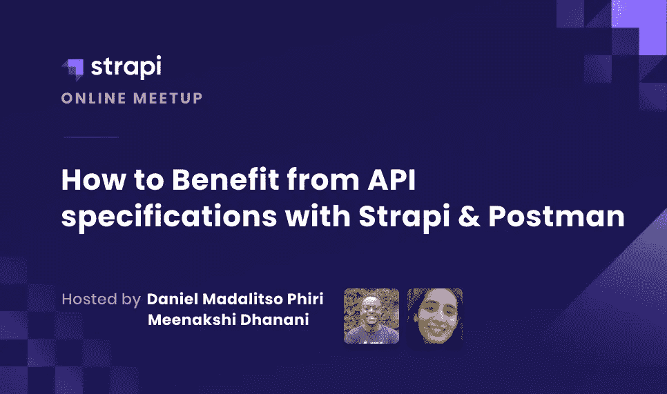

# 网上研讨会回顾:如何从 Strapi 和 Postman 的 API 规范中获益

> 原文：<https://medium.com/geekculture/webinar-recap-how-to-benefit-from-api-specifications-with-strapi-and-postman-3d9a8b7c5509?source=collection_archive---------47----------------------->

我们最近结束了第二次网上研讨会，讨论了 Postman 和 Strapi 的 API 规范带来的好处。如果您错过了网上研讨会，或者您想重温一下，请查看完整的录音和观众的一些问题！

在本次网络研讨会中，Postman 的开发者倡导者 Meenakshi Dhanani 探讨了 Strapi 内容类型、OpenAPI 规范以及能够构建模拟服务器并使用 Postman 进行测试的完整工具链。

# 从数字上看:

## 📝118 名登记者

## 👥+47 名与会者

## 🔊+108 条消息

## 💬1 个问题

# 观众的问题

对使用 GraphQL 的人有什么意见吗？1)这些概念的相关性如何；2)关于如何充分利用 Postman 的资源，有什么建议吗？

两个网站上都发布了大量资源来解释 Strapi 和 Postman 如何合作。[https://www.postman.com/strapijs](https://www.postman.com/strapijs)[https://www . postman . com/devrel/workspace/how-to-benefit-from-API-specifications-with-strapi-and-postman](https://www.postman.com/devrel/workspace/how-to-benefit-from-api-specifications-with-strapi-and-postman)

## 加入我们的[简讯](https://strapi.io/email-updates) &并关注我们的 [Twitch](https://www.twitch.tv/strapijs) 以获得更多精彩的网络研讨会！