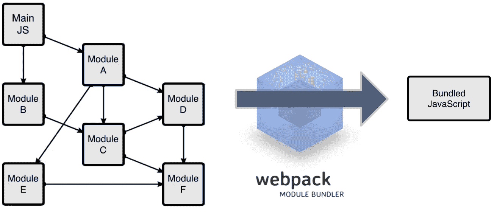
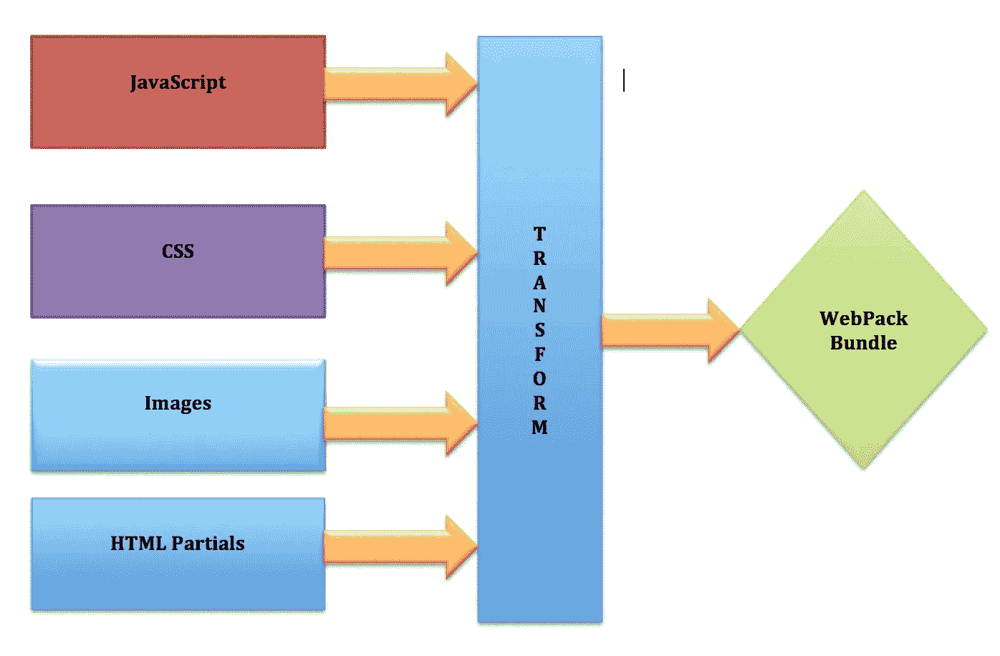

# Webpack 101:快速浏览 Webpack 及其用途

> 原文：<https://medium.com/geekculture/webpack-101-a-quick-look-at-webpack-and-its-uses-22ff598723a9?source=collection_archive---------21----------------------->



## **什么是 Webpack？**

根据官方网站，Webpack 是现代 JavaScript 应用程序的静态模块捆绑器

Webpack 只是一个捆绑所有 javascript 文件使其工作的工具。

当你用许多**非代码静态资产**如 CSS、图片、字体等构建一个复杂的前端应用时，可以使用 Webpack。
如果你的应用程序相当小，你没有很多静态资产，你只需要构建一个 Javascript 文件来服务客户端，那么 **Webpack 的开销可能比你需要的更多。**

Webpack 可以执行许多操作。例如:

> 1.将你的文件从 es6 转换成 es5
> 
> 2.转换您的。少还是。scss 文件转换为常规文件。钢性铸铁
> 
> 3.缩小文件(减小文件大小)
> 
> 4.从所有文件中删除所有注释(以减小文件大小)
> 
> 5.将所有代码放在一个。js 文件
> 
> 6.收集你所有的。css 捆绑成一个文件。

Webpack 获取具有依赖关系的模块，并生成表示这些模块的静态资源



## 基本设置

首先，让我们创建一个目录，初始化 npm，在本地安装 webpack，并安装 webpack-cli(用于在命令行上运行 webpack 的工具):

```
mkdir webpack-democd webpack-demonpm init -ynpm install webpack webpack-cli — save-dev
```

我们可以通过检查 package.json 文件来检查这些库是否已经成功安装。

```
“devDependencies”: { “webpack”: “⁵.20.2”, “webpack-cli”: “⁴.5.0”,}
```

我们将稍微调整一下我们的目录结构，将“源”代码(/src)从我们的“分发”代码(/dist)。“源代码”是我们将要编写和编辑的代码。“分发”代码是我们构建过程的最小化和优化的输出，最终将被加载到浏览器中。

安装完这些包之后，我们需要创建一个 *webpack.config.js* 文件，该文件导出一个包含 webpack 设置的对象。

```
module.exports = {}
```

## webpack 简介

要开始使用 webpack，您需要熟悉四个基本概念。(入口、输出、加载器、插件)

1.  ****第一个*** *核心概念叫做*词条。*

```
*module.exports = { 
  entry: ‘./src/index.js’
};*
```

**条目*对象是 webpack 开始构建包的地方。Webpack 以此为起点。*

**2。* ***第二个*** *核心概念叫做*输出*。**

***输出*属性告诉 webpack 在哪里发出它创建的包以及如何命名这些文件(默认情况下是这样的。/dist)。**

```
**const path = require(‘path’); module.exports = {
  entry: ‘./src/index.js’,output: {
 *path:* path.resolve(__dirname, ‘dist’),
filename: ‘./bundle.js’
},
}**
```

**在本例中，output.filename 负责文件名，output.path 负责文件所在的目录。**

***3。* ***第三个*** *核心概念是*装载机*。***

***加载器获取文件的内容，然后根据需要进行转换，并将转换结果包含在整个包中。***

```
***const path = require(‘path’); module.exports = {
  entry: ‘./src/index.js’,output: {
 *path:* path.resolve(__dirname, ‘dist’),
filename: ‘./bundle.js’
  }, module: {
    rules: [
      {
        test: /\.css$/i,
        use: [‘style-loader’, ‘css-loader’],
      },
      {
        *test:* /\.(png|svg|jpg|jpeg|gif|mp4)$/i,
 *use:* {
 *loader:* ‘file-loader’,
 *options:* {
 *name:* ‘[name].[hash].[ext]’,
 *outputPath:* ‘imgs’,
          },
        },
      },
    ],
  },
}***
```

**使用装载机有两个目的:**

**1.test 属性指定应该转换哪些文件**

**2.use 属性指定应该使用哪个加载程序来执行转换。**

> **最受欢迎的 [*装载机*](https://webpack.js.org/loaders/) 排行榜**

**4.**第四个**核心概念是“插件”。**

**如果加载器用于转换特定类型的模块，那么插件可以用于执行更广泛的任务。**

**要使用插件，你需要先安装它**

```
**npm i html-webpack-plugin -D**
```

**然后使用 *require()* 并将其添加到插件数组中**

```
**const path = require(‘path’);
*const* HtmlWebpackPlugin = require(‘html-webpack-plugin’);module.exports = {
  entry: ‘./src/index.js’, output: {
 *path:* path.resolve(__dirname, ‘dist’),
filename: ‘./bundle.js’
  }, plugins: [
    new HTMLWebpackPlugin()
  ] module: {
    rules: [
      {
        test: /\.css$/i,
        use: [‘style-loader’, ‘css-loader’],
      },
      {
        *test:* /\.(png|svg|jpg|jpeg|gif|mp4)$/i,
 *use:* {
 *loader:* ‘file-loader’,
 *options:* {
 *name:* ‘[name].[hash].[ext]’,
 *outputPath:* ‘imgs’,
          },
        },
      },
    ],
  },
}**
```

**HtmlWebpackPlugin 将在 dist 目录中创建一个新的 index.html 文件，并向其中添加一个捆绑链接。**

> **最流行的[插件列表](https://webpack.js.org/plugins/)**

## **启动网络包**

**我们有一个 package.json 文件，可以在其中创建一个脚本来运行 webpack**

**打开 package.json 文件，修改脚本对象，如下所示:**

```
**“scripts”: { “test”: “echo “Error: no test specified” && exit 1", “dev”: “webpack — mode development”, “build”: “webpack — mode production”},**
```

**现在，当您在终端中运行`npm run build`命令时，将启动一个 webpack，它将创建一个优化的 index_bundle.js 文件并将其放在 dist 中**

## **结论**

**Webpack 是一个有用且强大的工具。本文仅介绍其基本特性。但是 webpack 可以做得更多。下面是进一步探索收集器功能的资源列表:**

> **[官方 webpack 文档](https://webpack.js.org/concepts/)。**