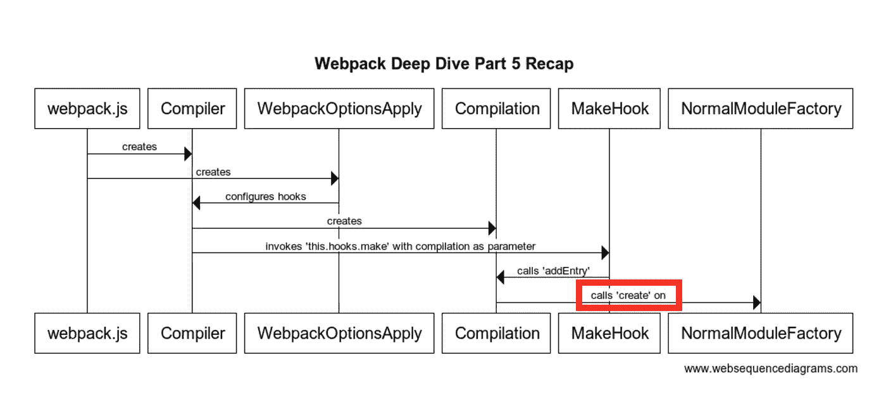

# Webpack 深入探讨第 5 部分:加载加载器

> 原文：<https://medium.com/geekculture/webpack-deep-dive-part-5-loading-loaders-76496cca83e8?source=collection_archive---------26----------------------->

# 介绍

当我开始写这个博客系列的时候，我想我最多只会花 3 个月的时间，但是如果你注意到了我的发帖模式，我已经花了很长时间了。我已经接受了自己无法持续发布博客的事实，并且接受了自己懒散的写博客方式。我必须记住，这是一种旨在享受的消遣，不应该以牺牲内容质量为代价来强迫自己(就像我的上一篇帖子一样)。为此，以较慢的速度写博客可以让我更客观地评估我自己的内容，并提供更高质量的文章，所以这是我将努力去做的。

老实说，我不记得我在上一篇文章的代码库中看到了什么，但我很幸运地阅读了我的旧帖子以跟上速度！我现在可以根据我最忠实的读者之一——我自己——的反馈重新开始写作了。预计这本书会有更多的图画和更多的技术简洁，因为这是我给自己的反馈。

# 概述

上次我们关注了 compilation.js 文件中的“addEntryItem”调用链(由 compiler.js 中的“make”挂钩启动)。“compilation.addEntryItem”最终导致调用“compilation . handlemodulecreation”方法，该方法调用名为“compilation.factorizeModule”的方法。“compilation.factorizeModule”最终将参数添加到名为“factorizeQueue”的队列中，该队列最终异步调用“_factorizeModule”。“_factorizeModule”方法实质上只是调用“Factory”上的“create ”,该“factory”驻留在其 options 参数中，对应于我们今天将检查的“NormalModuleFactory.create”方法。

**我做了一个序列图，展示了我们今天要关注的部分:**

# 语境

这部分代码要求读者知道什么是“加载器”，所以我决定在这里写下我自己的非正式解释。

## 什么是装载机？

您可能已经知道，Webpack 是一个工具，用来简化 web 上 javascript 文件的依赖管理。webpack 库通过生成将在浏览器中运行的 javascript“包”来实现这一点，该浏览器将您的网页所需的所有 javascript 文件组合在一个文件中。为了增加 webpack 的功能，该工具还可以使用任意语法从文件中生成 javascript。事实上，这是模块捆绑的部分工作方式。如果我有一个“A.js”文件，其中有一行“let libraryB = require("b.js ")”，那么 webpack 已经在编译非标准语法，因为“require”不是 ECMAScript 标准(指导 Javascript 在 web 浏览器中实现的标准)的一部分。

因为非标准的 javascript 总是被解释和转换，所以“加载器”的概念最终成为一个更抽象的概念，其目的是转换源代码文件的字符串内容。加载器的实现被定义为遵循特定接口并在 webpack 配置中正确注册的任何函数。加载器可以将带有无效 javascript 语法的源文件转换为有效文件(比如将 React 文件的内容更改为与浏览器兼容的 javascript)，可以将无效 javascript 更改为另一种形式的无效 javascript(比如将 React 文件转换为使用 Vue 语法)，甚至可以执行从有效 javascript 到另一种形式的有效 javascript 的转换(这种转换就像删除空行代码一样简单)。

# 范围

我正在分析的代码来自 webpack 的 commit da67529a2。它将包含**normalmodulefactory . create**方法(由前一篇文章末尾讨论的‘compilation . factorize module’方法产生)以及随后在 **NormalModuleFactory.js** 文件中调用的挂钩**因式分解**和**解析**。我今天讨论的代码包括 webpack 如何解析内联加载器和加载器指令，webpack 如何处理 webpack 配置中指定的加载器的检索(在较高层次上)，以及如何使用模块别名(在模块中正式称为“匹配资源”)。

为什么我们复习的方法这么少？因为“resolve”钩子有一个特别强大的函数，我不得不重构它来解释一下！

## 关于重构的一个注记

我写这些帖子的目的通常不是重构代码，而是分析 webpack 的现有源代码，以了解发生了什么。不幸的是，原始源代码让我很困惑，甚至当我开始理解发生了什么时，我也不知道如何连贯地解释发生了什么。为此，我试图将它分解成更小的逻辑组件，以帮助我自己的理解。在编程中，这很大程度上导致了函数和方法的创建——因此有了重构。既然我用我的重构代码来增强我自己的学习过程，我决定为什么不用它来增强你的呢？重构后的代码并不完美，但我相信它确实在清晰度方面有所提高。对于那些担心这会妨碍你对 webpack 源代码的原始理解的人，请放心，我将在每个重构的方法上发布 github 链接，这些链接指向原始代码库中的相应行。

在我的重构代码中，我们将检查新生成的 **resolve** 、 **getResourceData** 、 **resolveLoaders** 、 **getApplicableLoaders** 、**tryGetInlineLoaderDirectives**和 **tryGetModuleAlias** 方法。我知道这看起来很多，但请记住，这都是从附加到“resolve”挂钩的一个函数重构的，所以理论上代码量应该不会太大…

# **方法总结**

**normalmodulefactory . create**—这里没做什么，这个方法只是初始化一些数据(目前与我们无关的数据)并启动“beforeResolve”和“factorize”挂钩

**normalmodulefactory . hooks . factorize**—调用‘resolve’、‘after resolve’和‘create module’挂钩

**normalmodulefactory . hooks . resolve**—调用“resolve”方法

# 重构方法摘要

**resolve** —这个函数是从附加到 NormalModuleFactory 的“resolve”钩子(‘This . hooks . resolve’)的内联定义的 lambda 创建的，该钩子来自 NormalModuleFactory 的构造函数。它被分离到自己的函数中，以减少内联并缩短构造函数。这个钩子是从 NormalModuleFactory 的“create”调用链中调用的，所以将这个功能移到它自己的方法中会更容易引用。

本质上，该方法编排的方法调用的最终目标是识别应该在文件上运行的所有加载程序(使用“resolve”方法的“data”参数中包含的“request”来确定)。

**tryGetModuleAlias** (从“resolve”调用)— Webpack 有一个特性，允许您在 regex 测试时使用不同的文件名，以查看应该在文件上使用哪些加载程序。这是通过文件路径规范中的指令来完成的。您必须按以下格式指定替换名称“{replacement_name}}！=!{ {常规路径到文件}} '。此方法将返回模块别名数据(在“resource”属性中包含 module alias 的对象)。

**tryGetInlineLoaderDirectives**(从‘resolve’调用)-该方法查找正在处理的文件的路径前的某些字符。如果存在，它可以禁止在正在处理的文件上使用“预自动加载器”、“自动加载器”或“前置加载器”。此方法还处理指令，这些指令允许显式指定应该用于处理文件的加载程序。加载程序以下列格式指定:{{loader1}}！{{loader2}}！{{loaderN}}！{ {常规路径到文件}} '。这些指令不能在模块别名中使用，但可以在模块别名之外使用。

**getResourceData** (从“resolve”调用)-如果找到相对路径，则解析正在处理的文件的路径。在我们的例子中，入口文件是由 NormalModuleFactory 处理的文件。如果没有相对路径，并且正在处理的条目字符串包含“scheme ”,则该字符串作为 NormalModuleFactory 的“resolveForScheme”挂钩的参数被调用。

*Scheme —以冒号结尾的字符串开头的字母数字序列(也可以包括'+'和'-'s)

**resolveLoaders** (从“resolve”调用)—该方法检索所有应该应用于正在处理的文件的加载器，并将该信息放入“data.createData”(最终用于将数据传播回“NormalModuleFactory.create”)

**getapplicationbleloaders**(从“resolveLoaders”调用)—这调用了一个名为“ruleset”的方法，其中一个参数是文件路径(或模块别名)。ruleset 调用的返回值是一个对象数组，模式为:{ident: string，loader: string，options: Object}。“loader”属性保存各个加载程序文件的绝对路径。“getApplicableLoaders”方法的输出是 ruleset 数组的一个子集，该数组遵循加载程序指令(即开头有两个感叹号的模块路径中的指令)所设置的限制。

# 带注释的代码检查

试图将我的重构代码链接到原始 webpack 源代码是一个挑战。尽管如此，我还是尽力去做了。在我看来，重构是一个巨大的进步。以至于我有点想对官方代码库进行公关，但不知道我是否有时间从维护者那里获得认同，并证明使用承诺不会对性能造成太大影响。

无论如何，继续进行带注释的代码检查:

# 下次

看起来我可能因为技术简洁而错过了我的目标，但我能说什么呢，这就是生活。下一次，期待探索“NormalModuleFactory.create”调用的其余挂钩和回调。