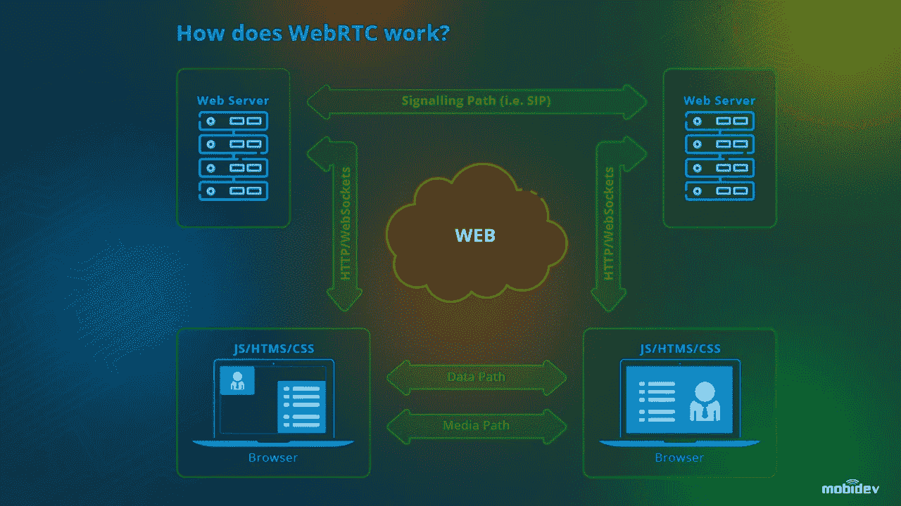
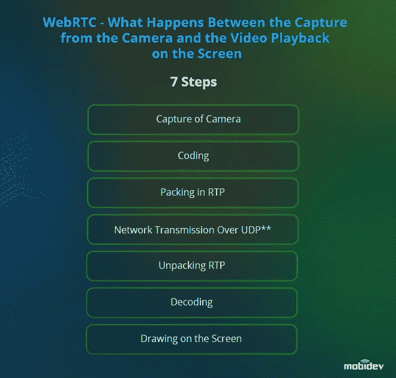

# WebRTC 应用程序开发:挑战、用例及未来

> 原文：<https://medium.com/geekculture/webrtc-app-development-challenges-use-cases-and-the-future-a6b8eee3d86b?source=collection_archive---------26----------------------->

Photo by [Ga](https://unsplash.com/@neringa?utm_source=unsplash&utm_medium=referral&utm_content=creditCopyText) on [Unsplash](https://unsplash.com/collections/39308473/virtual-or-remote-work%2Fcommunication?utm_source=unsplash&utm_medium=referral&utm_content=creditCopyText)

*由 JavaScript 领袖塞维多夫·卢恰尼诺夫在* [*MobiDev*](https://mobidev.biz/) 撰写

简单来说， **WebRTC 是一种在 web 浏览器和移动应用程序之间提供点对点通信的技术**。它被称为 Web 实时通信，指的是开源项目，允许传输音频、视频和数据。

WebRTC 开发人员提到这是一项简单而复杂的技术。**简单的本质在于易于实施**。可以使用五到十行代码来组织两个浏览器之间的对等视频通信。与此同时，当我们与技术合作时，总会有一个“但是”。

在 WebRTC 的情况下，**主要的挑战是后端**:开发者必须确保解决方案在不同的网络中工作。要找出该技术复杂性的其他原因以及如何克服它们，请阅读我们的文章，该文章还描述了 WebRTC 的未来、业务案例以及它们与应用程序开发的关系。

# 什么是 WebRTC？

WebRTC 是 Google 在 2011 年发布的一个开源项目，它在 web 浏览器和移动应用程序之间提供基于 API 的通信，包括音频、视频和数据的传输。消除了对本地插件和应用程序安装的需求，使得这些连接对用户友好，并受到所有主流浏览器和移动操作系统的支持。

在过去的几年中，WebRTC 在技术社区中的应用显著增加。脸书、亚马逊和谷歌是实现 WebRTC 以使其 web 应用程序更快、更可靠、更安全的重要技术公司之一。

WebRTC 特性也在现成的解决方案中提供，可以很容易地与其他软件集成。一个很好的例子是 OpenTok，这是一个用于实时通信的 PaaS，由我们在以前的 TokBox(现在的 Vonage)的业务伙伴提供。我们在为客户提供的许多解决方案中成功地使用了它，包括基于生物识别技术的高级认证服务。

正如在摘要中已经提到的，WebRTC 的关键特征是它是简单而复杂的技术。简单的本质在于易于实现。用五到十行代码组织两个浏览器之间的点对点视频通信就足够了。该技术的复杂性与 WebRTC 的特殊性有关，它必须适应不同的浏览器，并且如果它不能正确工作，它很难配置。此外，为了获得想要的结果，您应该了解 STUN、TURN 和 NAT。

STUN 是一组标准化的方法，包括网络协议，用于在实时语音、视频、消息和其他交互式通信的应用中穿越网络地址转换器(NAT)网关。我们为什么需要它？

当我们需要连接两个没有外部 IP 地址的浏览器时，STUN 是强制的。两者都连接到服务器并找出它们的 IP。浏览器交换这些端口，它们通过这些端口相互关联。

转弯几乎做同样的事情。它通过自身发送流量。这种流量没有被修改或改变。这种方法允许我们在 TCP(比 UDP 更可靠但更慢的协议)上工作时连接两个点。值得注意的是，约有 15%的通话没有转向就无法进行。

现在，您已经知道了 WebRTC 是什么，让我们深入历史，了解这项技术是何时、如何出现的，以及在什么情况下可以使用它。此外，我们还将概述该技术的优缺点、WebRTC 解决方案的示例以及高需求的 WebRTC 应用程序。默认情况下，这些应用程序基于点对点通信。如果我们需要组织群组通话和直播，就必须使用作为协议客户端的服务器。

# WebRTC 是如何工作的？

WebRTC 的主要焦点是在参与者之间提供实时的音频和视频通信，参与者使用 web 浏览器开始对话，相互定位，并绕过防火墙。

WebRTC 利用 JavaScript APIs 和 HTML5，嵌入在浏览器中。WebRTC 应用程序的典型特性如下:

*   发送和接收流式音频和视频。
*   检索网络配置数据，例如 IP 地址、应用程序端口、防火墙和 NAT(网络地址转换器)，使用 WebRTC API 向另一个客户端发送和接收数据时需要这些数据
*   打开/关闭连接并报告错误。
*   传输媒体数据，例如图像分辨率和视频编解码器

为了发送和接收数据流，WebRTC 提供了以下可在 web 应用程序中使用的 API:

*   用于音频和视频传输、加密和带宽配置的 RTCPeerConnection
*   用于传输通用数据的 RTCDataChannel
*   MediaStream，用于从数码相机、网络摄像头、麦克风或共享桌面等设备访问多媒体数据流

Internet 工程任务组和 Web 实时通信工作组目前正在开发一套在软件中使用 WebRTC 的标准。

# 幕后的 WebRTC

WebRTC 主要只是一种在浏览器中发送和接收 UDP 包的方法。此外，WebRTC 知道媒体(音频和视频)的传输，它可以直接连接两个客户端(点对点)。开发人员承认，在引擎盖下，WebRTC 是一个相当简单的东西:打开 UDP 端口，知道合作伙伴的 IP 端口，将流量包装在 RTP 中。

让我们来谈谈从相机的捕捉到屏幕上的视频回放之间发生了什么。这个过程包括 7 个基本步骤:

浏览器有一个 API，允许我们请求用户访问摄像头或麦克风—navigator . get user media = > media stream。主要的困难是，我们不能立即向对话者发送媒体流，因为它们未经压缩就很重。例如，一个 640×480 格式的 BMP 图像重 1.2 Mb。每秒钟这种图片的数量是 30。意味着一秒钟的视频重 36 Mb。因此，比特率将是 288 Mbps。数据必须经过压缩才能传输。所以下一步——编码——是强制性的。

**2。编码**

简单来说，编解码器允许音频和视频流的压缩。有很多这样的编解码器，其中一部分可以在 WebRTC 中获得。我们以 VP9 为例。该编解码器用于在 WebRTC 中对图像进行编码。它可以传输分辨率为 1280×720 的图像，压缩后 30 帧的重量为 1.5 Mbps。VP9 如何做到这一点？

VP9 不是不断地发送关于图像的信息，而是区分两个图像。我们在输出端得到主机，而其他帧间表示与主机的差异。帧中更多的动作意味着更多的图像权重。

在基础阶段，确定具有关于所有像素的信息的关键帧，并且帧间表示与先前状态相比的差异。如果我们在帧间链中至少丢失了一次，我们就不能绘制其他帧间。

数据被打包在 RTP(实时传输协议)中，其中包含有关数据包顺序的信息。这是一个强制性的步骤，因为包可能会以不同的顺序出现，甚至可能会丢失。我们需要包的数量来按照正确的顺序复制它们。此外，RTP 存储允许音频和视频轨道同步的时间信息。RTP 的附加细节有大约 5%的小开销。

有一个名为 RTCP 的主要协议的扩展。它用于交换丢失包裹的信息和包裹接收的统计数据。

**4。UDP 上的网络传输**

数据作为一个成形的 UDP 包发送。如果我们比较 UDP 和 TCP，主要优势将是包之间的最小间隔。UDP 有几个缺点:数据包丢失、到达时间晚、顺序错误。

**5。拆包 RTP**

包的顺序在这个阶段被恢复。视频业务被接收并传输到解码器。

**6。解码**

数据以正确的顺序发送，在输出端，我们得到一个纯视频流——媒体流。

**7。在屏幕上绘图**

我们将该流附加到视频元素并获取图像。

在两个浏览器之间的对等通信过程中，有时您会注意到视频被正方形覆盖或冻结。原因是不同问题导致的包丢失:

*   随机损耗或有损耗网络(简单地说，部分包留在房子的墙壁里)。
*   数据包可能会因失误而丢失(操作系统或网络设备中的错误)。
*   网络拥塞。

为了实现稳定的视频通信，我们需要绕过丢包。四个主要解决方案有助于实现它:

**1。抖动缓冲器**

稍后我们将呈现一个 RTT。我们可以索要丢失的包裹。在大量丢失的情况下，中楣较短，因为有更多的时间来请求关键帧。这种方法的主要缺点是额外的恒定延迟。

**2。降低比特率**

比特率= FPS *质量*分辨率

我们可以通过改变这些参数来控制比特率。

**3。前向纠错**

编解码器复制了一些数据。当数据发送到客户端时，会有某些重复。这可能会加剧网络拥塞，但我们有更大的机会在第一时间交付内容。

**4。网络调谐**

-最佳网络路由(我们可以设计网络使路由最优，媒体服务器按照 ping 量最小的原则选择)。

-设置服务器和路由器。

# WebRTC 技术的利与弊

**WebRTC 的主要优势有:**

1.  所有平台都有实现。
2.  使用现代音频和视频编解码器促进高质量的通信。
3.  安全和加密的 DTLS 和 SRTP 连接。
4.  有一个内置的内容抓取机制(桌面共享)。
5.  P2P =端到端加密。
6.  浏览器直接同意。
7.  基于 HTML5 和 JavaScript 实现管理界面的灵活性。
8.  开源。
9.  通用性:只要浏览器支持 WebRTC，基于标准的应用程序在任何操作系统上都可以很好地工作。

**WebRTC 的条件性劣势**是其维护的高昂价格，这与对强大服务器的需求有关。

# WebRTC 的业务用例及示例

正如文章中已经提到的，网络实时交流的基础是视频聊天。音频和视频通话服务、数据共享是涉及 WebRTC 技术的主要应用类型，最著名的例子是 WhatsApp、Google Hangouts 和 Facebook Messenger。但是如果我们把所有的商业案例和 WebRTC 的例子拼凑在一起，我们可以发现有很多使用的领域。

该技术在远程医疗、监视和远程监控、在线教育、[物联网](https://mobidev.biz/blog/webrtc-real-time-communication-for-the-internet-of-things)、虚拟现实游戏、流媒体、带语音通信的在线游戏、博彩、应急响应等领域有着极高的需求。

MobiDev 多次面临在不同领域应用 WebRTC 的需求。最显著的用例之一是通过共享 AR 和 WebRTC 的远程协助。多亏了 WebRTC，双向连接在这里得以组织。它被用于点对点通信，有助于避免服务器过载。这个案例本身的本质可以归结为这样一个事实，即与 AR 的实时双向通信有助于在许多领域的协助下解决任务。

最简单的例子就是任何设备的维修和保养。在这种情况下，WebRTC 应用程序开发与我们使用增强现实的经验相结合。

# WebRTC 的未来:趋势和预测

根据市场研究报告，预计 2026 年全球 WebRTC 市场规模将达到 165.705 亿美元。让我们回想一下，2016 年，使用 WebRTC 的产品的全球市场价值为 107 亿美元。WebRTC 的转折点出现在 2017 年，当时微软 Edge 和 iOS Safari 11 开始支持它。

就全球覆盖而言，WebRTC 市场横跨北美、欧洲、亚洲、中东、南美和非洲。预计该地区仍将占据主导地位，因为它可以轻松接入高速互联网，并且拥有大量移动设备。

如今，谷歌在网络实时交流的发展上投入了巨大的努力。所以 WebRTC 的未来可以万里无云。通过评估谷歌在这项技术上的投资，很容易验证这一点。所有这些都是针对代码优化和功能集的扩展或改进。

**2021–2022 年与 WebRTC 相关的主要趋势有:**

1.  被称为 W3C 标准的 WebRTC 将会迅速发展。
2.  WebRTC 提供的会议规模将会增长，这会影响解决方案的复杂性。值得注意的是，1000 名用户参加会议是一个真正的挑战，需要一个新的架构。
3.  像[背景模糊](https://mobidev.biz/blog/background-removal-and-blur-in-a-real-time-video)和噪声抑制这样的附加工具已经开发出来，并将在未来得到改进，这些工具与 Chrome 中 WebRTC 的实现相关联。疫情引发了他们的繁荣。
4.  大量与用户隐私和应用程序安全相关的活动将会完成。
5.  编解码器 VP9 和 AV1 将实现现代化。

WebRTC 的未来与新市场中技术的出现有关。此外，只要 WebRTC 是 W3C 标准，任何人都可以影响它的开发，这意味着巨大的前景。

*文章最初发表于*[*https://mobidev . biz*](https://mobidev.biz/blog/webrtc-app-development-challenges-use-cases-future)*，基于 mobi dev 技术研究。*