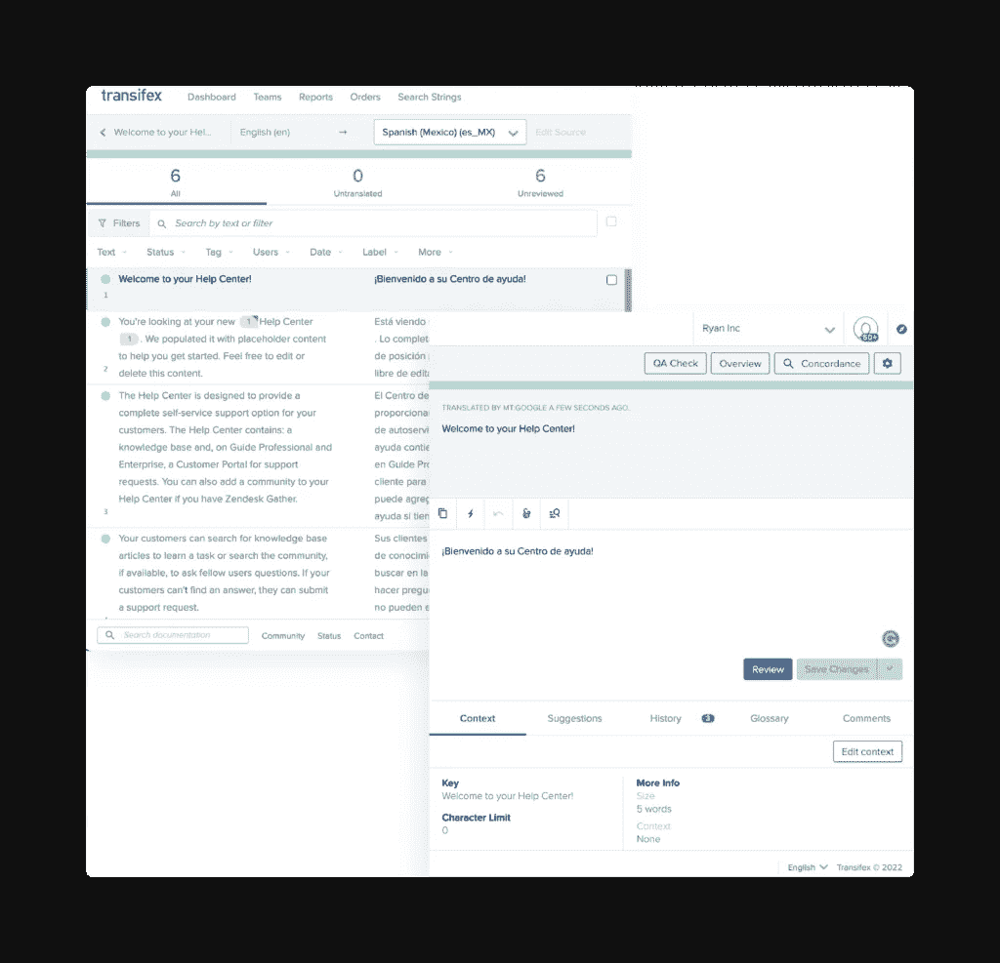
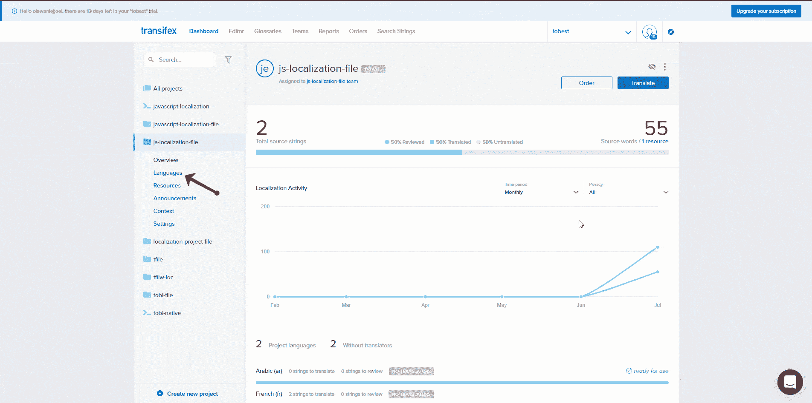
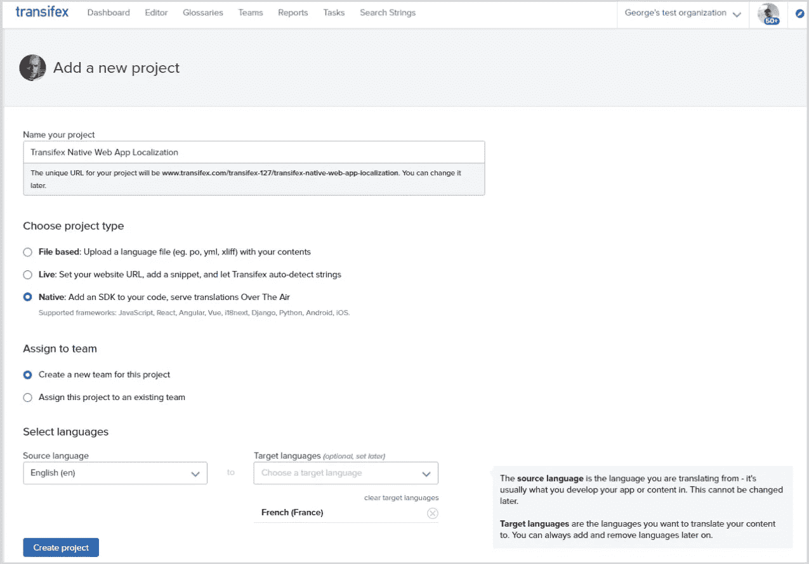
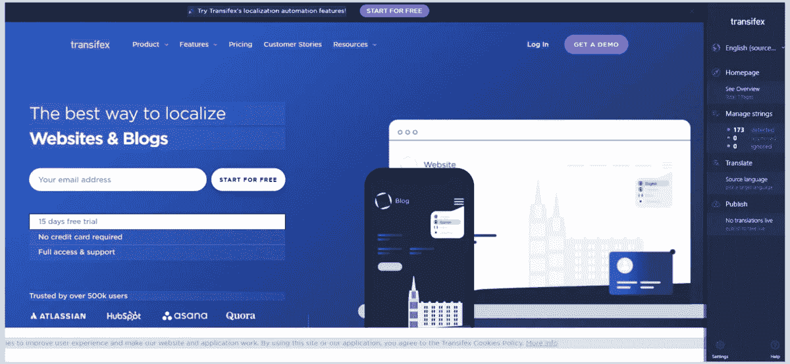
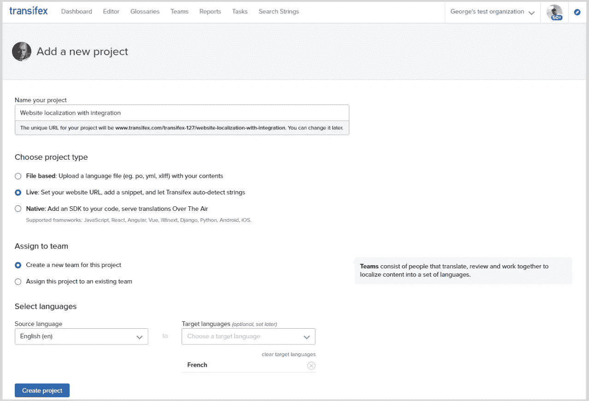
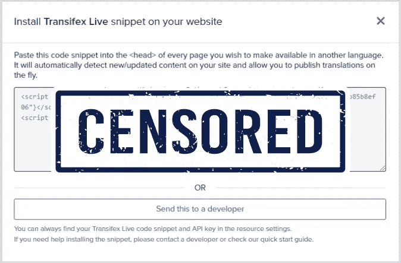
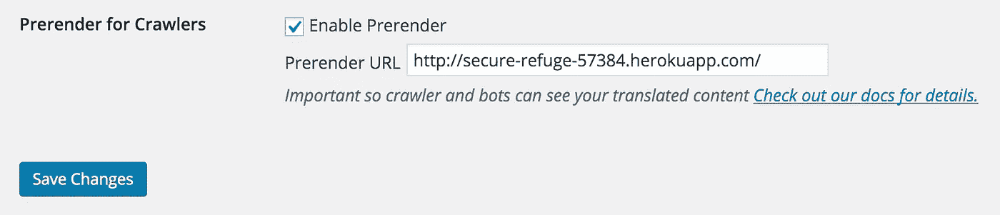

# 网站本地化指南

> 原文：<https://medium.com/geekculture/website-localization-guide-350fa5fb50d1?source=collection_archive---------9----------------------->


据统计，目前有 50 亿互联网用户。网站本地化是一个如此热门的话题也就不足为奇了。毕竟，说英语的人只占那个百分比的 [1/5！](https://www.transifex.com/blog/2022/transifex-languages/)

这还没有提到任何关于文化和与您的受众相关的内容，而这正是本地化的意义所在。

但是网站本地化，像任何其他形式的本地化一样，也有自己的一系列挑战。高层的计划是什么？以哪些地区为目标？怎么会？技术挑战呢？

不要担心。在本指南中，你可以一步一步地了解这一切。所以，事不宜迟，我们开始吧！

# 什么是网站本地化？

顾名思义，网站[本地化](https://www.transifex.com/blog/2021/what-is-localization/)就是将你的网站本地化。这是关于通过翻译你的内容，让你的内容更具文化吸引力，从而让你的内容更容易被各个地区所接受。

在研究本地化时，您可能还会遇到术语“L10n”，这是一个缩写。10 表示“本地化”的第一个字母和最后一个字母之间的字母数

# 网站本地化是怎么做的？

就技术细节而言，网站本地化主要有三种方式:

1.  基于文件的
2.  无文件
3.  安装一个集成来实时查看翻译预览，如 [Transifex Live](https://docs.transifex.com/live/introduction)

每种选择都有其优点和缺点。稍后详细介绍。

有些人通过直接编辑 HTML 或使用电子表格进行翻译，但这些方法现在效率低下且过时。

为了翻译内容，大多数人依靠类似 Transifex 的[翻译管理系统](https://www.transifex.com/blog/2021/what-is-a-translation-management-system/) (TMS)。

当您拥有 TMS 时，您可以使用它来:

*   上传并存储您的所有内容
*   让您的整个本地化团队同步工作
*   根据谁需要做什么，提供不同的角色和权限
*   向翻译人员提供上下文
*   自动化工作流程
*   更多

但是，最重要的是，翻译人员可以在一个图形编辑器上工作，该编辑器提供了他们需要的所有功能。这就是现代编辑的样子:



现在不需要担心一步一步的细节。对于三种可用的现代解决方案中的每一种，我们稍后都会谈到这一点。

# 本地化与国际化和全球化

你可能遇到过的一些非常常见的术语是[国际化(i18n)和全球化(g11n)](https://www.transifex.com/blog/2022/i18n-meaning-vs-l10n-g11n-and-t9n/) 。所以，在我们继续之前，让我们澄清一下区别。

我们已经讨论了本地化，所以让我们继续国际化和全球化。

# 国际化

软件国际化是关于为本地化准备你的应用程序或网站的所有技术方面。比如确保你的网站可以支持多种语言并在它们之间切换，显示各种符号而不中断，容纳更大的文本等等。

你需要一个工程师来帮你处理。除非你用 WordPress 插件之类的东西进行本地化，它会自动为你处理国际化。但是，再一次，稍后会有更多的内容。

# 全球化

全球化是指在更高层次上走向世界的过程。比如你如何在全球展示你的品牌，你将如何进入新的市场，法律准备等。

现在我们已经解决了这个问题，让我们继续阅读指南！

# 为什么网站本地化很重要？

网站本地化会给你带来很多优势，尤其是相对于那些不尽相同努力的竞争对手。

[例如，Vida Health](https://www.transifex.com/case-studies/vida-health/) 是第一个西班牙语的主要健康平台。由于这一举措，他们成功地为自己创造了一个市场，现在正在进入其竞争对手由于缺乏本地化而难以进入的地区。

将您的业务扩展到新的区域是本地化非常重要的另一个原因。事实上， [87%的美国公司认为国际扩张对长期增长至关重要](https://newsroom.wf.com/English/news-releases/news-release-details/2016/Despite-Weak-Global-Economy-U.S.-Companies-Still-Turning-to-International-Markets-for-Growth/default.aspx)。

这只是主要的好处之一。让我们不要忘记提到:

1.  如果网站有他们的母语版本，顾客更有可能购买；如果网站感觉熟悉他们的文化，顾客更有可能购买
2.  当潜在客户和客户通过为他们创造更好的整体体验而感到你关心他们时，他们更有可能信任你
3.  你可以进入没有本地化就无法进入的新市场，这是发展你的公司的好方法
4.  本地化的网站提供了更好的用户体验，对于非母语用户来说是必不可少的
5.  本地化有很高的 ROI(投资回报),很多情况下每花一美元就能得到 25 美元的回报

# 网站本地化:高层规划

在你开始考虑网站本地化之前，请考虑以下几点:

1.  你想瞄准哪些地区？
2.  你最重要的页面是什么？
3.  你最重要的衡量标准是什么？[其他市场的流量](https://www.transifex.com/blog/2022/search-traffic/)？来自新市场的新客户？[现有市场的新客户？客户满意率的提高？](https://www.transifex.com/blog/2022/global-expansion/)

这些是提高投资回报率(ROI)的关键步骤。很明显，将整个网站本地化是最理想的，但是最好从最重要的部分开始。

至于如何瞄准新市场，一个好的起点是你已经拥有但还没有本地化的市场。

研究显示，76%的人更喜欢从以他们自己的语言提供信息的网站上购物，而 40%的人根本不会购买。

因此，这是一个很好的机会，你可以通过本地化来吸引更多的外国游客。

# 不只是翻译

本地化不仅仅是把你的网站翻译成另一种语言。你还应该记住这样的事情:

*   新地区的付款选项
*   货币
*   日期/时间
*   阅读顺序(从左到右或从右到左，取决于地区)
*   国际 URL 结构(就像 Amazon.de 变成了德国的 Amazon.de)
*   法律内容

特色资源

# 国际化你的网站

正如我们上面简要提到的，[国际化](https://www.transifex.com/blog/2021/what-is-internationalization-i18n-in-software/) (i18n)就是为你的网站做本地化的准备。

在继续本地化你的网站之前，你应该让你的工程师确保当你使用不同的语言时网站不会崩溃。

例如，一些单词和短语比源语言长。英语中简单的“嗨”可以翻译成日语中的“こにちわ”。这是一个更大的词，因此，网站需要设计来积累这个。

这就是为什么你需要国际化。

# 选择您的网站本地化解决方案

现在你知道要注意什么了，是时候卷起袖子开始翻译你的网站了。

就像工程师没有好的 IDE 就无法工作，营销人员和销售人员没有 CRM 就无法工作一样，负责本地化的人没有翻译管理系统就无法高效工作。

顾名思义，TMS 是管理所有内容和翻译的中心平台。它是您存储、翻译和下载内容的地方，也是整个翻译团队合作完成工作的地方。

如果您希望在翻译工作流程中安装集成，TMS 也是必要的。就像你可以用 Slack 连接吉拉一样，你也可以用它连接你的 TMS，或者 GitHub、 [Figma](https://www.transifex.com/integrations/figma/) 、 [Sketch](https://www.transifex.com/integrations/sketch/) 、 [Zapier](https://www.transifex.com/integrations/zapier/) 等。

根据您选择的 TMS，您将获得一组不同的可用解决方案。对于 Transifex，您会得到:

1.  基于文件的
2.  无文件；又名 Transifex Native
3.  像 Transifex Live 这样的实时编辑器

他们都有利弊要考虑。

# 基于文件的网站本地化

使用基于文件的解决方案，您可以将网站内容提取到一个文件中，上传到 TMS，然后下载翻译后的内容并上传回您的网站。然后，工程师必须部署更新。

[https://youtu.be/9ArDOS6aXBw](https://youtu.be/9ArDOS6aXBw)

**优点:**

*   最流行的方法，这也是为什么本地化专家通常对此感到最舒服的原因
*   适用于任何网站或应用程序(您只需提取 TMS 支持的[格式的内容)](https://docs.transifex.com/formats/introduction)
*   伟大的搜索引擎优化(搜索引擎优化)不需要第三方软件

**缺点:**

*   需要与工程师协作并投入工程时间/资源
*   与其他选择相比可能会很乏味
*   与使用像 Transifex Live 这样的实时编辑器相比，提供上下文更加棘手

听起来很适合你？以下是您如何使用该解决方案！

# 如何使用基于文件的项目进行本地化

有许多翻译管理系统都采用基于文件的方法。在本指南中，我们将使用 Transifex。

1-以有利于本地化的[文件格式提取网站内容](https://docs.transifex.com/formats/introduction)(这由工程师完成)

2- [免费创建一个 Transifex 账户](https://www.transifex.com/signup/)，如果你没有的话

3-登录并选择“创建项目”

4-选择“基于文件”

5 —选择“创建项目”


6-点击“上传文件”

7-翻译你的内容

8 —下载它



然后你所要做的就是把你更新的内容上传回网站，让开发者部署它。

# 无文件网站应用程序本地化

无文件方法是老式的基于文件的解决方案的继承者，尽管它有自己的优缺点。

需要注意的是，这只适用于[支持的网站应用](https://developers.transifex.com/docs/native)。

顾名思义，无文件项目消除了从你的网站上传和下载文件到 TMS 的过程，反之亦然。相反，你所要做的就是将字符串推送到 TMS，然后翻译通过我们的解决方案自动下载到应用程序。

[https://youtu.be/gVFwicJ0xDs](https://youtu.be/gVFwicJ0xDs)

看起来是这样的:

1.  在您的代码中安装 SDK
2.  与工程师一起进行首次设置
3.  开始工作，让 TMS 为您推送内容

**优点:**

*   消除了对文件的需求，节省了工程资源
*   第一次设置后，使用起来更容易、更快
*   伟大的搜索引擎优化不需要第三方软件

**缺点:**

*   仅适用于受支持的网络和移动应用
*   与 Transifex Live 这样的集成相比，更难提供上下文

听起来不错？以下是您如何推进这一解决方案的方法。

# 如何使用无文件项目进行本地化

要本地化你的网站而不需要任何文件，你需要一个名为“ [Transifex Native](https://www.transifex.com/native/) 的软件解决方案

1- [免费创建一个 Transifex 账户](https://www.transifex.com/signup/)，如果你还没有的话

3-登录并选择“创建项目”

4-选择“本地”

5 —单击“选择项目”



6-点击“分享说明”(你需要一个电子邮件客户端来完成这项工作)

然后把说明交给你的工程师，你马上就可以开始本地化你的网站，而不需要文件。

如果您是工程师，请查看我们的指南或文档:

*   [JavaScript](https://www.transifex.com/blog/2022/javascript-localization/)
*   [反应](https://www.transifex.com/blog/2021/react-localization-with-transifex-native/)
*   [Vue](https://www.transifex.com/blog/2022/vue-internationalization-getting-started-with-transifex-native/)
*   [棱角分明](https://www.transifex.com/blog/2022/angular-localization-getting-started-with-transifex-native/)
*   姜戈
*   [Python](https://www.transifex.com/blog/2021/python-localization/)

# 使用实时编辑器进行网站本地化

翻译管理系统不仅仅是管理你的内容。他们还提供集成以使本地化更有效。

在网站本地化的情况下，我们需要使用一个集成，一个实时编辑器，我们称之为“Transifex Live”

[https://youtu.be/NouZpZ3rVaA](https://youtu.be/NouZpZ3rVaA)

与替代方案相比，这种集成的最大优势在于，在翻译出版之前，您可以在制作过程中实时观看翻译。因此得名 transi fex“Live”



与其他方法相比，这种方法的唯一缺点是，根据您使用它的方式，您可能需要采取额外的步骤来确保 SEO 一切顺利。稍后会详细介绍。

但是这个过程非常简单:

1.  获取 JavaScript 代码片段
2.  粘贴到你的网站上(就像你用谷歌分析)
3.  开始本地化

**优点:**

*   直接视觉情境
*   不需要工程参与

# 缺点:

*   对于 SEO 和 HREFLANG 标签，您可能需要“Prerender ”,尤其是当您使用子域或子目录时

# 如何使用 Transifex Live 本地化您的网站

要使用 Transifex Live 插件进行网站本地化:

[1-免费创建一个 Transifex 账户](https://www.transifex.com/signup/)，如果你没有的话

3-登录并选择“创建项目”

4-选择“实时”



5 —添加您的网站 URL

6-选择“实时翻译”

7-将片段复制到您要翻译的每一页的开头，或者如果您不愿意自己动手，可以将信息发送给开发人员。

如果你在 WordPress 上，你所要做的就是安装“Transifex 的国际 SEO”插件，然后把 API 密匙粘贴进去。



这就是全部了。您现在可以开始翻译您的网站与直接的视觉背景！


现在，关于 SEO，还有最后一步，你必须确保搜索引擎能够检测到你的多语言内容。

在大多数情况下，您构建的页面是 HTML，搜索引擎可以轻松地检测和抓取。但是，Transifex Live 的网站本地化使用 JavaScript 来拉翻译并将其呈现在网站上，而不是为每种语言创建一个静态的 HTML 页面。

搜索引擎是否可以抓取一个使用 JavaScript 动态注入 HTML 的网站[仍然是专家们争论的话题](https://www.searchenginejournal.com/seo-javascript-good-bad-uncertainty/346708/)。

解决办法？使用[前置器](https://prerender.io/)。

# 如何在 WordPress 上用预呈现器呈现静态 HTML(供工程师使用)

要使用 Prerender，您必须:

1.  在你自己的服务器上运行一个 Prerender 实例(任何一个都可以，Heroku 是一个流行的选项)
2.  然后用 Heroku 设置 Prerender:

```
$ git clone https://github.com/prerender/prerender.git$ cd prerender$ heroku create$ git push heroku master
```

关于这一点的更多信息，请访问 GitHub 。

完成 Prerender 的设置后，只需转到:

1.  WordPress 管理面板
2.  插件
3.  Transifex 的国际 SEO
4.  向下滚动并勾选“启用预呈现器”
5.  然后将您的 Prerender 服务器 URL 粘贴到“Prerender URL”字段旁边



恭喜你，你现在把你的 JavaScript 内容转换成了一个简化的静态 HTML，机器人爬虫可以很容易地看到。

# 包扎

这就是你如何尽可能简单高效地进行网站本地化的方法。总结一下，这些是可用的解决方案:

1.  **基于文件的**:适用于一切，但不断需要文件管理和工程参与新版本
2.  **无文件:**在第一次设置后，消除了大部分文件管理和工程参与，但仅支持网络和移动应用
3.  **使用动态编辑器:**无需工程师的任何帮助就能直接处理视觉上下文(除非您想设置 Prerender 用于国际 SEO 目的)

本帖原载[于本页面](https://www.transifex.com/blog/2022/website-localization/)。