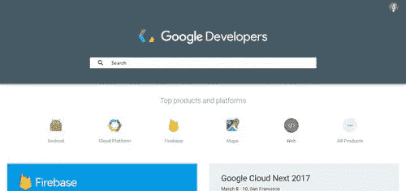
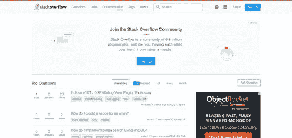

# 所有开发者必须访问的网站

> 原文：<https://medium.com/geekculture/websites-all-developers-must-visit-16b494d61263?source=collection_archive---------13----------------------->

有一些专业人士被认为是每个部门的权威。

大多数人都有博客或网站，这使他们成为整个行业最可靠的信息来源。你经常会发现一个社区，所有的专业人士都去那里和其他有共同兴趣的专业人士交流。发展行业也是如此。既然程序员是这么一个古怪的群体，任何老网站都不行。我们收集了网络、项目讨论、最新技术新闻和故障排除方面的顶级开发人员网站。

网站帮助新手学习编程。当你需要从最近的开发工作中休息一下时，一些有趣的网站也包括在列表中。

# 面向程序员的最佳开发者网站

## 程序员和开发人员专用的新闻网站和社区

开发人员可以从哪里找到影响编程和开发行业的最新消息？下面列出了与开发人员和程序员相关的最新编程新闻的最佳开发人员网站。

## [黑客新闻](https://news.ycombinator.com/)
[@newsycombinator](https://twitter.com/newsycombinator)

这就像是 Reddit，但是是针对开发者的！Hacker News 是开发者新闻的首选网站，这些新闻与您在任何特定时间可能会担心的所有事情有关。例证:数百名开发人员跳上车，讨论 2017 年 2 月 28 日 AWS S3 大规模停机事件。很少有人比你的开发伙伴更能体会到这样的中断所造成的巨大灾难。

## [斜线圆点](https://slashdot.org/)
[@斜线圆点](https://twitter.com/slashdot)

SlashDot 是一个大规模的交互式存储库，用于存储关于代码和技术的最新博客文章和新闻文章。rob“cmdr taco”Malda 于 1997 年创建了该公司，但现在归 BIZX，LLC 所有。SlashDot 有着强烈的社区意识，由一小组编辑和程序员在网站活跃读者的帮助下管理。

## [Reddit 编程](https://www.reddit.com/r/programming/)
[@ Reddit _ progr](https://twitter.com/reddit_progr)

就像程序员的 Reddit！Reddit 是谈论最新技术新闻、发展趋势以及忙碌的开发人员所关心的任何事情的首选社区。如果你想快速了解当天的顶级开发者新闻，想谈论你一直在思考的编程问题，或者需要大声抱怨你最近的编码错误，Reddit 是值得访问的网站。

## [DZone](https://dzone.com/)T2[@ DZone](https://twitter.com/DZone)

DZone 是当今程序员和开发者的知名编程新闻中心，会员超过百万开发者。该网站涵盖了从敏捷到云、开发运维、大数据、集成、性能等所有内容。DZone 是从各个角度获取最新市场信息的绝佳资源。

## [代码学院](https://www.codecademy.com/)
[@代码学院](https://twitter.com/Codecademy)

Codecademy 是一种免费的交互式方法，用于学习如何用各种语言编程。它致力于提供一个刺激、有效的学习环境，重新创造学习过程，使学生能够以自己的速度完全在线地从初学者变成专家。通过 Codecademy，超过 2500 万人已经提高了他们的知识和能力。你，为什么不呢？

## [谷歌开发者](https://developers.google.com/)
[@googledevs](https://twitter.com/googledevs)

有了教训和建议，最权威的网站旨在激励程序员。还有大量的附加工具和资源可用，包括培训、游戏、视频和几个谷歌开发者控制台(如谷歌 Play 商店开发者控制台和谷歌 API 控制台)。

## [stack overflow](https://stackoverflow.com/)
@ stack overflow

类似于著名的问答网站 Quora，但只针对开发人员的在线社区 StackOverflow 提供学习材料，促进知识共享的社区，并为开发人员的职业发展提供服务，包括招聘信息。

## [bit degree](https://www.bitdegree.org/)
[@ bit degree _ org](https://twitter.com/bitdegree_org)

为了了解各种 IT 主题，BitDegree 提供了全面的教程、视频课程、互动课程等。涵盖了区块链、编程语言、数据科学、市场营销以及更多主题。他们的大部分内容是免费的，但他们也提供一些价格合理的在线课程。

如果你在最好的开发者网站上寻找更多的内部意见，看看这个 Quora 主题,它提供了许多值得一提的内容。