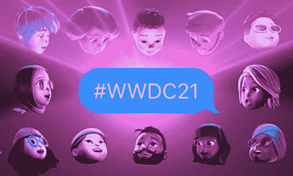

# 第 10 周:iOS 15 有什么新功能

> 原文：<https://medium.com/geekculture/week-10-day-one-of-wwdc-2021-in-4-minutes-25e874266eac?source=collection_archive---------45----------------------->

by Apple on [https://developer.apple.com/wwdc21/](https://developer.apple.com/wwdc21/)

嘿，苹果用户/开发者们，

WWDC 2021 已经开始。我对苹果开发的所有新功能感到非常兴奋。作为一个包，这些功能确实将苹果产品的用户体验提升到了一个全新的水平。我们讨论的是光电探测、自动翻译、通知摘要等等。如果你错过了 WWDC 2021 现场秀，没关系。我抓住你了。笔记记录者是货币接受者。我记下了笔记…