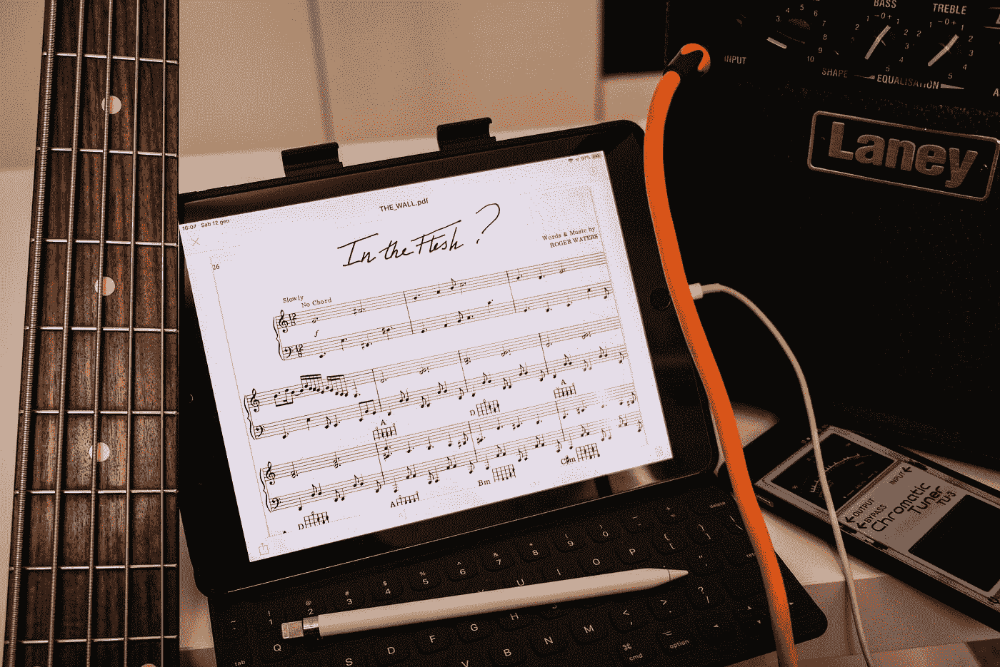

# JavaScript 的周末乐趣:编码并玩“Ney”

> 原文：<https://medium.com/geekculture/weekend-fun-with-javascript-code-and-play-ney-8c5666dc50b9?source=collection_archive---------21----------------------->

## 键盘声音应用程序:HTML-CSS-JavaScript

Photo by [Alberto Bigoni](https://unsplash.com/@albertobigoni?utm_source=medium&utm_medium=referral) on [Unsplash](https://unsplash.com?utm_source=medium&utm_medium=referral)

爱好在周末比繁忙的工作日更有作用。这个帖子的开头故事也和这个有些关系。

怎么会？

当我的大儿子不会演奏 ney 乐器让他有点沮丧时，我想出了一个主意…