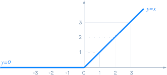
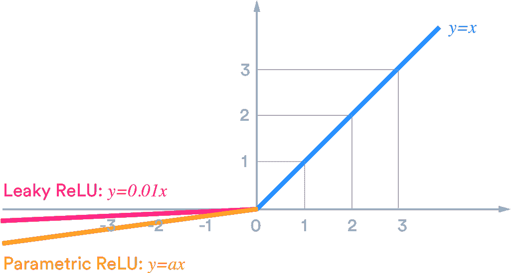
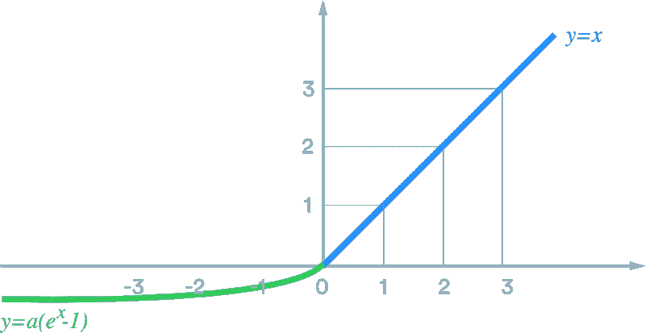

# 神经网络中的权重初始化

> 原文：<https://medium.com/geekculture/weight-initialization-in-neural-nets-78091cfee93?source=collection_archive---------20----------------------->

## 带有不饱和函数的

权重初始化是神经网络的重要因素之一。基于每个神经元的权重，可以确定误差。众所周知，要得到一个精确的模型，误差必须更小。

我们将讨论三种主要的权重初始化技术，它们是:

a)均匀分布

b) Xavier 初始化

c) He 初始化

# a)均匀分布:

该权重初始化背后的思想是在[-y，y]的范围内初始化权重，并且它应该接近零，其中 y 由下式给出

**y = 1/sqrt(fan _ in)**；fan_in 是给予神经元的输入数量

当使用 Sigmoid 激活函数时，均匀分布工作得非常好。

# b)Xavier 初始化:

Xavier 初始化是 Glorot 和 Bengio 提出的。他们指出，信号必须正确地向前和向后流动而不会消失。他们指出:为了使信号正确流动，我们需要每层输出的方差等于其输入的方差。

我们有两种 Xavier 初始化

**T5)1)泽维尔正常 **

权重取自均值等于零且标准差等于 **sqrt(2/fan_in+ fan_out)的正态分布；** fan_out 是神经元的输出数。

***2)泽维尔制服***

权重取自[-y，y]范围内的均匀分布，其中 y 由下式给出

**y = sqrt(6/扇入+扇出)**

Xavier 初始化与 Sigmoid 激活功能配合良好。

默认情况下，Keras 使用这个具有统一分布的 Xavier(glorot)初始化器。

# c) He 初始化:

权重可以用两种类型的初始化来初始化

***1)何正常***

权重取自均值等于零且标准差等于 **sqrt(2/fan_in)的正态分布。**

**2)贺制服**

权重取自[-y，y]范围内的均匀分布，其中 y 由下式给出

**y=sqrt(6/fan_in)**

权重初始化技术与 ReLU 激活功能配合得非常好。

`import keras.layers.Dense`

`keras.layers.Dense(10,activation="relu",kernal_initializer="he_normal")`

# 要点:-

*   权重值应该很小。
*   对于所有迭代或时期，权重不应相同。
*   权重应该具有良好的方差。

# 不饱和激活函数

在 Glorot 和 Bengio 于 2010 年发表论文之前，许多人认为 Sigmoid 激活函数是最好的激活函数。但是，当网格变得密集时，sigmoid 函数会带来消失梯度问题。ReLU(整流线性单元)是 sigmoid 的更好替代方案，因为它不会因正值而饱和。

***热路***

ReLU 是神经网络中使用的非线性激活函数。

对于 x > =0 ，ReLU 定义为 **y=max(0，x)**

对于 x<0y = 0，其中 x 是输入值

不幸的是，ReLU 遇到了一个被称为*死亡 ReLU 的问题。在某些情况下，我们可能会发现一半的神经元死亡，特别是当它们的权重被调整到输入的加权和为负时，当这种情况发生时，它只会继续输出零。*

为了解决这个问题，我们使用 ReLU 的变体，称为泄漏 ReLU，参数 ReLU

***漏热路***

漏 ReLU 定义为 **y=max(0.01x，x)**

***参数化 ReLU***

它由 x 的> 0 定义为 **y=x**

**y=ax 否则**其中 a 是一个小值

当 a=0.01 时，参数 ReLU 作为泄漏 ReLU 工作。

Djork-Arne Clevert 在 2015 年的一篇论文中提出了一种新的激活函数，称为**指数线性** **单位**该函数优于 ReLU 的所有变体。

***指数线性单位***

定义为 **y = x，x > =0**

**y=a(e^x -1)，否则**

恭喜你，现在我们知道了神经网络的重要和常用的激活函数以及不同的权重初始化技术。我希望你已经发现这是有用的。感谢您的阅读