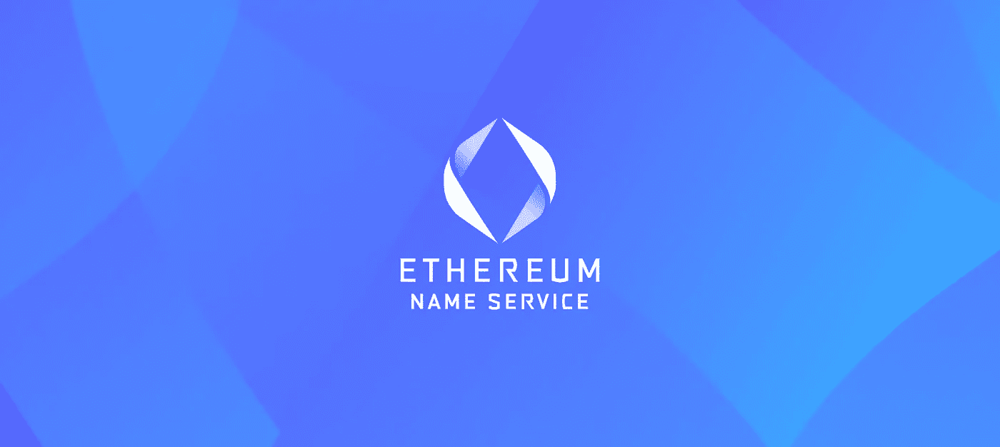
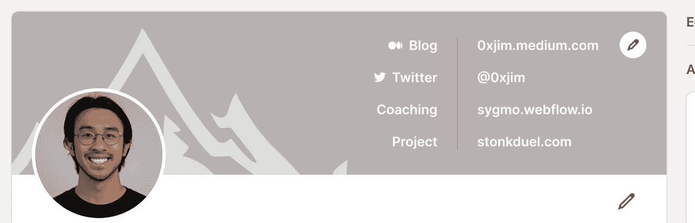
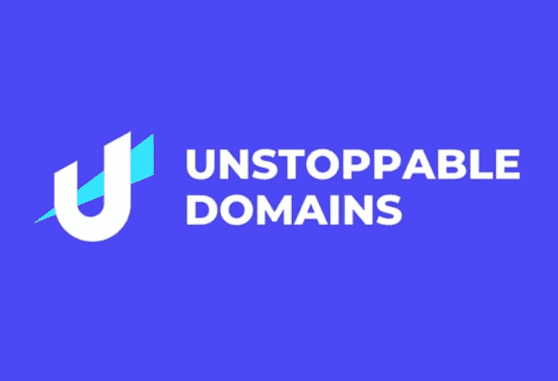

# 欢迎来到分散式网络

> 原文：<https://medium.com/geekculture/welcome-to-the-decentralized-web-e56b4a27b6c2?source=collection_archive---------3----------------------->

## Web3 将需要一个全新形式的完全拥有的网站

作者注:这是我的 NFT 系列的第 5 部分。 [*点击这里阅读第一部分*](https://jimmy-chang.medium.com/how-did-nfts-become-so-popular-f894eea22f90) *，我在这里记录了 NFTs 的崛起。而* [*这里为 Part 2*](/the-shadow/the-metaverse-web3-and-the-inevitability-of-nfts-18c8fff1db2a) *，在这里我把它作为新世界的一个基础来谈。这里的* [*是第 3 部分，*](/geekculture/nfts-unlock-a-new-form-of-digital-identity-7145aa7b48c9) *我在这里谈到拥有我们的社交媒体内容+社交媒体作为我们的数字身份。而这里为* [*第四部分*](/coinmonks/decentralized-identity-starts-with-owning-your-name-3fbfca9d8ff) *，这里我谈的是分散的身份和姓名所有权。*

几天前，我断言，没有去中心化的身份——拥有自己的名字，从而拥有自己在元宇宙的身份的能力——就不会有网络 3 革命和元宇宙的到来。

如果你没有时间通读整篇文章，这篇简介总结了我想要表达的 80%的意思:

> 在元宇宙，你需要拥有自己的名字——在区块链证明你就是你所说的那个人。
> 
> 回到我之前的类比，这个名字是键-值对中的键，因此当查询它时，会返回大量信息——这些信息实际上告诉其他人你是谁。

我认为第二种说法非常有力，这也是我今天想要阐述的。

身份是许多不同信息的融合:你的教养、价值观、爱好、工作(如果你住在美国的话)等等。

名称是一个标识符，它将所有信息包装成一个可以被索引和查询的键。

今天，我们可以对这种分散的身份做的最简单的事情就是将我们不同的个性连接成一个键:我们的 Instagram、Twitter、LinkedIn 等。关于我们是谁的数字真相的单一来源。

Kind of like what I have on LinkedIn

今天我们可以用**去中心化身份做的另一件非常有趣的事情是，实际上把它们用作解析网站的 URL**——我们称之为去中心化域。

# 域是如何去中心化的？

现在像这样的域名。com 归 Verisign 等第三方公司所有，并通过 name price 和 Godaddy 等公司转售给最终消费者。

我们要么为使用该域名的权利支付年费，要么以惊人的价格直接购买。

不管怎样，我们并不真正拥有那个域名。威瑞信可以随时审查它。黑客可以将 Verisign 作为攻击目标，关闭您的域名，从而限制您的网站访问互联网。

我们以前在这个密码中见过。黑客瞄准 URL 名称并将其解析为恶意网站，以从加密用户那里提取资金。

在分散式域名中，个人拥有域名，未经个人明确同意，其他任何人都不能使用或夺走域名。

这可能是因为——与分散式身份一样——分散式域是在区块链上创建的，拥有不可变的所有权和权限设置。

这就是像[不可阻挡的域名](https://unstoppabledomains.com/)和[以太坊名称服务](http://ens.domains)这样的公司的有趣之处；他们正在为真正的网络——像网站一样——创造进入 Web3 时代的基石。

所有这些都是关于 Web3 的，我完全忽略了关于文字网站加入运动的讨论！

《不可阻挡的域名》的首相迈克尔·威廉斯完美地抓住了这一点:

> 不可阻挡的创造和销售网站的网址。不像我们现在的选择(GoDaddy，Google Domains 等。)这些域名 100%由用户控制。它们永远不会被撤销、取消、终止或掩盖。

如果我们结合分散的域+分散的数据存储协议，如 [IPFS](https://ipfs.io/) 、 [Arweave](https://arweave.org/) 或 [Filecoin](https://filecoin.io/) +以太坊等分散的计算层，我们就创建了一个 web 3-native world web web——其中标识符/解析、存储和处理都是以开放、无许可和分散的方式跨数千台计算机完成的，而不是微软、谷歌或亚马逊拥有的大型数据中心。

；照片

# 去中心化网络的研究

很难将去中心化的 web 概念化——毕竟，万维网不是已经去中心化了，建立在像 IP、DNS、SMTP 和 TCP 这样的开源协议上吗？

是的，但是在过去的几十年里，像谷歌和脸书这样的大公司已经把数据和信息流集中起来了。现在他们本质上是互联网，Web3 运动正试图收回 Web 1.0 所描绘的最初的自由。

这里有一个说明性的例子，也许能让我们对去中心化的网络有所了解:

一个个人拥有自己数据的网站。

假设我在 Medium 上有一个博客(我确实有)。如果我想开始为 Substack 写新的帖子，我基本上必须从一个空白的状态重新开始，而不是我现在在 Medium 上拥有的一个强大的内容库——或者我可以从字面上复制我的文章并粘贴到 Substack 上，但我冒着被 Medium 发现的风险(idk 他们会做什么，但他们在技术上拥有我的内容),或者至少 Google 在 SEO 中看到并取消我在 Substack 上复制的内容的优先级。

净-净就是我的数据都不会留下来。我的观点统计，我的追随者，我的评论，等等。

现在想象一下，我*可以*继续我的内容，因为我实际上拥有它们。它们存储在区块链里，和我的标识符联系在一起。

我可以将它们移植到我喜欢的任何平台上——哪个平台最适合我，对我最好，并且具有最能支持我的目标的特性。

我甚至可以托管自己的网站，我的标识符——比如 Jimmy . crypto——将解析为一个展示我喜爱的内容的网站。

在不同社交媒体平台之间的围墙花园多年之后，跨任何平台的数据互操作将成为可能。

# 结束语

我将引用[迈克尔·威廉斯](/@mvwi/why-im-joining-unstoppable-domains-828c3de3ff7b)的一句话来结束我的演讲:

> 分散的领域当然是玩具般的，奇怪的，不严肃的。但这在很大程度上是因为它们从根本上不同于我们以前拥有的任何东西。这些差异开启了一个全新的可能性世界。

去中心化的网络仍然是一个非常新生和抽象的想法——老实说，即使在我写我的说明性例子的时候，我也努力想出一些具体的东西来真正地强调去中心化网络的价值。

我以一个关于博客平台之间的数据互操作性的蹩脚例子结束，但老实说，这项技术的意义远不止于此，远远超出了我的想象——更不用说阐明了。

*如果你认为这篇博文值得你花 5 分钟来阅读，请帮我在下面鼓掌(最多 50 次)或者与一个会从这篇内容中受益的朋友分享。非常感谢！*