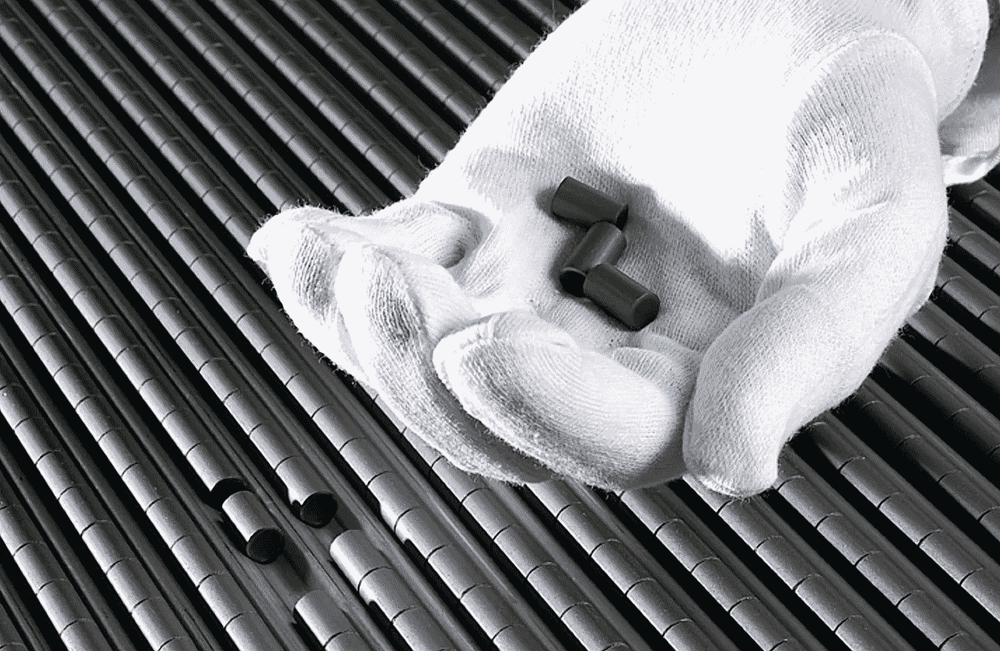
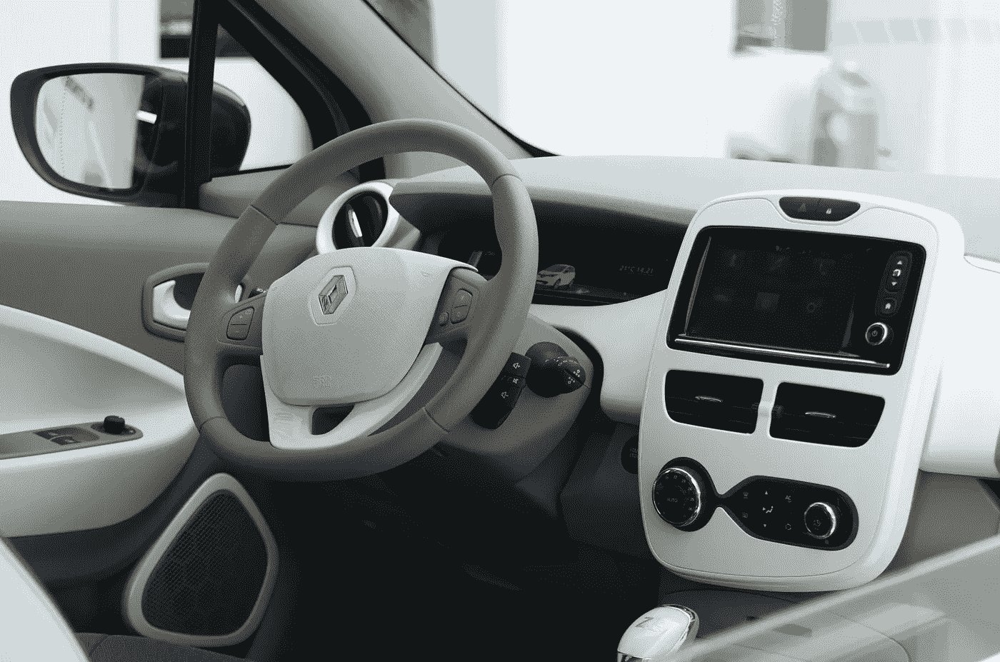
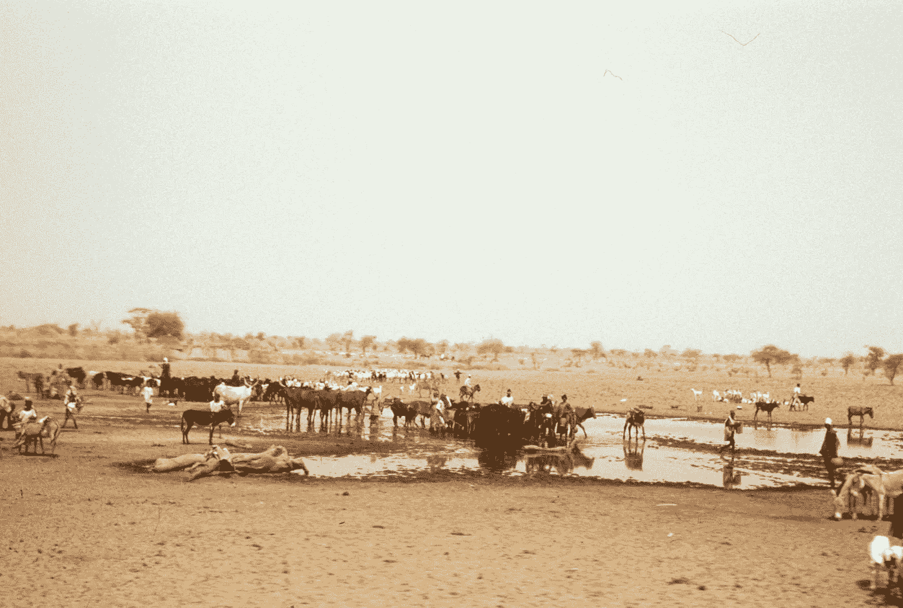
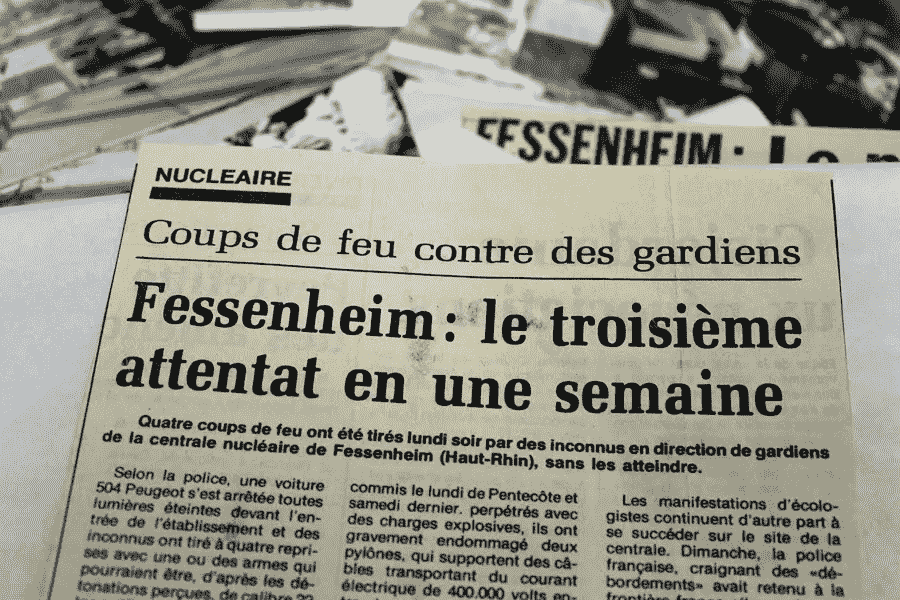
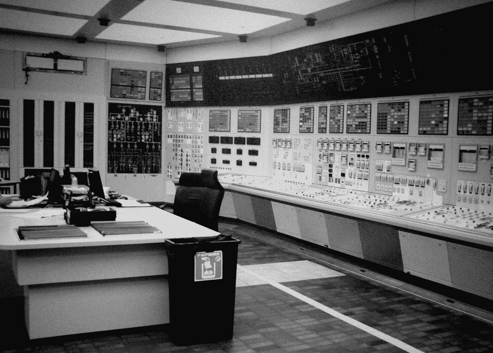
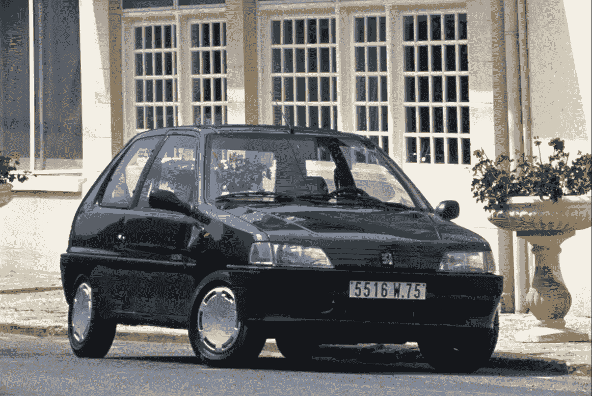
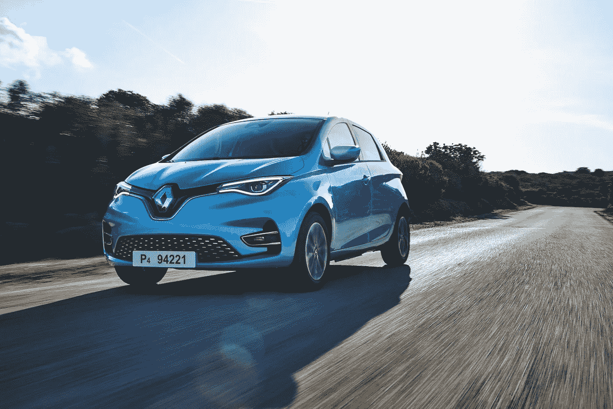

# 欢迎来到核能汽车的国度

> 原文：<https://medium.com/geekculture/welcome-to-the-land-of-nuclear-powered-cars-a5da2b049c52?source=collection_archive---------0----------------------->

## 铀消耗量为每 100 英里 0.02 盎司或每 100 公里 0.34 克

Pellets of enriched uranium. Photo: [NRC, Areva](https://commons.wikimedia.org/wiki/File:Nuclear_Fuel_Pellets_(14492225000).jpg)

现代核动力汽车看起来一点也不像 20 世纪 50 年代的福特核子汽车。这是一款时尚的掀背车，可能对美国人来说太小了。方向盘有点水平放置，就像卡车或 1959 年的英国迷你车一样。司机的职位相对较高，但令人钦佩的是，制造商抵制了将车辆作为“跨界车”进行营销的诱惑。

它没有假装成跑车，但它对司机的命令反应迅速；它的动力系统的最大扭矩是即时可用的，因此加速感觉很轻松。它也很安静——以至于它配备了模仿传统发动机声音的扬声器，以避免偷偷靠近行人。

上个月在法国售出的汽车中，有九分之一是核能汽车。包括那些可以使用核能，但也可以使用天然气或柴油的，它更像是五分之一。

Interior. Photo: [Clément Bucco-Lechat](https://commons.wikimedia.org/wiki/File:Geneva_MotorShow_2013_-_Renault_Zoe_steering_wheel.jpg)

## **对化石燃料说不**

如果在另一个国家使用，这些汽车将不再是核动力的——不再是*主要是*核动力的。当然，它们是电动汽车，无论是来自风力涡轮机、太阳能电池还是化石燃料，它们都能愉快地消耗电力。但我们谈论的是法国:几十年前，这个国家注意到发电厂燃烧化石燃料违背了自己的利益。于是它就不做了。

在 20 世纪 70 年代，全球变暖的证据——一种由有争议的核科学家爱德华·泰勒在 20 世纪 50 年代预测的现象——已经相当充分了。

编辑:但是下面描述的萨赫勒干旱并不是一个很好的例子。是的，由于工业化国家的所作所为，萨赫勒干涸了。但这并不是全球变暖的直接后果。罪魁祸首是大气中的人造硫酸盐气溶胶——这种物质是对抗全球变暖的一种方式(只是不安全)。这些悬浮在大西洋北部热带上空的悬浮微粒有两个后果:1)海洋变冷，2)陆地降雨量减少；因此出现了干旱。1991 年皮纳图博火山爆发时，也观察到了类似的现象，但不是人为的，也不是短期的。⁰

萨赫勒地区——撒哈拉以南的一片土地——降雨量开始比以前少得多。根据季节的自然循环，当地人习惯于带着他们的牛在北方的雨季牧场和南方的旱季牧场之间季节性地迁移。但是 1970 年左右降临到他们头上的灾难，持续了数年，远非自然。

几十万人死了你能怎么办？当然是责怪受害者。如今这个被过度使用的短语仍然是描述西方对萨赫勒灾难反应的最佳方式。西方说，他们错误地使用了他们的土地。当地资源管理不善应该是问题所在。

Sahel in the 1970s. Photo: [Ryszard Vorbrich](http://cyfrowearchiwum.amu.edu.pl/archive?location=Niger&type=&page=3)

显然，直到 20 世纪 90 年代，气候模型才开始指出气候变化是萨赫勒饥荒的原因。很显然。我们不久前了解到，在 20 世纪 80 年代早期，埃克森公司的科学家能够很好地模拟 CO₂和气候之间的关系。在“埃克森 21 世纪研究”中，他们正确预测了中国将取代美国成为世界上最大的 CO₂排放国，并绘制了几种不同的情景，假设中国 CO₂排放量将达到多高，所有这些都指向我们今天正在经历的变暖。但那是内部使用的。[⁴](http://www.climatefiles.com/exxonmobil/1982-memo-to-exxon-management-about-co2-greenhouse-effect)⁵

看看这张乍得湖的照片，是 1968 年从阿波罗飞船上拍摄的。这是一个时代的遗迹，当时人类已经掌握了太空飞行，但还没有从地球表面抹去这一自然奇迹的大部分。

Lake Chad in 1968\. Photo: [NASA](https://commons.wikimedia.org/wiki/File:Lake_Chad_from_Apollo_7.jpg)

当时，传统观点总是指责当地人，过度耕种和过度养殖；1968 年出版的《人口炸弹》一书的流行支持了这种解释，尽管人口过剩(非常真实的)问题很快进入了流行话语，但全球变暖的问题却没有。

认为工业化国家没有想出一种简单、有效、副作用可怕的方法来阻止变暖(不减少石油)是幼稚的，但那是另外一个故事了。[⁶](https://iopscience.iop.org/article/10.1088/1748-9326/4/4/045108)⁷

总之。法国。20 世纪 70 年代的萨赫勒气候灾难——它毕竟发生在法国的势力范围内——是法国发展核能的原因吗？大概不会。

法国依赖进口石油，不仅汽车和卡车燃烧石油，发电厂也燃烧石油。当然，它也有水力发电厂，但是它的电力需求正在增长；它的水力发电量，没有那么多。不受外国影响对法国执政的戴高乐主义者至关重要:1966 年，他们退出了北约的一些机构，正式表达了他们对美国在欧洲拥有太多权力的不满，1968 年，他们向世界展示了自己的氢弹。

法国转向核电厂最常被引用的原因是 1973 年的石油危机。但是那场危机的影响通常与尼克松冲击的影响混为一谈，简而言之，尼克松冲击改变了世界货币的制造方式。法国人对以前的货币体系有一种表述——*美元的过度特权*——但也没有理由确信新体系会更好。

在这种动荡的气氛下，法国总理皮埃尔·梅斯梅尔宣布了他的计划，要让法国成为全电力、全核能的国家。法国环保主义者不信任梅斯梅尔是情有可原的。法国总理是一个右翼政党的成员，也是一名军人，参与了在阿尔及利亚沙漠进行的核武器试验。

该计划要求到 2000 年建造 100-200 座反应堆，并大幅增加电力输出。⁸核能不仅应该取代发电站燃烧的化石燃料，还应该取代用于取暖的化石燃料。据设想，通过全核电供电的电热器，法国家庭在冬天不用燃烧一滴取暖油就能保持温暖。

那时，建造一座核电站的成本大约是燃油核电站的一半。 [⁹](https://www.lemonde.fr/archives/article/1975/03/14/le-slogan-tout-electrique-tout-nucleaire-a-suscite-de-bien-facheux-malentendus-declare-m-marcel-boiteux_2581965_1819218.html)

## **在它下蛋之前杀了它**

法国已经有了一些运行中的反应堆，但梅斯梅尔计划要求所有新的反应堆都使用不同的技术建造，如压水反应堆(PWRs)。法国人已经从美国西屋电气公司获得了压水堆技术的许可，并开始在距离费森海姆不远的莱茵河流域的法国农村建造一个与宾夕法尼亚州比弗谷核电站相似的复制品。

当梅斯梅尔发表声明时，费森海姆的建设——后来被“改造”为梅斯梅尔计划的试点项目——正在进行中，因此梅斯梅尔很快就会有东西展示他的计划。

前提是费森海姆成功了。如果没有，那很可能会葬送整个计划。

A French newspaper reporting about the June 1980 attacks on Fessenheim. Photo: [Républicain Lorrain](https://www.republicain-lorrain.fr/actualite/2015/11/04/le-berceau-de-la-centrale-nucleaire-de-fessenheim).

1975 年 5 月 3 日，两枚炸弹在未完工的发电厂爆炸。虽然没有人受伤，但这使建设推迟了几个月。一个自称“乌尔丽克·迈因霍夫-普伊格·安蒂奇突击队”的组织声称对此事负责。1980 年 6 月，当费森海姆已经满负荷运转时，媒体报道说工厂的警卫遭到枪击——他们指出，这是一周内的第三次袭击。[⁰](https://fr.wikipedia.org/wiki/Centrale_nucléaire_de_Fessenheim)

*(仔细想想，1980 年 6 月的袭击很可能与法以之间的严重分歧有关，即向萨达姆统治下的伊拉克出售核反应堆***】和铀。)**

*但是首先动手的是警察，而不是反核积极分子。1977 年，警察在法国另一个地方的一次实验性反应堆的抗议活动中杀死了维塔尔·米沙龙。*

*有些组织从事反核破坏活动，你可能从未听说过。比如布列塔尼民族主义者。对他们的事业相当认真，但(至少到 2000 年)小心不要杀死任何人，只破坏财产。1975 年 8 月，他们在布伦尼利斯的一个旧核电站放置了两枚炸弹，造成了一些破坏；几年后，他们通过破坏附近的输电线，设法暂时停止了那个发电厂的运转。*

## ***够成功吗？***

*这些尝试并没有阻碍梅斯梅尔的计划。费森海姆取得了成功，许多类似的工厂紧随其后，但法国核电产量在 20 世纪 80 年代后期趋于平稳。不是建造 100-200 座反应堆，而是总共大约 60 座投入使用。*

**

*The control room at the Gravelines power plant, one of the first results of the Messmer Plan. Construction started 1974, operating since 1980\. A modern photo by [Serge Ottaviani](https://commons.wikimedia.org/wiki/File:Centrale_nucl%C3%A9aire_de_Gravelines-_Salle_de_controle.jpg).*

*1986 年，也就是该计划宣布 12 年后，法国 70%的电力来自核能。 [⁵](https://www.eia.gov/international/data/country/FRA/electricity/electricity-generation?pd=2&p=00000000000000000000000000000fvu&u=0&f=A&v=mapbubble&a=-&i=none&vo=value&&t=C&g=none&l=249--77&s=315532800000&e=1546300800000)*

*在更近的时间里，2019 年，这一数字为 69%；但是水力和风力，加上一些其他可再生能源，使得 CO₂-free 能源的总份额达到 90%左右。此外，法国的发电量超过了它的需求——大约高出 12%。这些盈余被出口了。*

*这就引出了一个问题:2019 年，法国核能和可再生能源发电量超过了法国对电力的需求总量*。 [⁶](https://iea.blob.core.windows.net/assets/e7485344-bc69-494b-9581-58d1505ed35c/mes.pdf)**

*如果我们生活在一个这样的结果很平常的世界就好了。*

## ***电气化万岁***

*全电力家庭的计划，用核能代替燃油或天然气取暖，在某种程度上证明是成功的。事实上，法国大多数新建的住宅都装有电暖气。现在显而易见的事情是普及热泵，热泵有能力通过从宇宙的其余部分窃取能量来加热宇宙的特定部分(例如，用户的家)。与普通电暖器相比，每消耗一单位电力，它们提供的热量要多两到三倍。*

*但是汽车呢？*

*上世纪 70 年代，当梅斯梅尔计划推出时，购买新电动汽车的选择非常有限。有电动高尔夫球车。在美国销售的基于高尔夫球车技术的 [CitiCar](https://en.wikipedia.org/wiki/Citicar) 。还有[恩菲尔德](https://en.wikipedia.org/wiki/Enfield_Automotive)和[扎加托泽勒](https://en.wikipedia.org/wiki/Zagato_Zele)。*

*1995 年，一家法国制造商终于开始大量销售看起来像汽车的电动汽车。*

**

*Peugeot 106 Electric. Photo: [Peugeot](https://int-media.peugeot.com/en/peugeot-vlv-new-peugeot-e-2008-tale-electric-revolution)*

*等等，1995 年？法国人抢先美国人一步了吗？通用汽车公司的 EV1，这辆车太好了，不会被压碎，直到 1996 年才问世…*

*事实上，是的，他们做到了。标致 106 电动版不仅上市时间更早，销量也只有几千辆(相比之下，通用 EV1 的销量约为 1100 辆)。*

*不过，在驾驶动力方面，小型标致无法与 EV1 匹敌。EV1 的加速很快，但在标致中，它只能和它的功率输出一样好——都是 27 马力。EV1 配备了热泵，而法国车配备了油箱。不是为马达提供动力，而是在寒冷的日子里加热室内。*

*2003 年，被称为 EV1 的强大猛禽在与一个大而钝的岩石(某个石油公司)的碰撞中未能幸存，导致其灭绝。但即使在今天，你仍然可以在欧洲互联网上不太常见的地方看到电气化的标致 106——在世界末日中幸存下来的小型、有弹性的哺乳动物，目前的所有者在那里讨论他们的经历。*

## ***现在怎么办？***

**

*Renault Zoe. Photo: [Renault](https://en.media.groupe.renault.com/photos/2019-new-renault-zoe-tests-drive-in-sardinia-21231702-989C5.html?lang=en)*

*雷诺 Zoe——前面提到的现代法国核能汽车——是去年法国*和德国*最畅销的电动汽车。除了在德国，它混合使用化石燃料电力和 CO₂-free 电力。[⁷](https://www.automobile-propre.com/la-voiture-electrique-passe-le-cap-des-100-000-immatriculations-en-2020)⁸t8】⁹⁰*

*我们不知道大众有什么王牌，但目前看来德国制造商和法国汽车制造商已经瓜分了市场。更准确的说，是法德电动车市场没有被特斯拉和韩国人抢走的那部分。让法国人制造更便宜更小的电动汽车；大众对大型车( [C 级车](https://en.wikipedia.org/wiki/C-segment)及以上)以及随之而来的更高利润率感兴趣。*

*仅看 12 月份，销售数字是惊人的。在德国销售的汽车中，27%是插电式电动汽车。英国为 23%。法国实际上落后了,“仅仅”是 19%。*

*但是在这些国家中，法国拥有最清洁的为电动汽车供电的发电站。*

*已故的皮埃尔·梅斯梅尔绝不是环保主义者，他可能会发现自己终究站在了历史的正确一边。*

*___*

**本文自首次发表以来一直处于编辑状态。**