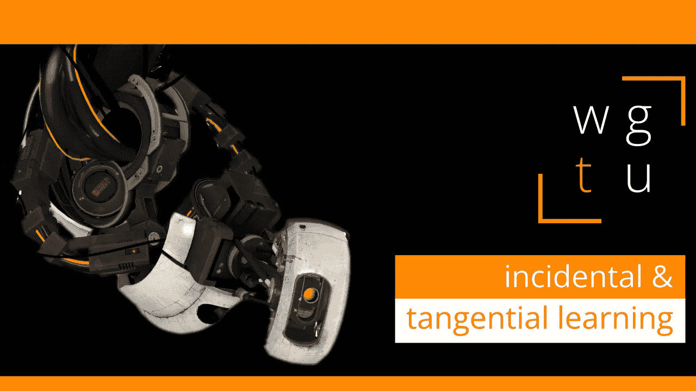

# WGTU #0:附带和附带学习

> 原文：<https://medium.com/geekculture/wgtu-0-incidental-tangential-learning-8cd5ab5b253d?source=collection_archive---------28----------------------->

## 让我们看看电子游戏如何通过附带和切线学习来教我们！

[*WGTU #1:焦点&策划—与上古卷轴 v:天际➡️*](https://mina-pecheux.medium.com/wgtu-1-focus-planning-with-the-elder-scrolls-v-skyrim-3774de90ffe8)

*这篇文章有视频格式和文本格式——见下文:)*