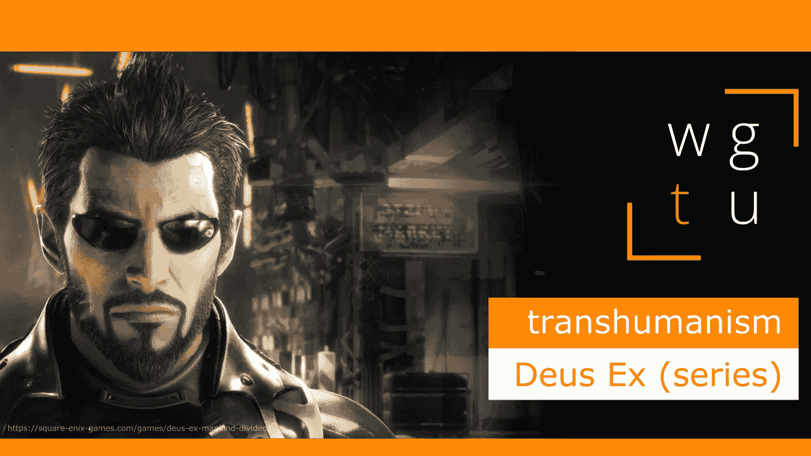

# WGTU #10:超人类主义——与 Deus Ex

> 原文：<https://medium.com/geekculture/wgtu-10-transhumanism-with-deus-ex-7bb1179fee05?source=collection_archive---------18----------------------->

## 让我们看看这个众所周知的赛博朋克系列如何向大众展示超人类主义！

[*⬅️ WGTU #9: Diegetic VS 非 Diegetic 学习—与魔兽世界*](/geekculture/wgtu-9-diegetic-vs-non-diegetic-learning-with-world-of-warcraft-f7eff7eb44a0)*|*[*wgtu # 11:毅力—与超级肉仔➡️*](https://mina-pecheux.medium.com/wgtu-11-perseverance-with-super-meat-boy-7daf56ddfb3d)

*这篇文章有视频格式和文本格式，见下文:)*