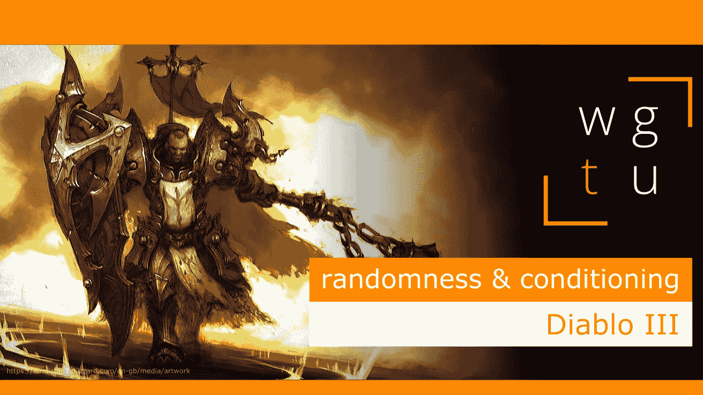

# 《暗黑破坏神 3》中的随机性和条件性

> 原文：<https://medium.com/geekculture/wgtu-18-randomness-conditioning-with-diablo-3-en-fr-4cd62bd5471c?source=collection_archive---------20----------------------->

## 看看暴雪的知名动作 RPG 是怎么用随机性把我们勾进去的吧！

[*⬅️ WGTU #17:世界建筑—与传送门*](/geekculture/wgtu-17-world-building-with-portal-en-fr-2fa952036285)*|*[*wgtu # 19:程序生成的力量—与中土:魔多之影➡️*](https://mina-pecheux.medium.com/wgtu-19-the-power-of-procedural-generation-with-middle-earth-shadow-of-mordor-f27cc1e8d755)

*这篇文章有视频格式和文本格式，见下文:)*