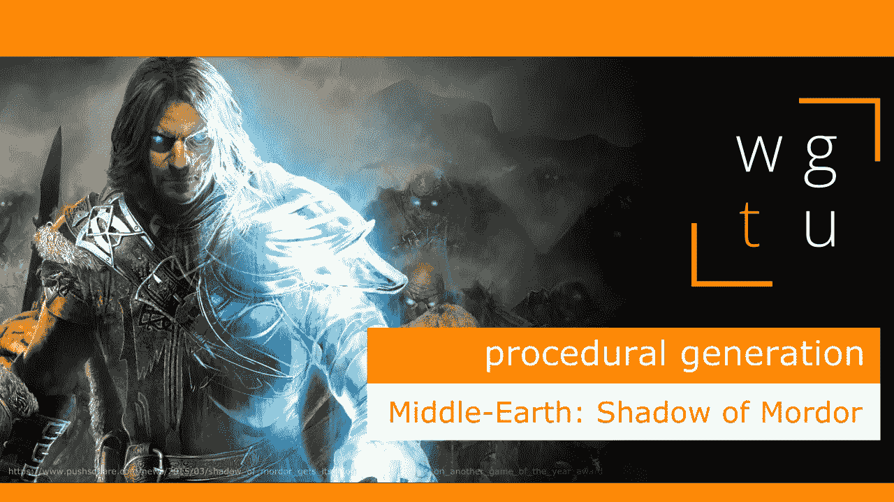

# WGTU #19:程序生成的力量——与中土世界:魔多的阴影

> 原文：<https://medium.com/geekculture/wgtu-19-the-power-of-procedural-generation-with-middle-earth-shadow-of-mordor-f27cc1e8d755?source=collection_archive---------14----------------------->

## 让我们来讨论一下这个动作冒险游戏是如何使用程序生成来实现沉浸感的！

[*⬅️ WGTU #18:随机性&调理—与神棍*](/geekculture/wgtu-18-randomness-conditioning-with-diablo-3-en-fr-4cd62bd5471c)*|*[*wgtu # 20:时间管理—与星空谷➡️*](https://mina-pecheux.medium.com/wgtu-20-time-management-with-stardew-valley-b58e9d01df0f)

