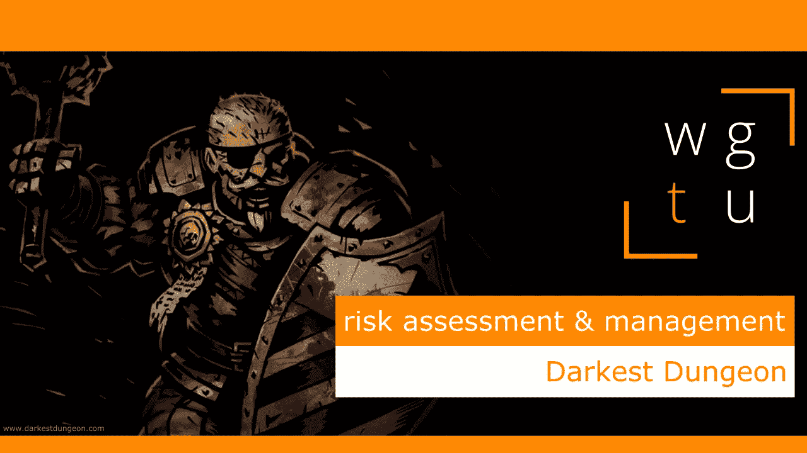

# WGTU #2:风险评估和管理—最黑暗的地牢

> 原文：<https://medium.com/geekculture/wgtu-2-risk-assessment-management-with-darkest-dungeon-896bc2ce0a2c?source=collection_archive---------26----------------------->

## 让我们来谈谈一个伟大的独立流氓一样，侧重于风险机制！

[*⬅️ WGTU #1:专注&策划—与上古卷轴 v:天际*](/geekculture/wgtu-1-focus-planning-with-the-elder-scrolls-v-skyrim-3774de90ffe8) *|* [*WGTU #3:记忆&计时—与鬼泣➡️*](https://mina-pecheux.medium.com/wgtu-3-memory-timing-with-devil-may-cry-244049b1e809)

*这篇文章有视频格式和文本格式，见下文:)*