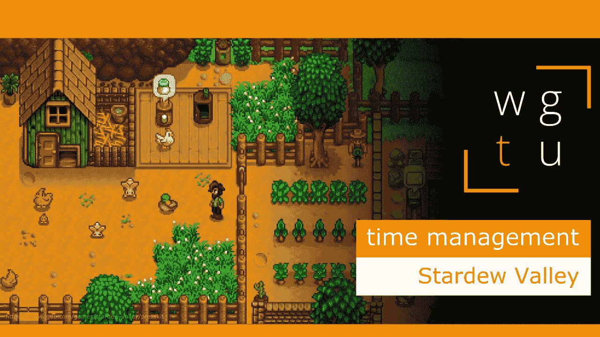

# WGTU #20:时间管理—与 Stardew Valley 合作

> 原文：<https://medium.com/geekculture/wgtu-20-time-management-with-stardew-valley-b58e9d01df0f?source=collection_archive---------8----------------------->

## 让我们来讨论这个伟大的独立模拟 RPG 如何教我们提前计划和管理我们的时间！

[*⬅️ WGTU #19:程序生成的力量—带魔多之影*](/geekculture/wgtu-19-the-power-of-procedural-generation-with-middle-earth-shadow-of-mordor-f27cc1e8d755)*|*[*wgtu # 21:人物进化—带盗墓者➡️*](https://mina-pecheux.medium.com/wgtu-21-character-evolution-with-tomb-raider-a8890a88d8da)

