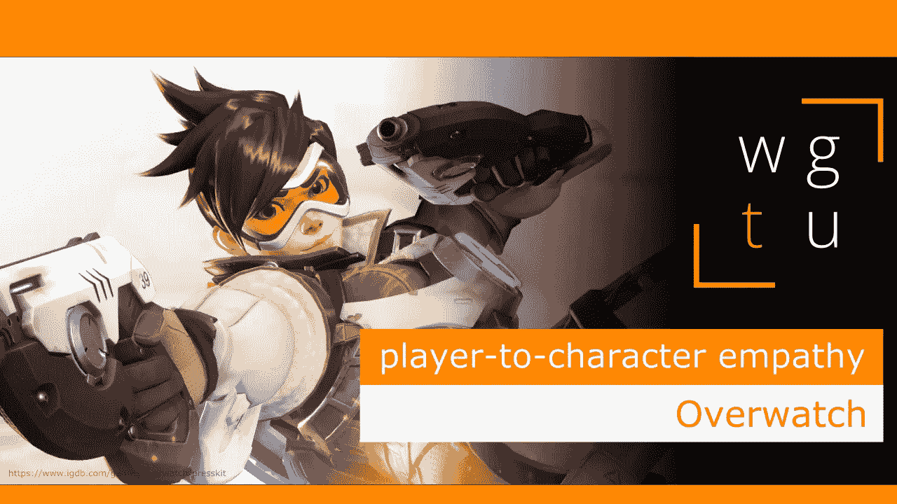

# WGTU #22:玩家对角色的同理心——通过监视

> 原文：<https://medium.com/geekculture/wgtu-22-player-to-character-empathy-with-overwatch-e86c6da493ad?source=collection_archive---------12----------------------->

## 让我们看看这款充满动作的艳遇游戏是如何成为角色进化的绝佳范例的！

[*⬅️ WGTU #21:人物进化—与古墓丽影*](/geekculture/wgtu-21-character-evolution-with-tomb-raider-a8890a88d8da)*|*[*wgtu # 23:通过游戏性产生共鸣—与蝙蝠侠:阿卡姆➡️*](https://mina-pecheux.medium.com/wgtu-23-empathy-via-gameplay-with-batman-arkham-2117e9d6892f)

*这篇文章有视频格式和文本格式，见下文:)*