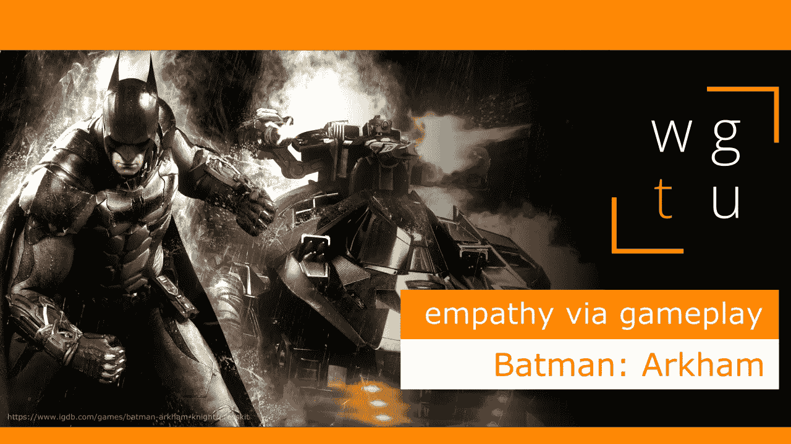

# WGTU #23:通过游戏的同理心——与蝙蝠侠:阿卡姆

> 原文：<https://medium.com/geekculture/wgtu-23-empathy-via-gameplay-with-batman-arkham-2117e9d6892f?source=collection_archive---------14----------------------->

## 让我们看看这一系列令人惊叹的动作冒险游戏如何融入蝙蝠侠的世界和蝙蝠侠的靴子！

[*⬅️ WGTU #22:玩家对角色共情——与看守*](/geekculture/wgtu-22-player-to-character-empathy-with-overwatch-e86c6da493ad)*|*[*wgtu # 24:通过讲故事共情——与底特律:成为人类➡️*](https://mina-pecheux.medium.com/wgtu-24-empathy-via-storytelling-with-detroit-become-human-en-fr-bd89e63b2968)

