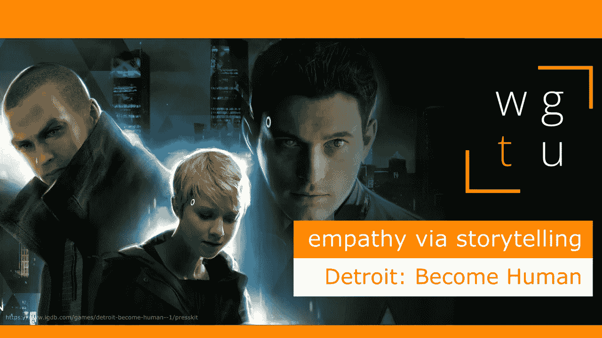

# WGTU #24:通过讲故事产生共鸣——底特律:成为人类

> 原文：<https://medium.com/geekculture/wgtu-24-empathy-via-storytelling-with-detroit-become-human-en-fr-bd89e63b2968?source=collection_archive---------18----------------------->

## 让我们看看这部不可思议的互动剧是如何提供宏大而又有关联的角色的！

[*⬅️ WGTU #23:通过游戏性的共情——与蝙蝠侠:阿卡姆*](/geekculture/wgtu-23-empathy-via-gameplay-with-batman-arkham-2117e9d6892f)*|*[*wgtu # 25:通过定制的共情——与星球大战:旧共和国➡️*](https://mina-pecheux.medium.com/wgtu-25-empathy-via-customisation-with-star-wars-the-old-republic-en-fr-58d3c7599f08)

