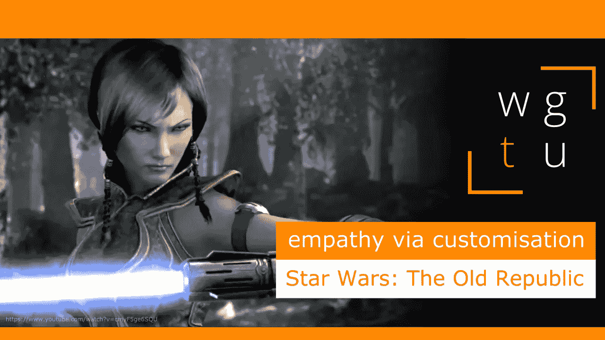

# WGTU #25:通过定制产生共鸣——与《星球大战:旧共和国》一起

> 原文：<https://medium.com/geekculture/wgtu-25-empathy-via-customisation-with-star-wars-the-old-republic-en-fr-58d3c7599f08?source=collection_archive---------10----------------------->

## 让我们看看这个著名的 MMORPG 如何通过我们的头像吸引我们！

[*⬅️ WGTU #24:通过讲故事感同身受——与底特律:成为人类*](/geekculture/wgtu-24-empathy-via-storytelling-with-detroit-become-human-en-fr-bd89e63b2968)*|*[*wgtu # 26:一心多用——与我们中的➡️*](https://mina-pecheux.medium.com/wgtu-26-multi-tasking-with-among-us-7453d55732e6)

*这篇文章有视频格式和文本格式，见下文:)*