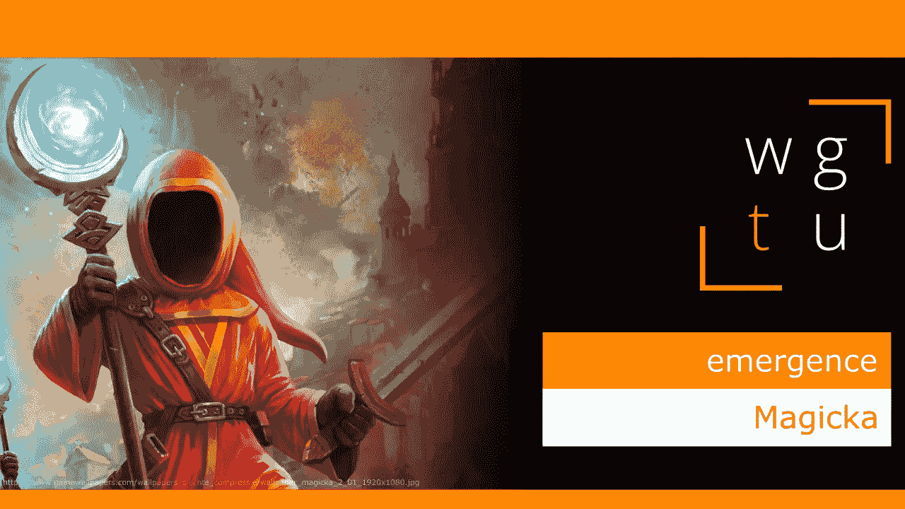

# WGTU #4:出现——用魔法

> 原文：<https://medium.com/geekculture/wgtu-4-emergence-with-magicka-f4e73966fd46?source=collection_archive---------19----------------------->

## 让我们看看这款非常棒的独立动作冒险游戏如何向我们介绍涌现的概念！

[*⬅️ WGTU #3:记忆&计时—带鬼泣*](/geekculture/wgtu-3-memory-timing-with-devil-may-cry-244049b1e809) *|* [*WGTU #5:多功能 VS 专精—带炉石➡️*](https://mina-pecheux.medium.com/wgtu-5-versatility-vs-specialisation-with-hearthstone-454786bf24a3)

*这篇文章有视频格式和文本格式，见下文:)*